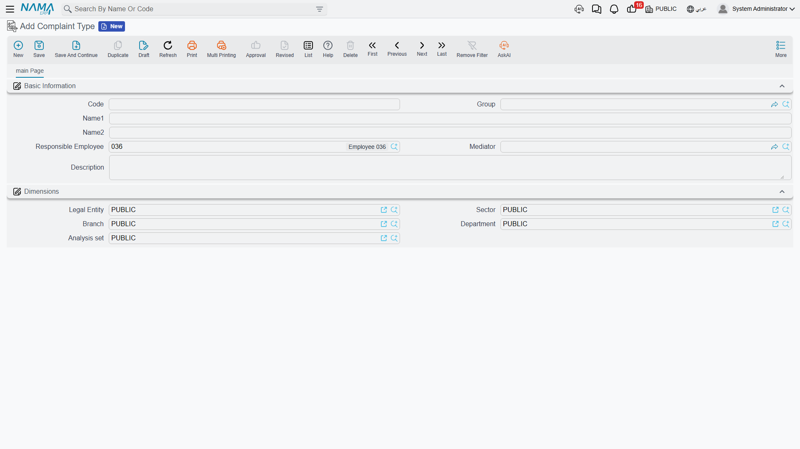

# Problem and Complaint Catalogues

::: info Required licence
`crm`.
:::

When a customer rings up to say a unit has stopped working, the agent taking the call has to record
two different things: *how the complaint reached us and what kind of complaint it is*, and *what is
actually wrong*. Four master files cover those two questions — Complaint Type and Complaint Source
for the first, Problem Classification and Problem for the second.

::: info These four serve Complaints only
Every one of them is read by the [Complaint](/modules/crm/support/crm-complaints.md) screen and by
nothing else. A [trouble ticket](/modules/crm/support/crm-trouble-tickets.md) has no problem
catalogue at all, and the machine-maintenance half of the module keeps its **own** fault vocabulary
— dysfunctions, trouble levels and trouble descriptions — in the
[Fault Catalogues](/modules/crm/maintenance-setup/crm-fault-catalogues.md). The two sets never read
each other. A problem you define here cannot be selected on a maintenance order, and a dysfunction
defined there cannot be selected on a complaint. If your business needs both, expect to maintain
both.
:::

## The four files

| File | Menu | Where it is selected |
|---|---|---|
| **Complaint Type / نوع شكوى** | Support / الدعم | The *Complaint Type* box on the Complaint |
| **Complaint Source / مصدر شكوى** | Support / الدعم | The *Complaint Source* box on the Complaint |
| **Problem Classification / تصنيف مشكله** | Support / الدعم | The Problem file, and the classification column of the Complaint's problem grid |
| **Problem / مشكلة شائعة** | Support / الدعم | The problem column of the Complaint's problem grid |

Only one order constraint exists: **Problem Classification before Problem**, because each problem
names the classification it belongs to. In the worked example `PCL-02`
(أعطال كهربائية / Electrical faults) is created first, and `PRB-11`
(الوحدة لا تعمل / Unit does not start) is filed under it. Complaint `CMPL-0207` then carries
`CTY-02` (عطل فني / Technical fault) as its complaint type and `CSR-01`
(مكالمة هاتفية / Phone call) as its source, with one problem row pointing at `PCL-02` / `PRB-11`.

## The screens

**Complaint Type** and **Complaint Source** are the same screen twice: **Code, Group, Name1, Name2,
Responsible Employee / الموظف المسئول, Mediator / الوسيط, Remarks**, then the
**Dimensions / محددات** group.

Both fill Responsible Employee with your user's employee the moment you press New, and they do it
**unconditionally** — the *Fill Responsible Employee With Current Employee*
[setting](/modules/crm/crm-configuration.md) does not govern these screens, only the Lead screen.

**Problem** carries **Code, Group, Name1, Name2** and one extra box,
**Problem Classification / تصنيف المشكله**, then Dimensions. **Problem Classification** carries the
four basic boxes and nothing else. Neither has a Remarks box, and neither fills anything in for you.

## Getting the right box on the Complaint screen

This is the part that causes support calls, so it is worth being precise. The Complaint screen shows
**four** boxes whose names overlap almost completely, and only two of them are fed by the files on
this page:

| Box on the Complaint | What it is |
|---|---|
| **Type / النوع** | A fixed system list — Complaint, Suggestion, Remark. Not a master file; you cannot add to it. |
| **Complaint Type / نوع الشكوي** | **Your** list, from the Complaint Type file. |
| **Source / المصدر** | A fixed system list — Sales Invoice or Service Contract. Not a master file. This is the one that decides what the Complaint's invoice search button looks through, and its starting value comes from CRM Settings. |
| **Complaint Source / مصدر الشكوي** | **Your** list, from the Complaint Source file. |

So "Type" and "Source" are system behaviour; "Complaint Type" and "Complaint Source" are your
vocabulary and drive nothing at all beyond being recorded and reportable.

## The problem grid

The Complaint has a grid for the faults reported on the call. Each row takes a **Problem
Classification** and a **Problem**, plus a free-text description of what the customer actually said.

The two columns cooperate: choose the classification on a row and the problem picker on that same
row narrows to the problems filed under it. That is the only behaviour these two files have. Picking
a problem does not price anything, route anything, suggest a solution or create a document — it
records what was wrong, in words your team agreed on in advance, so that a month of complaints can
be counted by cause instead of read one by one.

Keep the lists short for exactly that reason. A problem list with two hundred near-duplicate entries
gives you no more insight than free text would.

## Reporting

Reporting: none. This module ships no system reports, and this screen has no print form. Counting
complaints by type, source or problem is done from the Complaint list view's filters and Excel
export, or in BI.
