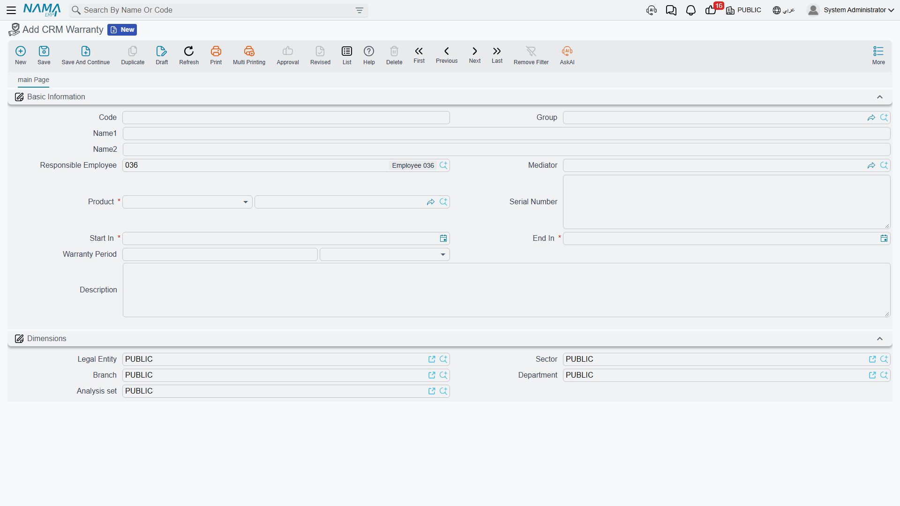

# Warranties

**CRM Warranty / ضمان** — `Customer Relationship Management > Support > CRM Warranty`.

::: info Required licence
`crm`.
:::

A CRM Warranty is a small register entry that says *this product, optionally this serial number, is
under warranty between these two dates*. One record per warranty. It exists for exactly one reason:
so that when a support agent opens a [trouble ticket](/modules/crm/support/crm-trouble-tickets.md)
about that product, the ticket shows the agent whether a warranty is running.

That single sentence is also the whole of what it does, and the rest of this page is mostly about
how narrow that is. Read the danger box below before you design anything around this file.

## The screen

One page. Everything on it is typed by hand.

| Field | Notes |
|---|---|
| Code, Group, Name1, Name2 | The usual basic block. |
| Responsible Employee / الموظف المسئول | Filled with your user's employee when you press New — **unconditionally**, whatever the *Fill Responsible Employee With Current Employee* [setting](/modules/crm/crm-configuration.md) says. That option is honoured by the Lead screen only. |
| Mediator / الوسيط | Optional. |
| Product / المنتج | **Required.** An inventory item, or a rental unit. |
| Serial Number / الرقم المسلسل | The individual unit, when the product is serial-tracked. |
| Start In / يبدأ في | **Required.** |
| End In / ينتهى | **Required.** |
| Warranty Period / فترة الضمان | A length of time — a number plus a unit. |
| Description / الوصف | The notes box. It is labelled *Description*, not *Remarks*, on this screen only. |

Then the **Dimensions / محددات** group.

The list screen shows Product and Serial Number and lets you filter by Product.

### The dates and the period fill each other in

You never have to work out the third value yourself. Type any two of **Start In**, **End In** and
**Warranty Period** and the screen supplies the missing one:

- Type **Start In** when End In is already there → the **Warranty Period** is worked out from the gap.
- Type **Start In** when End In is empty but a period is there → **End In** = Start In plus the period.
- Type **End In** when Start In is already there → the **Warranty Period** is worked out from the gap.
- Type **End In** when Start In is empty but a period is there → **Start In** is worked backwards.
- Change the **Warranty Period** with a Start In already there → **End In** is recalculated.

::: tip Check the date when you work backwards
Filling End In first and letting the system produce Start In is the one direction that is not
calendar-aware: it measures the period in fixed-length units rather than real months, so a
"1 Month" warranty can land a day or two away from where you expected. Glance at the Start In it
produced before you save.
:::

### Serial Number switches itself on and off

The Serial Number box follows the product you chose. Pick an inventory item that is serial-tracked
and the box is enabled. Pick an item that is not, and anything already typed there is cleared. Pick
a rental unit and the box is greyed out — rental units have no serials.

### What is not checked

Only one rule is enforced on save: **Start In cannot be after End In**, and the screen highlights
both dates if it is. There is **no uniqueness check and no overlap check** — two warranties covering
the same product, the same serial and the same dates will both save without a murmur, and both will
then match the same ticket.

## What the warranty actually does — and does not do

A trouble ticket carries two read-only boxes, **Covering Type / نوع التغطيه** and
**Covering Document / سند التغطية**, that are recalculated every time the ticket is opened. They
look for a [CRM service contract](/modules/crm/support/crm-service-contracts.md) line first and a
warranty second, and they report *Covered By Contract / مغطي بعقد خدمة*,
*In Warranty Period / في فترة الضمان* or *Not Covered / غير مغطي*. **A contract always beats a
warranty.**

In the worked example, `WR-00219` covers `AC-SPL-24` serial `SPL24-2025-11-0783` from 2025-11-18 to
2026-11-18. Ticket `TKT-0451`, raised on 2026-04-06 on that exact unit, falls inside it — and still
reports **Covered By Contract**, because `CSC-0044` also covers that serial and contracts win. Had
the contract not existed, the ticket would have read *In Warranty Period* and pointed at `WR-00219`.

::: danger Coverage is display-only, and it never checks the customer
This is the single most important fact about the CRM warranty register, and it surprises everybody.

**What the match uses:** the ticket's **Product**, the ticket's **Serial Number** *only when the
ticket carries one*, and the **ticket date** falling between the record's **Start In** and
**End In**.

**What the match ignores:** the **customer** — any customer's warranty or contract can cover any
other customer's ticket; the contract's **status**, so cancelled, finished and renewed contracts
still cover; whether the contract was ever committed, so drafts cover; a contract's frozen
extension, so the screen may show a later end date than coverage actually tests; and every
dimension — legal entity, branch and sector are not part of the match.

**What coverage does:** nothing but display. No rule refuses a charge, changes a price, blocks a
status change or produces a different document because a ticket says *In Warranty Period*. There is
no document term on the trouble ticket that could react to it either. Whether the repair is free is
a decision your agent makes and records by hand.

**The practical instruction:** always fill **Serial Number** on serialised items. A warranty
registered for a product with the serial left blank will match **every ticket ever raised on that
product, for every customer, in every branch**, and will be shown to all of them as their warranty.
:::

## There are two warranty systems, and they are strangers

The word "warranty" appears in more than one place in this module, and the places do not talk to
each other.

- **The register on this page** is read by the trouble ticket, and by nothing else.
- **The machine-maintenance suite keeps its own**: named warranty period types, warranty start and
  end dates on the [machine file](/modules/crm/maintenance-setup/crm-machines.md), and a ledger of
  dysfunction warranties that maintenance orders write and read back. That system genuinely works —
  and it never looks at a CRM Warranty, and the trouble ticket never looks at it.
- The [Complaint](/modules/crm/support/crm-complaints.md) screen has its own typed *Warranty Period*
  and *Warranty End Date* boxes, filled from the invoice search. They are notes on that complaint;
  nothing reads them either.
- A [CRM service contract](/modules/crm/support/crm-service-contracts.md) line carries its own start
  and end dates, and those are what the ticket's coverage check prefers.

So: repairing a machine under a maintenance order does **not** make a trouble ticket say *In
Warranty Period*, and registering a CRM Warranty does **not** appear anywhere in the maintenance
documents. A site that uses both halves of the module has to enter its warranty data twice, in two
unrelated screens, with two different shapes.

## Setting them up

Create one record per warranty you want an agent to see: the product, the serial if there is one,
the two dates, and a description a human can read at a glance. Keep them for the products your
support desk actually gets called about — a register that covers everything you have ever sold is a
register nobody trusts, especially given that a serial-less entry matches every customer.

## Reporting

Reporting: none. This module ships no system reports, and this screen has no print form. Expiring
warranties are found from the list view and Excel export, or in BI — there is no expiry alarm,
reminder or notification anywhere in the module.
