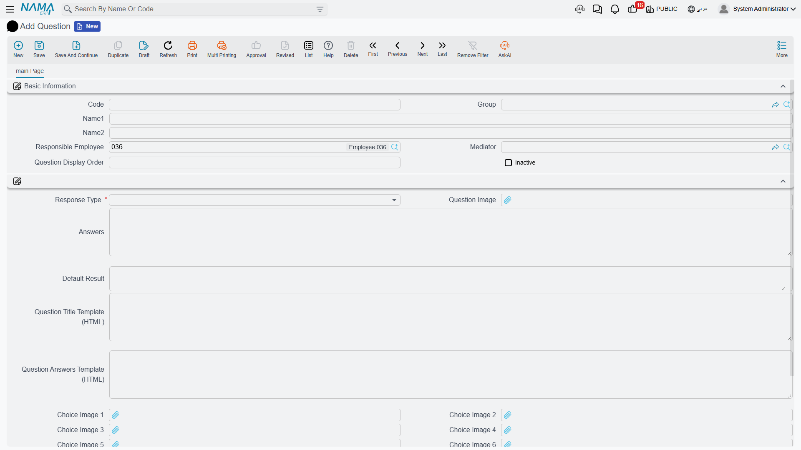
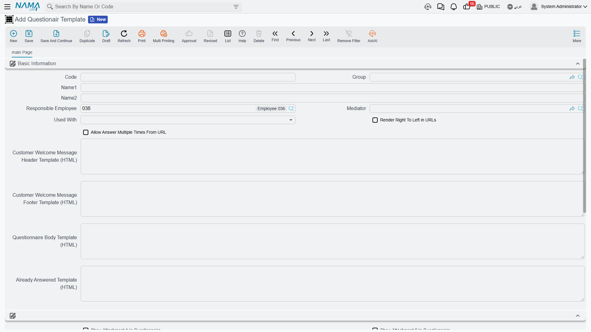

# Questionnaire Templates and Questions

Two weeks after Al Nokhba services a customer's chillers, somebody rings the customer and asks four
questions: were the technicians on time, was the work explained, how would you rate the service out
of ten, and would you like us to call again. Four questions, asked the same way every time, with the
answers kept where anyone can find them.

Building that survey takes two screens. The **Question** file (سؤال) is a library of individual
questions, written once and reused. The **Questionair Template** (قالب استبيان) is the survey
itself: an ordered list of questions plus the settings that control how the survey looks when it is
sent out as a web link. The third screen — the [questionnaire](/modules/crm/questionnaires/crm-questionnaires.md)
itself — is one respondent's answers, and it has its own page.

::: info Required licence
`crm`
:::

| What | Where |
|---|---|
| Question | Customer Relationship Management > Questionairs > Question |
| Questionair Template | Customer Relationship Management > Questionairs > Questionair Template |

## The question library

A question is a small master file. Its **Arabic name** is the question text as the respondent sees
it by default, with the English name alongside, plus the usual code, group, responsible employee and
mediator.

The heart of it is **توع الاجابة / Response Type**, which is required and offers exactly four
choices:

| Response type | What the respondent gets | Where the answer is stored |
|---|---|---|
| نصي / Text | a free-text box | the text answer column |
| اختيار / Choices | a drop-down of the options you listed | the text answer column |
| رقم / Number | a numeric box | the numeric answer column |
| تاريخ / Date | a date box | the date answer column |

For a Choices question, type the options into the **الاجابات / Answers** box — **one option per
line**. `ممتاز`, `جيد`, `مقبول`, `ضعيف` on four lines becomes a four-option drop-down.

The **النتيجة الافتراضية / Default Answer** box holds a value that is copied into the answer column
whenever this question is added to a questionnaire. It is read according to the response type, so a
Number question's default must be a number and a Date question's a date.

::: tip There is no rating scale and no multi-select
This is the expectation to correct first. There is no rating type, no star scale, no slider, no
matrix and no multiple-answer question. A "rate us out of ten" question is a **Number** question, or
a **Choices** question with ten lines — and the drop-down accepts **one** answer only.

There is also no weight or value behind a choice. `ممتاز` is a piece of text, not a 5, so **nothing
in the module can score a questionnaire.** If you want a score, ask for a Number and add the numbers
up yourself outside the system.
:::

::: warning Leave the *Question Answers Template (HTML)* box empty
The question carries two HTML boxes for sites that want to control how a question is drawn on a web
form. *Question Title Template (HTML)* works — it replaces the rendered question text.

*Question Answers Template (HTML)* does **not**. Filling it makes the web form print the question's
title a second time and emit **no answer box at all** for that question, so the question becomes
impossible to answer from the link. If the title template is empty too, the page fails outright.
Leave this box empty on every question.
:::

::: warning The image and ordering fields belong to a separate mobile application
The question screen shows a *صورة السؤال / Question Image*, seven *صورة الخيار / Choice Image* slots
and a *ترتيب عرض السؤال / Question Display Order* box. These are read by a separate mobile
application only. **They are drawn nowhere in the ERP and nowhere on the web questionnaire**, and
the display-order number is never applied — questionnaire lines always come out in the order the
template lists them.

The choice images also carry a validation that catches people out: fill **one** choice image on a
Choices question and the record refuses to save until the number of images matches the number of
option lines exactly. Since the images are never shown anyway, the simplest advice is to leave all
eight image boxes empty.
:::

One more small thing: the **غير نشط / Inactive** tick has no effect inside the ERP. Ticking it does
not remove the question from the picker on a new template line, and does not remove it from
templates or questionnaires that already use it. To retire a question, take it out of the templates.

## The template — the survey itself

A template is the survey: a code, Arabic and English names, a few settings, and a grid of questions.

**Details grid.** One row per question, in the order you want them asked. The same question may not
appear twice — the screen refuses to save and points at the offending line. There are also five
free-text description columns on the row which nothing reads; ignore them.

::: tip The English column header says "Criteria"
On both the template's question grid and the questionnaire's answer grid, the English label of the
question column reads **"Criteria"**. It is the question column, nothing else; the Arabic label
(السؤال) is correct. It is mentioned here so you can find the column, not so you use the word.
:::

**يستعمل مع / Used With** decides where the template can be picked: *الاتصالات فقط / Calls only*,
*الاستبيانات فقط / Questionairs only*, or *أى منهما / Both*. Leaving it empty means both. This
filters the template picker on the [questionnaire](/modules/crm/questionnaires/crm-questionnaires.md)
screen and on the [Call](/modules/crm/activities/crm-calls.md) screen.

::: warning Only the questionnaire builds an answer sheet from a template
Picking a template on a **questionnaire** creates one answer line per template question. Picking a
template on a **Call** does not — the Call's responses grid stays exactly as it was, and its rows
are typed by hand. Do not plan a "script the call from a template" workflow; the Call's template box
records a choice and nothing more.
:::

### Settings that only affect the public web link

The remaining settings matter only when the survey is answered from a web link rather than typed in
by your own staff. That channel, and its one prerequisite, is described on the
[Questionnaires](/modules/crm/questionnaires/crm-questionnaires.md) page.

- **Render Right To Left in URLs** — draws the web page right-to-left and labels its upload boxes in
  Arabic. Tick it for Arabic surveys. (The label itself is English on the Arabic screen, as are the
  four HTML boxes below.)
- **Customer Welcome Message Header Template (HTML)** and **Footer Template (HTML)** — free HTML
  rendered above and below the questions. This is where a logo, a greeting and a thank-you line go.
- **Questionnaire Body Template (HTML)** — if you fill this, it **replaces the whole generated
  page**. Leave it empty and the system builds a clean, standard form for you; that is the right
  choice unless somebody is actively maintaining the HTML.
- **Already Answered Template (HTML)** — see the warning below.
- **اظهار مرفق N في الاستبيان / Show Attachment N In Questionnaire**, eight ticks. Each ticked slot
  adds a file-upload box to the web form, and the uploaded file lands in the matching attachment slot
  on the questionnaire document. Files are limited to 20 MB each.

::: warning "Allow answering more than once", and the "already answered" page
**السماح بالإجابة على نفس الاستبيان أكثر من مرة من الرابط** looks like a duplicate-response control.
It is not one. It only decides what a respondent **sees** when they re-open a link they have already
used; a form that is submitted a second time — a browser back-and-resubmit, a refresh, an automated
post — **overwrites the stored answers regardless of this setting**. Never describe a survey as
protected against duplicate responses.

The "already answered" page it produces is unreliable in its own right: a template with *Already
Answered Template (HTML)* filled in shows the system's built-in message instead of yours, and a
template with it empty renders an empty block that can fail outright.

Because the setting protects nothing and the page it guards is unreliable, the practical advice is
to **tick "allow answering more than once"** and treat duplicate answers as something you notice by
looking — the questionnaire stamps the date it was answered from the link, so a second answer is
visible in the record.
:::

::: tip Build the template before the questionnaires that use it
A questionnaire copies the template's questions into its own answer grid at the moment you pick the
template. Adding a question to the template afterwards does **not** reach questionnaires that were
already created — they keep the list they were built with. Finish the template first, then start
sending.
:::

::: info Reporting
Reporting: none. This module ships no system reports, and these screens have no print form.
:::
