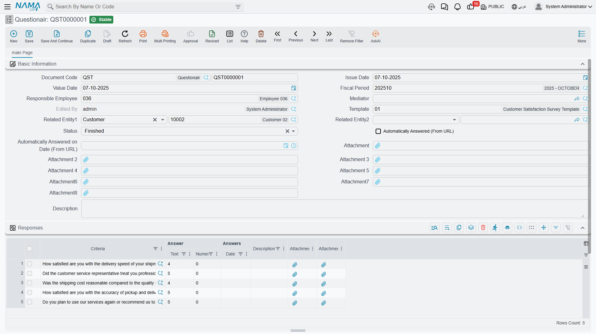

# Questionnaires

The template is the survey; the **questionnaire** (استبيان) is one filled-in copy of it. One
respondent, one document, one set of answers. Ask two hundred customers how the service was and you
have two hundred questionnaires.

That design is worth understanding early, because it decides everything else on this page — how
answers are collected, and how they are read back. Collecting them works well. Reading them back is
where this feature stops, and the honest picture of that is the most useful thing here.

::: info Required licence
`crm`
:::

| What | Where |
|---|---|
| Questionair | Customer Relationship Management > Questionairs > Questionair |

Unlike the marketing screens, the questionnaire really is a **document**: it takes a document book
and a document number, and it has an issue date, a value date and a fiscal period. It needs **no
document term**, has no accounting effect, no inventory effect and generates nothing.

## Creating one and filling it in

There are two ways in. The straightforward one is the menu entry above. The more convenient one is
the **إنشاء استبيان / Create Questionair** action that appears in the *more* menu of other screens —
a customer, a lead, a trouble ticket — which opens a new questionnaire with the record already
filled into *Related Entity 1*, and the record's customer or supplier into *Related Entity 2*. Those
same screens gain a **Questionairs** page listing every questionnaire already linked to the record.

::: tip That button and page have to be switched on, screen by screen
The action and the related-questionnaires page appear only on screens you list in
[CRM Settings](/modules/crm/crm-configuration.md), under *Add Questionairs Page To*. They also only
appear on a screen's **default** layout — if your site has built a customised layout for that screen,
the page is not added to it.
:::

Once the questionnaire is open, pick the **القالب / Template**. That is the moment the work happens:
the answer grid fills itself with one line per template question, in the template's order, each line
pre-filled with the question's default answer. From there:

- Only the answer column that matches the question's response type is editable. A Number question
  offers the numeric box and nothing else; if a question has no response type, all three columns are
  locked.
- Typing into the text answer of a Choices question suggests the matching options from the
  question's answer list as you go.
- The same question may not appear twice on the sheet.
- Each answer line has its own remarks box and two attachment slots.

Fill in *Related Entity 1* (a customer or a supplier) and *Related Entity 2* (anything) so the
questionnaire can be found from the record it is about — those two references are the only way a
questionnaire is ever connected to the rest of the system.

::: warning The status field is a note to yourself
**الحالة / Status** offers Initial, First Missed Call, Second Missed Call, Closed, Rejected,
Complaint and Finished. Nothing in the system ever sets it, reads it, validates it or acts on it —
including answering from the web link, which does **not** move the status to Finished. It is a manual
label, useful for filtering your own list view and nothing more.
:::

## Getting the survey to the respondent

**By hand, in the ERP.** Somebody rings the customer, or hands over a tablet, and types the answers
into the grid. This is the channel with no surprises, and for a four-question follow-up call it is
usually the right one.

**From the Nama mobile app.** A salesperson can fill a questionnaire in the field, and the app also
captures a client signature and a sales signature.

::: warning Mobile signatures land in attachments 1 and 2
The two signatures are stored in the questionnaire's first and second attachment slots — the same
slots the web form uploads into. If a respondent uploaded two files through the link and the same
questionnaire is later saved from the mobile app, those files are replaced by the signature images.
Do not use attachments 1 and 2 for respondent uploads on any survey that is also used from the app;
tick slots 3 and upwards on the template instead.
:::

**From a public web link.** The questionnaire can be published as a page a customer opens in a
browser and submits. It works — but getting the link to the customer takes one setup step that
nothing on the screen tells you about.

::: danger There is no *Send* button and no *Copy link* button — anywhere
Nothing on the questionnaire screen, and nothing in its *more* menu, sends a questionnaire or shows
its public link. The link is never displayed in the interface at all.

The only way it reaches a respondent is a **mail or notification template** built by your site,
using the questionnaire placeholders documented in the [Tempo guide](/admin/tempo.md): one
placeholder inserts the link into the mail, another embeds the whole form in the mail body. Until
that template exists, the web channel is not available — no amount of clicking on the questionnaire
will produce a URL.
:::

::: warning Always pick a template before saving
A questionnaire saved without a template has a public page that cannot be built: opening its link
shows only a generic *"An error occurred, sorry for any inconvenience"* message with no explanation.
If a respondent reports that, the first thing to check is the *Template* box on the questionnaire.
:::

A couple of things to expect on the public page: the questions come out in template order with a
submit button underneath, plus whatever welcome header and footer the template defines and an upload
box for each attachment slot the template enables. After submitting, the respondent sees a short
fixed English confirmation — `Thanks for your reponse`, misspelling included. It is not translatable
and not configurable; if that matters for a customer-facing survey, keep the survey inside your own
team's hands or have your site put the closing message in the template's footer instead.

When the answers arrive, the questionnaire is updated in place and flagged as answered from the
link, with the date and time of the answer.

## Reading the results

::: danger Questionnaire answers are never aggregated
There is **no score, no summary, no results view, no report, no dashboard and no cross-questionnaire
screen** anywhere in the module. Nothing counts how many people answered *ممتاز*, nothing averages a
rating, nothing compares this quarter with last, and there is no total on the questionnaire itself.

Scoring is not merely missing from a screen — it is not possible in the module's data, because a
choice carries no numeric weight and a questionnaire has no total field.

The only cross-record view that exists is the *Questionairs* page on a related record, which lists
**which** questionnaires exist for that customer — not what anybody answered.
:::

So a two-hundred-respondent survey is read one of two ways, and it is worth choosing before you run
it rather than after:

1. **One document at a time.** Perfectly reasonable for a small, qualitative follow-up survey where
   somebody is going to read every answer anyway and act on it.
2. **Export and pivot.** The questionnaire list view exports to Excel — including the *Simple Export
   For Docs* action, which brings the answer lines out with the documents. Pivot in the spreadsheet
   and you have your counts and averages in a few minutes. This is the standard answer for any survey
   big enough that reading it individually is not sensible.
3. For a survey you run continuously — a post-service satisfaction question asked after every job —
   ask your site to build a **BI dashboard** over the questionnaire answers. The data is complete and
   perfectly countable; what is missing is a screen that adds it up, and that is exactly what BI is
   for.

Design your questions with the read-back in mind. **Choices** and **Number** questions pivot cleanly
in a spreadsheet; free-text answers do not. If you want to be able to say "82 % were satisfied", ask
a Choices question with a short, fixed option list and keep the wording of the options identical
across surveys.

::: info Reporting
Reporting: none. This module ships no system reports, and this screen has no print form. Use the
questionnaire list view, its Excel export, or BI.
:::
