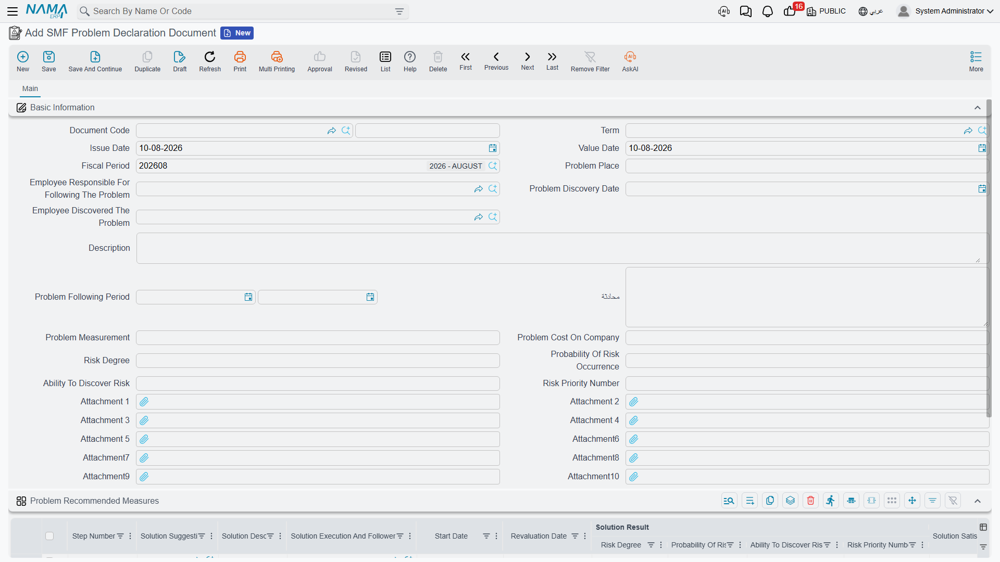
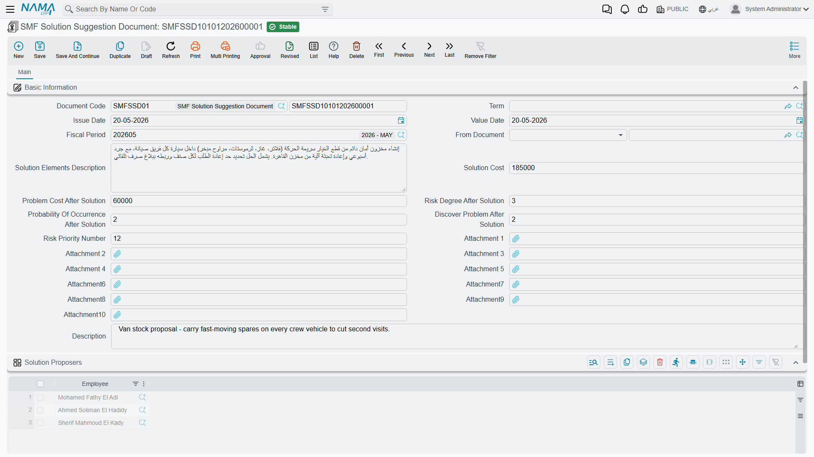

# CRM Risk Register

::: info Licence
The three screens on this page are gated on the `crm` licence code.
:::

Open the CRM menu, scroll past Support and Marketing, and you will find a folder called
**Management And Organization Documents** (الإدارة والتنظيم) holding three documents:
**SMF Problem Declaration Document**, **SMF Solution Suggestion Document** and
**SMF Initial Operation Document**.

Almost everyone meets them by accident, assumes they belong to customer support, and starts
looking for the button that links one to a trouble ticket. There is no such button. These three
screens are an **internal risk register** — a quality-improvement notebook for the company's own
processes. They do not know that customers exist.

## What the register is for

The model is the familiar failure-mode-and-effects one. Somebody notices that something inside
the company keeps going wrong — the maintenance store runs out of the same filter every quarter,
say, or installation crews keep arriving on site without the customer's access permit. You write
that down as a **problem**, score it on three factors, and multiply the three into one number you
can sort a list by. Then you write one or more **solution suggestions**, each with its cost and
with the score the problem would carry *after* the fix, and you record which step you took next.

That is the whole product. Nothing is generated, nothing is approved, nothing is escalated.

## The three factors and the priority number

Every score on both scoring documents is built from the same three boxes:

| Arabic label | English label | What it records |
|---|---|---|
| درجة الخطورة | Risk Degree | How much damage the problem does when it happens |
| احتمال الحدوث | Probability Of Risk Occurrence | How often it happens |
| القدرة على الاكتشاف | Ability To Discover Risk | How likely you are to catch it before it hurts |
| رقم أولوية الخطر | Risk Priority Number | The three multiplied together |

They are plain numeric boxes. The system imposes no 1-to-10 scale and no upper limit, so agree a
scale in-house and write it into your own procedure — otherwise one department's 8 and another
department's 80 end up in the same sorted list.

Score a recurring stock-out at severity 8, probability 5 and detectability 3 and the priority
number comes out at 120. Fix the reorder point so that the same stock-out becomes rare and easy
to spot, and the after-solution score you record on the suggestion might be 8 × 2 × 2 = 32.

## The Problem Declaration

This is where a problem is opened. Besides the usual book, code and dates, the Basic Information
group asks for **Problem Place** (مكان حدوث المشكلة), the **Employee Responsible For Following
The Problem** (المسؤول عن متابعة المشكلة), the **Problem Discovery Date** and the **Employee
Discovered The Problem**, a from/to **Problem Following Period** window, the problem description,
**Problem Measurement** (كيفية قياس المشكلة — how you will tell whether it is getting better), an
estimated **Problem Cost On Company**, and then the three factors and the priority number. Ten
attachment slots hold the photographs, reports and mail threads behind the case.

Below it sits the grid **Problem Recommended Measures** (الإجراءات الموصى بها لحل المشكلة) — one
row per countermeasure. Each row carries a step number, a **Solution Suggestion Document**
reference, a solution description, the person executing and following the solution, a start date
and a **Revaluation Date** (تاريخ إعادة التقييم), its own copy of the three factors and its own
priority number, a **Solution Satisfaction Degree**, a **Next Step**, a description, and the
**Problem Cost After Solution**.

Pick a Solution Suggestion Document in a row and its solution description is copied into that
row's Solution Description for you. That is the one automatic convenience in the whole area.

*Next Step* offers **Problem Solved Temporarily** (تم حل المشكلة مؤقتًا), **Move To Another
Solution** (الانتقال إلى حل آخر), **Expert Help** (الاستعانة بخبير), **Approve Solution As Best
Practice** (اعتماد الحل كـ BP) and **Other** (أخري).

::: warning The priority number is calculated in one place only
On the Problem Declaration the Risk Priority Number fills itself from the three factors, both in
the header and in each countermeasure row. On the **Solution Suggestion** the identically-named
field is **typed by hand** and is never checked against the three after-solution factors sitting
right above it. Whoever fills in that screen has to do the multiplication themselves.
:::

## The Solution Suggestion

A proposal for fixing a declared problem. It carries **From Document** (بناءا على), a **Solution
Elements Description**, the **Solution Cost**, the **Problem Cost After Solution**, the three
after-solution factors, the hand-typed priority number, ten attachments, and a one-column grid
**Solution Proposers** (أسماء مقترحي الحل) listing the employees behind the idea.

*From Document* accepts a Problem Declaration or another Solution Suggestion, and nothing else.
Point it at another suggestion and that document's Solution Proposers are copied into your grid —
and from then on you cannot remove any of the copied employees: saving without one of them is
refused with a message naming the employee and the source document. You may add proposers freely;
removing an inherited one means clearing *From Document* first.

So the two documents do reference each other, in both directions: a Problem Declaration reaches
forward to its suggestions through the countermeasure rows, and a Solution Suggestion reaches back
to its problem through *From Document*.

## Initial Operation — a survey that stands on its own

The third document is not a risk score at all. It is a questionnaire for describing how a process
runs today, before anybody tries to improve it: **Operation Name**, the responsible **Employee**,
**Operation Execution Seniority**, a description, the **Important Operation Tasks**, how often the
process repeats and how long it takes, where it is carried out, how important it is, how many
employees are involved and what their jobs are, the **Operation Output**, the **Operation Average
Of Success**, the **Important Changes On Operation** you would like to make, and finally
**Perfect Operation Suggestion** (اقتراح لتكون من العمليات المثلى), answered with **Yes**, **No**
or **Yes After Editing** (نعم بعد التعديل). Ten attachments again.

::: warning Initial Operation is connected to nothing at all
Nothing creates it, nothing reads it, and it does not link to the other two documents in this
folder. It cannot be selected in a Problem Declaration's countermeasure row or in a Solution
Suggestion's *From Document*, and neither of those points back at it. Treat it as a standalone
form you fill in and file — not as step one of a three-step cycle.
:::

## What the register does not touch

This is worth being blunt about, because the menu placement invites the opposite assumption:

- **No customer, no ticket, no complaint.** None of the three documents has a customer field, and
  no trouble ticket, complaint, service contract or FAQ can be linked to them in either direction.
- **No machine, no maintenance.** Nothing in either maintenance suite refers to them, and they
  refer to nothing in it.
- **No money, no stock.** The cost figures are typed for your own record-keeping. Nothing reaches
  the ledger or the warehouse, and saving one of these documents creates no business request.
- **No report, no dashboard.** As everywhere in CRM, there is no system report here. Read the
  register from the list views, sort by the priority number, and use Excel export or BI if you
  need more than that.
- **No reminder.** The Revaluation Date on a countermeasure row is a note to yourself. There is no
  scheduler, alarm or notification anywhere in CRM, so nothing will tell you when it arrives.

One last small thing: all three screens display a **Term** (توجيه المستند) picker although none of
them uses one, and there is no configuration behind it. Leave it empty — see
[How CRM Document Terms Work](/modules/crm/document-terms/crm-terms-basics).
