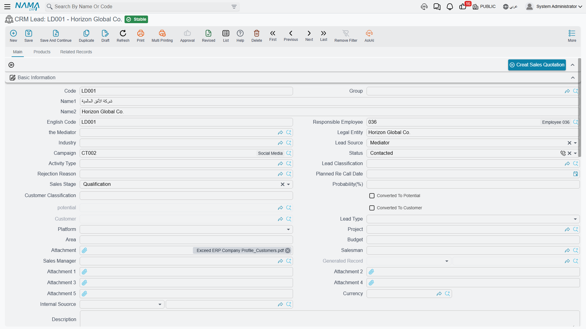

# Leads

A lead is the record you open the moment a prospect becomes real enough to remember. Somebody walked onto the stand, somebody rang the hotline, a broker sent a name — and now it needs an owner, a next step and a place to keep the phone numbers.

In NaMa a **CRM Lead** (خيط بيع) is a **master file**, not a document: it has no book, no document term, no value date, no document number and no approval cycle. You create it, you keep editing it as the story develops, and eventually it is converted into a customer or quietly goes cold.

::: info Required licence
The CRM Lead screen is unlocked by the licence code `crm`.
:::

Find it at **Customer Relationship Management → Marketing → CRM Lead** / **خدمة العملاء ← التسويق ← خيط بيع**.

Throughout this page we follow `LD-00417`, opened on 12 January 2026 by Hala Samir Abdel Rahman (`EMP-1042`) for **Marina Plaza Hotels** (فنادق مارينا بلازا) after the International Cooling Expo.

## The Main Tab

The first tab holds one large group of header fields, then the contact-information block, then two grids.

| Field (English / Arabic) | What it is | On `LD-00417` |
|---|---|---|
| Code, Arabic Name, English Name (الكود، الاسم العربي، الاسم الإنجليزي) | Master-file identity | `LD-00417`, فنادق مارينا بلازا, Marina Plaza Hotels |
| Legal Entity (الشركة) | **Free text** naming the prospect's own company | فنادق مارينا بلازا |
| Responsible Employee (الموظف المسئول) | Who owns the record | `EMP-1042` |
| Salesman (مندوب المبيعات) | Must be an employee flagged as a salesman | `EMP-1042` |
| Sales Manager (مدير المبيعات) | Free employee reference | `EMP-1001` Tarek Youssef El Mansy |
| Mediator (الوسيط) | The broker or consultant who brought the deal | `MED-07` Rowad Engineering Consultants |
| Industry (المجال) | Classification master file | `IND-04` Hotels and Hospitality |
| Lead Source (مصدر الخيط) | Where the lead came from | Trade Show / معرض تجاري |
| Campaign (الحملة) | The marketing campaign it is attributed to | `CAMP-2026-01` |
| Status (الحالة) | Where the conversation stands | Initial / مبدئي at creation |
| Lead Classification (تصنيف العميل المرتقب) | Classification master file | `LC-B` Mid-Market |
| Activity Type (نوع النشاط للفرع) | The next kind of contact planned | `AT-01` Follow-up Call |
| Rejection Reason (سبب الرفض) | Filled when a lead dies | empty |
| Planned Re-Call Date (التاريخ المخطط لمعاودة الإتصال) | The date you intend to call back | set by the Call document |
| Sales Stage (مرحلة البيع) | One of twelve labels | Qualification / تأهيل |
| Probability (%) (الإحتمالية) | A number you type | 40 |
| Lead Type (نوع الخيط) | Fresh, Cold Call, or three spare labels | Fresh / جديد |
| Platform (المنصة) | The channel it arrived through | Walk-In / زيارة مباشرة |
| Customer Classification (تصنيف العميل) | Carried over to the Customer on conversion | — |
| Internal Source (المصدر الداخلي) | An employee or a partner who referred it | — |
| Project (المشروع), Area (المساحة) | Real-estate fields: a Real Estate project reference and a free-text area | — |
| Budget (الميزانية) | **Free text** | `about EGP 4.5 million` |
| Remarks and six attachments | Free text and files | — |
| Currency group (العملة) | Currency and exchange rate | EGP |
| Dimensions (محددات) | Legal entity, sector, branch, department, analysis set | `NOK`, `SEC-SRV`, `BR-ALX`, `DPT-SLS` |

Five more fields sit on the screen read-only and are maintained by the conversion buttons: *Converted To Potential* (تم تحويلة إلي فرصة), *Potential* (الفرصة), *Converted To Customer* (تم تحويلة إلي عميل), *Customer* (العميل) and *Generated Record* (السجل المنشأ). You never type in them — see [Converting a Lead](/modules/crm/sales-pipeline/crm-lead-conversion).

::: warning Two different fields are both labelled "Legal Entity"
The **Legal Entity (الشركة)** in the header group is free text naming the *prospect's* company — and if you leave it empty it is filled with the lead's Arabic name every time you save. The **Legal Entity (الشركة)** in the Dimensions group is *your own* company dimension. They are unrelated fields with the same label; read the group heading to tell them apart.
:::

::: warning The deal value is not on this screen
The *Currency* group shows a currency and a rate only — the amount that goes with them is not displayed. The **Budget** box is free text, so it cannot be summed or sorted. A lead's worth cannot be recorded here out of the box, and there is therefore no pipeline value, no weighted forecast and nothing to report on. See [The Sales Pipeline](/modules/crm/sales-pipeline/crm-pipeline-overview).
:::

### The statuses

**Status** has twelve values and no transition rules — any status can follow any other, and nothing is set automatically except by a Call or a Visit.

| Arabic | English |
|---|---|
| مبدئي | Initial |
| لم يتم الأتصال | Not Contacted |
| محاولة الأتصال | Attempted To Contact |
| تم الأتصال | Contacted |
| الأتصال مستقبلا | Contact In Future |
| مؤهل مبدئيا | PreQualified |
| مؤهل | Qualified |
| دافئ | Warm |
| ساخن | Hot |
| بارد | Cold |
| بدون قيمة | Junk Lead |
| فاشل | Lost Lead |

**Lead Source** offers Cold Call, Existing Customer, Self Generated, Employee, Partner, Public Relations, Direct Mail, Conference, Trade Show, Web site, Word Of Mouth, Campaign, Mediator, Grant, Social Networks and Other. **Platform** offers Broker, WhatsApp, SMS Campaign, Customer Call Center, Owner, Freelance, Personal, Hotline, Walk-In, Instagram, Google, Outdoor, Facebook, Empty Platform and three spare labels. **Lead Type** offers only Fresh, Cold Call (which reads **إتصال ارتجالي** in Arabic) and three spare labels.

::: warning The campaign picker offers every campaign
The Campaign field looks as though it excludes cancelled and inactive campaigns. It does not — the filter behind it never removes anything, so every campaign in the system is offered. Check the campaign's own status before you pick it.
:::

## The Contacts Grid, and Real Contact Records

The **Contacts** grid (جهات الاتصال) holds the people: contact code, contacts group, title, name, job title, mobile, phone, fax, e-mail and address. On its own it is just a list inside the lead.

Two fields above it change that. Tick **Create Contact For Every Line** (إنشاء جهة اتصال لكل سطر) and set a **Contacts Group** (مجموعة تكويد جهات الاتصال المنشأة), and every row of the grid becomes a real **Contact** master file the moment you save. On `LD-00417` that produced `CNT-0904` (Eng. Ramy Abdel Moneim, chief engineer) and `CNT-0905` (Ms. Mona Shaaban, purchasing), and the generated record is shown back in the grid's read-only *Contact* column.

Two behaviours to know before you switch it on:

- **Deleting a row deletes the contact it generated.** The grid is treated as the master list, not as a one-off import.
- The contact's Arabic and English names are both set to the single **name** you typed in the row, so a generated contact has the same text in both name fields until somebody edits it.

If you tick the box without a contacts group or a contact code on the line, the save is refused with *"You should choose contacts group or fill contact code field"*.

## The Products Tab

The **Products** grid (المنتجات) records what the prospect is interested in and who else is bidding: **Product** (an inventory item, or a rental unit in a real-estate installation), **Competitor Company**, **Competitor Company Item** and remarks.

On `LD-00417` there are two rows: the central chiller `AC-CHL-300`, against `COMP-03` Ufuq Air Conditioning Co. and their `CITM-011` Ufuq Chiller 300 TR; and the air-handling unit `AC-AHU-12` with no competitor named.

Picking a competitor item fills in the competitor company for you, and the competitor-item picker is filtered by the product and company already on the row. There are no quantities and no prices in this grid — it is an interest list, not a quotation.

## Assignment: Three Separate Things

The screen offers three ways to put a name on a lead, and they do not talk to each other.

1. **Responsible Employee** — one employee, filled automatically with the employee attached to the logged-in user when the lead is created. This is the only CRM screen where that auto-fill is governed by a setting; see [CRM Settings](/modules/crm/crm-configuration).
2. **Salesman and Sales Manager** — free employee references. The Salesman picker offers only employees flagged as salesmen, and saving with anybody else is refused with *"Must be sales man"*. There is no territory, no quota and no commission logic anywhere in the module.
3. **The Assigned To grid** (مسند إلي) — the real assignment, one row per employee. On `LD-00417` it holds `EMP-1042` and `EMP-1001`.

Every save compares the grid with what was there before and writes the difference into **Assigning History** (سجل التصعيدات), the read-only list on the Related Records tab: a row per employee added, stamped with the date, time and the user who assigned, and a closing date written onto the rows of employees who were removed. It is a genuine audit trail and it is maintained for you.

Picking a **Campaign** appends that campaign's own assigned employees to the grid — the one thing that fills it automatically. On `LD-00417` that is how `EMP-1042` arrived there.

::: warning Nobody is notified, ever
Assigning a lead raises no e-mail, no alert, no task and no reminder. The assigned employee finds out by opening the list screen and filtering on their own name. Nothing validates that a lead has an assignee at all.
:::

## The Related Records Tab

The third tab is entirely read-only: the **Contacts** generated from this lead, the **CRM Tasks**, **CRM Calls** and **Visits** that point at it, and the **Assigning History** described above. Nothing on this tab can be edited; it is the "what has happened to this lead" view.

## Buttons on the Screen

| Button | What it does |
|---|---|
| Convert To Potential (تحويل إلي فرصة) | Opens a new, unsaved Potential — see [Converting a Lead](/modules/crm/sales-pipeline/crm-lead-conversion) |
| Convert To Customer (تحويل إلي عميل) | Opens a new, unsaved Customer |
| Convert To REOwner (تحويل الي مشتري) | Opens a new, unsaved Real Estate owner; only present when Real Estate is installed |
| Create Sales Quotation (إنشاء عرض أسعار) | Refused until the lead has been converted to a customer |
| Create Contact (إنشاء جهة اتصال) | A new Contact linked back to this lead, with the header contact details copied |
| create CRM Call (إنشاء اتصال) | A new Call with this lead's current status, classification, activity type and rejection reason already loaded into its "current…" fields |
| create CRM Task (إنشاء مهمة خدمة العملاء) | A new CRM Task linked back to this lead |

All of them open a **new, unsaved screen**. Nothing is created until you save what opens.

## The List Screen

The Lead list carries quick-filter chips on **Status** and **Sales Stage**, and criteria for mediator, campaign, status, probability, potential, customer, lead type, area and budget. Two mass actions sit in its toolbar:

- **Change Records Status** (تغيير الحالة) — asks for a status and writes it onto every selected lead.
- **Assign Records To** (تصعيد إلي) — asks for one employee and applies it to every selected lead.

::: danger "Assign Records To" replaces the assignees — it does not add one
This action **clears the whole Assigned To grid** on each selected lead and leaves a single row for the employee you chose. A supervisor who uses it to put a second salesman onto a batch of leads silently removes the first one from all of them. The Assigning History will faithfully record what happened — the earlier employee's row is closed — but the grid is gone.

To add an employee without losing the existing ones, open the lead and add a row to the grid by hand.
:::

## What the System Actually Refuses

Only two rules are enforced on this screen, and it is worth knowing that the list is that short:

- **The Salesman must be flagged as a salesman.** Anything else is refused with *"Must be sales man"*.
- **A converted lead cannot be edited.** Once *Converted To Customer* is ticked, saving the lead fails with *"Cannot be updated as it is converted to customer"* — unless *Allow Editing CRM Lead After Connection* is switched on in [CRM Settings](/modules/crm/crm-configuration).

Everything else — a probability of 900, a Closed Won lead with no customer, an empty Assigned To grid — saves without complaint.

::: info The lock does not stop a Call from moving the lead
A committed [CRM Call](/modules/crm/activities/crm-calls) or [Visit](/modules/crm/activities/crm-visits) writes its *Change Status To* onto the lead regardless of the lock. That is deliberate: activity documents are the normal way a lead's status moves. Note that cancelling that call afterwards does **not** put the status back — the lead keeps whatever the cancelled document gave it, and you correct it by hand.
:::

## Reporting

**Reporting: none.** This module ships no system reports, and this screen has no print form. Use the list screen's filters and chips, export to Excel, or build a BI view over the lead data.
