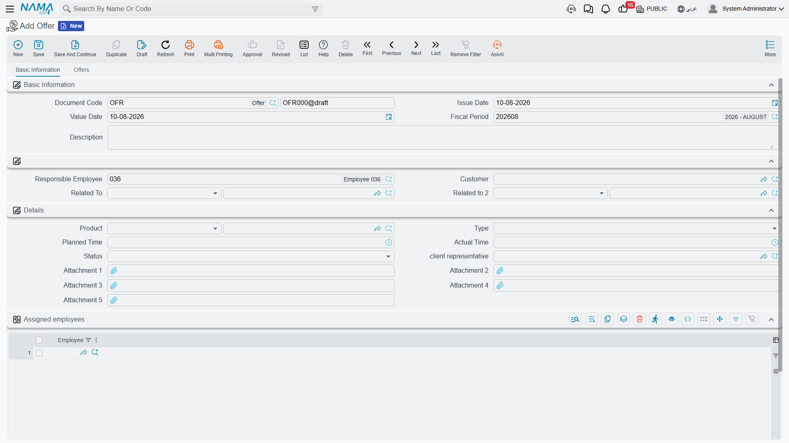

# Offers

The screen called **Offer** (CRM عرض) is the most commonly misread thing in the CRM menu, and it is worth clearing up in the first paragraph: **it is not a price offer.** There is no quantity on it, no unit price, no discount, no tax, no total, no validity date, no currency, no price list and no terms and conditions. Nothing anywhere on the screen holds money.

What it actually holds is a **work package**: who is assigned to a piece of work, what kind of work it is, how long it was expected to take and how long it really took. It belongs to the delivery side of a project — the preparation and training you commit to around an installation — not to the commercial side of a sale.

If what you need is a priced quotation for a customer, that is a **Sales Quotation** in Supply Chain, reached from the Lead or Potential through *Create Sales Quotation*. See [Converting a Lead](/modules/crm/sales-pipeline/crm-lead-conversion).

::: info Required licence
The Offer screen is unlocked by the licence code `crm`.
:::

Find it at **Customer Relationship Management → Marketing → Offer** / **خدمة العملاء ← التسويق ← CRM عرض**.

## It Is Not Downstream of Anything

::: danger Nothing creates an Offer, and nothing is created from one
There is **no button on the Lead screen or the Potential screen that makes an Offer.** You create one from the menu, from scratch, every time.

Going the other way, an Offer produces nothing at all: no quotation, no sales order, no invoice, no project, no accounting entry, no stock movement. Its only outward connections are two reference fields that a person fills in by hand.

In particular, an Offer can never be linked to a **CRM Project**. The Project's *Related To* field does not accept an Offer, so even manually there is no way to record that this project came out of this offer. See [The Sales Pipeline](/modules/crm/sales-pipeline/crm-pipeline-overview).
:::

## The Basic Information Tab

Unlike the Lead and the Potential, the Offer is a real **document**: it has a document code made from a **book** plus a number, an issue date (تاريخ التحرير), a value date (التاريخ الفعلي) and a fiscal period (الفترة).

::: info No document term
The Offer does not use a document term (توجيه) — the screen neither asks for one nor offers one, and there is nothing to configure per term. A **document book** is still required, because that is where the number comes from.
:::

The header then holds:

| Field (English / Arabic) | What it is |
|---|---|
| Responsible Employee (الموظف المسئول) | Filled with the logged-in user's employee on every new record |
| Customer (العميل) | Who the work is for |
| Related To (يرتبط بـ) | A **Lead** or a **Potential** — filled by hand |
| Related To 2 (مرتبط ب2) | An **Analysis** or a **Lead** — filled by hand |

Below that, a **Details** group describes the work package as a whole: **Product** (المنتج), **Type** (النوع), **Planned Time** (الوقت المخطط), **Actual Time** (الوقت الفعلي), **Status** (الحالة), **Client Representative** (ممثل العميل) and five attachments. Then a single-column grid, **Assigned employees** (الموظفون المعنيون), listing the employees who will do the work — and, finally, the dimensions group.

For the Marina Plaza installation, an offer of this kind would name the customer, point *Related To* at the potential, carry `AC-CHL-300` as the product, sit at type *preparement* while the plant room is being prepared, and list Hala Samir Abdel Rahman and the technician Mahmoud Adel Hassan on the assigned-employees grid.

### Type and Status

**Type** (النوع) has four values, and their labels are worth quoting exactly because two of them read oddly:

| Arabic | English |
|---|---|
| عرض | Offer |
| تجهيز | preparement |
| تدريب | Training |
| دعم | TroubleTicket |

The last row really is labelled *TroubleTicket* in English and *دعم* (support) in Arabic — it means support work, and it has no connection whatsoever to the Trouble Ticket screen in the Support folder.

**Status** (الحالة) has three values: *مخطّطة / Planned*, *تحت التنفيذ / Excuting* and *تم التنفيذ / Excuted*. The two English spellings are what the screen shows.

Neither field drives anything. There is no rule that a status must move forwards, no rule that actual time may only be filled once the status is *Excuted*, and no calculation anywhere that compares planned time with actual time. **Planned Time** and **Actual Time** are clock-style values (hours and minutes) that nothing reads, totals or compares — the variance is yours to work out by eye.

## The Offers Tab

The second tab is where the work package is broken down. Its **Details** grid holds one row per piece of work, with: **Product**, **Client Representative**, **Assign To**, **Status**, **Type**, **Planned Time**, **Actual Time**, **Start Date**, **End Date** and an attachment.

So a single Offer for Marina Plaza might carry a *preparement* line for the plant-room survey, a *Training* line for the hotel's own engineers on the chiller controls, and a *دعم / TroubleTicket* line for the first month of hand-holding after commissioning — each with its own assignee and its own planned and actual times.

Below that grid sits a second, one-column grid for meeting notes, labelled **دقائق ملاحظات الاجتماع / Training preparing remarks**.

::: warning That second grid has no heading of its own
The remarks grid on this tab shows the raw key **`CRMOffers.remarkLines`** where its title should be — in both Arabic and English, because the label is simply missing. It is the meeting-notes grid; nothing is wrong with the grid itself, only with its heading.
:::

## The One Link That Does Something

Fill **Related To 2** (مرتبط ب2) with an **Analysis** and the offer copies five things across from it: the product, the type, the status, the client representative and the responsible employee. It is the only automatic behaviour on the whole screen.

That same reference has one further effect: the Analysis screen carries a read-only **Offers** list on its Related Records tab, and that list is driven by *Related To 2*. It is the only place in the product where an analysis and the offers made against it are shown together — so if you want that view, you must use the **second** reference field, not the first.

See [Projects, Analysis and Development Requests](/modules/crm/sales-pipeline/crm-projects-and-analysis) for the Analysis screen itself.

## Nothing Here Is Validated

::: warning The Offer accepts anything you type
No rule on this screen is enforced. An offer with no lines saves. A line whose actual time is filled while its status is still *Planned* saves. An end date before its start date saves. *Related To* and *Related To 2* pointing at two unrelated prospects saves.

Do not plan a process on the assumption that the system will catch a mistake here — it will not. Whatever discipline you need has to come from your own review step.
:::

## Effects

There are none. The Offer has **no accounting effect and no inventory effect**; committing it creates no business request and no downstream document. Saving the record is the entire result.

## Reporting

**Reporting: none.** This module ships no system reports, and this screen has no print form. Use the Offer list view and Excel export, or build a BI view, if you need to see planned versus actual time across offers.
