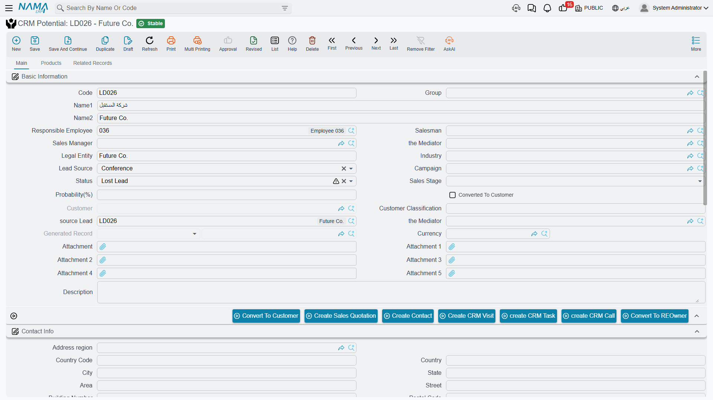

# Potentials

On 2 February 2026, three weeks after the first call and a fortnight after the site visit, Hala pressed **Convert To Potential** on `LD-00417` and saved `PT-00203`. Marina Plaza had stopped being a name on a stand and had become a deal somebody expected to win.

That is what a **CRM Potential** (فرصة) is for: the same prospect, promoted, so that the list of things you are actually chasing is separate from the list of things you are still qualifying. Like the Lead, it is a **master file** — no book, no document term, no value date, no approval cycle.

::: info Required licence
The CRM Potential screen is unlocked by the licence code `crm`.
:::

Find it at **Customer Relationship Management → Marketing → CRM Potential** / **خدمة العملاء ← التسويق ← فرصة**.

## It Is the Lead Screen, Slightly Smaller

The honest description of the Potential screen is that it is the [Lead](/modules/crm/sales-pipeline/crm-leads) screen with one field added and eleven removed. It is not a richer screen, and it does not unlock anything the Lead could not do.

**What it adds:** **Source Lead** (خيط البيع), a read-only reference to the lead this potential was promoted from. The conversion button fills it; you do not type it.

**What it drops from the screen:** English Code, Activity Type, Lead Classification, Rejection Reason, Planned Re-Call Date, Lead Type, Platform, Project, Area, Budget and Internal Source.

Everything else is the same: name, legal-entity text, responsible employee, salesman and sales manager, mediator, industry, lead source, campaign, status, sales stage, probability, customer classification, remarks and attachments, the currency group, the contact-information block, the **Contacts** grid with its *Create Contact For Every Line* switch, the **Products** grid with its competitor columns, the **Assigned To** grid with its Assigning History, dimensions, and the read-only *Converted To Customer* / *Customer* / *Generated Record* fields.

::: info Four dropped fields are still alive behind the screen
Activity Type, Lead Classification, Rejection Reason and Planned Re-Call Date are missing from the Potential's screen but still exist on the record — and a committed [CRM Call](/modules/crm/activities/crm-calls) or [Visit](/modules/crm/activities/crm-visits) still writes them. So a potential can be carrying a lead classification and a planned re-call date that nobody can see on the screen. Read them from the list view's columns, or from an Excel export, if you need them.
:::

::: warning The Mediator field appears twice
On the Potential screen the **Mediator** (الوسيط) field is added to the same group twice, so you may see two identical boxes side by side. They are the same field — fill either one.
:::

## The Deal Value Problem Is Worse Here

::: danger A potential has no visible value at all
The Potential carries a field named *Value Of Deal*. It is **not on the screen**, and it has **no Arabic and no English label** — the system has no name to show for it. The currency group beside it shows a currency and an exchange rate with no amount, exactly as on the Lead, and the Lead's free-text **Budget** box is not on the Potential screen at all.

The practical effect: the record that is supposed to represent a deal you expect to win cannot tell you what that deal is worth. There is no pipeline total, no weighted value and no forecast anywhere in the module. If a site needs a value per potential, the field has to be put on the screen by its implementer.
:::

## What the System Refuses

One rule, and one rule only, is enforced on this screen:

- **A potential cannot claim a source lead that already belongs to a different potential.** The save fails with *"Lead has a different potential {0}"*, naming the other one. This is what stops a lead being promoted twice.

Beyond that, the Potential validates nothing.

::: warning A converted potential stays editable
The Lead has a lock: once it has been converted to a customer, saving it is refused unless the *Allow Editing CRM Lead After Connection* setting is switched on. **The Potential has no such lock.** A potential that has already produced a customer — and that is carrying the *Converted To Customer* tick to prove it — can still be opened and edited freely by anybody, and there is no setting that changes this.

If your process depends on the record being frozen after the win, that guarantee exists on the Lead only.
:::

## Buttons on the Screen

| Button | What it does |
|---|---|
| Convert To Customer (تحويل إلي عميل) | Opens a new, unsaved Customer — see [Converting a Lead](/modules/crm/sales-pipeline/crm-lead-conversion) |
| Convert To REOwner (تحويل الي مشتري) | Opens a new, unsaved Real Estate owner; only present when Real Estate is installed |
| Create Sales Quotation (إنشاء عرض أسعار) | Refused until the potential has been converted to a customer |
| Create Contact (إنشاء جهة اتصال) | A new Contact linked back, with the header contact details copied |
| create CRM Call (إنشاء اتصال) | A new Call with the potential's current status pre-loaded |
| Create CRM Visit (إنشاء زيارة) | A new Visit linked back to this potential |
| create CRM Task (إنشاء مهمة خدمة العملاء) | A new CRM Task linked back to this potential |

There is deliberately **no "convert to offer" button**, and no button that produces an Analysis or a CRM Project. Those three screens are not downstream of the potential — see [The Sales Pipeline](/modules/crm/sales-pipeline/crm-pipeline-overview).

## The List Screen

The Potential list shows Status, Sales Stage, Probability, Customer, Salesman and Sales Manager as columns, with the same two quick-filter chips (Status and Sales Stage) and the same criteria as the Lead list. It carries the same two mass actions in its toolbar, and the same trap:

::: danger "Assign Records To" replaces the assignees
On the Potential list, exactly as on the Lead list, **Assign Records To** (تصعيد إلي) clears the whole *Assigned To* grid on each selected record and leaves a single row for the employee you chose. It is a re-assignment tool, not a way to add somebody. To add an employee, open the potential and add a grid row by hand.
:::

## One Setting That Does Not Apply Here

The CRM setting *Fill Responsible Employee With Current Employee* governs the **Lead screen only**. On the Potential — and on the Offer, the Analysis, the Project and the Development Request — the Responsible Employee is filled with the logged-in user's employee on every new record, unconditionally, whatever that setting says. Switching it off changes nothing here.

## Reporting

**Reporting: none.** This module ships no system reports, and this screen has no print form. The list screen, Excel export and BI are the reporting.
