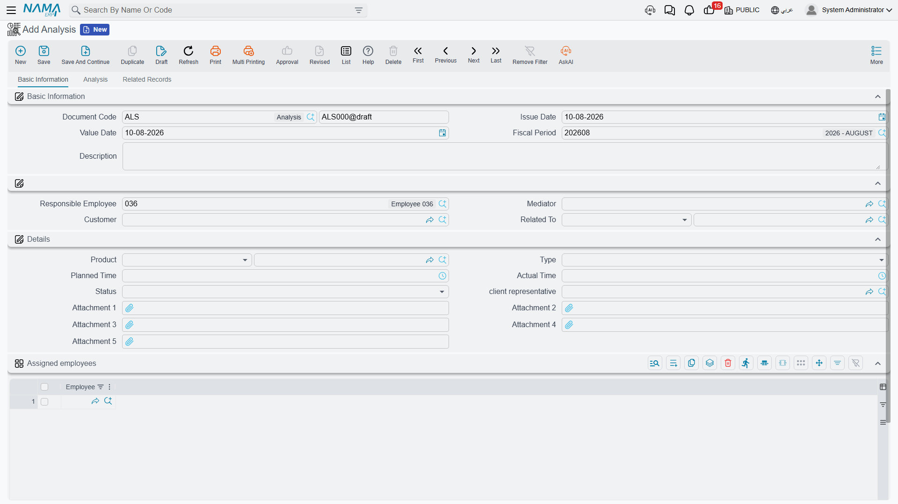
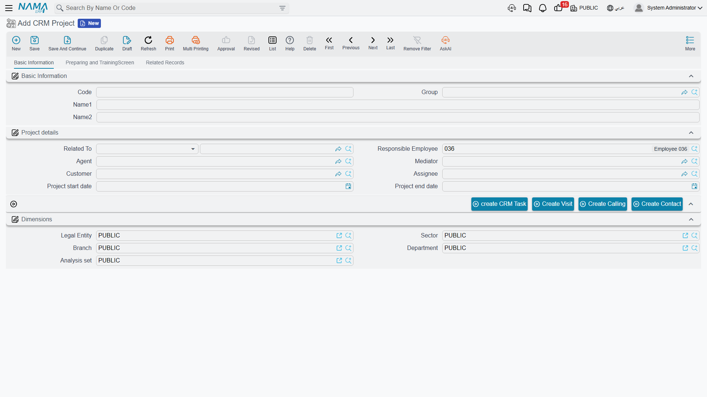
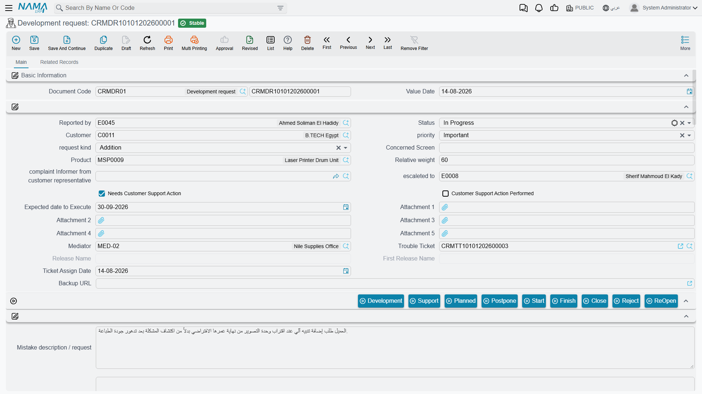

# Projects, Analysis and Development Requests

Three more screens sit in the CRM menu alongside the pipeline, and all three describe **delivery** rather than selling: what was analysed, what has to be built or taught, and what was sent back to be fixed. They look like the natural continuation of Lead → Potential → Customer. They are not.

::: info Required licence
All three screens are unlocked by the licence code `crm`.
:::

Before the detail, the shape of the thing:

```text
   Analysis  (تحليل)          what the customer needs
       :
       :  the Offer's second reference field, filled by hand
       v
   Offer     (CRM عرض)        the work package - no money on it at all
                              see the Offers page

   CRM Project  (CRM مشروع)   the delivery plan
       ^
       :  Related To, filled by hand - and it accepts a Lead, Potential,
          Project, Campaign, Trouble Ticket, Customer or Development
          Request. It does NOT accept an Offer or an Analysis.
```

The dotted lines are reference fields somebody types. There is **no button anywhere** that turns an Analysis into an Offer, or an Offer into a Project, and — as the diagram says — the Project cannot even be pointed at the Offer or the Analysis that preceded it. Read [The Sales Pipeline](/modules/crm/sales-pipeline/crm-pipeline-overview) if you have not already.

## Analysis

**Menu:** Customer Relationship Management → Marketing → Analysis / خدمة العملاء ← التسويق ← تحليل.

The Analysis (تحليل) is a document — a book gives it its number, and like the [Offer](/modules/crm/sales-pipeline/crm-offers) it needs **no document term**. Structurally it is the Offer screen with two differences: it adds a **Mediator** (الوسيط) to the header, and its *Related To* (يرتبط بـ) accepts a **Lead**, a **Potential** or a **CRM Project** (there is no second reference field).

Everything else you already know from the Offer: a header with responsible employee, customer and the reference field; a *Details* group carrying product, type, planned time, actual time, status and client representative; a single-column **Assigned employees** grid; and a second tab whose grid breaks the analysis work into lines with their own assignees, statuses, planned and actual times and dates, followed by the meeting-notes grid — which, as on the Offer, shows a raw key instead of a heading.

The one thing the Analysis has that the Offer does not is a third tab, **Related Records**, holding a read-only list titled **Offers**. It shows the offers whose **second** reference field (مرتبط ب2) points at this analysis. That list is the only place in the whole product where an analysis and its offers appear together — which is why, if you want the view, you must link the offer through *Related To 2* and not through *Related To*.

There is no money on the Analysis screen either: no quantity, no price, no cost, no tax and no total.



## CRM Project

**Menu:** Customer Relationship Management → Support → CRM Project / خدمة العملاء ← الدعم ← CRM مشروع.

Note the folder — the Project is filed under **Support**, not Marketing, which tells you what it is really for: the implementation and training engagement that follows a sale, not the sale itself.

It is a **master file**, so there is no book, no document term, no value date and no approval cycle. Three tabs.



### Basic Information

Code, group and the two names, then a **Project details** group:

| Field (English / Arabic) | Notes |
|---|---|
| Related To (يرتبط بـ) | A Lead, Potential, another Project, Campaign, Trouble Ticket, Customer or Development Request — **not** an Offer and **not** an Analysis |
| Responsible Employee (الموظف المسئول) | Filled with the logged-in user's employee on every new record |
| Agent (الوكيل) and Mediator (الوسيط) | The outside parties involved |
| Customer (العميل) | Who the project is for |
| Assignee (المعين للمهمة) | The employee who owns the delivery |
| Project Start Date / Project End Date (تاريخ بداية المشروع / تاريخ نهاية المشروع) | Plain dates |

::: danger There is no budget, no cost and no progress on a CRM Project
The screen has no budget field, no cost field, no revenue field, no percentage complete, no milestone and no completion flag. Nothing is rolled up from the lines, and nothing is compared to anything.

It is also completely unrelated to the **Contracting** module's projects — different screens, different data, no reference in either direction, no shared reporting. If you are looking for project costing, budgets, extracts or progress billing, that is the Contracting module and this screen has nothing to do with it.
:::

### Preparing and Training

The second tab is the plan. A remarks field, then a grid with one row per phase: **Serial** (المسلسل), **Phase or Cycle** (المرحلة), **Description** (الوصف), product, client representative, the employee it is assigned to, status, type, planned time, actual time, start date, end date and an attachment. The status and type values are the same short lists used on the Offer.

Select a row and press **Create Visit From Selected Line** (إنشاء زيارة من السطر المختار) and a new [CRM Visit](/modules/crm/activities/crm-visits) opens carrying that line's serial, description, phase and assignee. As always, the visit is unsaved until you save it, and no link is written back onto the project line.

Below the grid sits the same meeting-notes grid you saw on the Offer, and it has the same problem: its heading renders as the raw key **`CRMProject.remarkLines`** in both languages.

### Related Records

The third tab is read-only: the Contacts, CRM Tasks, CRM Calls and Visits that point at this project.

### The buttons, including two with no label

The project's toolbar offers **create CRM Task**, **Create Contact**, and buttons that create a Call and a Visit linked to the project.

::: warning Two buttons show their internal name instead of a label
On the CRM Project screen the visit button has **no Arabic and no English label at all** and renders as the raw text `CreateVisit`; the call button has an Arabic label (إنشاء اتصال) but no English one, so an English-language user sees `CreateCalling`. They work — they just have not been given names. Do not go looking for a differently-named button; these are the ones.
:::

::: warning Do not use "Convert To Project Contract" on a service contract
The CRM Service Contract screen carries a button that creates a CRM Project from the contract. It has the same missing-label problem — it renders as `convertToProjectContract` — but the more important issue is that **the project it produces is pointed at a type its own reference field does not accept**. A contract is not one of the values *Related To* allows, so the project comes back holding something the picker cannot re-select, and the behaviour of that record has not been verified.

Treat Service Contract → CRM Project as unsupported. If you need the link, create the project from its own menu and point *Related To* at the customer instead.
:::

### Nothing here is validated

::: warning The Project accepts anything
The Project — like the Offer and the Analysis — enforces no rules whatsoever. An end date before the start date saves. A line with actual time recorded while its status is still *Planned* saves. A project with no customer, no assignee and no lines saves.

Nothing on these three screens will stop a mistake, so do not write "the system will prevent…" into your own procedures for them.
:::

## Development Requests

**Menu:** Customer Relationship Management → Support → Development request / خدمة العملاء ← الدعم ← طلب تطوير.

This screen is **NaMaSoft's own internal development backlog**, and it ships to every installation that holds the `crm` licence. It is not a customer-facing feature and it is not a project-management or change-request tool for your own business.

You can tell from the screen itself: its status list names NaMaSoft's internal departments (*Feedback from Development*, *Feedback from Technical Support*, *Sales Feedback*), it carries a release name and a first-release name, and it holds a twenty-slot discussion thread each entry of which is stamped with the employee who wrote it and the time they wrote it. A request is normally raised from a Trouble Ticket rather than typed from the menu, and once a release name has been stamped on it its status is frozen — the only way forward is the **ReOpen** button, which spawns a fresh request linked back to the old one.



Two practical notes for anybody who does open it:

- The nine status buttons along the toolbar (تطوير, دعم فني, مخطّطة, تأجيل, بدء, انهاء, إغلاق, رفض and إعادة فتح) simply write a value into the on-screen **Status** field. Nothing is saved until you save the record yourself, and nothing else happens.
- The **Complete Description** column on the list view is built from a specific e-mail template that must exist in the installation under a fixed code. Where that template has not been created, the column is permanently blank — that is the explanation, and there is no setting to change it.

::: warning Development Requests cannot be deleted
The Delete action is refused unconditionally on this screen — there is no setting and no permission that allows it. The refusal message is written in English only and is addressed to NaMaSoft's own staff, so it will look out of place to anybody else who triggers it. If a request was created in error, close or reject it instead.
:::

## Reporting

**Reporting: none.** This module ships no system reports, and none of these screens has a print form. The list views, Excel export and BI are the only way to see across projects, analyses or offers.
