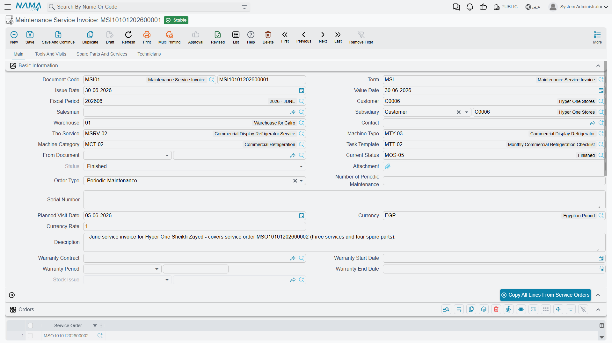

# Service Invoicing

This is the page that decides whether the Service Documents branch can run your business. Read the danger box before you read anything else.

::: info Required licence
The Maintenance Service Invoice and Maintenance Service Invoice Return need the licence code `crm-maintenance-services`.
:::

::: danger The services branch can only bill spare parts
A service line in this branch carries no item, no quantity and no price. There is nowhere on any screen to put a rate on the work itself. The **Total Price Of Services** (إجمالي سعر الخدمات) box is **permanently 0.00** — on the contract, the order, the execution, the invoice and the return — and **service revenue never reaches the ledger**.

A **Maintenance Service Invoice bills spare parts and nothing else.**

If your product *is* labour — cleaning, security cover, a monthly servicing retainer — this suite cannot invoice it as it stands. The only route the product supports is to register the service fee as a stock or service **item** and put it in the **Spare Parts** grid, so that it is billed as a part. If that is not acceptable, use the machine maintenance branch instead, which has priced service lines; [Services or Machines?](/modules/crm/services-suite/crm-services-suite-overview) explains the trade.
:::

## Raising the Invoice

There are two buttons that produce one, and they behave the same way: **Create Service Invoice** (إنشاء فاتورة خدمة) on the Maintenance Service Order, and its twin on the Maintenance Service Order Execution. Either opens a new Maintenance Service Invoice with the source document copied wholesale — customer, contact, service, status, order type, salesman, serial number, warranty fields and all four money groups on the header, and the services, dysfunctions, tools, spare parts, technicians, maintenance groups and returned spare parts in the grids. The order being invoiced is listed in the invoice's own orders grid.

Al Nokhba invoices `SO-0058` on 16 May 2026 as `SINV-0033`:

| | |
|---|---|
| Spare part `SP-FLT-10` × 8 @ 180.00 | **1,440.00** |
| **Total Price Of Services** | **0.00** |
| Total | 1,440.00 |
| Sales tax 14 % | 201.60 |
| Net value | **1,641.60** |

Two and a half hours of a technician's time went into that visit and none of it appears on the invoice, because there is nowhere for it to appear.

## What Saving the Invoice Does

Saving is instant; the effects are created as business requests and processed in the background, so watch the document's processing status rather than the save button. If something fails, it is retried from the **Business Requests** list view — filter by failed status, select the rows and use **More → Reprocess**.

**The accounting entry.** The invoice creates a full sales-side entry from the debit and credit sides on its document term, together with the tax, discount, cash and service-fee sides configured there. For `SINV-0033` that is 1,641.60 against the customer's receivable, 1,440.00 to spare-parts revenue and 201.60 to sales tax. Only spare-part lines carry value into it — there is nothing else to carry.

**The stock issue.** If the invoice's document term names a stock-issue book and term and has **Generate Stock Issue With Spare Parts** (إنشاء سند صرف مخزني بقطع الغيار) ticked, saving the invoice creates a real Stock Issue and remembers it in the read-only **Stock Issue** (صرف مخزني) field on the header. `SINV-0033` produces `SI-1955` from warehouse `WH-ALX` carrying 8 × `SP-FLT-10`. **This is the document that actually takes the parts out of stock** — not the order and not the execution sheet.

::: warning Parts always leave the header warehouse
The generated stock issue takes its warehouse from the invoice **header**. The Warehouse and Location columns on the individual spare-part lines are ignored, and so are the line prices, item dimensions and remarks. A visit that draws parts from two different warehouses cannot be recorded correctly on one invoice — split it.

Worse, the Maintenance Service Invoice does **not require** a header warehouse even though it generates a stock issue. Leaving it empty produces a raw technical error when the document is saved rather than a readable validation message. Always fill it. (The Maintenance Service Invoice Return does require one.)
:::

::: warning Two term options that do nothing here
Ticking **Generate Stock Issue With Service Items** (إنشاء سند صرف مخزني بأصناف الخدمات) on the invoice term produces an **empty** stock issue, because there are no priced service lines for it to read.

Several other options on the invoice and contract term screens are equally inert in this branch: *Copy Remaining To Cash*, *Pay Installments In Order*, *Allow Payment More Than Invoice Amount*, *Use Payment Docs As Debt Ages* and *Price List Default Price*. This branch has no payment lines, no instalments and no external payments at all. On the contract term, *Pay Installments In Order* is even rendered **twice**. Leave all of them alone; ticking them changes nothing.
:::

## Cancelling an Invoice Does Not Undo It

::: danger A cancelled service invoice leaves its accounting entry and its stock issue behind
Cancelling or deleting a **Maintenance Service Invoice** does **not** reverse its accounting entry and does **not** cancel the Stock Issue it generated. The entry stays in the ledger and the parts stay issued. Editing a saved invoice re-applies its effect **without** reversing the previous one first, so an amended invoice can leave a doubled entry behind it.

The Maintenance Service Invoice Return is the only correct way to reverse a service invoice. Do not cancel the invoice and assume the books are clean — check the ledger and the stock issue by hand if somebody already has.
:::

This is the single most expensive difference between this branch and the machine one, where the invoice reverses itself properly. Build your working practice around it: **correct with a return, never with a cancellation.**

::: warning Do not press Regenerate Accounting Effects on a service invoice or a service contract
The toolbar action exists on both screens and it does not work on either. Pressing it either fails outright or wipes the document's entry to nothing. If an entry needs rebuilding, raise it with your Nama representative rather than pressing the button.
:::

## Contract Entitlement Is Never Consumed

If your contract lists an entitlement — `SVC-0006` carries 312 filters — you would expect invoicing 8 of them to leave 304 remaining. It does not.

::: warning Sold Quantity and Remaining Quantity are manual columns
Nothing in the services branch consumes contract entitlement. Invoicing does not increase **Sold Quantity** (ما تم بيعه) and does not reduce **Remaining Quantity** (المتبقي), and the check that would refuse a quantity greater than the remaining entitlement never fires here. After thirty-nine visits, `SVC-0006` still shows 312 remaining.

There is a matching oddity on the way back: cancelling a **Maintenance Service Invoice Return** *does* adjust the contract — it adds the quantity back to Remaining and subtracts it from Sold — even though nothing ever took it away. That pushes Sold Quantity negative. If you see a negative Sold Quantity on a service contract, this is why; correct the contract quantities by hand.
:::

## Returns

The **Maintenance Service Invoice Return** (مردود فاتورة خدمة الصيانة) is the reverse of the invoice, and it is the better-behaved of the two. It creates a purchase-side accounting entry from its own document term, and it generates a **Stock Receipt** from the term's stock-receipt book and term when *Generate Stock Receipt With Spare Parts* is ticked. Unlike the invoice, it declares its full set of effects, so cancelling a return **does** reverse its entry and cancel its stock receipt.

It also **requires a warehouse** before it will save — the one validation the invoice is missing.

Like the invoice, its *Generate Stock Receipt With Service Items* option does nothing, and its Total Price Of Services is 0.00.

## When a Document Refuses to Save With a Technical Error

Both the invoice and the return read their document term without checking that its settings were ever filled in. A document saved against a term whose settings page was left blank fails with a raw technical error rather than a readable message. If a user reports an unintelligible error on save, check the document term first: it is almost always a term that was created and never configured.

The term settings that actually matter here are covered in [Maintenance Document Terms](/modules/crm/document-terms/crm-maintenance-terms).

## Reporting on Any of This

There are **no system reports and no dashboards for CRM at all**, and none for this branch in particular. What you have is the list view, its column set and its filters, Excel export, and whatever BI dashboards your site builds. If somebody asks for "the service revenue report", the honest first answer is the one at the top of this page: in this branch, service revenue does not exist as a figure the system holds.
