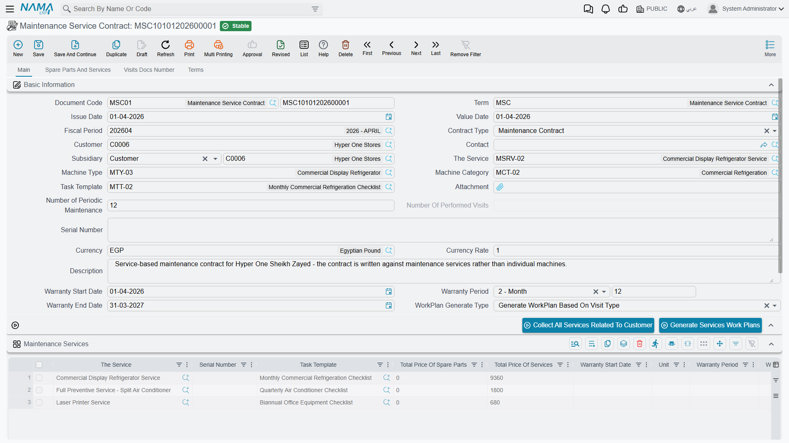
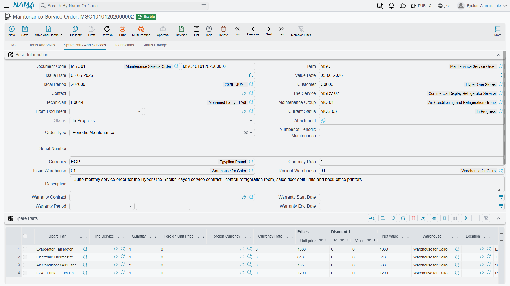
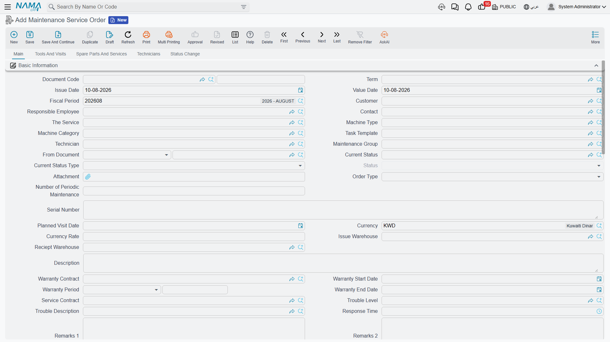

# Service Orders and Executions

This page follows one contract from the day it is signed to the day a technician ticks the last box on a checklist. It is the working half of the Service Documents folder; the money is on the [Service Invoicing](/modules/crm/services-suite/crm-service-invoicing) page.

::: info Required licence
Every screen on this page needs the licence code `crm-maintenance-services`. The task templates, statuses, buildings and categories they refer to are licensed under `crm-maintenance`.
:::

## The Chain, and Which Arrows Are Automatic

```
Sales Quotation ──manual──▶ Sales Order ──manual──▶ Contract
                                                      │
                                                      │ button: Generate Services Work Plans
                                                      ▼
                                                  Work Plans
                                                      │
                                                      │ button: Generate Orders
                                                      ▼
   Notice ──manual (From Document)──────────────▶ Service Order
                                                      │
                                                      │ button: Create Service Execution For All Lines
                                                      ▼
                                                  Execution ──▶ status back onto the order
```

Every arrow in that diagram is a **button somebody presses**. Nothing in this folder happens on a timer. There is no scheduler, no reminder, no alarm and no notification anywhere in the CRM module, so a contract that nobody opens produces no work plans, and a work plan that nobody opens produces no orders.

## The Service Contract

The contract is where the commercial arrangement is recorded and where the visit calendar comes from. Al Nokhba's agreement with Nile Commercial Bank is contract `SVC-0006`, dated 1 May 2026.



**On the main tab** you set the Contract Type, the Customer (`C-02240`), the Contact and the **Subsidiary** (الذمة) — the account the entry will be made against — plus the Currency and the Work Plan Generate Type.

::: tip The contract dates are labelled "warranty"
The contract's start and end dates are the fields labelled **Warranty Start Date** (تاريخ بداية الضمان) and **Warranty End Date** (تاريخ نهاية الضمان). They are not a warranty in any meaningful sense here — they are the period the contract runs for, and the work-plan generator reads exactly those two boxes. For `SVC-0006` they hold 1 May 2026 and 1 November 2026. Sites commonly relabel them to *Contract Start Date* and *Contract End Date*, which is worth doing.
:::

**The services grid** carries one row per serviced site. For each row you choose the **Visit Types 1 to 7** — up to seven independent recurrences on the same site — each with its own task template, plus the employee who will do the work and the building. Nile Commercial Bank's three branches all take **Bimonthly** (نصف شهرية) with template `TT-BRN-B` and employee `EMP-2014`.

::: warning The services grid on this screen and on the service order is titled "Machines"
On the Maintenance Service Order the grid holding the service lines is headed **Machines** (ألآت), and it carries Machine Classification and Odometer columns as well. Every row in it is a service. The heading is wrong, the rows are right; read past it. Do not spend time looking for a separate machines grid, because there is not one anywhere in this branch.
:::

Here is the grid in question — headed **Machines**, with Service and Task Template as its first columns:



**The Spare Parts And Services tab** holds the parts entitlement — for `SVC-0006`, 312 filters (`SP-FLT-10`) at 180.00 each, being 39 planned visits × 8 filters per visit — with **Sold Quantity** (ما تم بيعه) and **Remaining Quantity** (المتبقي) columns beside them. Below the parts sits the **Total Price Of Services** (إجمالي سعر الخدمات) group, showing 0.00, and it will show 0.00 for the life of the contract: service lines in this branch carry no price at all.

**The Terms tab** is the SLA table: trouble level, trouble description and response time, plus two remark columns. It is a reference table on the contract; nothing measures a response against it.

**When the contract is saved**, it creates an accounting entry over the **spare-part lines only** — for `SVC-0006`, 64,022.40 against the customer's subsidiary account, 56,160.00 to spare-parts revenue and 7,862.40 sales tax. That happens only if the contract's document term has **both** a debit and a credit side configured; if either is empty, nothing is created and any existing entry is cancelled. Like all document effects it is processed in the background, so the save itself is instant and the processing status is visible on the document. The contract moves no stock.

::: warning Entitlement is never drawn down
Nothing in this branch ever increases Sold Quantity or reduces Remaining Quantity. Orders and invoices do not consume the contract, and the check that would refuse a quantity greater than the remaining entitlement never fires here. Treat those two columns as manual bookkeeping and reconcile them yourself.
:::

::: warning Two permanently empty tabs
The contract's **Visits Number** (عدد الزيارات) tab — and the **Maintenance Visits** list on the Tools And Visits tab of the order, invoice and invoice return — list the **machine** suite's visit document. There is no visit document in the services branch, so these lists can never show a row, no matter how much work has been done. The execution sheet is what records a visit here.
:::

## Generating the Work Plans

With the contract saved, press **Generate Services Work Plans** (إنشاء خطط عمل). The generator needs the work-plan book and term to be named on the contract's document term, and it needs the contract start and end dates; it refuses without them.

For each services line, for each of its visit types, it walks forward from the contract start date one step at a time and emits a planned visit until it passes the contract end date. The step lengths are:

| Visit type | Step |
|---|---|
| Daily | 1 day |
| Weekly | 7 days |
| **Bimonthly** | **14 days** |
| Monthly | 1 month |
| Quarterly | 3 months |
| Biannual | 6 months |
| Yearly | 12 months |

::: warning "Bimonthly" steps 14 days, not two months
The label reads as *every two months* in English; the Arabic *نصف شهرية* reads as *twice a month*, and the Arabic is the one that matches the behaviour. If you meant every two months, there is no visit type for that — use Monthly and delete alternate lines, or use Quarterly.
:::

For `SVC-0006` that gives 13 dates per branch — 15 and 29 May, 12 and 26 June, and so on to 30 October, the next one falling past the contract end — and 13 × 3 branches = **39 planned visits**, which is where the 312 filters came from. Those 39 lines are grouped into work plans according to **Work Plan Generate Type**; `SVC-0006` uses *Based On Contract Priority*, which groups by the month of the expected date, producing six work plans `SWP-0011` to `SWP-0016`.

If the first computed visit date already falls after the contract end date, the whole action fails with *"Visit type {0} is after contract end date {1} in line number {2}"* — which usually means the contract dates are the wrong way round.

::: warning Re-running the generator deletes work plans
Pressing *Generate Services Work Plans* again is not a safe refresh. Work plans whose grouping no longer matches are **deleted**, and they take their line-to-order links with them. If you change the contract dates or the visit types on a contract that already has orders in flight, expect to lose the trail between them.
:::

A work plan has **no accounting and no inventory effect** — it is a calendar with a document number.

## Generating the Orders

Open a work plan and press **Generate Orders** (إنشاء أوامر). The book and term for the new orders come from the work plan's document term.

Lines are grouped by **(expected date, employee, building)** and one service order is created per group. `SWP-0011` holds two dates across three buildings, so it produces six orders, `SO-0058` to `SO-0063`. Each order gets its value date from the line's expected date, its Service Contract from the work plan's From Document, and the header service, task template, technician, maintenance group, contact, customer, warranty fields and price classifiers copied down.

Pressing the button again **edits the order it created last time** rather than making a duplicate — the work-plan line remembers which order it produced.

There is a second, tidier route into the same screen: **Gather Services With Same Options** (تجميع الخدمات ذات نفس الخصائص) collapses work-plan lines that share the same options before you generate, which is useful when a contract has many sites on identical schedules.

## The Service Order

`SO-0058` — value date 15 May 2026, from document `SWP-0011`, service contract `SVC-0006`, service `SRV-0071`, employee `EMP-2014` — is a work order. It lists the services to be attended, the dysfunctions found, the spare parts expected (8 × `SP-FLT-10`, 1,440.00), the tools to be taken, the technicians and their rewards, and it keeps a status trail.



::: warning The service order creates nothing in the ledger and moves no stock
Unlike the machine suite's maintenance order, a Maintenance Service Order has **no accounting effect at all** — the whole accounting layer of the order document belongs to the machine branch. The Debit and Credit pages are correctly hidden on its document term, which is the honest signal. Its *Total Price Of Services* is 0.00 as everywhere else. Nothing about the order reaches the general ledger; only the invoice does.
:::

Two fields on the header regularly cause trouble:

::: warning Use Service Contract, not Warranty Contract
The header carries both **Service Contract** (عقد خدمة صيانة) and **Warranty Contract** (عقد الضمان). Only the first is a service contract. The Warranty Contract picker searches the **machine** suite's contracts, and selecting one is expected to fail with a technical error rather than copy any dates across. Fill Service Contract and leave Warranty Contract empty. The same trap is on the Maintenance Service Notice and the Maintenance Service Invoice.
:::

::: warning Roll-up and odometer columns never fill themselves
Total Price Of Spare Parts, Total Price Of Services, Total Price Of Returned Spare Parts, Last Odometer, Current Odometer and *Difference Between Current and Last Odometer* on the service lines are computed by nothing in this branch. They stay empty unless somebody types into them, and selecting a service does not auto-fill the header customer or contact. There is no odometer tracking for services — but the order still refuses to save if a line's Current Odometer Date equals its Last Odometer Date, so leave both empty.
:::

**What the order does refuse to save.** The technicians' rewards in the grid must add up to the header reward; every service used in a spare-parts, tools or dysfunctions line must appear in the services grid; the same service and task template may not be listed twice; and the status-change lines may not be added, removed or edited by hand. That last rule is why the **Status Change** tab is read-only on screen: every row on it is written automatically when somebody changes the Current Status, capturing the from-status, to-status, timestamp, user and remark, and then clearing the remark box.

**The status type** is copied from whichever status you choose. If your Maintenance Order Status records have no status type set, the order's lifecycle records nothing useful — that setup detail is covered with the statuses themselves in the maintenance files.

**Moving parts out of stock** is a manual step here. The **Spare Parts Issue** (طلب صرف قطع غيار) and **Tools Issue** (طلب صرف عِدد) buttons on the order open a pre-filled Stock Issue Request that the user must then save; the **Spare Parts Receipt** button does the same for returned parts. Nothing leaves the warehouse when the order is saved. Two cautions: the Tools Issue button appears twice on the screen with the same label, and one of the two actually produces a stock **receipt** request rather than an issue — check the document that opens before you save it. And the receipt variant arrives with an empty *From Document*, so type the link in if you rely on it.

## Ad-Hoc Work: The Service Notice

Not everything is planned. When a branch reports a fault, the intake document is the **Maintenance Service Notice** (بلاغ خدمة صيانة): the customer, the service, the trouble level, trouble description and response time, the dysfunctions found and any parts likely to be needed. Move it through the statuses as it progresses — every change is recorded on its Status Change tab automatically — and then raise a Maintenance Service Order with the notice as its **From Document**.

The notice **has no accounting effect and no inventory effect**. It is a fault log, nothing more. It also has **no document term**, so the Term field on its screen has no options behind it. And unlike the machine suite's notice, there is **no mobile check-in and check-out** on it — the technician attendance flow in Nama Mobile belongs to the machine branch only.

## The Execution Sheet

The execution is what the technician fills in. From the order, **Create Service Execution For All Lines** (إنشاء سند تنفيذ لكل السطور) — or *For Selected Lines* — creates one **Maintenance Service Order Execution** per service line, taking its book and term from the order's document term. If that term has the option to consider task-template tasks switched on, each execution arrives with the checklist already loaded.

`SEX-0090` is the execution for `SRV-0071` on 15 May 2026. The technician presses **Start** (بدء) at 09:00 to stamp the from-time, works through the five checklist lines, records the parts actually used (8 × `SP-FLT-10`), and presses **End** (إنهاء) at 11:30. Net time comes out at 2:30. **Make All Lines Done** ticks the whole checklist in one go, and **Change Status To In Progress** is there for work that spans days.

**What saving it does:** the execution writes its status back onto the matching line of the parent order, and then sets the order's overall status type — *In Progress* if any line is still in progress or reopened, *Finished* otherwise. Cancelling the execution clears the link and the status from those lines again.

::: warning The execution sheet moves no stock and no money
Despite listing spare parts and showing money totals, a Maintenance Service Order Execution has **no accounting effect and no inventory effect**. It is a work record. Parts are moved either by saving one of the pre-filled stock requests its buttons open, or by the invoice — and nothing checks that one of those happened.
:::

The execution is also the one document in this folder with **no document term class at all**. The Term field is on its screen; there are no settings behind it. Its machine twin does have one, which is why the two screens look identical and behave differently.

Four documents in this folder — the work plan, the sales order, the sales quotation and the execution — perform **no validation whatsoever** when saved. Book, code and dimensions aside, nothing on them is checked. Do not rely on the system to catch a mistake in a work plan.

When the work is done, [Service Invoicing](/modules/crm/services-suite/crm-service-invoicing) is the next and last step — and the one with the most important warning in this folder.
