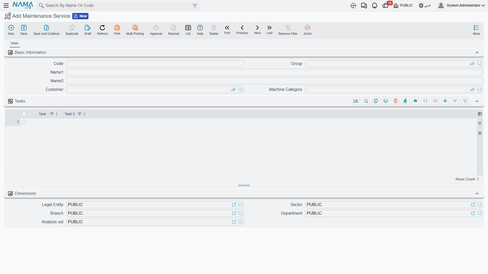

# Service Records

Every document in the Service Documents folder points at something being serviced. In the machine maintenance folder that something is a machine — a compressor with a serial number, a warranty and an owner. Here it is a **Maintenance Service** (خدمة صيانة): a named piece of recurring work at a place.

Al Nokhba services the air conditioning in three branches of Nile Commercial Bank. That is not one service and it is not three machines — it is three service records:

| Code | Arabic name | English name | Customer |
|---|---|---|---|
| `SRV-0071` | صيانة تكييف فرع سموحة | AC servicing – Smouha Branch | `C-02240` |
| `SRV-0072` | صيانة تكييف فرع سيدي جابر | AC servicing – Sidi Gaber Branch | `C-02240` |
| `SRV-0073` | صيانة تكييف فرع المنشية | AC servicing – Manshia Branch | `C-02240` |

Each one is a row on the contract, a line on the work plan, a service order of its own and an execution sheet of its own. Get the granularity of these records right and the rest of the folder follows naturally; get it wrong — one record for the whole bank, say — and you will find you cannot dispatch a technician to a single branch.

::: info Required licence
The Maintenance Service file needs the licence code `crm-maintenance-services`. Most of the reference fields on it, however, belong to `crm-maintenance` — see the note at the end of this page.
:::

## What Is on the Record

It is a short file, and deliberately so:

| Field | Arabic | Notes |
|---|---|---|
| Name | الاسم | The Arabic name is `name1`, the English name is `name2` |
| Customer | العميل | Load-bearing — see below |
| Machine Category | تصنيف آلة | Genuinely used: it filters the task-template lookup on documents |
| Tasks | المهام | The checklist held on this record |

That is very nearly the whole file. There is **no serial number, no warranty period, no odometer, no ownership history and no price** on a service record. If you have read the machine file page you will notice how much is absent — and that absence is the honest difference between the two branches, not something waiting to be switched on.

::: tip The record is a master file, not a document
Maintenance Service has no book, no document term, no value date, no document number and no approval cycle. Nothing is processed when you save it and it has no accounting or inventory effect. Treat it exactly as you treat a customer or an item: reference data that documents point at.
:::

### The Customer Field Is the One That Matters

Almost everything downstream keys off the customer on this record.

The contract screen has a button, **Collect All Services Related To Customer** (تجميع كل الخدمات المرتبطة بالعميل), which loads every service record whose customer matches the contract header and replaces the services grid with one line per record. It is the fastest way to build a contract for a customer with dozens of sites — and it is completely blind to any record whose Customer box is empty. A service with no customer is invisible to it, and the button reports *"Customer must be entered"* if the contract header itself has no customer yet.

### Where the Location Comes From

The record carries building, floor and room fields internally, but **they are not on its screen**. In practice you set the location on the **document lines** — the services grid on the contract, work plan, order or execution carries its own Building, Floor and Room columns, and those are what the order generator groups by when it decides how many service orders to create for a day.

That is worth knowing before you design your data: two branches in the same building will be grouped into one service order, because the grouping key is date, employee and **building**.

## Creating Service Records

There are two routes, and they are not equally complete.

### By hand

Open **Customer Relationship Management → Service Documents → Maintenance Service**, give it an Arabic and an English name, set the Customer, set the Machine Category so task templates can be found, and fill the task checklist. This is the route that produces a usable record, and for a handful of sites it is the right one.

### From a services sales order

When you are quoting for a customer who has forty branches, typing forty master records first is not sensible. So the sales quotation and sales order let you type a **Service Name** in each line of the services grid and create the master records afterwards: fill the lines, save the sales order, then press **Generate Service** (إنشاء الخدمة). For every line that has a name but no service reference, a Maintenance Service record is created and linked back into the line.

::: warning Generated service records are shells and must be finished by hand
The generator fills only the **Arabic name** (from the line's Service Name), the code (from the Service Group), the building, floor and room, and the dimensions. It does **not** set the **Customer**, it does not fill the **task checklist**, and it leaves the **English name empty**.

Two consequences bite immediately:

- *Collect All Services Related To Customer* cannot find any of them, because they have no customer.
- Execution sheets generated for them arrive with no checklist for the technician to tick.

After pressing *Generate Service*, open every record it created and give it a customer, an English name and its tasks. Nothing warns you that this step is outstanding.
:::

There is one more thing to know about the sales documents while you are there: they carry a **Service Name** field on the header as well as the grid column, but the header field is **never rendered on any tab**. Only the grid column exists on screen, and the grid column is the one *Generate Service* reads. Do not go looking for the header field.

## How Documents Use the Record

Once the record exists, its behaviour on documents is consistent across the folder:

- Setting the header field **The Service** (الخدمة) on an order, notice, invoice or invoice return **inserts a matching line** into the services grid if one is not already there, first removing any line with an empty service. You do not have to add the header service to the grid yourself.
- Every service referenced in a spare-parts grid, a tools grid or a dysfunctions grid **must also appear in the services grid**, or the document refuses to save with *"Can not use the service {0} because it was not found in the services grid"*.
- The same **(service, task template)** pair may not appear twice in the services grid — *"The service {0} in line {1} is repeated"*.
- The **task template** lookup on a services line is filtered by the record's **Machine Category** and by the visit types chosen on that line. If a technician tells you a template "is not in the list", check the Machine Category on the service record first.

## The Machine Wording, One More Time

A service record is described with fields whose labels talk about machines: **Machine Category** (تصنيف آلة) here, and on the documents that point at it, **Machine Type** (نوع الآلة), **Machine Classification 1..5** and **Serial Number**. Only Machine Category does anything on this side of the product — it drives the task-template filter. The rest are inherited fields you can use as free reference data or leave alone.

Do not confuse this file with **Machine Maintenance Service** (خدمة صيانة ماكينة), which is a completely different file under the `crm-maintenance` licence: a priced catalogue entry with a price and a tax plan that you sell on a machine order line. The overview page, [Services or Machines?](/modules/crm/services-suite/crm-services-suite-overview), sets the two side by side.

## Reference Data You Also Need

The Machine Category, the buildings, floors and rooms, the task templates, the classifications, the maintenance groups, the dysfunctions and the order statuses that these screens ask for are all licensed under **`crm-maintenance`**, not under `crm-maintenance-services`. A site licensed for the services branch alone can create service records but cannot create most of what they point at. Plan for both licence codes.

Next: [Service Orders and Executions](/modules/crm/services-suite/crm-service-orders) puts these three bank branches under a contract and gets a technician to them.
