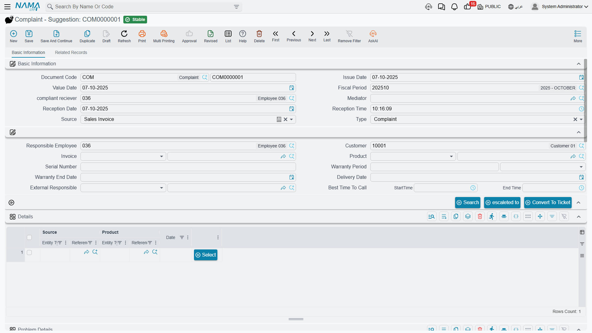

# Complaints

::: info Required licence
`crm`.
:::

The screen is called **Complaint - Suggestion** (*شكوي - إقتراح*), and the second half of that name matters: this is the desk's general intake log, not a fault register. A customer who calls to complain, a customer who calls to suggest an improvement, and a customer who calls to pass on a remark all end up on the same form, distinguished by the **النوع / Type** field.

Its real strength is finding things. An agent who has a customer on the phone and nothing else — no invoice number, no serial, no idea which of nine split units in the building is broken — can pick the customer, press one button and walk through what that customer actually bought.

## What happens when you open one

A new complaint arrives partly filled in: **Reception Date** is today, **Reception Time** is now, **Complaint Receiver** and **Responsible Employee** are the employee behind the current user, and **المصدر / Source** takes its default from **Compliant Source** in [CRM Settings](/modules/crm/crm-configuration.md).

That Source setting is more consequential than it looks. It has two values — **Sales Invoice** and **Service Contract** — and it decides what the search on this screen will offer: lines from the customer's committed sales invoices, or lines from their committed service contracts.

## Finding the product

This is the part worth learning properly. Karim takes the call from Marina Plaza on 6 April 2026 and raises `CMPL-0207`:

1. He picks the **customer**, `C-01188`. The screen clears the invoice, product, warranty and call-time fields, fills the address block from the customer's contact address, and populates the **التفاصيل / Details** grid with rows drawn from that customer's history — one row per line of their committed sales invoices, showing the source document, the product and the date. **بحث / Search** repeats that lookup on demand.
2. He finds the row for the guest-room split unit and presses **إختيار / Select**. That copies the row's source document into **الفاتورة / Invoice** and its product into **المنتج / Product** — here invoice `SI-2025-4416` of 18 November 2025 and item `AC-SPL-24`.
3. Selecting the invoice pulls across the **Customer**, the **Delivery Date** and the shipping address. Selecting the product pulls the item's **warranty period** and its default supplier into **المسئول الخارجي / External Responsible** — `SUP-0311`. Because an invoice is now set, the screen also computes **تاريخ نهاية الضمان / Warranty End Date** as the invoice's value date plus the warranty period: 18 November 2026.
4. He types the **Serial Number** from the customer's unit, `SPL24-2025-11-0783`.

In four steps the complaint knows exactly which physical unit is being complained about, and roughly whether it is still under its original warranty.

::: warning Two things about the search that will surprise you
**The Details grid is never saved.** It is a search result, not part of the document. Re-open a committed complaint and the grid is empty — which is correct behaviour, but startling if you were treating it as a record of what was offered. Anything you want to keep must be pulled onto the document with **Select**.

**The search does not return the newest documents.** It brings back a fixed number of rows from the customer's history — set by **Number Of Result Sources Of Complaint** in CRM Settings, falling back to 10 when blank — and those rows are **not** the customer's most recent ones. Do not assume the top row is the latest sale, and raise the row count when what you are looking for is not in the list.
:::

The **Warranty Period** and **Warranty End Date** captured here are stored on the complaint as data. They are not the same thing as the coverage a trouble ticket computes — that is a live lookup against warranties and service contracts, described on [Trouble Tickets](/modules/crm/support/crm-trouble-tickets.md).

## The rest of the screen

**Type and classification.** **النوع / Type** is Complaint, Suggestion or Remark. Alongside it, **نوع شكوى / Complaint Type** and **مصدر شكوى / Complaint Source** are your own master files — Karim uses `CTY-02` *Technical fault* and `CSR-01` *Phone call*. There is also a Document category, two "Related to" reference fields, an **Assignee** and an **Escalated To**.

**تفاصيل المشكلة / Problem Details** — the grid that says what is actually wrong. One row per issue: a **Problem Classification**, a **Problem** and a free description. The Problem picker is filtered by the classification chosen on the same row, so setting the classification first narrows the list usefully. `CMPL-0207` carries one row: classification `PCL-02` *Electrical faults*, problem `PRB-11` *Unit does not start*, description *"Unit does not start after a power cut"*.

**المتابعه / Follow Up** — a plain manual grid of employee, date and note. Nothing writes into it; it is for the agent to keep a running note of chases.

**Best Time To Call** — a start and end time, so the desk knows when the customer can actually be reached.

**Address Information** and **Dimensions** round off the first tab.

**السجلات المرتبطة / Related Records** — the second tab, and the only place in the product where a complaint's downstream work is visible in one screen: the trouble tickets raised from this complaint, their executions, and their follow-ups.

## Converting to a ticket

When the call turns out to need technical work, press **تحويلة إلي طلب دعم / Convert To Ticket**.

The button refuses if **Product** is empty — *"You must enter product"* — which is the only validation anywhere on this screen. Otherwise it opens a **new, unsaved Trouble Ticket** carrying the complaint's dimensions, Customer, Product, Serial Number, Description, both Related-to fields and the External Responsible, plus a read-only link back to this complaint. You still have to save the ticket yourself.

::: warning The complaint does not know it was converted
Convert To Ticket changes nothing on the complaint. It does not set a status, does not mark it as handled, and does not stop you pressing the button again — press it three times and you get three unrelated tickets, all pointing back here.

The link runs one way only. The complaint's Related Records tab reads the tickets that point at it; there is no field on the complaint naming its tickets.
:::

## Status, escalation, and the absence of a workflow

::: danger Complaint status never changes by itself
The **الحالة / Status** field offers *مبدئي / Initial*, *منتهي / Finished*, *Escalated* and *مغلقة / Closed*, and **no process in the system ever writes it or reads it** — including Convert To Ticket. `CMPL-0207` will read *Initial* forever unless somebody opens it and changes the field by hand.

It is a manual label. If your desk relies on it, put a step in your own procedure that says who updates it and when, because the system will not. (*Escalated* has no translation in either language and shows as a raw Latin word in the dropdown.)
:::

::: warning Escalate To is a field, not a state
**تصعيد الي / Escalate To** stamps the chosen employee onto the complaint and immediately saves and commits it — the version stored on the server, so any unsaved edits on screen are lost. It does not change the status, does not notify the person named, and there is no queue of escalated complaints anywhere.
:::

More broadly: **the complaint validates nothing.** Beyond the product check on Convert To Ticket, you can commit a complaint with no customer, no product, no type and no problem rows. Whatever discipline your desk needs has to come from your own procedure and, if necessary, from required-field settings you configure yourself.

## Do you need complaints at all?

An honest answer, because it comes up in every implementation:

**Use the complaint** if your desk logs every inbound contact — including suggestions and remarks that will never become work — or if agents routinely need the invoice search to identify a product. It is a good notepad with excellent auto-fill.

**Skip it** if your desk only ever records faults and agents already know the product. Raising a Trouble Ticket directly loses you nothing: the complaint has no validation, its status is inert, and its one piece of automation opens an unsaved ticket you would have opened anyway.

What you must not do is treat the complaint as a case that progresses through states while the ticket handles the work. Only the ticket has a lifecycle.

## Effects and reporting

The complaint **posts nothing, moves no stock and uses no document term.** For reporting, use the Complaint list screen with its criteria, or export to Excel — CRM ships no system reports and no dashboards at all, and none of the built-in printed forms covers complaints.
