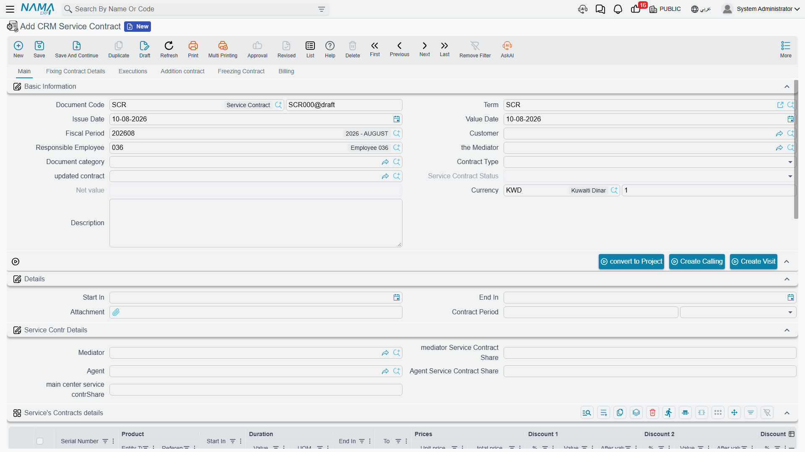
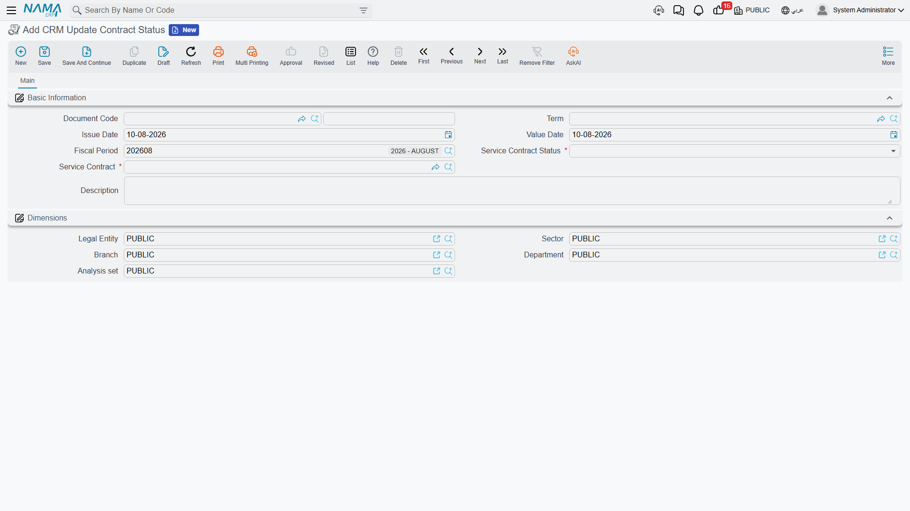

# Service Contracts

::: info Required licence
`crm`.
:::

A **CRM Service Contract** (*عقد خدمة*) is a priced, period-bounded agreement that a named customer's listed products are entitled to support. Marina Plaza buys twelve months of cover for three of its guest-room and office units; the contract records which units, for which period, at what price.

Before anything else, two facts that decide whether this document fits your business at all.

::: warning The contract *is* the invoice
This is not a contract that later produces invoices. It carries the full money block itself — line prices, eight discount levels, four taxes, net value, paid and remaining — and when it is processed it posts **one ledger line per contract line**. Committing the contract is the billing event. There will never be another one.
:::

::: danger There is no payment schedule and nothing generates a recurring invoice
The contract has no instalment grid, no payment-schedule tab, and no button, rule or scheduled job anywhere in CRM that raises an invoice from it. **Twelve monthly invoices means twelve receipt vouchers raised by hand, in Accounting, one a month, by somebody who remembered.**

Nothing reminds anybody. There is no renewal action and no expiry warning either — a contract simply stops covering on its end date, silently.

If you are selling a subscription, plan the recurring billing outside this document before you commit to it.
:::

## Raising a contract

You reach it from **Customer Relationship Management → Support → CRM Service Contract**.

**Start with the document term.** The term is what decides whether the contract will post anything at all, and picking it also fills in the **نوع العقد / Contract Type** — *Ordinary* for a new contract, or *Renewal*, *Extension*, *Upgrade* or *Transfer* for one that supersedes an earlier contract. The field stays editable afterwards.

**The header** — Customer, Responsible Employee (pre-filled with the current user's employee), the Mediator, Document category, the contract type, the contract this one updates, a read-only **حالة العقد / Service Contract Status**, currency and rate, and a description. Below it a small **Details** block holds the header **يبدأ في / Start In**, **ينتهى / End In** and **مدة العقد / Contract Period**.

`CSC-0044` is issued on 25 February 2026 with a value date of 1 March, customer `C-01188`, mediator `MED-07`, contract type *Ordinary*, running 1 March 2026 → 1 March 2027.

**The lines** — the **تفاصيل عقود الخدمة / Service's Contracts details** grid is the heart of the document. One row per covered product:

| # | Product | Serial | Start In | End In | Net value |
|---|---|---|---|---|---|
| 1 | `AC-SPL-24` Split unit 24,000 BTU | `SPL24-2025-11-0783` | 2026-03-01 | 2027-03-01 | 18,000.00 |
| 2 | `AC-SPL-18` Split unit 18,000 BTU | `SPL18-2025-11-0791` | 2026-03-01 | 2027-03-01 | 14,000.00 |
| 3 | `AC-FCU-08` Fan-coil unit | `FCU08-2025-12-0310` | 2026-03-01 | 2027-03-01 | 8,000.00 |

Each line also carries a unit price, eight discount levels, four item taxes, a duration, and a calculated **إلى / To** column that we come back to under Freezing.

Inserting a line copies the header's Start In and End In down onto it, and typing a period value or unit computes the line's End In from its Start In. Any line dates still empty when the document is saved are back-filled from the header.

::: warning Picking a product does not fill that line's dates
There is an auto-fill that is supposed to derive a line's dates from the chosen product, and it does not work: choosing a product fills nothing, and in some situations it **blanks a Start In you had already typed**. Check the dates on every line after choosing products, and fill them from the header period rather than expecting the product to supply them.
:::

**The totals** are calculated from the lines. On `CSC-0044`:

| | |
|---|---|
| الإجمالي / Total | **40,000.00** |
| Sales tax 14 % | **5,600.00** |
| صافي القيمة / Net value | **45,600.00** |

## What happens when the contract is processed

On commit, the contract raises its accounting effect as a **business request** handled in the background — the document saves instantly and the ledger entry appears a moment later. If it fails, it shows up in the **Business Requests** list view, where you filter by status, select the rows and use **More → Reprocess / Recommit**. Nothing appears on the contract screen itself.

The entry produced for `CSC-0044` is **one ledger line per Details line** — 18,000.00, 14,000.00 and 8,000.00 — debiting the customer's receivable account for 45,600.00 and crediting service-contract revenue 40,000.00 and sales tax payable 5,600.00. Subsidiary accounts are drawn from the customer, the responsible employee, the line's product and the product's item section.

::: danger A term with only one accounting side posts nothing, silently
The accounting effect runs **only when the document term carries both a debit side and a credit side.** Configure one and leave the other empty and the contract commits perfectly happily, reports no error, produces no business request and posts nothing at all. There is no warning anywhere on screen.

If contracts are committing and the ledger is empty, this is almost always why. Check the term first.
:::

Editing a committed contract re-posts the entry; cancelling it reverses the entry — both re-check the same both-sides condition.

**Inventory: none.** The contract has no quantity, no warehouse and no stock document. It is also recognised as a tax-authority document, so the standard e-invoicing actions are available on it.

## Collecting the money

Payment on this document runs one way only: **inbound**. The contract never pushes an invoice out; it receives receipts raised elsewhere.

Raise an ordinary receipt voucher in Accounting pointed at the contract, and a row appears by itself in the contract's **الدفع / Billing** tab — Document, Payment Date, Payment Value and a *Do Not Affect Remaining* flag — and the contract's Remaining falls. That grid is a **system-maintained log**, not a schedule you fill in.

For `CSC-0044`, Al Nokhba collects **twelve receipts of 3,800.00** (3,800.00 × 12 = 45,600.00), one a month, each raised by hand. If the term has **Use Payment Docs As Debt Ages** ticked, those receipt rows also feed the debt-age analysis; with it unticked they do not.

## What the contract does for support

Its one functional consumer is the trouble ticket. When an agent raises a ticket for a product, the ticket asks *"is this product under contract on this date?"* and the contract answers. On `TKT-0451`, `CSC-0044`'s first line is what makes the ticket read **مغطي بعقد خدمة / Covered By Contract**.

::: danger What coverage matches, and what it ignores
**What coverage matches:** the ticket's **Product**, the ticket's **Serial Number** *only when the ticket carries one*, and the **ticket date** falling inside the line's **Start In → End In** window. A service contract wins over a warranty when both match.

**What coverage ignores:** the **customer** (any customer's contract or warranty can cover any other customer's ticket), the contract's **status** (Cancelled, Finished and Renewed contracts still cover), whether the contract has ever been **committed** (drafts cover), the **frozen extension** (the screen shows the extended date but coverage tests the original End In), and all **dimensions** — legal entity, branch, sector.

**What coverage does:** nothing but display. Covering Type and Covering Document are an on-screen indicator for the agent. No validator, pricing rule, status guard or document generation reads them; there is no document term on the Trouble Ticket that could react. The commercial decision — whether to charge for the work — remains entirely manual.

**Practical advice:** always fill Serial Number on serialised items, or one contract line registered without a serial will cover every ticket raised on that product, for every customer, in every branch.
:::

**Contract or warranty?** A [CRM warranty](/modules/crm/master-files/crm-warranties.md) is the free cover a product shipped with — a master file with no price and no accounting. A service contract is paid cover the customer bought — a document with money that posts. Both feed the same lookup, and the contract wins.

::: info Not the same thing as a maintenance contract
The machine maintenance suite has its own, richer contract with visit schedules and instalments, under a different licence. Nothing links the two: no reference field, no shared status, no migration path, and a maintenance contract plays no part in trouble-ticket coverage. Which one you use is decided by which licence you own, not by which fits better. See [Maintenance Contracts](/modules/crm/maintenance-cycle/crm-maintenance-contracts.md).
:::

## Contract status — a label with no teeth

The **حالة العقد / Service Contract Status** field is read-only on screen and has six values: *upgraded*, *transferred*, *renewed*, *extended*, *Cancelled* and *Finished*. An **empty** status is the normal, live state — there is no value meaning "in force".

Two things write it. First, committing a **new** contract whose type is Renewal, Extension, Upgrade or Transfer, with **العقد المعدل / updated contract** pointing at the old one: the old contract is stamped *renewed*, *extended*, *upgraded* or *transferred* accordingly. (The document refuses that link when the type is empty or Ordinary, and refuses a contract already claimed by another.) Second, the **CRM Update Contract Status** document.

::: danger Contract status enforces nothing at all
Cancelling or finishing a contract does **not** withdraw coverage, block tickets, block work or block free repairs. A contract marked *Cancelled* still reports **Covered By Contract** on every ticket raised inside its date window, and so does a contract auto-stamped *renewed* by its successor. There is not one rule anywhere in the system that reads this field.

**The only thing that ever ends coverage is the line's End In date passing.** If a contract must stop covering, shorten the line dates — changing the status achieves nothing.
:::

::: danger The Update Contract Status document can rewrite a different contract
**CRM Update Contract Status** (*تغيير حالة عقد خدمة*) is a two-field document — the contract, and the status to apply — with one rule: its value date must be later than the contract's. It is unreliable in a way that is easy to miss.

When it runs, it looks at **every status document in the database**, for every contract, picks the one with the latest value date, and applies *that* status to the contract being saved. So marking contract B *Finished* today can silently change the status of contract A — a different, live contract belonging to a different customer — the next time A is saved. Re-saving any contract can flip it again.

Do not use this document as a reliable way to set one contract's status. Combined with the fact that status enforces nothing, the whole status feature is cosmetic at best: if you need to record that a contract is dead, record it in the description and correct the line dates.
:::

The status document itself is this small:

## Freezing a contract

The **تجميد عقد / Freezing Contract** tab handles a suspension of service: a product, a freeze start date and a freeze end date. It is one of the better-behaved parts of the screen — it refuses a product that is not on the contract (*"You can not freeze product {0} because it does not exist in contract"*), and it adds up the frozen days per product and pushes that line's calculated **إلى / To** column out by the same number of days.

On `CSC-0044`, the hotel closes a wing from 1 to 31 July 2026, so line 2's *To* moves from 1 March 2027 to **1 April 2027**.

::: warning Freezing does not extend support coverage
The extension shows on the line's *To* column and nowhere else. The ticket coverage lookup still tests the line's raw **ينتهى / End In**, so a ticket raised in those extra 31 days reads **Not Covered** even though the screen says the line runs to April.

If a freeze must genuinely extend cover, edit the line's End In as well.
:::

## The Executions tab

Tab 3 shows two read-only lists: the trouble tickets matched to this contract, and their execution lines. It is the closest thing the module has to "what did this contract cost us to service?"

::: warning The Executions tab under-reports
A ticket only appears here if the coverage answer happened to be worked out while the ticket was being saved. Tickets created through import, a web service or a bulk operation frequently never appear, even though opening them shows *Covered By Contract* perfectly correctly.

Treat the tab as indicative. For a complete picture, filter the Trouble Ticket list by customer and product.
:::

## The parts of the screen that do nothing

Two whole tabs and one group on this document accept data, store it, and are read by nothing.

::: danger Inert areas — record-keeping only
**تفاصيل عقد الصيانة / Fixing Contract Details** (tab 2) — a complete parallel block of dates, amounts, percentages, a customer, a mediator, an agent and its own lines grid. Only two fields are touched by any code, and only to default them from the header customer and mediator. Nothing on this tab is summed, validated, billed or posted.

**عقد اضافي / Addition contract** (tab 4) — product, dates, an addition amount, currency and share percentages. **An addition amount does not increase the contract value, does not change what is billed, and does not reach the ledger.** If a customer adds equipment mid-term, raise a new contract of type Extension instead.

**Mediator share, agent share and main-centre share** in the *Service Contr Details* group, and the matching percentages on the Fixing Contract tab — free-form numeric record-keeping. No commission is calculated, no total is validated, nothing is posted. Do not present commission splitting or revenue sharing as a feature of this document.
:::

The action block on the Main tab carries **CreateCalling** and **CreateVisit**, which open a blank CRM Call or CRM Visit in a pop-up with a reference back to the contract. They are shortcuts for logging a conversation, not a schedule: no date, no recurrence, and the created activity is not tracked against the contract in any way.

::: info No visit schedule here
Unlike the maintenance suite's contract, this one schedules no visits and generates none. There is no visit-schedule grid, nothing expands a series of planned visits, and nothing warns about a visit that did not happen.
:::

## Configuring the document term

All meaningful configuration for this document lives in its **Document Term**, not in CRM Settings. Three pages:

**التأثير / Effect** — the **Contract Type** pushed onto documents that use this term; **Use Payment Docs As Debt Ages**; the **Debit** and **Credit** account sides (both required for anything to post); the approximation-discount side; the **Tax Plan**, **Taxable**, **Modifiable Tax** and **Allow Editing Header Tax In Details** flags; **Allow Payment More Than Invoice Amount**, which caps receipt vouchers at the contract's net when unticked; and **Link With Invoice Lines In accounting Document**, which makes the contract selectable in the invoices grid of payment and receipt vouchers.

**تأثيرات أخرى / Other effects** — the cash side and four tax sides, plus an **External Effects** grid that lets you post differently depending on which receipt voucher paid the contract.

**تأثير الخصومات / Discount Effects** — the account sides for the line discount, the invoice discount and discounts 2 to 8.

Two notes on that last page: a few of the discount account sides show their raw internal names instead of translated labels in search, export and column-picker lists, so the group headings are the reliable guide; and the third and fourth tax sides carry Arabic and English labels that describe different things — read the Arabic label as the authority.

::: info Service fees are not available on this document
Whatever you may have seen on other invoice-style terms, the service-fee account sides and the second debit and credit sides do not exist for the service contract. Do not go looking for them.
:::

## Reporting

There is **none**. No system report, no printed form, no dashboard and no BI widget reads this document. A question as ordinary as *"which contracts expire next month?"* has no off-the-shelf answer — use the contract list screen's criteria, export to Excel, or build it in BI. The same is true of contract revenue by period.

## The whole thing, end to end

1. **Configure a document term** with the right contract type and **both** accounting sides.
2. **Register warranties** for products that ship with free cover, so the desk can tell bought cover from free cover.
3. **Raise the contract** — customer, term, period, and one line per covered product with its serial number, dates and price. Check the line dates.
4. **Commit.** The ledger entry is raised as a business request. *This is the only invoice this contract will ever produce.*
5. **Collect** with receipt vouchers raised in Accounting, one per instalment, by hand. They write themselves into the Billing tab.
6. **Support runs.** Tickets for covered products inside a line's window show *Covered By Contract*, and the commercial decision about charging stays with your staff.
7. **Freeze** a suspension if you need to — and remember to move the line's End In too if the cover is genuinely meant to extend.
8. **Renew** by raising a *new* contract of type Renewal pointing at the old one. There is no renewal button and no expiry warning; somebody has to know.
