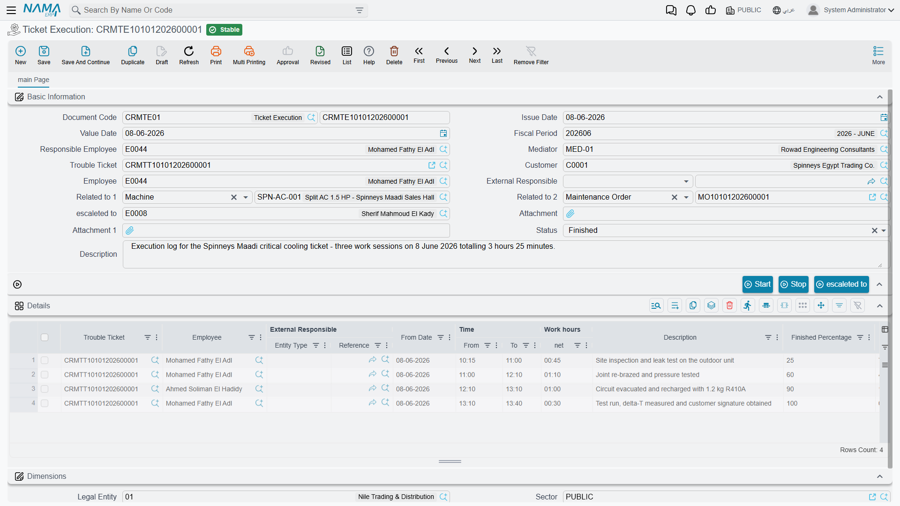

# Ticket Executions

::: info Required licence
`crm`.
:::

The **Ticket Execution** (*تنفيذ طلب دعم*) is a timesheet. A technician finishes a stretch of work on a ticket and records it: which day, from what time to what time, what was done, and how far along the job now is. Committing the document adds those hours to the ticket's Actual Fix Period and nudges the ticket's status.

That is genuinely all it is. It is worth saying up front what it is **not**:

- It **moves no stock.** Spare parts consumed on the visit are not on this document and cannot be. If parts were used, somebody issues them with an ordinary stock document and nothing links that document back to the ticket.
- It **posts nothing.** There is no rate, no labour cost, no invoice. Net Time is captured for reporting only.
- It has **no document term**, so there is nothing to configure on it.

## Raising one

The natural route is the **تنفيذ / Execute** button on the Trouble Ticket, which opens an unsaved execution in a pop-up already pointing at that ticket, with one detail line for the responsible employee starting now. You can also open **Customer Relationship Management → Support → Ticket Execution** directly.

The header carries the Book and Code, Issue Date, Value Date, Fiscal Period, Responsible Employee, the Mediator, **Trouble Ticket**, **Customer**, **Employee**, External Responsible, Escalated To, two attachments, a Status and a Description.

The pickers on this screen are unusually helpful, and worth knowing about:

- The **Employee** picker offers only the ticket's responsible employee plus the technicians in the ticket's Employees grid. If somebody is missing from the list, they have not been assigned on the ticket.
- The **Customer** picker offers only the ticket's customer.
- The **Trouble Ticket** picker offers only tickets in *In Progress*, *Assigned* or *Finished* for the chosen customer or employee.

## The Details grid

One row per stretch of work: Trouble Ticket, Employee, External Responsible, **من تاريخ / From Date**, **الوقـت من / From Time**, **الوقـت إلى / To Time**, **ساعات العمل / Net Time**, a Description, **نسبة الإتمام / Finished Percent**, a read-only **النسبة المتبقية / Remaining Percent**, and an attachment.

Notice what is *not* there: a **To Date**. Every line ends on the day it started, so a night shift that runs past midnight has to be entered as two lines.

The **بدء / Start** and **stop** buttons on the header drive the last line for you: Start fills its From Date and From Time (or appends a fresh line if the last one is already complete), and stop stamps the To Time and works out the Net Time. Start refuses to move on while an otherwise-complete line still has a blank To Time.

Following the example, `TEXE-0662` records Mahmoud's first day on `TKT-0451`:

| From date | From time | To time | Net time | Finished % |
|---|---|---|---|---|
| 2026-04-07 | 08:30 | 11:00 | 2.5 | 60 |
| 2026-04-07 | 13:00 | 14:30 | 1.5 | 60 |
| | | **Document total** | **4.0** | |

Committing it sets `TKT-0451` to *قيد التنفيذ / In Progress* and raises its **Actual Fix Period** to 4.0 hours.

Six days later `TEXE-0679` records Sayed finishing the job:

| From date | From time | To time | Net time | Finished % |
|---|---|---|---|---|
| 2026-04-13 | 09:00 | 12:00 | 3.0 | 100 |

Because a line reached 100 %, the ticket now shows *منتهي / Finished*, its Closing Date is stamped with 13 April, and Actual Fix Period reaches **7.0 hours** — against an estimate of 4.0. Nothing anywhere compares those two figures; if the overrun matters to you, it is a list-view or Excel exercise.

## What the checks catch — and what they miss

This is the only document in the support folder with real validation, so it is worth knowing where it stops.

**What it refuses:**

- A ticket in *Cancelled*, *Closed* or *Initial* — on the header and on every line ("Invalid State"). A ticket in *Finished* is accepted only if it was already on the previous version of this document.
- A header Customer that is not the ticket's customer ("Not the Ticket Customer").
- A negative Net Time, or a From Time later than the To Time.
- Two lines for the same employee on the same date where one is a duplicate of the other or sits entirely inside it.

::: warning Genuinely overlapping periods are not caught
The overlap check only rejects duplicate or fully-contained entries. **09:00–10:00 and 09:30–11:00 both pass**, and the same technician is credited 2.5 hours for 2 hours of elapsed time — an inflated figure that then flows straight into the ticket's Actual Fix Period.

If accurate labour hours matter, review the Details grid rather than trusting the check.
:::

## The status effect — and why it does not stick

Each committed detail line pushes the ticket to *Finished* when Finished Percent is 100, and to *In Progress* otherwise, and adds its hours to the ticket's Actual Fix Period. Re-saving the execution subtracts the previous version's hours first, so editing is safe. Cancelling it subtracts all of them, puts the ticket back to *In Progress* and clears its Closing Date.

::: danger Completing an execution does not close the ticket
An execution at 100 % makes the ticket **display** *Finished* — but it does not update the status the ticket itself remembers. The next time anybody saves `TKT-0451` for any reason, the ticket re-applies its remembered status and, because its Employees grid has rows, silently drops back to *مسند / Assigned*.

Read that again if your desk plans to close tickets this way: the ticket looks finished, then quietly un-finishes itself. **Close a ticket explicitly** — with **Change Status → Closed** on the ticket, or with a [Ticket Follow-Up](/modules/crm/support/crm-ticket-follow-ups.md) carrying the closing status. Treat the execution as *reporting* completion, not as performing it.
:::

## The Status field on the execution does nothing

The header carries a **الحالة / Status** dropdown with four values — *Awaiting Review*, *Reviewed*, *Rejected* and *Finished*.

::: warning There is no review or approval cycle here
Nothing sets this field and nothing reads it. A supervisor who marks an execution **Rejected** has changed a label and nothing else: the ticket still went to *Finished*, and the rejected hours are still counted in its Actual Fix Period. Nothing is reversed, nobody is told, and no list shows executions awaiting review.

Use it as a note to yourself if you like. Do not build an approval process on it.
:::

## Two clocks, and a third-party hazard

The hours on Ticket Execution documents are **not** the same as the ticket's stopwatch. The ticket's Assigned To tab keeps its own Ticket Execution Time grid, driven by the **بدء / Start** and **إنهاء / End** buttons *there* and by Change Status → In Progress. On `TKT-0451` the stopwatch totals 10:35 while the executions total 7.0 hours. They are maintained independently and nothing reconciles them — pick one as your reporting figure.

::: warning Starting the ticket's stopwatch stops the same technician elsewhere
This belongs to the ticket rather than to this document, but it catches people out on the same working day: starting a technician's clock on one ticket automatically closes their open clock on **any other** ticket, often recording zero minutes for it. The full story is on [Trouble Tickets](/modules/crm/support/crm-trouble-tickets.md). Have technicians press **End** before moving on.
:::

## Where executions are visible

- The **Executions** tab on the ticket lists the executions raised against it.
- The **Related Records** tab on the originating complaint lists the executions descending from that complaint.
- The **Executions** tab on a service contract lists execution lines for tickets that were matched to that contract — with the caveat described on [Service Contracts](/modules/crm/support/crm-service-contracts.md).
- The **Ticket Execution list screen** filters by Trouble Ticket, Employee, External Responsible and Customer. This is the closest thing to a labour report the module has; there are no system reports and no dashboards for it.
