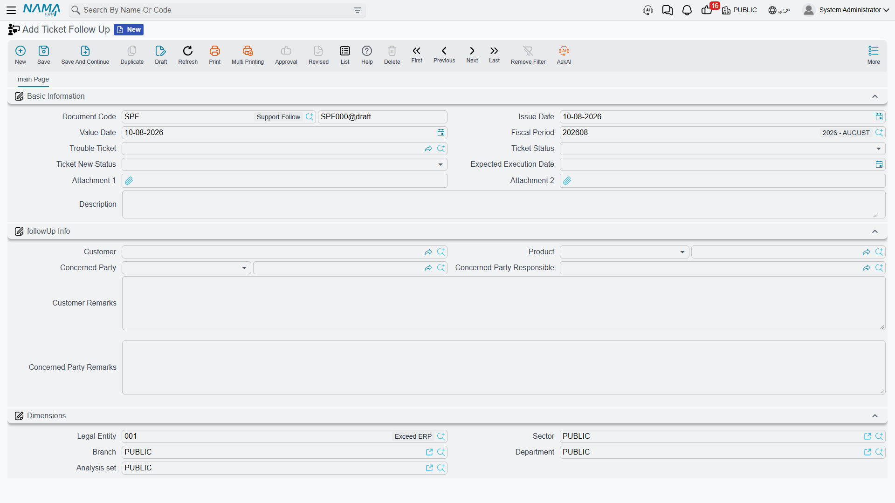

# Ticket Follow-Ups

::: info Required licence
`crm`.
:::

On the face of it the **Ticket Follow Up** (*متابعة طلب دعم*) looks like the least important document in the support folder — a small one-page form for writing down what the customer said. In practice it is the most important one to know about, because it is the **only place in the product where eight of the ticket's thirteen statuses can be set**.

Nobody discovers that by exploring the screens. This page exists so that your desk does not spend a year working with five statuses.

## The status gateway

The Trouble Ticket's **تغيير الحالة / Change Status** dialog offers five values. The status field itself is read-only. So where do the other eight live?

| Reachable from the ticket's Change Status dialog | Reachable **only** by committing a Ticket Follow-Up |
|---|---|
| قيد التنفيذ / In Progress | مبدئي / Initial |
| ملغي / Cancelled | مسند / Assigned |
| مغلقة / Closed | تم التنفيذ / Done |
| منتهي / Finished | مؤجل / Postponed |
| معاد فتحه / ReOpen | طلب تطوير / Development Request |
| | بانتظار رد العميل / Customer Feedback |
| | OutSideContractScope *(untranslated in both languages)* |
| | خارج الضمان / Out Of Warranty |

*Initial* and *Assigned* are normally set for you — Initial when the ticket is created, Assigned whenever the ticket's Employees grid has rows — but if you ever need to force a ticket back to one of them, the follow-up is again the only route.

The mechanism is the field **تغير حاله طلب الدعم الى / Ticket New Status**. Whatever you put there is written onto the ticket when the follow-up is committed. That is the whole gateway.

::: tip The practical rule
*"If the status you want is not in the Change Status dialog, raise a follow-up."*

Teach the desk that one sentence and everything else on this page becomes detail.
:::

## Raising one

Open **Customer Relationship Management → Support → Ticket Follow Up**, or press **عمل متابعة / Create CRM Follow Up** on the ticket — a button whose label says CRM Follow Up but which actually opens this screen. Either way you get an unsaved single-page document.

**Basic Information** — the Book and Code, Issue Date, Value Date, Fiscal Period, then:

| Field | Arabic | What it does |
|---|---|---|
| **Trouble Ticket** | طلب الدعم | The ticket this follow-up belongs to. Treat it as mandatory — see below. |
| **Ticket Status** | حاله طلب الدعم | A snapshot of where the ticket stood. You can type in it; **nothing reads it.** |
| **Ticket New Status** | تغير حاله طلب الدعم الى | **The field that moves the ticket.** |
| **Expected Execution Date** | تاريخ التنفيذ المتوقع | Copied onto the ticket along with the status. |
| Attachment 1 / 2, Description | | Free capture. |

**بيانات المتابعه / followUp Info** — Customer, Product, **الجهة المختصة / Concerned Party** (a third party or a supplier), **المسئول لدى الجهة المختصه / Concerned Party Responsible**, **ملاحظات العميل / Customer Remarks** and **ملاحظات الجهة المختصة / Concerned Party Remarks**.

That second group is what makes the follow-up a genuine conversation record rather than just a status switch: one side of it holds what the customer told you, the other holds what the supplier or subcontractor told you.

Follow-up `TFUP-0333` in the canonical example, dated 8 April 2026 against ticket `TKT-0451`:

- Concerned Party — `SUP-0311`, Egyptian Refrigeration Services Co.
- Customer Remarks — *"Customer asks to postpone until the compressor arrives"*
- **Ticket New Status — مؤجل / Postponed**
- Expected Execution Date — 13 April 2026

On commit, `TKT-0451` moves to *Postponed* and picks up 13 April as its expected execution date. *Postponed* is one of the eight; there is no other way to get the ticket there.

## The two things that will bite you

::: danger A blank Ticket New Status wipes the ticket's status
**Ticket New Status is optional on the screen and mandatory in practice.**

If you file a follow-up purely to record what the customer said and leave that field empty, the empty value is written onto the ticket anyway. The ticket's Status goes **blank** — and it stays blank through every later save, because the value the ticket remembers was blanked too. The **Expected Execution Date** on the ticket is cleared with it.

Recovering means filing another follow-up that carries the correct status. There is no undo, and cancelling the offending follow-up does not put the old status back.

**Always set Ticket New Status.** If the status is not changing, set it to the status the ticket already has.
:::

::: warning Saving without a Trouble Ticket produces a technical error
The Trouble Ticket field is not marked as required on the screen, but the document cannot be committed without it. Leaving it blank raises a raw technical error on save instead of a friendly "this field is required" message. Pick the ticket first.
:::

## Only the latest follow-up wins

When a follow-up is committed, the system checks whether it is the **latest follow-up for that ticket by Value Date**. Only then does it write the status.

Two practical consequences:

- **Back-dating does nothing.** A follow-up dated before an existing one is stored perfectly well and leaves the ticket exactly as it was. If you are correcting history, this is what you want; if you were trying to change the status, it is not.
- **The newest follow-up owns the ticket's status.** File a follow-up dated today and it overrides whatever an earlier follow-up said, regardless of what the ticket has been through in between.

The status is written straight onto the committed ticket rather than through a normal edit of it, so it does not run the ticket's own checks and it does not show up as somebody having edited the ticket. What it *cannot* escape is the ticket's own rule that a populated Employees grid forces the status to *Assigned* on every save — so a ticket you parked on *Postponed* will jump back to *Assigned* the next time anybody saves it. If a parked status has to survive, the ticket must not be saved again until you are ready to move it on.

## What a follow-up does not do

- **No effects.** It posts nothing, moves no stock, and has no document term — so there is nothing to configure and nothing that can be made to react to it.
- **No notification.** Nobody is told that a follow-up was filed, including the ticket's responsible employee and the concerned party named on it.
- **No reminder.** The Expected Execution Date it stamps on the ticket is never watched by anything. Nothing alerts when it arrives or passes.
- **No chaining.** A follow-up does not create the next follow-up, and there is no "next contact date" process anywhere in CRM.

The follow-ups filed against a ticket are visible on that ticket's **متابعات / Follow Up** tab, and on the originating complaint's Related Records tab. There is no list of "follow-ups due" because nothing is ever due.
