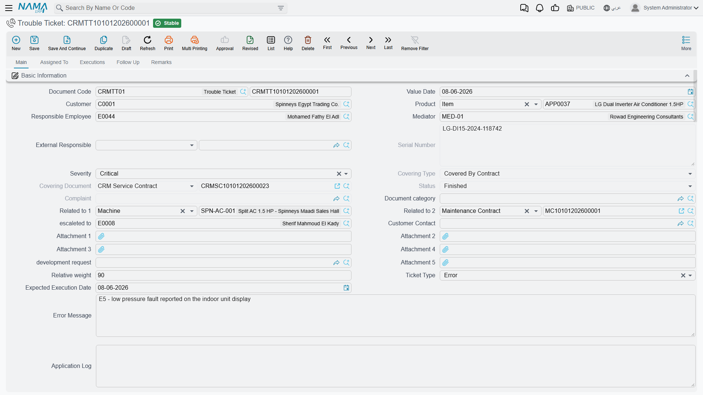

# Trouble Tickets

::: info Required licence
`crm`.
:::

The **Trouble Ticket** (*طلب دعم*) is the case file. It is the one document in the support folder that a desk cannot do without: it holds the customer, the product, who is working on it, how long they have been working, what the running conversation says, and — the part everybody looks at first — whether the product is under warranty or under contract.

Marina Plaza's split unit becomes ticket `TKT-0451`, raised on 6 April 2026 from complaint `CMPL-0207`. Follow it through this page.

## Opening a ticket

A ticket arrives one of two ways: pressing **تحويلة إلي طلب دعم / Convert To Ticket** on a complaint, which opens a ticket pre-filled with the customer, product, serial number, description and external responsible party; or by opening **Customer Relationship Management → Support → Trouble Ticket** and starting from scratch.

Either way the new record opens with **Ticket Date** set to today, **Estimated Fix Period** measured in hours, **Responsible Employee** set to whoever is logged in, and **Status** = *مبدئي / Initial*.

The Main tab holds the case identity: Customer, Product, Serial Number, Responsible Employee, the Mediator, External Responsible, Severity, Ticket Type, Relative Weight, Expected Execution Date, the contact block, and four wide text fields — Error Message, Log, Technical Support Remarks and Description.

::: warning Severity and its neighbours are recorded and never read
**Severity** (Minor / Major / Feature / Critical), **Ticket Type**, **Relative Weight** and **Expected Execution Date** are stored on the ticket and consulted by nothing. No queue is sorted by them, no rule reacts to them, nothing alerts when the expected date passes. **Estimated Fix Period** is likewise never compared with the actual hours the ticket accumulates.

Fill them in if your reporting wants them — they export perfectly well to Excel — but do not build a priority process on them, because the system will not enforce one.
:::

### The Ticket Time group

Four fields, two of which you cannot type into:

- **Estimated Fix Period** (*وقت التنفيذ المقدر*) — your estimate, in hours by default.
- **Actual Fix Period** (*وقت التنفيذ الفعلي*) — read-only, accumulated from Ticket Execution documents.
- **Ticket Date** (*تاريخ الطلب*) — defaults to today, and it is this date the coverage lookup tests.
- **Closing Date** (*تاريخ الإغلاق*) — read-only.

::: warning Closing Date is usually empty
Closing Date is stamped in only two situations: on the document's **first** commit, if the ticket was already Closed at that moment, or when a Ticket Execution reaches 100 % completion. The realistic path — open a ticket, work it for a week, then Change Status → Closed — leaves Closing Date **blank**. Any "time to close" analysis built on it will be mostly empty.
:::

### The discussion thread

Below the main fields sits the ticket's conversation: twenty text boxes. Type into one and, on save, the system stamps your user name and the current date and time into the read-only pair beside it. It is the internal running commentary on the case — and it is capped at twenty entries, after which there is nowhere else to write.

## Coverage — the one lookup that really works

The moment you pick a Customer and a Product, two read-only fields fill themselves in:

- **نوع التغطيه / Covering Type** — *Covered By Contract*, *In Warranty Period* or *Not Covered*.
- **سند التغطية / Covering Document** — the contract or warranty that produced the answer.

They are recomputed every time the ticket is read, so they always reflect today's contracts and warranties rather than a snapshot taken when the ticket was raised.

On `TKT-0451` both a warranty and a contract match the split unit on 6 April:

| Candidate | Window | Matches? | Wins? |
|---|---|---|---|
| CRM warranty `WR-00219` | 2025-11-18 → 2026-11-18 | yes | no |
| Service contract `CSC-0044`, line 1 | 2026-03-01 → 2027-03-01 | yes | **yes** |

**A service contract always beats a warranty.** Had `CSC-0044` not existed, the ticket would read *In Warranty Period* with `WR-00219` as the covering document; with neither, *Not Covered*.

::: danger What coverage matches, and what it ignores
**What coverage matches:** the ticket's **Product**, the ticket's **Serial Number** *only when the ticket carries one*, and the **Ticket Date** falling inside the line's **Start In → End In** window. A service contract wins over a warranty when both match.

**What coverage ignores:** the **customer** (any customer's contract or warranty can cover any other customer's ticket), the contract's **status** (Cancelled, Finished and Renewed contracts still cover), whether the contract has ever been **committed** (drafts cover), the **frozen extension** (the contract screen shows an extended *To* date, but coverage tests the original End In), and all **dimensions** — legal entity, branch, sector.

**What coverage does:** nothing but display. Covering Type and Covering Document are an on-screen indicator for the agent. No validator, pricing rule, status guard or document generation reads them, and there is no document term on the Trouble Ticket that could react to them. The commercial decision — whether to charge for the work — remains entirely manual.

**Practical advice:** always fill Serial Number on serialised items, or one warranty registered without a serial will cover every ticket raised on that product, for every customer, in every branch.
:::

## The lifecycle

Status is **not** something you type. The field is read-only on screen, and the ticket is moved between states by three different mechanisms that do not entirely agree with each other.

### 1. Assign — and the status jumps on its own

Open the **مسند إلي / Assigned To** tab and add rows to the **الموظفين / Employees** grid. On `TKT-0451` that means the two technicians, `EMP-2011` and `EMP-2014`.

::: warning Filling the Employees grid forces the status to Assigned
Every single time the ticket is saved, if the Employees grid has at least one row the status is set to *مسند / Assigned* before anything else is applied. You cannot leave a ticket on *Initial* once technicians are on it, and — more surprisingly — a status set by some other route can be pushed back to *Assigned* by an unrelated later save. This is the mechanism behind the reverting behaviour described under Ticket Executions.
:::

The grid is also what makes the ticket's technicians selectable on a Ticket Execution: the employee picker there offers only the ticket's responsible employee and the people in this grid.

### 2. Change Status — and what it will not offer you

The **تغيير الحالة / Change Status** action on the Main tab opens a small dialog. It offers exactly five choices:

**In Progress · Cancelled · Closed · Finished · ReOpen**

Choosing one writes that status onto the ticket and makes it stick across later saves. Choosing **In Progress** also starts a stopwatch row for the current employee; choosing anything except **ReOpen** stops it.

### 3. The status gateway — eight statuses live somewhere else

The ticket has **thirteen** statuses, and this is the single least discoverable fact in the whole support area:

| Reachable from Change Status | Reachable **only** through a Ticket Follow-Up |
|---|---|
| قيد التنفيذ / In Progress | مبدئي / Initial |
| ملغي / Cancelled | مسند / Assigned |
| مغلقة / Closed | تم التنفيذ / Done |
| منتهي / Finished | مؤجل / Postponed |
| معاد فتحه / ReOpen | طلب تطوير / Development Request |
| | بانتظار رد العميل / Customer Feedback |
| | OutSideContractScope *(no translation in either language)* |
| | خارج الضمان / Out Of Warranty |

::: danger The eight missing statuses are not on the ticket screen at all
If your desk wants to park a case as *Postponed*, *Waiting for Customer Feedback*, *Out Of Warranty* or *Development Request*, the Change Status dialog will never offer them and the Status field itself is read-only. The **only** way to set those eight is to raise a [Ticket Follow-Up](/modules/crm/support/crm-ticket-follow-ups.md) with the value in its *Ticket New Status* field and commit it.

(*Initial* and *Assigned* also appear in the right-hand column because the system sets them for you — Initial on a new record, Assigned whenever the Employees grid has rows — but if you ever need to put a ticket **back** to one of them by hand, the follow-up is again the only route.)

Two of those statuses show a raw Latin word rather than a translated label: **OutSideContractScope** has no translation in Arabic or English, and *Modification* on the Ticket Type list is translated in Arabic only.
:::

Train the desk on this early. Sites that do not know about it end up using only five statuses and inventing conventions in the description field to express the rest.

### 4. Close

Two routes, and they behave differently:

- **Change Status → Closed** — the ticket is closed. Closing Date is filled only if this happens to be the document's first commit.
- **Commit a Ticket Execution at 100 % completion** — the ticket shows *Finished* and Closing Date is set to that line's From Date. On `TKT-0451`, execution `TEXE-0679` on 13 April does exactly this. But see the warning on [Ticket Executions](/modules/crm/support/crm-ticket-executions.md): that route sets the visible status without making it stick.

**ReOpen** puts the ticket back into play; nothing else changes, and the Closing Date is not cleared.

## The ticket's stopwatch

The Assigned To tab carries a second grid, **وقت تنفيذ الطلب / Ticket Execution Time**, with one row per stretch of work: Employee, Start Date And Time, End Date And Time, Execution Time, Employee Total Execution Time. Every one of those durations is recomputed on save, and the header's **إجمالي وقت التنفيذ / Total Execution Time** is their sum.

Rows are created and closed by **بدء / Start** and **إنهاء / End** on the same tab, and by Change Status → In Progress.

On `TKT-0451` the stopwatch reads:

| Employee | Start | End | Duration |
|---|---|---|---|
| `EMP-2011` | 2026-04-07 08:25 | 2026-04-07 15:40 | 7:15 |
| `EMP-2014` | 2026-04-13 09:00 | 2026-04-13 12:20 | 3:20 |
| | | **Total Execution Time** | **10:35** |

::: warning Two clocks that will never agree
**Total Execution Time** (10:35 here) comes from this stopwatch. **Actual Fix Period** (7.0 hours here) comes from the Ticket Execution documents. They measure different things, are maintained independently, and nothing reconciles them. Decide which one your business reports on and be consistent.
:::

::: danger Starting work stops the same technician's clock on a different ticket
When a technician's clock starts here, the system first looks for **any** open stopwatch row belonging to that technician — *across every ticket in the database* — and closes it. One person can only be "in progress" on one ticket at a time.

Worse, the end time written onto the abandoned row is not the current time. It is the timestamp of that employee's most recent recorded action on the same day, and if there is none, the row is closed at its own start time — **zero minutes recorded** for a morning of work. The other ticket is re-saved silently as part of this.

Tell technicians to press **إنهاء / End** before starting work on another ticket. A row also may not span more than one day; the screen refuses one that does.
:::

## The buttons on the Main tab

| Button | What it does |
|---|---|
| **تنفيذ / Execute** | Opens an unsaved **Ticket Execution** in a pop-up, already pointing at this ticket, with one line for the responsible employee starting now |
| **تغيير الحالة / Change Status** | The five-value dialog described above |
| **تحويل إلي سؤال شائع / Convert To FAQ** | Creates a CRM FAQ entry: the question is the ticket's description, the answer is every Ticket Execution note recorded against this ticket, run together |
| **تصعيد الي / Escalate To** | Stamps the chosen employee into *Escalated To* |
| **إنشاء طلب تطوير / Development Request** | Opens an unsaved Development Request carrying this ticket, customer, product and description |
| **عمل متابعة / Create CRM Follow Up** | Opens an unsaved **Ticket Follow Up** |

::: warning Two buttons that do not do what their label says
**Create CRM Follow Up** opens a **Ticket Follow-Up**, not the CRM Follow-Up document from the Activities folder. Those are two different screens with different fields; the CRM Follow-Up is reachable only from its own menu item. See [Tasks and Follow-Ups](/modules/crm/activities/crm-tasks-and-follow-ups.md).

**Escalate To** saves and commits the whole stored record the moment you press it — and it commits the version held on the server, so any edits you have made on screen but not yet saved are **not** included. It also does not change the status: there is no *Escalated* state for a ticket, no escalation queue and no notification. Save your work before pressing it.
:::

## The rest of the screen

- **Executions** tab — a read-only list of the Ticket Execution documents raised against this ticket. (Its columns list Employee twice; that is a display quirk, not two different employees.)
- **Follow Up** tab — a read-only list of the Ticket Follow-Ups raised against this ticket.
- **الملاحظات / Remarks** tab — a free-notes grid with a remark and two attachments per row, on top of the five attachment slots on the Main tab.

## No effects, no term

The Trouble Ticket **posts nothing and moves no stock.** It has no document term, so there is nothing to configure and nothing that can be made to react to a status or to the coverage result. If a repair consumes spare parts, they are issued with an ordinary stock document raised separately, and no link back to the ticket exists.

::: info The "Create Trouble Ticket" button on other screens is something else entirely
Nama's own toolbar carries a generic *Create Trouble Ticket* action that can appear on any screen. That action does **not** create a ticket in your installation — it files a support request with NaMaSoft's own support desk over the internet, and it only works when your Global Config carries the Nama server address and credentials. What you see locally is a queue entry, not a CRM document. It has nothing to do with the tickets described on this page.
:::
