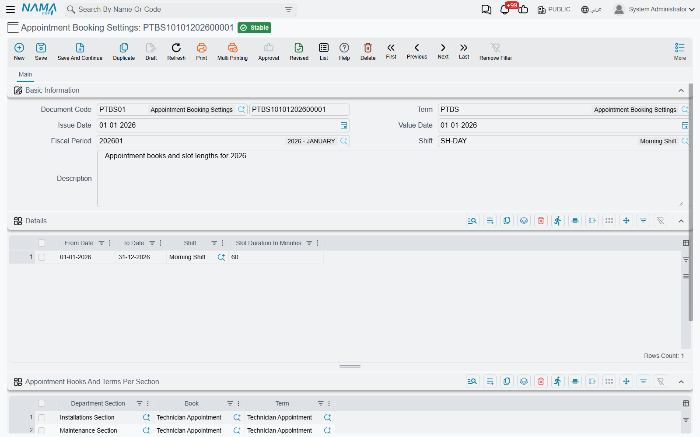

# Appointment Booking Settings

::: info Required licence
`crm-technician-appointments`.
:::

The booking calendar has to know two things before it can stop anybody making a bad booking: **when your crews work**, and **how finely you want the day chopped up**. Both live here, in a document called **Appointment Booking Settings** (*إعدادات حجز المواعيد*).

It is reached from the department section rather than chosen on the appointment. You create the settings record, then open **Department Section** and point its **Appointment Booking Settings** field at it. From then on this record governs every appointment for that section, the booking calendar, and the section's crews on [My Appointments](/modules/crm/technician-appointments/crm-my-appointments).

## Working hours come from an attendance shift

The one thing this screen does *not* do is ask you to redraw your working week. It borrows it from HR: the **Shift** (*ملف الدوام*) field points at an attendance shift, and the calendar reads that shift's day-by-day definition — which days are working days, which are weekly rest, and the work periods within each working day.

The record in the example above uses `SH-DAY - Morning Shift` (*الوردية الصباحية*). That shift works Sunday to Thursday from 8:00 to 16:00 and marks Friday and Saturday as weekly rest. The calendar therefore paints Sunday to Thursday as bookable between 8 and 4, and shades Friday and Saturday as non-working, because that is what the shift says.

A shift can carry more than one work period in a day — a morning block and an afternoon block with a break between them. The calendar honours that too: the break is drawn outside business hours and cannot be selected.

## The Details grid — periods, shifts and slot length

The **Details** (*التفاصيل*) grid is where the settings become time-boxed. Each row says: *between these two dates, work this shift, in slots of this length.*

| Column | What it does |
|---|---|
| From Date (*من تاريخ*) | Start of the period this row governs |
| To Date (*إلى تاريخ*) | End of it |
| Shift (*ملف الدوام*) | The shift for this period. When the header Shift is filled, it is copied into this column on every row when you save |
| Slot Duration In Minutes (*مدة الفترة بالدقائق*) | The height of one row on the calendar grid |

The example's single row covers 1 January 2026 to 31 December 2026, on the Morning Shift, in 60-minute slots.

Three consequences worth planning around:

**The dates fence the calendar.** The earliest From Date and the latest To Date across all rows become the range the calendar will show at all — you cannot page to a week outside it, so a booking clerk cannot accidentally book into a year nobody has set up. Leave the dates empty and the calendar is unbounded.

**The slot length is the drawing grid, not a rule about appointment length.** With 60-minute slots the calendar draws hour rows and a drag snaps to the hour; you can still drag across three rows to reserve three hours. If several rows carry different slot lengths, the calendar uses the **shortest** of them, so the grid is fine enough for every period. Leave it blank and the calendar falls back to half-hour rows.

**Rows can differ.** Two rows let you run a summer schedule on one shift and a winter schedule on another, or tighten the slot from an hour to half an hour during a busy season, without touching the shifts themselves.

::: warning The header Shift overwrites the rows
If the header **Shift** is filled, saving copies it into every Details row and replaces whatever shift the rows had. To give different periods different shifts, leave the header Shift empty and set the shift on each row.
:::

## Appointment Books And Terms Per Section

The second grid, **Appointment Books And Terms Per Section** (*دفاتر وتوجيهات المواعيد لكل قسم وظيفي*), answers a different question: how should appointments be *numbered* and *directed*?

One row per section: the **Department Section** (*القسم الوظيفي*), the **Book** (*الدفتر*) its appointments are recorded in, and optionally the **Term** (*توجيه المستند*). The example record has two rows, one for the Installations Section and one for the Maintenance Section, so both sections share its shift and slot rules.

When an appointment is saved without a book or without a term, the system looks up the section's settings, takes the **first** row for that section, and fills in both the book and the term. This happens every time the [booking calendar](/modules/crm/technician-appointments/crm-technician-appointment-calendar) creates an appointment, because the calendar never asks for a book. The appointment also takes its number from that book and inherits the book's dimensions. If a section has more than one row, only the first one is used.

::: tip One settings record can serve several sections
The grid is keyed by section, so several sections may point at the same settings record and still number their appointments in their own books. What they will share is the shift and slot rules in the Details grid — so put sections together only when they genuinely work the same hours.

A section with no row here gets no book filled in automatically. Whoever creates the appointment on its own screen has to pick the book by hand. The booking calendar cannot, so its saves for that section are refused until you add the row.
:::

## A worked setup

For an installation section that works 8–5 Sunday to Thursday, in one-hour slots, numbered in the `APP` book:

1. Make sure the attendance shift exists in HR with the right working days and hours.
2. Create the settings document, put the shift on the header.
3. Add one Details row: from 1 January this year, to 31 December next year, slot duration 60.
4. Add one row to Appointment Books And Terms Per Section: your section, book `APP`, term `APP_TERM`.
5. Commit, then open the department section, tick **Show In Appointments Screen** and point **Appointment Booking Settings** at this record.

The calendar for that section will now open on the right week, refuse Fridays and Saturdays, refuse anything before 8 or after 5, and hand every booking it creates a proper `APP…` number.
