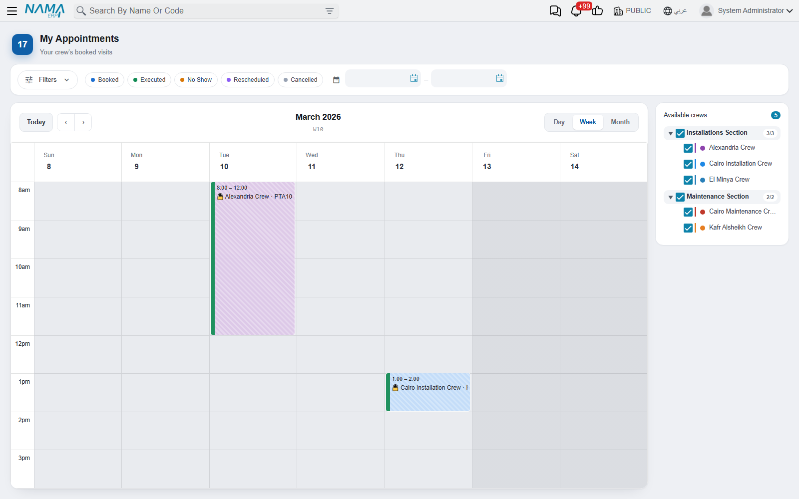
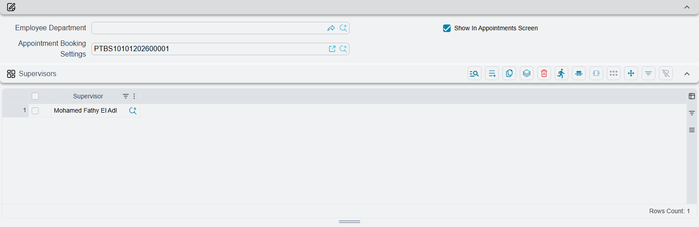
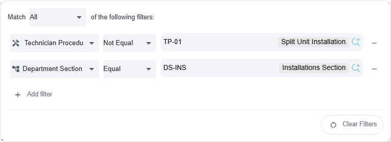

# My Appointments

::: info Required licence
`crm-technician-appointments`.
:::

The [booking calendar](/modules/crm/technician-appointments/crm-technician-appointment-calendar) is for the people who plan the visits. **My Appointments** (*مواعيدي*) is for the people who go on them, and for the people who supervise them. There is one menu item for all of them. A technician opens it and sees their crew's week. A section supervisor sees every crew in their sections, and an administrator sees every crew. The screen is read-only on purpose: it shows the schedule, and it is not a planning tool.

## Who sees what

The screen works out what to show from your login. It asks these questions in this order and stops at the first one that fits:

1. **Are you an administrator?** Your security profile has **Full Authority** (*صلاحيات كاملة*) — see [security profiles](/platform/security/security-profiles#Full-Authority) — or your user has **Allow Access to Admin Restricted Functionality (utils.html, kill tasks, logout users and so on)** ticked. If so, you see every committed crew, and your user does not need to be linked to an employee.
2. **Is your user linked to an employee?** If not, the screen stops with *"Your user account is not linked to an employee, so we cannot tell which crew you belong to. Ask your system administrator to link your account to your employee record."* — which is exactly what has to happen.
3. **Are you a section supervisor?** Your employee is listed in the **Supervisors** (*المشرفون*) grid of one or more committed Department Sections. If so, you see the committed crews of those sections. This wins over any crew you belong to yourself. Crews that have no department section are not shown to a supervisor.
4. **Are you a technician?** You see the committed crews that list your employee in their **Technicians** grid.

If none of these finds a crew, the screen says *"You are not a member of any technician crew, so there is no schedule to show. Ask your system administrator to add you to a crew."* Add the employee on the [crew](/modules/crm/technician-appointments/crm-technician-crews), or move them there with a [transfer](/modules/crm/technician-appointments/crm-technician-transfers). An administrator or supervisor sees the same message when there is no crew in their scope yet.

::: tip Crew Supervisor is not section supervisor
The **Crew Supervisor** field on a crew names the team leader. It does not make that person a supervisor on this screen. Only the Supervisors grid on the department section does that.
:::

## Setting up supervisors

A supervisor needs two things:

1. Open **Payroll → Main → Department Sections** (*الرواتب ← الأساسيات ← الأقسام الوظيفية*), open the section, add the employee to the **Supervisors** grid and save.
2. Link the supervisor's user to that employee record.

A supervisor of two sections sees the crews of both. For the rest of the section setup (**Show In Appointments Screen** and **Appointment Booking Settings**), see the [overview](/modules/crm/technician-appointments/crm-technician-appointments-overview#Setting-up-a-section-for-booking). For the crews themselves, see [Technician Crews](/modules/crm/technician-appointments/crm-technician-crews).

## Reading the schedule

The screen opens on the current week. **Today**, the ‹ › arrows and the **Day / Week / Month** views work as they do on the booking calendar. Under the period title you see the week number, for example *W37 · Current week*.

The working hours, the slot height, the range of dates you can page through and the rest days come from the [booking settings](/modules/crm/technician-appointments/crm-appointment-booking-settings) of the sections the listed crews belong to. Time that has already passed is greyed out.

Each block is one period of a committed appointment. It is labelled with the crew and the appointment code, followed by the appointment's title when a Title descriptor is set up for Technician Appointment. How to read a block:

- **The fill colour is the crew's colour**, so you can tell the crews apart at a glance.
- **The status is a coloured strip on the block's leading edge.** A *Booked* visit has no strip. *Rescheduled*, *No Show* and *Executed* each have their own colour, and an executed visit also shows a padlock 🔒.
- **A cancelled visit is still shown**, but faded and struck through, so the technician knows it is off.

The screen loads up to 200 appointments for the period on screen. On a busy week, narrow the view with the filters below.

## The Available crews panel

The **Available crews** (*الفرق المتاحة*) panel beside the calendar lists the crews you can see, grouped by department section. Crews without a section are grouped under *No department section* (*بدون قسم*). Each section shows how many of its crews are visible, for example *2/3*.

Every crew is ticked when the screen opens. Untick a crew to hide its visits, or untick a section to hide all of its crews at once.

## Filtering the schedule

The filter bar sits above the calendar. The **Filters** (*تصفية المواعيد*) button opens the filter builder, and a badge on the button counts the rules that have a value.

The builder reads as a sentence: *Match **All** / **Any** of the following filters*. Choose **All** when every rule must hold, or **Any** when one is enough. Each rule has three parts:

- a **field**,
- **Equal** or **Not Equal**. *Not Equal* also matches appointments where that field is empty,
- a **value**.

Press **Add filter** to add a rule, and use the minus button to remove one. While there are no rules, the builder says *No filters yet*.

| Field | What it matches |
|---|---|
| Technician (*الفني*) | Visits of the crews that person is currently in |
| Department Section (*القسم الوظيفي*) | Visits of that section's crews |
| Customer (*العميل*) | The appointment's customer |
| Branch (*الفرع*) | The appointment's branch |
| Area (*المنطقة*) | The region of the customer's address |
| Technician Procedure (*إجراء فني*) | The job booked. Use it to filter by type of visit |
| From Document (*بناءا على*) | The document the visit was booked from |
| Technician Appointment (*موعد فني*) | One particular appointment |

**Technician** and **Department Section** are offered only to supervisors and administrators, who see more than one crew. The Technician, Department Section and Technician Appointment pickers only offer values from the crews you can see.

Next to the Filters button:

- **Status chips.** Click one or more statuses to see only those. With no chip selected, every status is shown.
- **From and To date boxes.** They limit the schedule to a period, and the To date is included. When you set a From date, the calendar jumps to it.
- **Clear Filters** (*حذف الفلاتر*). It appears as soon as you add a rule, pick a status chip or set a date. It removes the rules, the dates and the status chips, and sets *Match* back to *All*. The builder has the same button.

Filters are not saved. When you leave the screen and come back, it opens unfiltered.

## Opening an appointment

**Left-click** a block to open that appointment, read-only, in the same tab. There you can read the customer, the address on the Customer Address page, the materials in Items And Services and the other periods of the booking.

**Right-click** a block for a small menu headed by the appointment code. Its only item, **Open the record** (*فتح المستند*), opens the appointment in a new tab.

Nothing on this screen changes a booking. To move, cancel or close a visit, use the [booking calendar](/modules/crm/technician-appointments/crm-technician-appointment-calendar) or the [appointment](/modules/crm/technician-appointments/crm-technician-appointment) itself.
