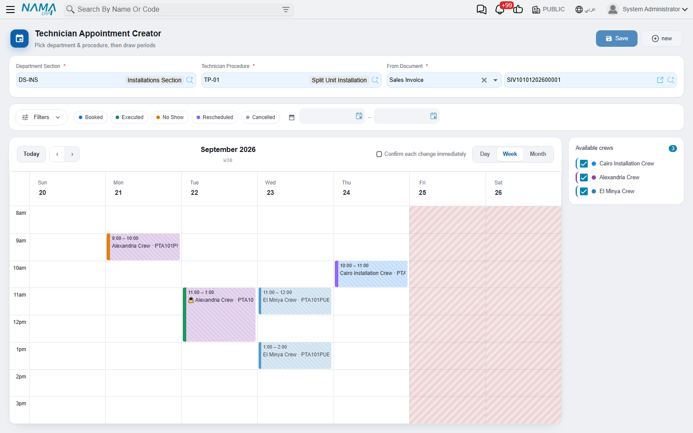

# The Booking Calendar

::: info Required licence
`crm-technician-appointments`.
:::

**Technician Appointment Creator** (*منشئ موعد الفني*) is the screen booking staff actually live in. It is a week view of your crews' commitments with three fields on top: pick the section, pick the job, name the document the visit was sold on, then drag out the hours you want and press **Create**. One committed appointment comes out the other end.

## The three fields at the top

**Department Section** (*القسم الوظيفي*) — offered only for sections marked **Show In Appointments Screen**. Choosing it loads that section's [booking settings](/modules/crm/technician-appointments/crm-appointment-booking-settings.md), which is what gives the grid its working hours, its slot height and the range of weeks you are allowed to page through.

**Technician Procedure** (*إجراء فني*) — the job. The picker offers procedures whose Department Sections grid names the section you chose, plus procedures whose grid is empty.

**From Document** (*بناء على*) — the sales invoice, order or contract that promised the visit. It is required here: the calendar will not create an appointment without it.

Until both the section and the procedure are set the calendar stays behind a *"Pick department & procedure to start drawing periods"* panel. As soon as both are set, the crew list and the week fill in.

## Reading the week

**The Available crews panel** on the side lists the crews that can do this job in this section — crews whose Procedures grid names the chosen procedure or is empty, and whose Department Section matches or is empty. Each crew has its colour and a tick box; untick a crew to take it and its bookings out of the view. It is the fastest way to answer "when is the Cairo crew free" on a crowded week: untick everybody else.

**Hatched blocks with a padlock** are existing appointments — the same crews' commitments, drawn in each crew's colour and labelled with the crew name and the appointment number. They are read-only here; clicking one opens that appointment.

**Solid blocks** are the periods you have just drawn and not yet created.

**Shaded columns and greyed rows** are time you cannot book: days the shift marks as rest, and the hours outside the shift's work periods. In the screenshot Friday and Saturday are shaded out entirely, and the grid runs from 8 am because that is when the administration shift starts.

The header buttons are the usual calendar set — **prev**, **next**, **today**, and **month / week / day** views. The red line is the current time.

## Drawing a booking

1. Drag down the column for the day you want, from the start time to the end time. The drag snaps to the slot length set in booking settings — hour rows in the screenshot.
2. A dialogue asks **which crew** this period is for, with a search box for sites that have many. If only one crew is available it is chosen for you without asking.
3. The block appears in that crew's colour. Repeat for as many periods as the job needs — a morning block and an afternoon block, or three consecutive mornings.
4. Press **Create**.

::: tip All the periods you draw belong to one crew
Choose a different crew for a second period and the calendar tells you *"Crew changed — previous periods removed"* and clears what you had drawn, leaving only the new period.

That is not the screen being awkward: an appointment books exactly one crew, so a single booking session can only ever be about one of them. Book the second crew as a second appointment.
:::

To remove a period you drew, click it and confirm the deletion. Existing appointments cannot be deleted here — click one and you are taken to the document.

## What Create does

The **Create** button is enabled once you have a section, a procedure, a source document and at least one drawn period. It then builds the appointment and commits it in one step:

- Department Section, Technician Procedure and From Document go on the header.
- Each drawn block becomes a detail row — crew, day, start time, end time.
- The status starts at *Booked*, and the book, term, number and dimensions are filled in from the section's booking settings.

A confirmation shows the new appointment's code, the drawn blocks disappear, and the newly created appointment reappears a moment later as a locked, hatched block — because it is now somebody's commitment like all the others. You are left on the same week with the same section and procedure, ready to book the next customer.

If the appointment cannot be committed — a missing book, an approval rule, a required dimension — the errors are shown and nothing is created; your drawn periods stay on screen so you can fix the cause and press Create again.

## Where the calendar's limits come from

Nothing about the working week is configured on this screen. Everything traces back:

| What you see | Where it comes from |
|---|---|
| Which sections you may choose | **Show In Appointments Screen** on the department section |
| Which weeks you may page to | From/To dates on the booking settings Details grid |
| The height of a grid row | Slot Duration In Minutes — the shortest one, if the rows differ |
| Working hours and rest days | The attendance shift named on the booking settings |
| Which crews are listed | The crews' Department Section and Procedures grid |
| Each crew's colour | Color Code on the crew |
| The book the appointment is numbered in | Appointment Books And Terms Per Section |

If the calendar is not offering what you expect, that table is the checklist to walk down.
