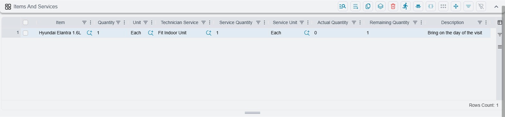
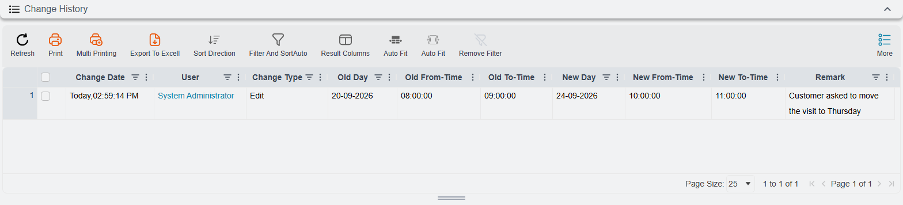

# The Technician Appointment

::: info Required licence
`crm-technician-appointments`.
:::

The **Technician Appointment** (*موعد فني*) is the booking itself — one crew, one job, the times they are reserved for, and the materials the visit will use. Most of the time you will not type one from scratch; you will draw it on the [booking calendar](/modules/crm/technician-appointments/crm-technician-appointment-calendar.md) and the calendar will create it. This page describes the document you get, because that is where you go to look a booking up, list its materials, change it, cancel it, trace it back to the sale or find out who moved it.

## The header

Alongside the usual document frame — **Document Code** and book, **Term** (*توجيه المستند*), **Issue Date**, **Value Date**, **Fiscal Period**, **Description** — the appointment carries fields of its own.

**From Document** (*بناءا على*) — the commercial document this visit was promised by: a sales invoice, a sales order, a contract, a maintenance document. It is a general reference, so it accepts any document, and it is the thread that ties the visit back to what was sold. `PTA101PUBLIC202600009` was raised from car sales invoice `SISI10101202600001`.

**Based On Document** (*المستند الأعلى لبناءاّ علي*) — filled in by the system and not editable: it is the document that *your* From Document came from. When the visit is booked from a sales invoice that was itself raised from a sales order, this field shows the sales order. It saves the follow-the-chain click when somebody asks which order this installation belongs to. On `PTA101PUBLIC202600009` it reads car sales order `SISO10101202600001`.

**Customer** (*العميل*) — filled in by the system on every save. It is the customer named on the Based On Document, or on the From Document when the Based On Document has none. The customer is read from maintenance documents, invoice-type documents (sales invoices, orders and the like) and CRM complaints. For any other kind of document, the field stays empty.

The **Customer Address** (*عنوان العميل*) page holds a read-only copy of that customer's shipping address, refreshed on every save, so the crew has the address of the visit on the booking itself: Region, Country Code, Country, City, State, Area, Street, Building Number, Postal Code, District, Land Plot Number, Address 1 and Map Location.

**Status** (*الحالة*) — where the booking stands. A new appointment starts at *Booked* (*محجوز*). Two events move it on their own:

- Committing a [service distribution](/modules/crm/technician-appointments/crm-technician-service-distribution.md) against it moves it to *Executed* (*تم التنفيذ*); cancelling that distribution moves it back to *Booked*.
- Saving the appointment after one of its periods was moved or removed sets it to *Rescheduled* (*معاد جدولته*).

The remaining values, *Cancelled* (*ملغي*) and *No Show* (*لم يحضر*), record what actually happened on the day: the customer called off, or nobody was home. Set them here, or from the calendar's right-click menu. *Executed* can also be set by hand, with the calendar's **Mark as executed** or directly in this field.

**Department Section** (*القسم الوظيفي*) — required, and the field that decides almost everything else. Only sections with **Show In Appointments Screen** ticked are offered. The section brings the working hours the calendar enforces and, through [booking settings](/modules/crm/technician-appointments/crm-appointment-booking-settings.md), the book and term the appointment is numbered in.

**Technician Procedure** (*إجراء فني*) — required. The job being booked. It also governs which services can later be reported against the visit, because a service distribution only accepts services listed on this procedure.

::: tip The book fills itself in
Save an appointment that is missing its book or its term, and the system looks up the department section's booking settings. It takes the first row for that section in **Appointment Books And Terms Per Section** and applies **both** its book and its term, then numbers the document and copies the book's dimensions. That is why an appointment created by the calendar, which never asks for a book, still comes out as a properly numbered `APP…` document.

The lookup is skipped only when the book **and** the term are both set. If you pick a book by hand but leave the term empty, both are replaced from the section's row. To use a different book, set the book and the term together.
:::

## The Details grid — the reserved times

Everything about *when* lives in the **Details** (*التفاصيل*) grid. One row per block of time:

| Column | Meaning |
|---|---|
| Technician Crew (*فريق فنيين*) | The crew reserved |
| Day (*اليوم*) | The date — required |
| From-Time (*من وقت*) | Start time |
| To-Time (*إلى وقت*) | End time |

On screen, the two time columns sit under a shared **Time** heading and are headed **From** and **To**.

`PTA101PUBLIC202600008` reserves the El Minya crew twice on 23 September 2026: 11:00–12:00 and 13:00–14:00. Two rows rather than one long block, because the crew has another job in between.

At least one row is required, and two rules govern the grid:

::: warning Every row must name the same crew
An appointment books **one** crew. If you put two different crews on two rows, the commit is rejected with *"All Lines must have same Crew"* on the row that differs.

If the work genuinely needs two crews, raise two appointments. That keeps each crew's calendar honest, and it keeps the service distribution — which reports against one crew's members — able to do its job.
:::

::: warning No period may start in the past
A row you add, or a row whose day or times you change, must start after the current moment. Otherwise the save is refused with *"Cannot book a period that starts before the current time"* on that row's From-Time. This includes changing only the end time of a visit that has already started. Rows you leave untouched are never checked, so you can still edit an appointment whose earlier visits are already in the past.
:::

## The Items And Services grid — what the visit uses

Below the periods sits **Items And Services** (*الأصناف والخدمات*). It records the materials the visit consumes and, for each one, the technician service it is consumed for — so that "which part was fitted for which task" is written on the booking instead of living in the supervisor's head.

| Column | Meaning |
|---|---|
| Item (*الصنف*) | The material |
| Quantity (*الكمية*) | How much of it |
| Unit (*الوحدة*) | The unit that quantity is counted in |
| Technician Service (*خدمة فنية*) | The task this material is for |
| Service Quantity (*كمية الخدمة*) | How much of that service |
| Service Unit (*وحدة الخدمة*) | The unit the service quantity is counted in |
| Actual Quantity (*الكمية الفعلية*) | How much was really used |
| Remaining Quantity (*المتبقي*) | Filled in by the system: Quantity minus Actual Quantity |
| Description (*ملاحظات*) | A free note |

The grid is optional; a purely scheduling appointment can leave it empty.

**Most of it fills itself in.** When you pick the From Document on an appointment, the grid is filled from that document's lines: the item, quantity and unit of each line. This works for supply-chain documents (sales invoices and orders, quotations, purchases, stock issues and receipts) and for maintenance documents, whose spare parts are copied. The three service columns are left empty, because only a person knows which material belongs to which service (Service Unit is then filled in on save, see below). The copy runs only while no row has an item or a service yet, so picking a different From Document later never overwrites rows you have filled in.

**Adding a row by hand** is also guided: the Item picker offers the items on the From Document, and choosing one fills in its quantity and unit from that document.

**The service unit defaults to the item's unit.** Leave Service Unit blank and it is set to the row's Unit when you save; set it yourself and it is left alone.

::: tip Switching the copy off
The copy is controlled by the term. Open the appointment's **Term** (*توجيه المستند*) and untick **Copy Items Of From Doc** (*نسخ الأصناف من المستند الأعلى*) to stop the grid filling itself in. The option is on by default.

Appointments created on the booking calendar are not filled in either way — the calendar does not go through this step. Open the appointment and re-pick the From Document if you want the copy.
:::

## Change History

The **Change History** (*سجل التغييرات*) page answers the question every dispatcher gets asked eventually: *when was this visit moved, and who moved it?* The rows are written when an appointment that is already **committed** is committed again with its periods changed. Each period that changed gets one row:

| Column | Meaning |
|---|---|
| Change Date (*تاريخ التغيير*) | When the change was saved |
| User (*المستخدم*) | Who saved it |
| Change Type (*نوع التغيير*) | *Add* for a new period, *Edit* for a period moved or resized, *Delete* for a period removed |
| Old Day, Old From-Time, Old To-Time | Where the period was — empty for a new period |
| New Day, New From-Time, New To-Time | Where it is now — empty for a removed period |
| Remark (*ملحوظة*) | The latest reason recorded for that period on the booking calendar (see [The reason for a change](/modules/crm/technician-appointments/crm-technician-appointment-calendar#The-reason-for-a-change)). Rows for periods changed on this screen have none, unless the period already carried a reason |

The list on this page opens folded; click its **Change History** heading to show the rows. The newest change is at the top. You can filter by Change Date, User, Change Type, Old Day and New Day, which is the quick way to find "everything Ahmed moved last week". Nobody can edit the rows. Cancelling the appointment document itself, or deleting it, removes its history. Setting its Status to *Cancelled* does not.

::: info What the history does not record
The rows are about **periods**. Creating the appointment, changing only its status, changing only the crew on a row, or editing the Items And Services grid writes nothing here. So an appointment that has been booked and executed without ever moving has an empty Change History — which is exactly what you would expect.
:::

## Editing a booking after the fact

The appointment behaves like any other document: correct it and save, or cancel it, subject to your approval cycle. For moving visits and changing statuses the [booking calendar](/modules/crm/technician-appointments/crm-technician-appointment-calendar.md) is usually quicker, because you can see where the crew is free.

Two habits worth adopting:

- **To move a visit**, change the Day and times on the existing rows — on this screen or by dragging on the calendar — rather than raising a new appointment. The appointment turns *Rescheduled* by itself, and the Change History keeps the old and the new times side by side.
- **To change the crew**, change it on every row — the same-crew rule is checked on save, so a half-finished change will simply be refused.

The list view shows Status, Department Section and Technician Procedure as columns, which makes "what installations are still only *Booked* this week" a straightforward filter.
