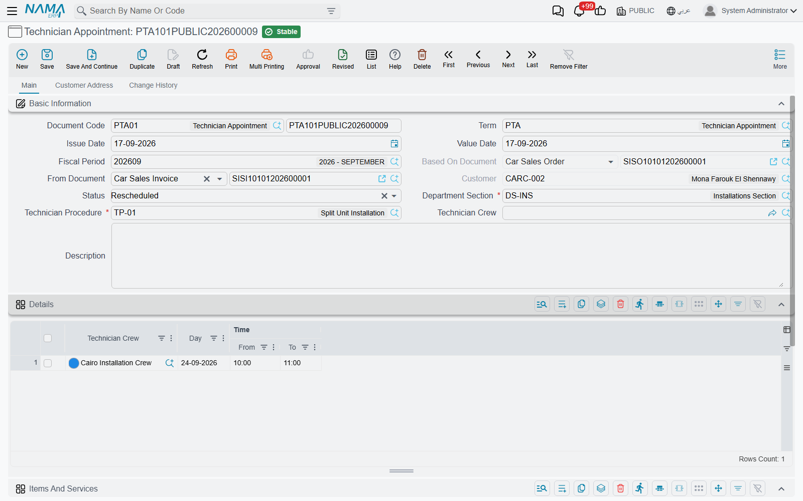

# The Technician Appointment

::: info Required licence
`crm-technician-appointments`.
:::

The **Technician Appointment** (*موعد فني*) is the booking itself — one crew, one job, and the times they are reserved for. Most of the time you will not type one from scratch; you will draw it on the [booking calendar](/modules/crm/technician-appointments/crm-technician-appointment-calendar.md) and the calendar will create it. This page describes the document you get, because that is where you go to look a booking up, change it, cancel it or trace it back to the sale.

## The header

Alongside the usual document frame — **Document Code** and book, **Term** (*توجيه المستند*), **Value Date**, **Fiscal Period**, **Description**, **Manual Ref1** — the appointment carries five fields of its own.

**From Document** (*بناء على*) — the commercial document this visit was promised by: a sales invoice, a sales order, a contract. It is a general reference, so it accepts any document, and it is the thread that ties the visit back to what was sold. `APP000001` was raised from sales invoice `SIV1-20260800001`.

**Based On Document** (*المستند الأعلى لبناءاً على*) — filled in by the system and not editable: it is the document that *your* From Document came from. When the visit is booked from a sales invoice that was itself raised from a sales order, this field shows the sales order. It saves the follow-the-chain click when somebody asks which order this installation belongs to. On `APP000001` it reads `SO1-20260800001`.

**Status** (*الحالة*) — where the booking stands. A new appointment starts at *Booked* (*محجوز*); committing a [service distribution](/modules/crm/technician-appointments/crm-technician-service-distribution.md) against it moves it to *Executed* (*تم التنفيذ*), and cancelling that distribution moves it back to *Booked*. The other three values — *Cancelled* (*ملغي*), *No Show* (*لم يحضر*) and *Rescheduled* (*معاد جدولته*) — are set by hand, and they are how the day's reality gets recorded: the customer called off, nobody was home, the visit was moved.

**Department Section** (*القسم الوظيفي*) — required, and the field that decides almost everything else. Only sections with **Show In Appointments Screen** ticked are offered. The section brings the working hours the calendar enforces and, through [booking settings](/modules/crm/technician-appointments/crm-appointment-booking-settings.md), the book and term the appointment is numbered in.

**Technician Procedure** (*إجراء فني*) — required. The job being booked. It also governs which services can later be reported against the visit, because a service distribution only accepts services listed on this procedure.

::: tip The book fills itself in
Save an appointment with no book and the system looks up the department section's booking settings, finds the row for that section in **Appointment Books And Terms Per Section**, and applies its book and term — then numbers the document and copies the book's dimensions across. That is why an appointment created by the calendar, which never asks for a book, still comes out as a properly numbered `APP…` document.

If a book is already set, nothing is overwritten.
:::

## The Details grid — the reserved times

Everything about *when* lives in the **Details** (*التفاصيل*) grid. One row per block of time:

| Column | Meaning |
|---|---|
| Technician Crew (*فريق فنيين*) | The crew reserved |
| Day (*اليوم*) | The date — required |
| Time From (*من*) | Start time |
| Time To (*إلى*) | End time |

`APP000001` reserves the Giza installation crew twice on 13 August 2026: 08:00–09:00 and 10:00–11:00. Two rows rather than one long block, because the crew has another job in between.

At least one row is required. And one rule governs the grid:

::: warning Every row must name the same crew
An appointment books **one** crew. Put two different crews on two rows and the commit is rejected with *"All Lines must have same Crew"* against the offending row.

If the work genuinely needs two crews, raise two appointments. That keeps each crew's calendar honest, and it keeps the service distribution — which reports against one crew's members — able to do its job.
:::

The **Dimensions** group at the foot of the screen works as it does on every document, seeded from the book when the book is applied.

## Editing a booking after the fact

The appointment behaves like any other document: correct it and save, or cancel it, subject to your approval cycle.

Two habits worth adopting:

- **To move a visit**, change the Day and times on the detail rows rather than raising a new appointment, unless you want the history of both. If you do raise a replacement, set the old one to *Rescheduled* so the calendar and the list view tell the story.
- **To change the crew**, change it on every row — the same-crew rule is checked on save, so a half-finished change will simply be refused.

The list view shows Status, Department Section and Technician Procedure as columns, which makes "what installations are still only *Booked* this week" a straightforward filter.
