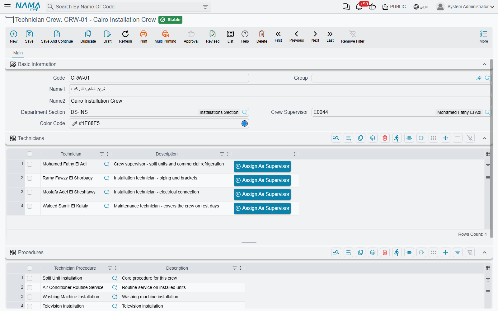

# Technician Crews

::: info Required licence
`crm-technician-appointments`.
:::

You do not book individual people in this feature — you book a **crew**. That is a deliberate simplification: a two-man installation team travels together, arrives together and is busy together, so treating them as one bookable unit removes a whole layer of scheduling that most field businesses do not need.

A crew is a named group of employees, attached to a department section, carrying the list of procedures it is qualified to perform, and — the small detail that makes the calendar readable — a colour.

## The header

**Code**, **Name1** (Arabic) and **Name2** (English) as on every master file. In the example above, `CRW-01` is the *Cairo Installation Crew* (*فريق القاهرة للتركيب*).

**Department Section** (*القسم الوظيفي*) — which part of the organisation this crew belongs to. It has a practical effect immediately: the **Technician** picker in the grid below is filtered to employees whose own department section matches. Set the section before you start adding people, or the picker will offer you the whole employee file.

**Crew Supervisor** (*مشرف الفريق*) — the team leader, the person answerable for the crew. It must be one of the crew's own technicians, so the picker offers only the people in the Technicians grid. If the supervisor is later removed from that grid, the record refuses to commit with *"Crew supervisor … must be one of the crew technicians"*.

::: tip Crew Supervisor is not a section supervisor
Naming someone Crew Supervisor does not let them see other crews on [My Appointments](/modules/crm/technician-appointments/crm-my-appointments#Who-sees-what). That comes from the **Supervisors** grid on the department section.
:::

**Color Code** (*كود اللون*) — the colour this crew's bookings are drawn in on the [booking calendar](/modules/crm/technician-appointments/crm-technician-appointment-calendar). The Cairo Installation Crew is blue, `#1E88E5`. Pick colours with real contrast between crews that share a section; a calendar week with four crews in four shades of blue is much harder to read than one with green, red, purple and orange. Crews left without a colour are given one automatically from a built-in palette.

## Technicians

One row per member: the **Technician** — an employee — and a free **Description**.

Each row also carries an **Assign As Supervisor** (*تعيين كمشرف*) button, which copies that row's technician into the Crew Supervisor field. It is a shortcut for the common case, and it works before the crew is saved.

::: tip A technician belongs to one crew only
When you commit the crew, every technician on it is checked against every other crew in the system. If somebody is already a member elsewhere you get *"Technician … already exists in another technician crew …"* and the commit stops.

This is the rule that makes the calendar trustworthy — a crew's bookings really are that person's bookings. It also means you never move somebody by editing two crews: use a [Technician Transfer](/modules/crm/technician-appointments/crm-technician-transfers), which takes them out of one crew and puts them into the other in a single committed document.
:::

## Procedures

The second grid lists the **Technician Procedures** this crew is qualified to perform, again with a free description.

This is what the booking calendar filters on. When a booking clerk picks *split unit installation*, the crews offered are the ones whose Procedures grid names that procedure — plus any crew whose grid is empty, which is read as "qualified for everything". A crew that has never had its procedures filled in will therefore appear under every job, which is fine for a small operation and misleading for a large one.

## Building the crews

For a section with three teams the sequence is short:

1. Create the crew, set its department section and its colour.
2. Add the technicians — the picker is already narrowed to the section's employees.
3. Press **Assign As Supervisor** on the team leader's row.
4. List the procedures the crew is trained for.
5. Commit. If somebody is rejected as already belonging to another crew, that is your answer about where they currently sit — transfer them rather than fighting the message.
