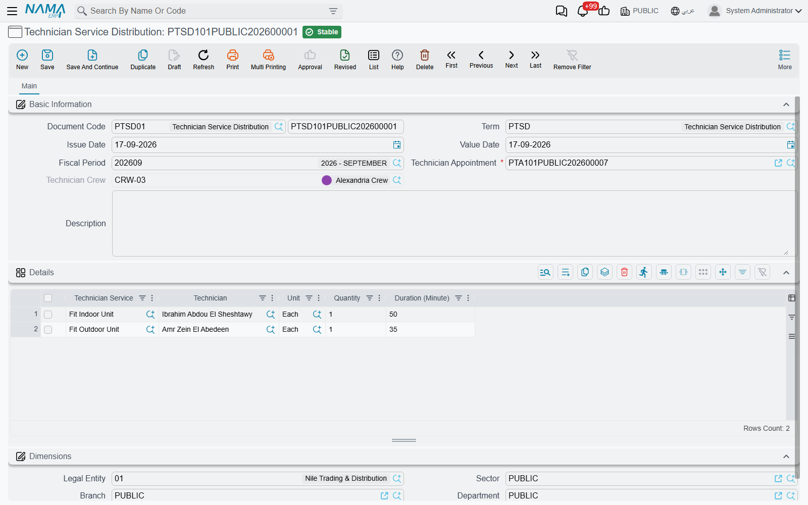

# Service Distribution

::: info Required licence
`crm-technician-appointments`.
:::

The appointment says the Giza crew is booked on Sunday morning for a split unit installation. The **Technician Service Distribution** (*سند توزيع الخدمات*) says what happened: Essam fitted the outdoor unit in 20 minutes, Mohamed fitted the indoor unit in 30. It is the after-the-visit document — one per appointment — and committing it is what marks the appointment as *Executed*.

## The header

**Technician Appointment** (*موعد فني*) — required, and the only thing you really have to choose. Everything else on the screen is shaped by it.

**Technician Crew** (*فريق فنيين*) — filled in from the appointment's detail rows the moment you pick the appointment, and kept in step on every save. You do not maintain it; it is there so the document, and the technician picker below, know which team's members are eligible.

The rest is the standard document frame: **Document Code** and book, **Term**, **Value Date**, **Fiscal Period**, **Description**, **Manual Ref1** and the **Dimensions** group.

## The Details grid — who did what

One row per piece of work performed:

| Column | Meaning |
|---|---|
| Technician Service (*خدمة فنية*) | The task performed — required |
| Technician (*الفني*) | Who performed it — required |
| Unit (*الوحدة*) | The unit the quantity is counted in |
| Quantity (*الكمية*) | How many |
| Duration (Minute) (*المدة (دقيقة)*) | How long it took — required |

`DIS000005`, written against appointment `APP000005`, carries two rows: *تركيب وحدة خارجية* by Essam, 1 count, 20 minutes; *تركيب وحدة داخلية* by Mohamed, 1 count, 30 minutes.

Both pickers are narrowed for you, which is the point of having reported the work this way:

- **Technician Service** offers only the services listed on the appointment's procedure.
- **Technician** offers only the members of the appointment's crew.

Those two limits are also checked again when the document is committed, so a row that was valid when it was typed and has since drifted — the procedure's service list changed, somebody was transferred out of the crew — is caught rather than quietly saved. The messages name the row: *"Technician Service … does not belong to Technician Appointment …"* and *"Technician … does not belong to Crew …"*.

The quantity, the unit and the minutes are yours to record as they really were. Nothing recalculates them from the service catalogue's planning durations, which is exactly what makes the comparison between the two worth having.

## What committing it does

::: tip Committing moves the appointment to Executed
On commit, the appointment named on the header is set to **Executed** (*تم التنفيذ*). Cancel the distribution and the appointment goes back to **Booked** (*محجوز*). Point a committed distribution at a *different* appointment and both are corrected: the new one becomes Executed and the one you moved away from returns to Booked.

That is the whole of this document's effect. It records effort — it does not price the work, does not move stock and does not post to the ledger. Invoicing continues to run off the sales document the appointment was raised from.
:::

## Fitting it into the day

The pattern that works in practice is one distribution per completed visit, written the same day:

1. Open the appointment from the calendar or the list and note its code, or start from the distribution screen and pick the appointment there.
2. Add a row per service actually performed, naming the technician who did it and the real minutes.
3. Commit. The appointment turns *Executed* and drops out of your "still outstanding" filter on the appointment list.

Visits that did not happen never get a distribution — set the appointment to *No Show* or *Cancelled* by hand instead, so that "Booked" always means work still to do.
