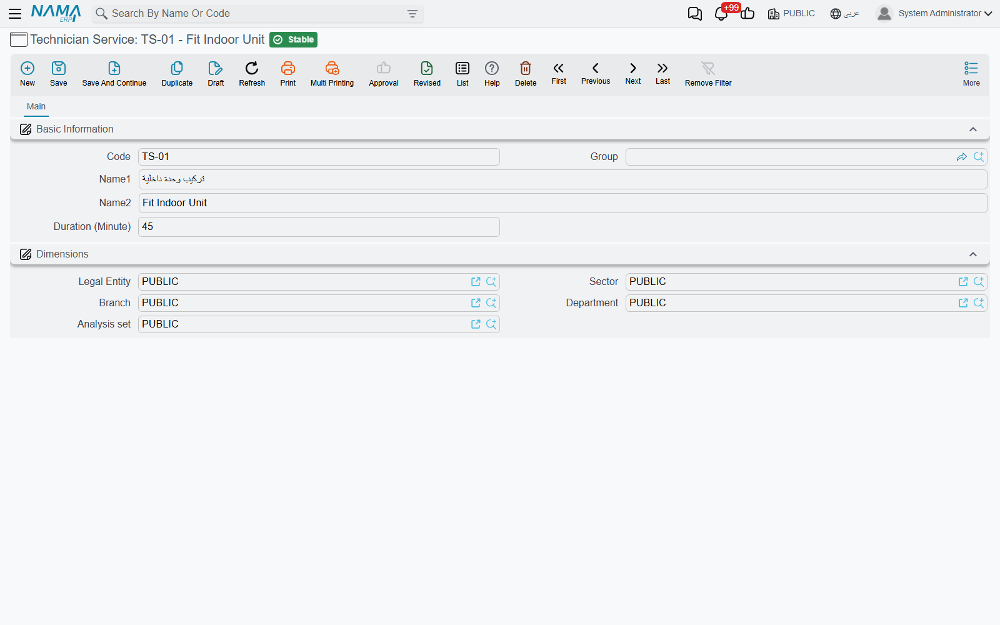
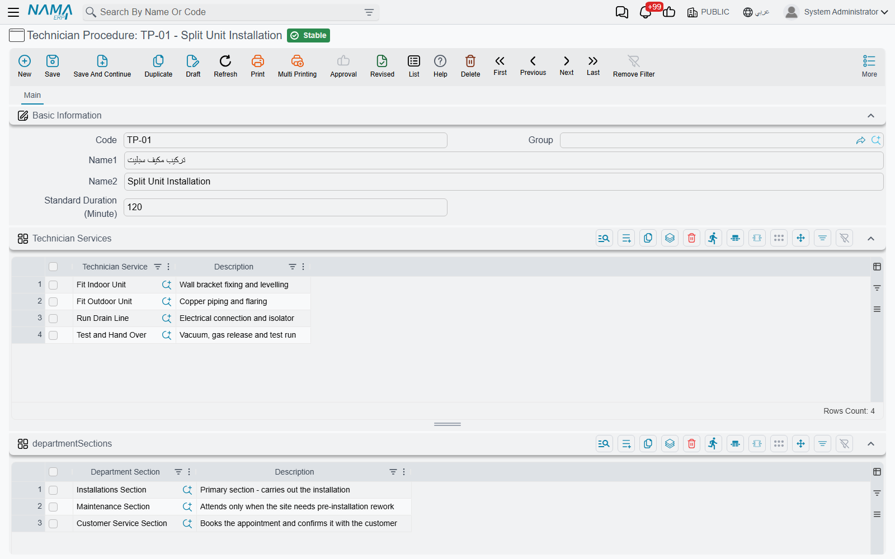

# Services and Procedures

::: info Required licence
`crm-technician-appointments`.
:::

Before you can book anybody you have to tell the system what you book people *for*. That takes two master files, and the difference between them is simply one of size.

A **Technician Service** (*خدمة فنية*) is one task: *fit the indoor unit*, *run the drain line*, *test and hand over*. A **Technician Procedure** (*إجراء فني*) is the job the customer actually asks for — *split unit installation* — and it is little more than a named list of the services that job is made of.

Why bother with both? Because they are used at opposite ends of the cycle. You book the **procedure** — that is what goes on the appointment and what filters the crews the calendar offers you. You report the **services** — after the visit, the service distribution asks which service each technician performed. Splitting the work into services is what turns "the crew was there for three hours" into "Essam fitted the outdoor unit in 20 minutes and Mohamed fitted the indoor unit in 30".

## Technician Service

A short file. Code, Arabic name, English name, and one field of your own:

**Duration (Minute)** (*المدة (دقيقة)*) — how long this task normally takes. It is the planning figure you keep on the catalogue so estimates are consistent; the minutes recorded against a real visit are typed on the service distribution.

Keep the list at the granularity you actually want reported. If nobody will ever care that fitting the bracket took 8 minutes, do not create a service for the bracket — every extra service is a row somebody has to fill in after every visit.

## Technician Procedure

The procedure carries the name your booking staff will recognise, plus a **Standard Duration (Minute)** (*المدة الإفتراضية (دقيقة)*) for the whole job — the number to have in mind when you decide how wide a slot to draw on the calendar.

Underneath sit two grids.

**Technician Services** (*خدمات فنية*) — the tasks that make up this job, one per row, with a free description. This grid is required: a procedure with no services can be booked, but the service distribution written against that booking will have nothing to offer, because it only accepts services listed here.

Al Bahaa's `01 - تركيب مكيف` (*Split unit installation*) carries two rows: *تركيب وحدة داخلية* (fit the indoor unit) and *تركيب وحدة خارجية* (fit the outdoor unit).

**Department Sections** (*الأقسام الوظيفية*) — which parts of the organisation perform this job. This one is optional, and the way it is read is worth knowing:

::: tip An empty section list means "everyone"
The booking calendar offers you the procedures whose Department Sections grid **either names the section you picked or is empty**. So leaving the grid blank makes a procedure universally available, and filling it in restricts the procedure to those sections.

Use it when two sections genuinely do different work — an installation section and a maintenance section — so that booking staff working in one never see the other's job list.
:::

Both grids have a **Description** column for anything a colleague needs to know when they pick the row.

## A sensible order to build them in

1. Write the service list first — every distinct task you want reported, with its normal duration.
2. Group the services into procedures, one procedure per thing a customer can book.
3. Restrict procedures to sections only where you have a real reason to.
4. Then move on to [crews](/modules/crm/technician-appointments/crm-technician-crews.md), where you say which teams are qualified for which procedures.
