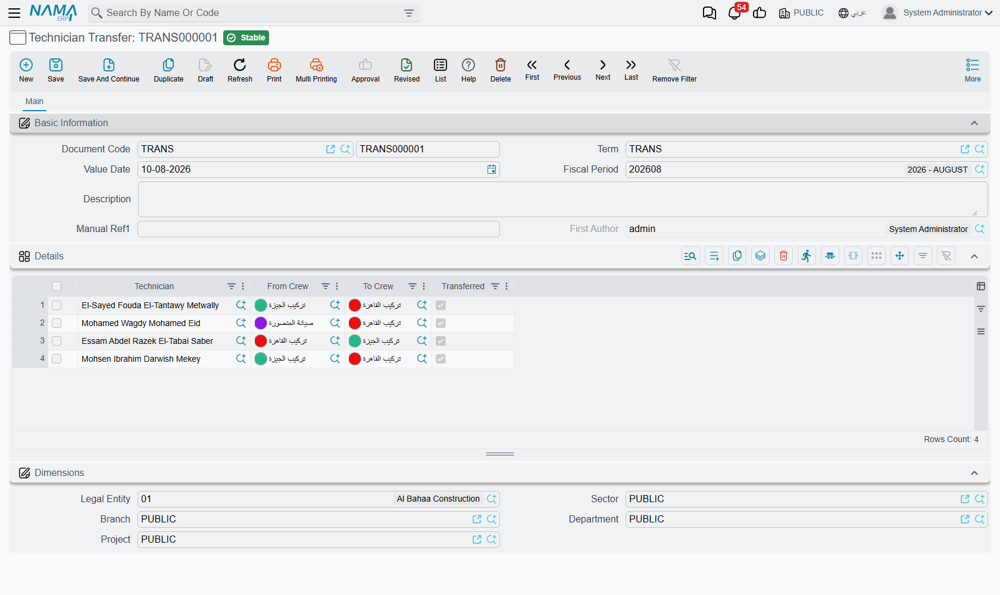

# Technician Transfers

::: info Required licence
`crm-technician-appointments`.
:::

Because a technician may belong to only one crew, moving somebody is not a matter of editing two crew records — you would be rejected halfway through, with the person briefly a member of both. The **Technician Transfer** (*سند نقل فني*) exists to make the move atomic: one document, one commit, and the crews come out the other side correct.

It is also a record. Six months later, "when did Essam move from Cairo to Giza" has an answer with a document number and a date on it.

## The Details grid

The document is a header of the ordinary kind — code and book, term, value date, fiscal period, description — plus a grid where each row is one person's move:

| Column | Meaning |
|---|---|
| Technician (*الفني*) | The employee being moved — required |
| From Crew (*من الفريق*) | The crew they are leaving — required |
| To Crew (*إلى الفريق*) | The crew they are joining — required |
| Transferred (*تم النقل*) | Ticked by the system once the move has been applied |

`TRANS000001` moves four people in one go — three into the Cairo installation crew, one back into Giza — which is the natural way to record a seasonal reshuffle.

The grid helps you fill it in from either end:

- **Pick the technician first** and the system looks up the crew they are currently in and puts it in **From Crew** for you. In practice this is the fastest route: you know who is moving, not necessarily where they sit today.
- **Pick the From Crew first** and the **Technician** picker narrows to that crew's members.
- **To Crew** never offers the crew you are moving out of.

## What is checked

Two rules are enforced when the document is committed, both reported against the offending row:

**Nobody twice.** A technician may appear on only one row — *"Technician … is repeated in more than one line, a technician can be transferred only once per document"*. If somebody really moves twice, that is two documents on two dates, which is also the truer record.

**Nobody into a crew they are already in** — *"Technician … already exists in Crew …"*. Usually this means the move has already happened, by this document or another one.

## What committing it does

On commit the document does the work itself: each un-transferred row's technician is **removed from the From Crew and added to the To Crew**, the affected crew records are saved, and the row's **Transferred** box is ticked.

That tick matters. It means the row has been applied, and it is what stops the same move being made twice if the document is committed again after an edit — already-transferred rows are skipped, and only new rows are acted on.

::: tip What a transfer does not touch
The move changes crew membership and nothing else. Appointments already booked for either crew keep their crews and their times, and past service distributions keep naming the person who did the work.

So if somebody moves mid-week, look at the bookings the two crews already hold and decide, case by case, whether the work still goes ahead with the crew as it now stands. And if the person you moved was the **Crew Supervisor** of the crew they left, name a new supervisor there — a supervisor has to be one of that crew's own technicians.
:::

## The usual sequence

1. Raise the transfer with one row per person moving.
2. Let the From Crew fill itself in, then choose the To Crew.
3. Commit — the crews are updated and the rows are ticked.
4. Open both crews to confirm the membership, and fix the supervisor on either side if the move touched them.
