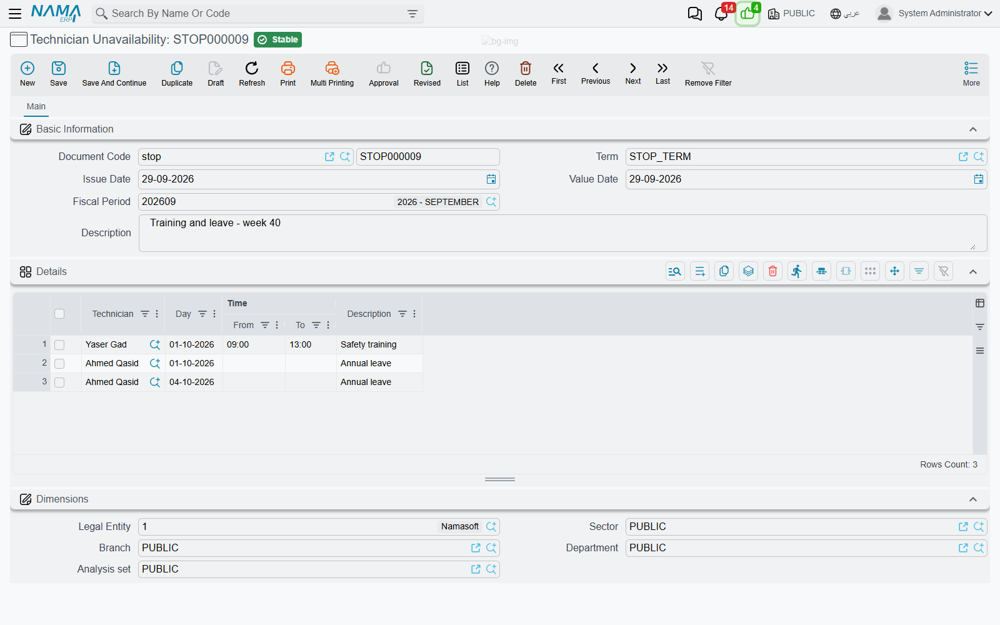

# Technician Unavailability

::: info Required licence
`crm-technician-appointments`.
:::

You book crews, not people, but a crew can only go out if its people are there. When one installer of a two-man crew is on leave on Thursday, the crew is not really free on Thursday, however empty its calendar looks. **Technician Unavailability** (*سند إيقاف فني عن الحجز*) is how you tell the system that: annual leave, a training day, a sick day, a morning at the embassy. You enter the person and the time, and while the document is committed nobody can book that person's crew in that time.

The menu lists it under **Technician Appointments**, right after Technician Crews, as *Technician Unavailabilities* (*سندات إيقاف الفنيين عن الحجز*).

## The Details grid

The document has the usual header (book, term, dates, description) and one required grid, **Details** (*التفاصيل*), with a row for each block of time:

| Column | Meaning |
|---|---|
| Technician (*الفني*) | The employee who is unavailable — required |
| Day (*اليوم*) | The date — required |
| From-Time (*من وقت*) | When the block starts. Empty means from the start of the day |
| To-Time (*إلى وقت*) | When the block ends. Empty means to the end of the day |
| Description (*ملاحظات*) | Why — "annual leave", "safety training" |

Leave both times empty to block the whole day. A week of leave is five rows, one per working day. Several technicians can share one document, so a single document can hold the whole team's training day.

When both times are filled in, To-Time must be after From-Time, or the commit is refused on that row with *"To-Time must be after From-Time"*.

## What the block does

A block belongs to the **technician**, and it stops the **crew** they belong to. Because a crew goes out as one unit, one missing member makes the whole crew unbookable for that time:

- On the [booking calendar](/modules/crm/technician-appointments/crm-technician-appointment-calendar#Unavailable-time), the block is drawn on the crew's week as a grey hatched *Unavailable* block, and the crew is left out of the crew list when you draw a period over it.
- When an appointment is saved, any new or moved period of a crew with a blocked technician is refused with *"Technician {0} is unavailable during this period"*. The check runs on the server, so it also applies to appointments edited on their own screen. See [The Technician Appointment](/modules/crm/technician-appointments/crm-technician-appointment#The-booking-rules).

The check looks at the crew's members at the moment of booking. If a [transfer](/modules/crm/technician-appointments/crm-technician-transfers) moves the technician to another crew, the block moves with them: it now stops the new crew, and the old crew is free again.

Only **committed** documents count. A draft blocks nothing, and cancelling the document lifts the block.

## Appointments already booked in the blocked time

Leave is often entered after the visits are already booked. The system does not refuse the document for that, and it does not move or cancel anything. When you commit, you get a warning for each appointment of the technician's crew that falls in the blocked time:

*"Appointment {0} is already booked for {1} during the blocked period"*

`{0}` is the appointment and `{1}` the technician. The document is still committed. Cancelled appointments are not listed. Use the list as a to-do: open each appointment on the booking calendar and move it, give the job to another crew, or cancel it.

::: tip No Arabic text for these messages
The three messages on this page have no Arabic translation yet, so they appear in English on the Arabic screens too.
:::
