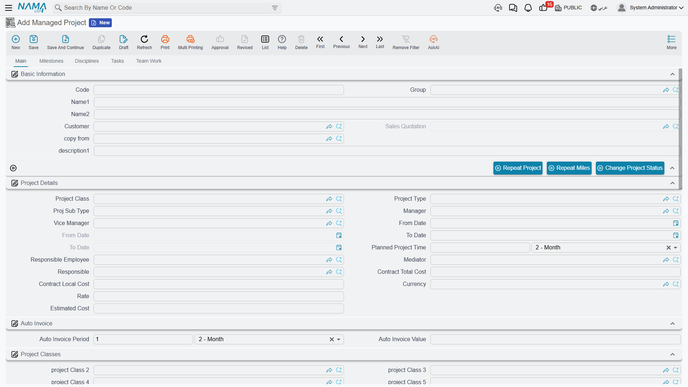
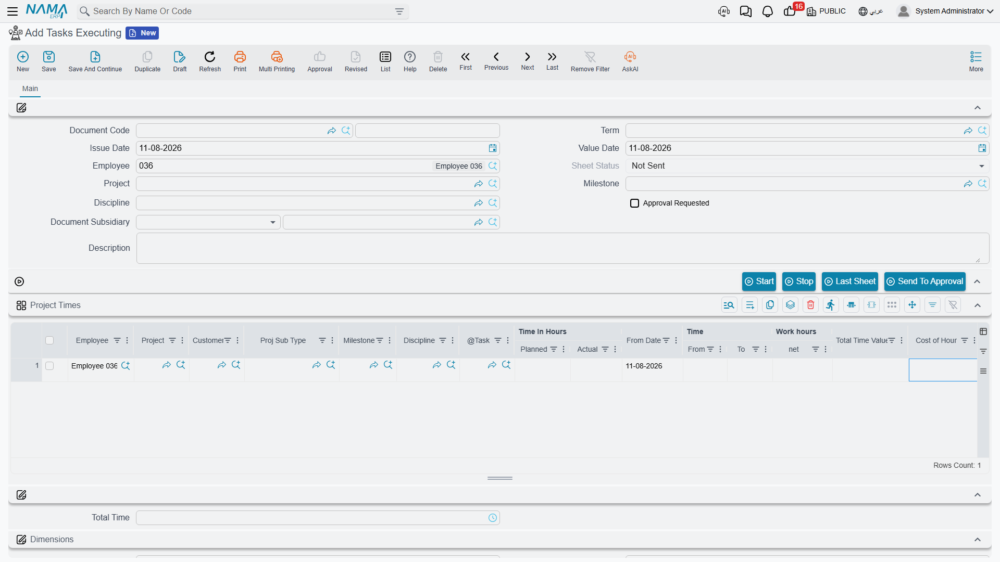

# Where Project Cost and Revenue Come From

::: info Required licence
`ecpa`. Nothing on this page is separately licensed — it describes how screens you already have fit
together.
:::

"What did this project cost us, and did we make money on it?" is the question every partner in an
engineering office asks, and it is the question this module answers in three separate places rather
than one. Knowing which place holds which half of the answer is the single most useful thing a
support engineer can learn about Project Management (ECPA), because almost every "the cost is wrong"
call turns out to be someone reading one of the three and expecting it to contain all of them.

The three places are:

1. **The Managed Project screen**, which carries one cost figure — and it is labour only.
2. **The general ledger**, which is the only place labour cost and out-of-pocket cost appear together.
3. **The Project Stage sheet**, which is the only screen showing revenue and cost side by side — and
   which is not attached to a project.

We will walk each of them with the same job:

> **Al-Manara Engineering**, project `PRJ-0042` "Tower Fit-out Design" for customer `CUST-011`. Sara
> (`EMP-7`) is an executer on task `TSK-0042-03` "Site survey": **120 planned hours** at an hourly
> rate of **60**, so a planned cost of **7,200**. By the end of March her approved time on that task
> stands at **90 hours**. Sara's constant monthly salary in the HR file is **10,000**, and the
> module's standard monthly hours are set to **200**. She has also claimed **300** of expenses on the
> job — a **220** taxi and **80** of printing.

## The Project's Own Total Is Labour Cost, and Nothing Else

Open `PRJ-0042` and the Main page carries a small read-only block of figures: **Total Project Cost**
(التكلفة الحالية), the project status, total planned time, total actual time and the completion
percentage.

**Total Project Cost is the sum of labour cost across the project's tasks, and only that.** It is
built from the bottom up:

- Each executer row on a task holds an **hourly rate** and the hours that have been approved against
  it. Multiply them and you have that person's actual cost on that task.
- Add up the executer rows and you have the task's actual cost.
- Add up the tasks and you have the project's Total Project Cost.

For Sara on `TSK-0042-03` that is 90 approved hours × 60 = **5,400**, and 5,400 is what her share
contributes to `PRJ-0042`'s total. Her 300 of expenses contributes **nothing** — and neither would a
stock issue, a purchase invoice, a fixed asset or a payment voucher, because none of those documents
can carry an ECPA project at all.

Two behaviours around this number surprise people, and both are simply how the screen works:

- **The total refreshes when a task is saved, or when a timesheet approval is committed — not when
  the project is saved.** Saving the project itself does not recalculate it. If a figure looks stale,
  open one of the project's tasks and save it, and the project's totals are rebuilt.
- **The completion percentage is the only percentage the system computes.** It is actual hours ÷
  planned hours across the project's tasks. Every other percentage in the module — the milestone's
  "% of project", the discipline percentages in the matrix, a milestone's "% of finishing" — is typed
  by a human. The system does not roll up weighted progress.



## Two Hourly Rates, and Why They Legitimately Disagree

The module values an hour twice, in two different places, from two different sources. This is the
thing most worth understanding on the whole page.

**The rate on the task's executer row** is a plain number a planner types when assigning the employee
to the task. It is what the project screen's Total Project Cost is built from. In our example it is
60, chosen by whoever set up the task — a charge-out rate, a blended departmental rate, whatever the
firm uses for planning.

**The hourly cost on the timesheet line** is a different number entirely. When the module setting
**Update Hour Cost of TimeSheet From HR** is switched on, each timesheet line is valued at the
employee's constant monthly salary from HR ÷ the module's **standard monthly hours**, and the line's
total cost is that hourly figure × the net time on the line. For Sara: 10,000 ÷ 200 = **50** an hour,
so her 90 hours value at **4,500** — and 4,500 is what reaches the general ledger through the
timesheet's document term.

So the same 90 hours are worth 5,400 on the project screen and 4,500 in the ledger, and both are
correct. One is the planned charge-out rate; the other is what the employee actually costs the firm.
Expect them to differ, and never reconcile one against the other.

::: tip If timesheet lines are valuing at zero
With **Update Hour Cost of TimeSheet From HR** switched off, the timesheet's hourly cost and total
cost are never computed at all — lines carry no value and are dropped from the accounting effect.
That setting, and the rate chain behind it, is covered in
[Project Management Settings](/modules/ecpa/ecpa-configuration).
:::



## Out-of-Pocket Cost Reaches the Ledger, Not the Project Screen

Sara's taxi and printing travel a different road. She raises a **Project Expense Request** against
`PRJ-0042`, with one line per claim, each tied to a task and to a **Project Expense Item** from the
catalogue. Committing that request books it to the ledger in the background, through the request's
own document term.

Then an accountant raises a **Project Expense Document**, presses *Collect Requests*, and commits.
That books the accounting side and stamps the request lines as processed so they are not gathered
twice.

Both documents are covered in [Project Expenses](/modules/ecpa/expenses/ecpa-project-expenses). What
matters for costing is where the money ends up:

- **The ledger, yes.** The expense item names the account the line lands in, and the request and the
  document both carry the project, the customer and the employee onto their ledger lines.
- **The project screen, no.** Neither document touches Total Project Cost.
- **The stage sheet, no.** Expense documents cannot be put on a Project Stage.
- **The invoice, sometimes** — and this is decided by one tick box. A line marked **Internal Account**
  (مصروف داخلى) is a cost the firm absorbs; a line left unticked is re-billed to the customer when
  someone presses *Collect Expenses* on a Project Invoice. Sara's 220 taxi is external and will be
  billed; her 80 of printing is internal and will not.

One consequence worth stating plainly, because it catches people out: **billing runs off the request,
not off the expense document.** A committed, non-internal request line is available to the invoice
whether or not anyone ever raised an expense document for it.

Because both the timesheet and the expense documents can put the project onto their ledger lines, an
accounting report filtered by project is the one place where labour cost and out-of-pocket cost
appear in the same total. It is not an ECPA screen, but it is the honest answer to "what has this job
cost us so far".

## The Project Stage Sheet — Revenue and Cost Side by Side

The one screen in the module that shows income against cost is the **Project Stage** (مرحلة مشروع), a
committed document with two dedicated pages.

**Before using it, understand what it is attached to: nothing.** A Project Stage has no project
field. It is keyed by project type and sub-type, and it reaches a project only through the milestones
picked on its own lines. It never writes anything back to a project, and one stage can legally carry
milestones belonging to two different projects. It is a sheet you assemble for a phase of work, not a
report the project produces.

Everything on both money pages is **hand-picked or hand-typed**. There is no collect button, no roll-up
task and no automatic feed.

### The income page

**Project Incomes** (إيرادات المشروع) takes **Sales Invoices** — the supply-chain sales invoice, not
this module's own Project Invoice. You pick each invoice by hand and the system fills in its date,
its customer and its net value. The module's own Project Invoices cannot be put on this sheet.


### The cost page

**Project Costs** (تكاليف المشروع) is five grids, each accepting a different kind of cost:

| Grid | What you put on it | How the value arrives |
|---|---|---|
| **Stock and supplier costs** | Stock Issues | You pick the issue; the system fills its source document, date, customer and net value |
| **Worker costs** | Employees, with days worked and a cost per day | Typed entirely by hand |
| **Fixed-asset costs** | An asset, with working days and a cost per working day | Typed by hand; the system multiplies the two |
| **Transportation costs** | Misc Purchase Invoices | You pick the invoice; the system fills its source document, date, supplier and net value |
| **Other costs** | Payment Vouchers | You pick the voucher; the system fills its source document, date, supplier and amount |


### The arithmetic

Each grid totals itself, the five cost totals add up to an all-costs figure, and the profit is the
income total less that:

```
Project incomes total       = Σ income lines
Stock and supplier costs    = Σ stock issue lines
Worker costs                = Σ employee cost in project
Fixed-asset costs           = Σ asset cost in project
Transportation costs        = Σ misc purchase invoice lines
Other costs                 = Σ payment voucher lines

All costs   = stock + workers + fixed assets + transportation + other
Profit      = incomes − all costs
```

For a stage covering the concept and schematic phases of `PRJ-0042`, a firm might record **250,000**
of income against **30,000** of stock, **45,000** of worker cost, **8,000** of fixed-asset use,
**5,000** of transportation and **2,000** of other costs — 90,000 of cost and a profit of
**160,000**. The totals are recalculated whenever the document is saved and again when it is
committed.

::: tip One document can only be counted once
A stage will not commit if the same sales invoice, stock issue, misc purchase invoice or payment
voucher appears twice on it — or if it already appears on another committed Project Stage. That guard
is what makes the sheet safe to use across several stages of the same job. It does not apply to the
worker and fixed-asset grids, because those hold no document reference to compare.
:::

The Project Stage produces no accounting effect of its own. It is a working sheet, not an
accounting document.

## Estimates Are Informational — There Is No Budget

The module has several fields that look like a budget and none that behaves like one:

- **Contract Total Cost** and **Contract Local Cost** on the project's details block — the agreed
  value of the job. The only thing the system does with them is convert one to the other at the
  document rate.
- **Estimated Cost** on the same block.
- The estimated-cost columns on the Milestones page, the Disciplines page and the work-package matrix
  — estimated direct work hours, average cost of an hour, direct work hours cost, indirect costs and
  a total.

All of these are arithmetic and display. **Nothing compares any of them against actual cost.** No
validation blocks a task, a timesheet, an expense or an invoice because an estimate has been passed,
and there is no budget record anywhere in the module. When a customer asks for budget control on
projects of this kind, this is the honest answer: record the estimate here for reference, and do the
control outside.

## Automatic or Manual — the Whole Picture on One Page

| Cost or revenue source | Where it lands | Automatic or manual |
|---|---|---|
| Approved timesheet hours × the executer's rate | Task actual cost → project **Total Project Cost** | **Automatic** |
| Timesheet hours × HR-derived hourly cost | The general ledger | **Automatic**, when *Update Hour Cost of TimeSheet From HR* is on and the timesheet's term has both accounting sides configured |
| Project Expense Request | The general ledger; and the invoice, for non-internal lines | **Automatic** on commit |
| Project Expense Document | The general ledger | **Automatic** on commit; lines gathered by *Collect Requests* |
| Stock issues | Project Stage → stock and supplier costs | **Manually picked**; value filled automatically |
| Misc purchase invoices | Project Stage → transportation costs | **Manually picked**; value filled automatically |
| Payment vouchers | Project Stage → other costs | **Manually picked**; value filled automatically |
| Sales invoices (revenue) | Project Stage → project incomes | **Manually picked**; value filled automatically |
| Employee days on a stage | Project Stage → worker costs | **Typed entirely by hand** |
| Fixed-asset usage | Project Stage → fixed-asset costs | **Typed entirely by hand** |

## Answering the Question in Practice

Put together, here is how to answer the four questions that actually arrive:

**"What has this project cost in labour?"** — the Managed Project's Total Project Cost, refreshed by
saving one of its tasks. It uses planning rates, not payroll rates.

**"What has this project cost us in total?"** — an accounting report filtered by the project, which
picks up both the timesheet cost and the expense documents. No ECPA screen shows this.

**"What have we billed?"** — the Project Invoice list for the project.

**"Are we making money on it?"** — assemble a Project Stage for the phase, pick up the sales invoices
and the cost documents, and read the profit figure. Nothing produces this automatically, and nothing
enforces the answer.
