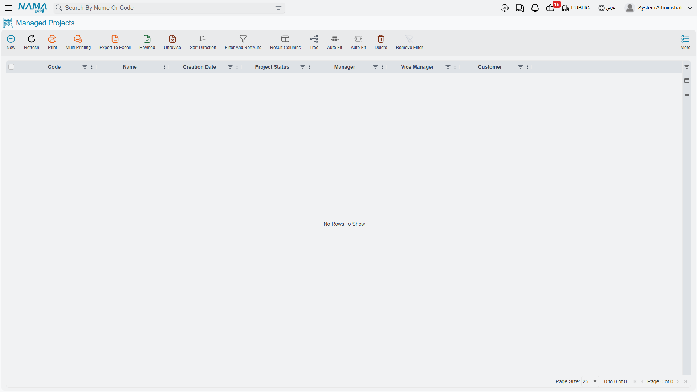

# Project Management (ECPA) Overview

::: info Required licence
`ecpa` — one code for the whole module, all or nothing. There are no sub-licences, so there is no
half-licensed state to explain: either every screen below is in the menu, or none of it is. The menu
root reads **Project Management** (ادارة المشاريع).
:::

An engineering office does not sell anything you can put on a shelf. What it sells is Tuesday
afternoon: a structural engineer's four hours over a foundation drawing, a draughtsman's day
redlining a floor plan, a partner's hour in a client meeting. The stock is people, the cost is
salaries, and the two questions that keep a practice awake are *who worked on what* and *when can we
invoice it*.

Project Management is Nama's module for exactly that shape of firm — architecture and engineering
offices, consultancies, audit and legal practices, design studios. Everything in it assumes the
deliverable is professional work, priced by the hour or by an agreed fee per phase, and that the hard
part is turning recorded hours into a defensible invoice.

Several pages in this documentation follow one firm:

> **Al-Manara Engineering** wins a design job for customer `CUST-011`, the **Tower Fit-out Design**,
> which becomes project `PRJ-0042`. The job is billed in four phases — concept, schematic, detailed
> design, tender documents — and three of Al-Manara's disciplines work on it: architectural,
> structural and electrical. Sara (`EMP-7`) is one of the architects assigned to it.

## The Module Is Called Project Management, Not ECPA

"ECPA" is the module's code, and you will meet it in licence dialogs and in support conversations.
You will not meet it in the menu. The menu group is **Project Management** in English and
**ادارة المشاريع** in Arabic, and a user hunting the tree for the letters E-C-P-A will not find them.

The same split runs one level down. Internally every record type in the module carries a `CPA` prefix,
but on screen you see ordinary names — **Managed Project**, **Task**, **Tasks Executing**,
**Project Invoice**. Use the screen names. The only place the internal prefix shows through is in the
short codes on document books (`CPAP`, `CPATS`, `CPAPI` and so on), where it is harmless.

::: info Two words that look identical in Arabic
**Project Milestone** (مرحلة) and **Project Stage** (مرحلة مشروع) are two completely different
things, and their Arabic labels are one word apart.

A **milestone** is a master file — the name of a billable phase, such as "Schematic Design". You
create a handful of them per project and hang tasks and invoice lines off them. A **stage** is a
committed document — a schedule-and-money sheet with target dates, late-day counters and cost grids.

Never write or say a bare "مرحلة" when either could be meant. This documentation always qualifies.
:::

## Where the Name Came From

The short answer is that ECPA is not an abbreviation of anything the module does. It is the name of
the firm it was built for.

**ECPAs** is a public accountants firm in Egypt, working in tax and audit. In 2014 they approached
Namasoft wanting to manage their projects properly — the projects themselves, and the tasks needed
to finish them. Out of that cooperation came this module.

So the module was named after them. `CPA` is for certified public accountants, which is also why
every record type inside it carries a `CPA` prefix. With hindsight it should have been called Time
Management or Project Management from the beginning — which is exactly what the menu says today. The
code name simply stayed.

::: info A note of thanks
Our thanks to **Mr Ashraf Hagar**, CEO of ECPAs, who trusted Namasoft with his firm's work back in
2014, when we had very little to show and almost no customers. That trust is why this module exists.

ECPAs are today one of Namasoft's strongest partners — they sell and implement Nama ERP themselves.
It is a partnership that began with someone taking a chance on a young company.
:::

## Is This the Module You Want? Project Management vs Contracting

Nama has two modules that both say "project", and readers land here having picked the wrong one
often enough that it is worth settling in one sentence:

> **Project Management is for firms whose product is billable professional hours. Contracting is for
> firms that build things — sub-contract work, measure quantities and issue payment certificates.**

If the conversation involves a contractor, a bill of quantities, a purchase order, an executive
budget or a site inspection, you are in [Contracting](/modules/contracting/contracting-overview),
not here. The two modules share no records and no licence.

| | **Project Management (ECPA)** | **Contracting** |
|---|---|---|
| What is sold | People's time, priced by rate, plus fee milestones | Work quantities, priced per BOQ item and measured on site |
| The project record | **Managed Project** — a master file you edit in place | Contract-centred documents |
| How cost is captured | Hours on timesheets × a rate, plus expense documents | Material issues, direct costs, equipment allocation, daily labour |
| How the customer is billed | **Project Invoice**, filled by sweeping timesheets and expense lines | Payment certificates built from measured quantities |
| Sub-contracting | Not modelled at all | An entire sub-system of contractors, their contracts and their certificates |
| Budgets | Not modelled | Estimated and executive budgets, with execution documents |
| Purchasing, quality and site control | Not modelled | Purchase requests and orders, inspections, test reports |

There is one genuine name collision to be ready for. Contracting has a record type called simply
**Project**; this module's is **Managed Project** (مشروع إداري). A customer licensed for both sees
two unrelated "project" screens in the menu.

## The Vocabulary You Set Up First

Before the first job is entered, a firm describes itself once. None of this is transaction data — it
is the shared language every later screen filters and groups by.

**Project Type** and **Project Sub Type** classify the work — *Residential*, *Commercial*, and their
sub-types. Type is the one classification that carries real behaviour: a task's type must belong to
the same project type as its project, and several lookups cascade from it. **Project Class** is a
reporting label and nothing more.

**Disciplines** (تخصص) are the professions in the firm — architectural, structural, electrical,
mechanical. **Milestones** (مرحلة) are the phases a job is delivered and billed in — concept,
schematic, detailed design, tender documents.

Those last two multiply together, and that multiplication is the heart of the module. A **Phases
Discipline Group** stores a reusable set of (milestone, discipline) pairs, so a new project of a
familiar shape inherits the whole grid in one action instead of being typed cell by cell. On the
project itself the grid becomes a real matrix of work packages — four milestones × three disciplines
is twelve packages, each with its own estimated hours and cost. This is covered end to end in
[Milestones and the Phase–Discipline Matrix](/modules/ecpa/projects/ecpa-milestones-and-matrix).

Two more setup files complete the vocabulary: **Task Types**, which pin a task to a project type, and
**Project Expense Items**, the catalogue of reimbursable categories — taxi, printing, courier,
permit fee — each of which names the account its cost lands in.

## From Quotation to Invoice

Here is the main line of work, in the order a job travels it.

1. **The quotation.** A **Project Sales Quotation** prices the job: priced lines, the tasks the firm
   expects to perform with the hours and rates behind them, the expenses it expects to incur, and a
   payment schedule. It is a real document with a book and a term, but it books nothing to the
   ledger — it is a commercial offer.

2. **Winning the work.** *Accept Offer* moves the quotation's status, and **Create Project And Tasks**
   turns it into a live **Managed Project** with its task list already populated. This is the
   module's real "new project" path.

3. **The project.** The **Managed Project** is the spine of everything after that. It is a *master
   file*, not a document: it has no book, no term and no commit, and you keep editing it for the
   whole life of the job. Its state moves through a **Change Project Status** button; the project
   keeps no history of those moves. It holds the customer, the manager and vice-manager, the team,
   the milestone list, the discipline list and the work-package matrix.

4. **The tasks.** Delivery is tracked as **Tasks**, also master files, each hanging off the project
   with a type, a milestone, a discipline and an **executers grid** — one row per employee, with that
   employee's planned hours, hourly rate and planned cost. The executers grid is where a project's
   labour estimate actually lives.

5. **The hours.** Staff book their time on **Tasks Executing** (تنفيذ مهام), a daily document with
   Start and Stop buttons and one line per stretch of work. A separate **Time Sheet Request** screen
   records work someone intends to do. Hours booked on a timesheet land on the matching executer row
   as *registered* time.

6. **The approval.** A manager raises a **TimeSheet Approval**, presses *Collect Sheets* to pull in
   the time waiting on projects they own, accepts or trims each line, and commits. That is the moment
   registered hours become **actual** hours, the task's cost total is rebuilt, and the project's own
   totals refresh.

7. **The out-of-pocket costs.** A **Project Expense Request** is the employee's claim — a taxi, a
   printing bill — classified by expense item and tied to a task. A **Project Expense Document** is
   the accountant's side: press *Collect Requests*, commit, and the cost is booked and the claims are
   stamped as processed.

8. **The invoice.** A **Project Invoice** bills the customer. Its distinguishing feature is the
   *collect* family of buttons, which sweep unbilled timesheet lines and unbilled expense lines into
   invoice lines so nobody re-types them. A **Project Return** gives money back on the same screen
   and the same kind of term — but on its own term record, which has to be configured as the mirror
   of the invoice's, because the return books in the same direction the invoice does.

Cutting across all of that, **Procedures** are free-form logged actions against a project or a task —
a follow-up call, a submission to the municipality — either raised by hand or generated from timesheet
lines.

## The Schedule Track

Alongside the delivery line there is a second, looser track for schedule and money at the phase level.

A **Project Stage** is a committed document holding a set of milestone lines with a targeted period,
an expected period, late-day and non-working-day counts — plus grids for the stage's incomes, its
stock and supplier costs, its worker costs, its fixed-asset costs and its transportation costs. It is
the only screen in the module that shows revenue and cost side by side.

A **Project Stage Extension** grants extra time on a stage, per milestone, against a two-level reason
list.

One fact to carry from the start, because it shapes how the sheet is used: **a project stage is not
attached to a project.** It has no project field. It reaches a project only through the milestones
picked on its own lines, and it never writes anything back. Two projects' milestones can legally
appear on one stage. This is explained where it matters, in
[Where Project Cost and Revenue Come From](/modules/ecpa/ecpa-costing-and-profitability).

## The Menu, Group by Group

| Menu group | What you find there |
|---|---|
| **Projects** (مشاريع) | Project Type, Project Sub Type, Managed Project, Project Class, Discipline, Phases Discipline Group, Project Milestone, Procedure, a shortcut to the shared **Customer** file, Template Project, Project Sales Quotation, Project Stage, Project Stage Extension, and the two stage-extension reason lists. |
| **Tasks** (المهام) | Task Type and Task. |
| **Task Execution / Approvals** (تنفيذ / الموافقة على المهام) | Tasks Executing, Time Sheet Request and TimeSheet Approval. |
| **Expense** (المصــاريف) | Project Expense Item, Project Expense Request and Project Expense Document. |
| **Invoice** (الفاتورة) | Project Invoice and Project Return. |
| **Settings** (الإعدادات) | The module's single settings record — the rates and the standard monthly hours that turn recorded time into money. See [Project Management Settings](/modules/ecpa/ecpa-configuration). |

The **Customer** entry in the Projects group is a shortcut to the shared customer file used by the
whole product, not an ECPA screen of its own.

## Where the Module Is Thin

Three things are worth knowing before a firm commits to this module, because they shape what you can
promise a customer.

**Nothing enforces a budget.** The quotation prices the job, the project screen carries a contract
value and an estimated cost, and the matrix carries estimated hours and costs per work package. All
of those are figures on a screen. No document blocks an over-run, no validation compares estimate to
actual, and there is no budget record. Estimates in this module are informational.

**The scheduling story is presentational.** Project Stages and Stage Extensions record targeted and
expected periods and count late days. That is the whole of it — there is no critical path, no
dependency between tasks, no resource levelling and no Gantt chart. A firm that needs true schedule
management runs it outside Nama and records the outcome here.

**Reporting is two timesheet reports.** The module ships **Employee TimeSheet** and **Employee
TimeSheet Details** and nothing else — no project profitability report, no work-in-progress report,
no dashboard. The Project Stage screen's income and cost grids are the nearest thing to a
profitability view, and they are screen-only. See
[Project Management Reports](/modules/ecpa/ecpa-reports) for what the two reports do answer, and
[Where Project Cost and Revenue Come From](/modules/ecpa/ecpa-costing-and-profitability) for how to
assemble the rest of the picture.

## Where to Go Next

If you are setting the module up, read
[Project Types, Classes and Disciplines](/modules/ecpa/projects/ecpa-project-setup) and then
[Milestones and the Phase–Discipline Matrix](/modules/ecpa/projects/ecpa-milestones-and-matrix) — the
matrix is the concept everything else leans on.

If you are supporting a live site, start with
[The Managed Project](/modules/ecpa/projects/ecpa-managed-project) and
[Where Project Cost and Revenue Come From](/modules/ecpa/ecpa-costing-and-profitability). Between
them they answer most of the questions that arrive.
