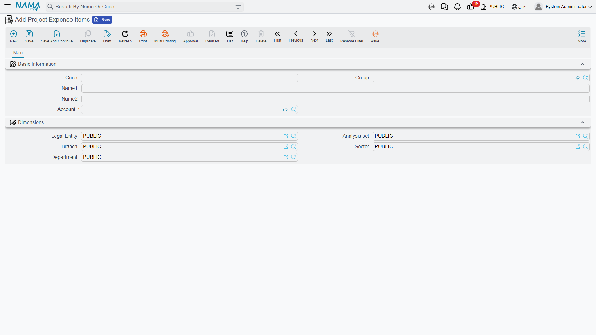
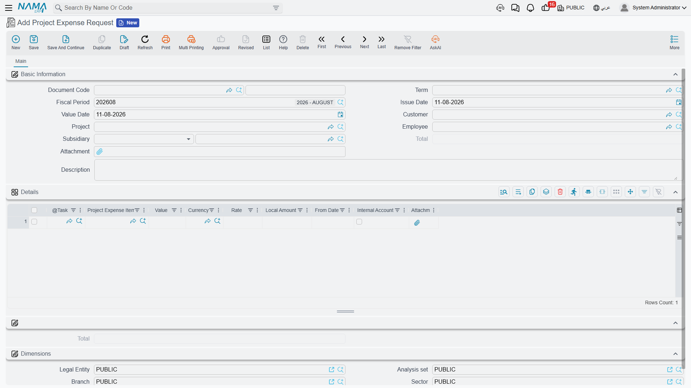
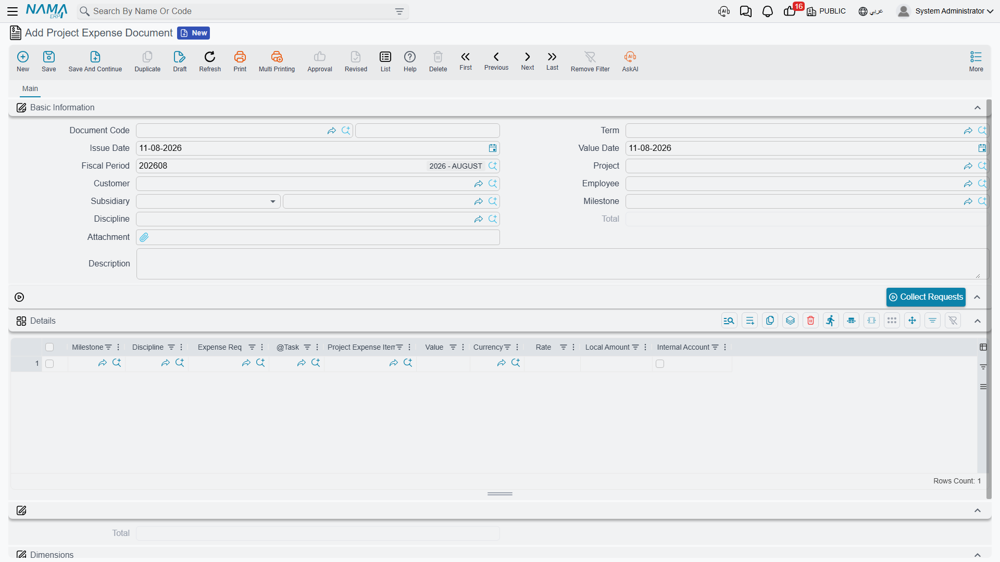

# Project Expenses

::: info Licence
All three screens on this page are gated on the `ecpa` licence code.
:::

A design office sells its people's time, but time is never the whole bill. Somebody takes a taxi
to the client's site, pays a municipality permit fee, prints a set of tender drawings, couriers a
signed contract back to the customer's office. Project Management (ECPA) handles that money with
three screens, all sitting together under **Expense** (المصــاريف) in the module's menu:

- **Project Expense Item** — the short catalogue of things that may be claimed, and the place
  where each one's expense account is decided.
- **Project Expense Request** — the claim itself: who spent what, on which task of which project.
- **Project Expense Document** — the accountant's record of a batch of accepted claims.

The word "Request" undersells the middle screen. A Project Expense Request is a full document: it
has a book, a term (توجيه), a commit, and an accounting effect of its own. It is also the record
the project invoice re-bills to the customer — the expense document plays no part in billing at
all. Keep that asymmetry in mind while you read; it explains most of what follows.

And one column on the claim — **Internal Account** (مصروف داخلى) — quietly decides both which
accounts the entry uses *and* whether the customer ever sees the amount. It has its own section
below, and it is the field to get right before anything else.

## The expense catalogue

**Project Expense Item** is a small master file: a code, an Arabic and an English name, an optional
group for sorting, the usual dimensions (محددات) — and one field that carries real weight, the
**Account**.

The account is **required**, and its lookup only offers detail accounts. That is not decoration.
When an expense line becomes an accounting entry, the account you put on the expense item is what
the term's **Line Subsidiary** source hands back. In other words, *the expense item is how a claim
line chooses its expense account*, and it is the only way it can. A firm that keeps one item called
"Travel" for every kind of spending will get one lump in the ledger; a firm that opens `EXP-TAXI`,
`EXP-PRINT`, `EXP-PERMIT` and `EXP-COURIER`, each pointing at its own detail account, gets an
expense breakdown for free.

So build this list with the chart of accounts open beside you. It is the shortest configuration
task in the module and the one with the longest reach.

## Raising a claim: the Project Expense Request

An employee opens **Project Expense Request**, names the project, and lists what was spent.

The header says who is claiming, and against what:

| Field | What it holds |
|---|---|
| Document Code (Book / Code) | The usual book and number |
| Term | The document term (توجيه) that decides which accounts the claim uses |
| Fiscal Period, Issue Date, Value Date | Standard document dating. The Value Date also stamps the date carried by every line |
| Project | The project being charged. Its lookup is narrowed by the customer if you filled one, otherwise to projects the employee is listed on |
| Customer | Filled in for you the moment you pick the project, and cleared again if you clear it |
| Employee | The person who spent the money |
| Subsidiary | The account party the claim is owed to — a supplier, a customer or an employee. This is what a term side set to *Document Subsidiary* will use, and it is normally the claiming employee |
| Total | Added up by the system from the lines |
| Attachment, Description | The receipt bundle and a free note |
| Dimensions | Legal entity (شركة), analysis set, branch, sector, department |

Each line of the **Details** grid is one thing bought:

| Column | What it holds |
|---|---|
| Task | The task being charged. The lookup only offers tasks of the header project whose status is In Progress or Not Started |
| Project Expense Item | Which catalogue entry — and therefore which account |
| Value, Currency, Rate, Local Amount | The amount claimed. A value is required and it may not be zero; the local amount is recalculated on every save |
| Internal Account | Whether the firm absorbs this line or re-bills it — see the next section |
| Attachment | The receipt for this one line |

Committing is deliberately permissive. The single rule that will stop you is an empty or zero
**Value** on a line: *"Please specify a value"*. Nothing else blocks the commit, so the discipline
about filling Project, Employee and Subsidiary properly has to come from your own procedure — the
accounting entry is only as good as those three fields.

If your site runs an approval definition over the document, the claim goes through the ordinary
approval cycle, and the approval case shows the approver the requested total and the expense items
being claimed before they decide.

## Internal Account — who ends up paying for it

This is the field a reader must not get wrong, because it is doing two jobs at once.

**Job one: which accounts the entry uses.** The expense term (توجيه) carries four account sides in
two pairs — an internal debit and credit pair, and an external debit and credit pair. When the
entry is built, the lines are split: lines with **Internal Account** ticked are processed with the
*internal* pair, lines with it unticked with the *external* pair. Both pairs are genuinely used, so
both must be configured on any term you intend to use for mixed claims.

**Job two: whether the customer is billed.** The project invoice's *Collect Expenses* button only
sweeps up claim lines where **Internal Account is unticked**. A ticked line is invisible to
invoicing; there is no later switch that re-exposes it.

Put the same amount through both settings and the difference is stark. Take one line of **500** for
travel, on task `TSK-0042-03` of project `PRJ-0042`, claimed by employee `EMP-7` (Sara), whose
employee account is the document's Subsidiary:

| | Internal Account **ticked** | Internal Account **unticked** |
|---|---|---|
| What it means | The firm absorbs the 500 | The firm expects the customer to pay the 500 |
| Accounts used | The term's **internal** debit and credit pair | The term's **external** debit and credit pair |
| A typical setup | Debit the travel expense account carried by the expense item; credit Sara's employee account | Debit a billable / work-in-progress account for the project; credit Sara's employee account |
| On the project invoice | Never appears — *Collect Expenses* skips it | Collected as a **500** line and billed to the customer |
| Net effect | 500 of cost, no revenue | 500 of cost, 500 of revenue |

::: warning The tick is the default — untick it deliberately
The moment you pick a project or a task on a line, **Internal Account is ticked for you** if it is
still empty. Left alone, every claim you enter is one the firm swallows. Anything you intend to
re-bill has to be unticked by hand, on every line, before the claim is committed.
:::

Because billing runs off the *request*, that decision is settled when the claim is committed, not
when the accountant records it. A committed, unticked line is invoiceable whether or not anyone ever
raises an expense document for it — see
[Project Invoice](/modules/ecpa/invoicing/ecpa-project-invoice) for the collecting end of that.

## Claims that raise themselves from a timesheet

Not every request is typed. A **Tasks Executing** line can carry an expense item and a value of its
own — the courier fee incurred during the same site visit whose hours are being recorded. When the
matching **TimeSheet Approval** is committed, the system creates a Project Expense Request for that
timesheet automatically, using the book and term named on the timesheet's own term (توجيه), and
copying each qualifying line's project, task, expense item, value **and its Internal Account
setting**. The generated request points back at the timesheet it came from, and cancelling the
approval deletes it again.

Only timesheet lines that actually name an expense item produce claim lines, and the generation
happens when the approval is committed, never on the timesheet itself. The mechanics are on
[Recording Worked Hours](/modules/ecpa/task-execution/ecpa-timesheets) and
[Approving Worked Hours](/modules/ecpa/task-execution/ecpa-timesheet-approval).

## Recording the claims: the Project Expense Document

Once the firm has decided to honour a batch of accepted claims — typically everything one employee
has outstanding on one project — the accountant raises a single **Project Expense Document**.

Its header is the request's header with two additions, **Milestone** and **Discipline**, which act
as defaults for the lines: any line left empty takes the header's values on save, so a document
raised for one phase of one discipline needs the pair typed once, on the header. The details grid is
the request's grid with the per-line date and attachment dropped, and three columns added —
Milestone, Discipline and **Expense Req**, which names the claim each line came from.

### Collect Requests

You do not type the lines. Fill the header **Employee** and **Project**, then press **Collect
Requests** (تجميع الطلبات). It searches every committed claim line that no expense document has
processed yet, narrowed by those two header fields, and writes one document line per hit carrying
the source request, the task, the expense item, the value and the Internal Account setting.

::: warning Collect Requests replaces the whole grid
The button does not append — it rebuilds the details grid from its search result, so anything
already in the grid is discarded. And with **Employee** and **Project** both empty it is not
narrowed at all: it will pull every unprocessed committed claim line in the database. Always fill
the header first.
:::

Two rules are enforced when the document is committed, and both are about consistency with the
header: a line's task must belong to the header **Project**, and that task must list the header
**Employee** among its executers. This is why one expense document covers one employee on one
project — treat that as the shape of the document rather than a limitation.

Committing also stamps every collected claim line as processed, so the next *Collect Requests* on
any document will not offer it again. Editing a committed document redoes that bookkeeping for you:
lines you removed become collectable again, lines you added are stamped, and the accounting entry
is re-issued as an update. Cancelling releases all of them.

## What a commit actually does

Neither document writes to the ledger inside the save. Committing raises a **business request**,
which is **processed** in the background against the accounts configured on the document's term
(توجيه) — the internal pair for ticked lines, the external pair for the rest. The document itself
comes back instantly.

Per entry line the system supplies the value and currency from the claim line, the expense item's
account where the term asks for the **Line Subsidiary**, the header Subsidiary where it asks for
the **Document Subsidiary**, and the header's Customer, Employee or Project where the term's
account or analysis-set source names one of those. The document's Description becomes the entry's
narration, and the document's dimensions travel with it.

If processing fails — a closed period, or an account missing on one of the four sides — the
document stays committed and the failure appears in the **Business Requests** list view. Filter it
by failed status, select the rows, and use **More → Reprocess** to run it again once the cause is
fixed. The account sides themselves are described on
[Document Terms for Project Documents](/modules/ecpa/invoicing/ecpa-document-terms).

## From claim to ledger: a worked example

Project `PRJ-0042` "Tower Fit-out Design" for customer `CUST-011`; employee `EMP-7` (Sara) is
working task `TSK-0042-03` "Site survey".

1. Sara raises request **`PER-000117`** with value date `2026-03-05`, project `PRJ-0042`, employee
   and subsidiary `EMP-7`, and two lines against `TSK-0042-03`:
   - expense item `EXP-TAXI`, **220**, Internal Account **unticked** — the taxi is being re-billed;
   - expense item `EXP-PRINT`, **80**, Internal Account **ticked** — the printing is on the firm.

   The header total shows **300**, and the approval case tells the approver exactly that: 300, for
   items `EXP-TAXI` and `EXP-PRINT`.
2. Committing `PER-000117` raises its accounting business request. The 80 is processed with the
   term's internal pair — typically debiting the printing account carried by `EXP-PRINT` and
   crediting Sara's employee account. The 220 is processed with the external pair, landing on
   whichever account the firm uses for spending it intends to recover.
3. The accountant opens a new expense document **`PED-000058`**, sets employee `EMP-7` and project
   `PRJ-0042`, and presses **Collect Requests**. Both lines arrive, each showing
   `Expense Req = PER-000117`; the total reads **300**.
4. Committing `PED-000058` marks both claim lines as processed — a second expense document will no
   longer see them — and raises its own accounting business request, again split 80 internal and
   220 external, this time according to the expense document's own term.
5. Later, the project invoice for `PRJ-0042` runs **Collect Expenses**. It picks up **only the
   220**: the 80 is internal and invisible to it. The 220 is billed to `CUST-011`, and the claim
   line is stamped so it can never be billed a second time.
6. The project's own **Total Project Cost** is unchanged by every step above. It still shows only
   approved timesheet hours × rate.

That last point surprises people, so it is worth stating on its own.

## Where the money goes next

**No payment is created, and none can be linked.** Neither the request nor the expense document
holds a remaining balance, an instalment plan or a payment reference, and nothing on the payments
side of the system can point back at either of them. Settlement is ordinary accounting: configure
the credit side of your term to credit the employee's — or the supplier's — subsidiary account, and
then clear that account with a normal Payment Voucher. Sara gets her 300 back through her employee
account, and the voucher that pays her simply will not carry a link to `PER-000117`.

Nor do these documents feed the project screen's cost figure. Expense claims reach the general
ledger and they reach the customer's invoice, but the **Total Project Cost** on the Managed Project
screen is labour cost only — the sum of task executer hours × rate. To see spending by project
including expenses you need an accounting report filtered on the project dimension, not an ECPA
screen. The whole map of which cost lands where is on
[Where Project Cost and Revenue Come From](/modules/ecpa/ecpa-costing-and-profitability).
