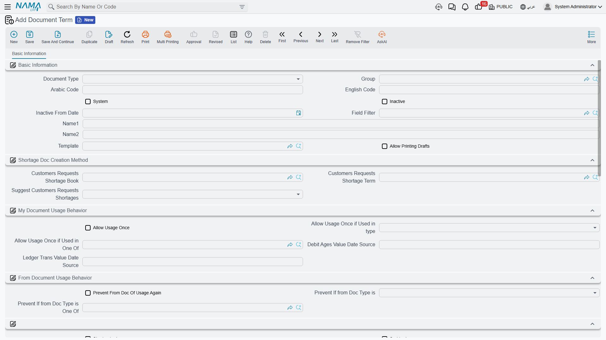

# Document Terms for Project Documents

::: info Licence
Every term described on this page belongs to a Project Management (ECPA) document type and needs the
`ecpa` licence code.
:::

A document in Nama knows *what* happened — 38 hours on a task, 1,500 of travel, a fee of 10,860. It
does not know *which accounts* that should touch. That is the job of the document term (توجيه): a
small configuration record, attached to a document book, that says "when a document of this type is
committed, debit this and credit that".

Project Management ships seven document types that carry a term, and they share five term definitions
between them — the invoice and the return use one definition, and Tasks Executing and Time Sheet
Request use another. This page is a guided tour of those five screens: what each one exists to do,
what it books, and which handful of options change how the module behaves. It is deliberately not a
field list — the invoice term alone renders roughly two hundred inputs, and nobody has ever been
helped by a table of two hundred rows.

## The seven documents, and the five terms

| Document | Term screen | What the term decides |
|---|---|---|
| [Project Invoice](/modules/ecpa/invoicing/ecpa-project-invoice) | Effect (التأثير) — the big one | Every account the billing entry touches, plus how the collect buttons behave |
| [Project Return](/modules/ecpa/invoicing/ecpa-project-returns) | The **same definition** as the invoice | The same, on its own separate term record |
| [Project Expense Document](/modules/ecpa/expenses/ecpa-project-expenses) | Effect — four account sides | Which accounts an expense booking uses, split by Internal Account |
| [Project Expense Request](/modules/ecpa/expenses/ecpa-project-expenses) | Effect — four account sides, same shape | The same, for the claim itself |
| [Tasks Executing](/modules/ecpa/task-execution/ecpa-timesheets) | Settings (الإعدادات) | The labour-cost entry, the generated expense request, and procedure creation |
| [Time Sheet Request](/modules/ecpa/task-execution/ecpa-timesheets) | The **same definition** as Tasks Executing | The same |
| [TimeSheet Approval](/modules/ecpa/task-execution/ecpa-timesheet-approval) | Settings — one option | Whether approved timesheets have their accounting effect re-issued |

The other Project Management documents — the sales quotation, the project stage and the stage
extension — have no term of their own, and none of them books anything to the general ledger.

## Where a term's own name lives

One structural fact catches everyone, so take it before anything else.

**Five of these term screens have no Basic Information page.** Open the term of a Project Invoice,
Project Return, Project Expense Document, Project Expense Request or TimeSheet Approval and you land
straight on the accounting page — there is no Code, no Name, no Inactive tick, no Template, no
printing options anywhere on the screen.

That does not mean the term has no code and no name. It means those are set from the **term list
view**, not from inside the record. Create the term from the list, name it there, and deactivate it
there when it is retired. Inside the screen you only ever configure accounts and behaviour.

The two timesheet terms — Tasks Executing / Time Sheet Request — are the exception: they *do* carry
the standard Basic Information group, so those two can be named and deactivated from the screen
itself.

## What an account side is

Almost every term screen in this module is built out of one repeating unit: the **account side**. A
side is a small form that answers a single question — *which account should this half of the entry
hit?* — and it is the same form everywhere it appears.

The essentials of a side are:

- **Side Configuration** — the accounting side record that gives the entry its shape.
- **Account Source Type** and **Account** — either a fixed account chosen here, or an instruction to
  read the account off a reference field.
- **Account Source Entity Type** and **Account Source Field ID** — used when the account is read off
  a reference.
- **Subsidiary Account Type** — which sub-ledger this side books against.
- **Bag Account Id** and **Account From Bag Currency** — for firms that keep accounts in a bag on
  the customer, project or employee.
- **Narration** and **Narration 2**, each as a template or as a query, which is what puts a readable
  description on the journal line.

If your Global Config has the dimension and reference sources for terms switched on, each side also
grows a source trio for every enabled dimension (sector, branch, department, analysis set, entity
dimension, ref 1–3). That is why the field count on these screens is not fixed and why the invoice
term appears to have far more inputs on one installation than on another.

Two rules apply to every side on every one of these screens:

1. **A pair with an empty half books nothing.** If either the debit or the credit side of a block is
   left unconfigured, that block silently produces no journal line. A term therefore books exactly
   what you configured it to book, no more and no less. This is the mechanism you use to switch
   whole entries off.
2. **The subsidiary sources available depend on the document.** The invoice and return offer the
   line's employee, the header customer and the line's project. The two expense terms offer
   employee, customer, project, the document subsidiary and the line subsidiary — and on those, the
   *line subsidiary* is the expense item's own account, which is what makes the expense item
   catalogue the real driver of how an expense is booked. The timesheet term offers the line's employee, that
   employee's department and the line's project, plus the document and line subsidiaries.

## The Project Invoice and Project Return term

This is the largest screen in the module and the one worth planning on paper first. It has a single
page, **Effect** (التأثير), and everything on it falls into one of three purposes: the accounts an
entry uses, how discounts and taxes are directed, and how the collect buttons behave.

### The accounts the invoice uses

Read down the page as a list of entries the document *may* produce. Each is a debit side and a
credit side, and each produces nothing until both halves are filled.

| Entry | Amount booked | When it is produced |
|---|---|---|
| **The main entry** | Each line's *Actual Value* | Always. Its two sides are required — the term cannot be saved without them. This is the receivable-versus-revenue entry. |
| **The external-expense entry** | The value of the external (billable) expense claim lines behind an invoice line | Only when *Create Accounting Effect For External Expense* is ticked, and only on lines that were built by a collect button — a hand-typed line has no claim lines behind it |
| **The header discount entry** | The discount typed on the document header | Only when both its sides are configured. Booked once, against the first line of the document |
| **The four tax entries** | Each line's tax 1, 2, 3 and 4 values | Each of the four line taxes has its own debit side and credit side on this screen |
| **The four line-discount entries** | Each line's discount 1, 2, 3 and 4 values | Configured differently — see below |
| **The calculated-value entry** | Each line's *Calculated Value* | Only for lines with no expense item, and only when both sides are configured. *Calculated Value* is rewritten from the invoice's Executions grid on every save, so this entry carries an amount on invoices built with *Collect Executions* |

The line-discount and calculated-value blocks are the odd ones out. Instead of a full account side
filled in place, each is a **reference to an Accounting Side Config master record** — one field, not
twelve. So before you can direct line discount 1 anywhere, somebody has to create that accounting
side config record; then you pick it here. Every other side on the screen is filled in place.

::: tip Plan the return term at the same time
The Project Return uses this same definition, on its own term record, and it books in the **same
direction** the invoice does. Configure the return's term as the mirror of the invoice's — debit and
credit swapped on every block you use — or the credit note will bill the customer again. See
[Project Return](/modules/ecpa/invoicing/ecpa-project-returns).
:::

### The options that change what is booked

Two ticks on this screen decide whether expense-bearing lines are booked once, twice, or through the
external entry only. They work as a pair, and the second does nothing unless the first is on:

| Create Accounting Effect For External Expense | Create Accounting Effect For Lines With Empty Expenses | What a committed invoice books |
|---|---|---|
| off | either | The main entry for every line. No external-expense entry. |
| **on** | off | The main entry for every line, **plus** an external-expense entry for the claim value behind each line. A line carrying an expense item is therefore booked twice — once at its billed value, once at its expense value. |
| **on** | **on** | Lines that carry an expense item are dropped from the main entry and appear only in the external-expense entry; lines with no expense item are booked normally. This is the combination most firms want. |

The middle row is the one to avoid unless you know why you want it. If your intent is "re-billed
expenses should hit the expense recovery accounts, and only fees should hit revenue", tick both.

### The options that change how collection behaves

The last two options on the screen do not touch the ledger at all. They change what the collect
buttons put into the grid when a user presses them, which makes them quietly powerful — and it also
means that changing them has no effect on any document that is already saved.

**Consider Value Date When Collecting Times And Expenses.** With this ticked, *Collect Times*,
*Collect Expenses* and *Collect Times And Expenses* only sweep up source lines dated on or before
the invoice's Value Date. Left unticked, the sweep ignores dates entirely and takes every unbilled
line in the project code range — including work dated after the invoice. This is the option that
makes month-end billing behave: with it on, an invoice dated 31 January cannot accidentally bill
February's timesheets. Most firms should tick it.

**Calculated Value Collection Method.** This governs the *Calculated Value* column, the informational
figure that sits beside the billed amount. Leave the option empty and Calculated Value simply repeats
the collected total, which tells you nothing. Fill it in — with either of its two values — and
Calculated Value is instead taken from a separate reading of the underlying timesheet cost for that
project and task, so the two columns deliberately show different numbers: what the work cost, beside
what you are charging for it.

The choice between the two values then decides which timesheet lines count:

| Value | Effect |
|---|---|
| **Collect Only Approved Values** | Only approved timesheet lines feed the calculated cost — and, on *Collect Executions*, only approved lines are pulled into the Executions grid at all |
| **Collect All Values** | Every timesheet line counts, approved or not |

For a firm that runs a real approval step, *Collect Only Approved Values* is the sensible setting; it
is also what keeps unapproved hours out of the Executions grid.

## The Project Expense Document and Project Expense Request terms

These two are the easiest screens in the module. Each has one page and **four account sides**, and
they have the same shape as each other:

| Side pair | Applies to |
|---|---|
| **Internal Debit / Internal Credit** | Claim lines with **Internal Account** ticked — costs the firm absorbs |
| **External Debit / External Credit** | Claim lines with **Internal Account** unticked — costs that will be re-billed to the client |

That is the whole screen. The single tick on the claim line chooses which pair is used, which is why
[Project Expenses](/modules/ecpa/expenses/ecpa-project-expenses) treats Internal Account as the field
to get right before anything else.

All four sides are read, and the term refuses to save unless both configured pairs carry accounts.
On both of these terms the *line subsidiary* source hands back the expense item's own account, so the
usual configuration is: expense account from the line subsidiary on one side, and the employee's or
supplier's payable account on the other.

## The Tasks Executing and Time Sheet Request term

One definition serves both documents, on a page titled **Settings** (الإعدادات). Unlike the terms
above it opens with the standard Basic Information group, so this term is named and deactivated on
its own screen.

The rest of it is one account pair and four settings:

- **Debit / Credit** — the labour-cost entry. Each committed timesheet line becomes one journal line
  valued at the line's Total Cost. A timesheet only produces an entry when **both** sides are
  configured; leave either empty and committing a timesheet books nothing. Typically the debit is a
  work-in-progress or labour cost account and the credit a salary accrual account.
- **Generation Book** and **Generation Term** — the book and term used for the **expense request
  that a timesheet generates** when its lines carry expense items. Fill these in if your firm lets
  engineers claim expenses on the same sheet they record hours on; leave them empty and there is
  nothing to generate into.
- **Procedures Group** — name a group here and every timesheet line carrying a next-procedure note
  creates a Procedure record in that group when the document is committed, carrying the employee,
  customer, project and task. Leave it empty and no procedures are created at all.
- **Create Accounting Effects For Approved Lines Only** — when ticked, only lines that have been
  approved are turned into journal lines. This is half of the "cost hits the ledger only after the
  manager signs off" arrangement; the other half is the approval term below.
- **Consider Registered Time With Save** — when ticked, the check that compares a task executer's
  hours against the planned hours also counts hours that are registered but not yet approved, so the
  warning arrives earlier.

## The TimeSheet Approval term

One page, one option: **Regenerate Accounting Effect For Time Sheet Documents**.

Small screen, real consequence. When a TimeSheet Approval is committed, it writes the approval
results back onto the timesheets it covers. With this option ticked, each affected timesheet then has
its accounting effect re-issued. That is what makes *Create Accounting Effects For Approved Lines
Only* on the timesheet term actually produce something: the timesheet was committed before approval
and booked nothing, and the approval is what sends the entry.

If you use approved-lines-only accounting, tick this. If you do not, leave it alone.

## Putting a set together

Take the engineering office used throughout this section: it bills fees, re-bills travel and
printing, runs an approval step on hours, and books labour cost to work in progress. A workable set
of terms looks like this.

**Invoice term** — main entry: debit the customer's receivable account, credit project fee revenue.
Tax 1 pair: debit tax receivable, credit VAT payable. Line-discount 1 pair: an accounting side config
pointing at discount allowed, against the customer. External-expense entry configured, with
*Create Accounting Effect For External Expense* and *Create Accounting Effect For Lines With Empty
Expenses* both ticked, so re-billed expenses land on the expense recovery account instead of
revenue. *Consider Value Date* ticked, *Calculated Value Collection Method* set to
**Collect Only Approved Values**.

**Return term** — the same screen, filled in as the mirror: debit sales returns, credit the
customer's receivable account, and the tax and discount pairs reversed the same way. Attached to the
return's own book.

**Expense request and expense document terms** — external pair: debit the expense account arriving
from the line subsidiary, credit the employee's payable account. Internal pair: debit an internal
overhead account, credit the same payable. Same configuration on both terms, so a claim books the
same way whether it is being requested or being settled by accounts.

**Timesheet term** — debit work in progress, credit salary accrual, *Create Accounting Effects For
Approved Lines Only* ticked, Generation Book and Generation Term pointing at the expense request
book the firm uses for claims raised on timesheets, and a Procedures Group named so that follow-up
notes become real records.

**Approval term** — *Regenerate Accounting Effect For Time Sheet Documents* ticked, so approved hours
reach the ledger the moment the manager commits.

Commit one document of each type on a test book before the module goes live, and read the resulting
journal entries. Every one of these screens books only what you configured, silently, so an entry
that never appears is far more likely to be a half-filled pair than a fault.
