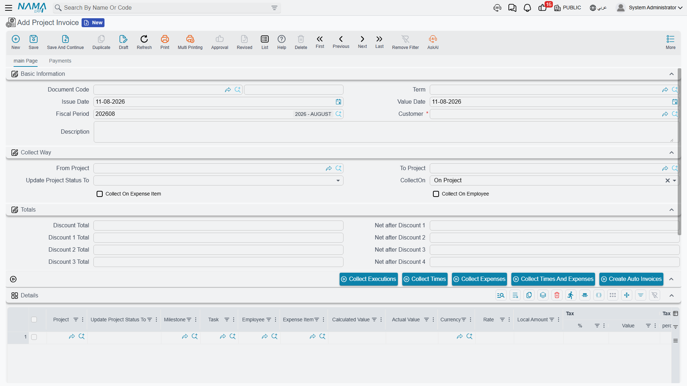
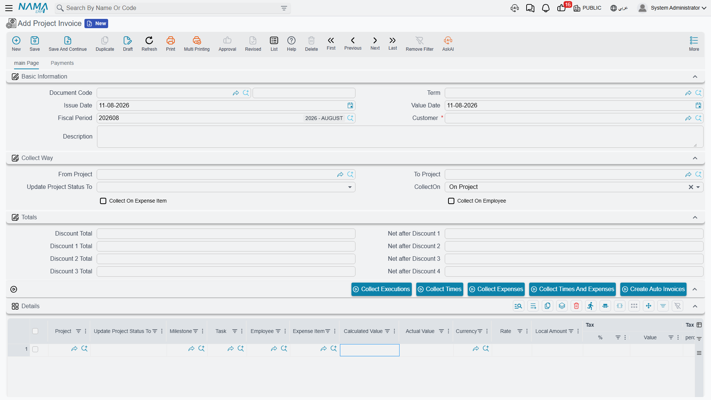
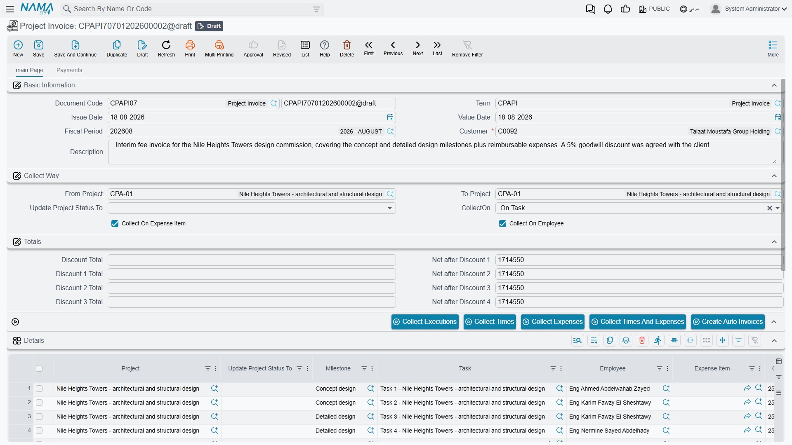

# Project Invoice

::: info Required licence
`ecpa` — one code for the whole module. There are no sub-licences.
:::

A Project Invoice is the bill a firm sends a client for work already done. It looks nothing like a
goods invoice: there are no items and no quantities. Each line is **one project** — or one task, or
one milestone — with a money amount against it.

That single amount is the whole subject of this page. Most of the time nobody types it: you press
one of the *collect* buttons and Nama sweeps up the approved hours and the billable expenses that
have not been billed yet, prices them, groups them the way you asked, and drops the result into the
grid. Understanding **which button reads which data, and how it turns that data into money**, is the
difference between an invoice that is right and an invoice that is quietly wrong.

You will find it under **Project Management → Invoice → Project Invoice**
(**ادارة المشاريع ← الفاتورة ← فاتورة المشروع**).



## Two columns of money, and only one of them is billed

Every invoice line carries two amounts, and the distinction runs through everything below:

- **Calculated Value** (القيمة المحسوبة) — what the system worked out. It is read-only on the grid;
  you cannot type into it. Every save recomputes it from the invoice's **Executions** grid, so it
  carries a figure on invoices built by *Collect Executions* and reads zero on invoices that have
  no executions behind them. Read it as information beside the billed amount, never as the bill.
- **Actual Value** (القيمة الفعلية) — **what is actually billed.** Every total on the document, every
  tax, every discount and every accounting entry is built from this number, and the invoice will not
  commit while any line has it at zero.



## How an amount gets onto a line

There are five ways an **Actual Value** can come into existence, plus one that creates whole invoices
rather than lines. The right way to read this section is as a choice: *how did you fill this
invoice?* — because that decides what the amount means and where it came from.

| How you filled it | Where the money comes from | Fills Actual Value? |
|---|---|---|
| Typed it yourself | you | yes |
| **Collect Times** | approved timesheet hours × the employee's rate on the task × Normal Time Rate | yes |
| **Collect Expenses** | the value on billable project expense request lines | yes |
| **Collect Times And Expenses** | both of the above in one sweep | yes |
| **Collect Executions** | the cost of the individual timesheet lines | **no** — it proposes, you price |
| **Create Auto Invoices** | the periodic-billing amount held on the project | yes, on new documents |

There is deliberately **no percentage-of-completion route and no milestone-value route**. A milestone
on an invoice line is a label and a grouping key; its own value is never read. Nor does the
quotation's payment schedule feed anything here — if you bill by instalment, you type the instalment
amount.

### Typing the amount yourself

Always available, and the default for anything the collect buttons cannot know about. Add a row, pick
a **Project** (the picker offers the header customer's projects that are not finished), optionally
narrow it with a **Milestone**, a **Task**, an **Employee** or an **Expense Item**, and type the
**Actual Value**. Nothing on the document prevents this, and nothing cross-checks it.

### Setting up a collection run

The four collect buttons all read the same group of header fields, called **Collect Way**. Fill them
in before you press anything:

| Field | What it does |
|---|---|
| **Customer** | required — the sweep only ever looks at this customer's work |
| **From Project** / **To Project** | a **range of project codes**, not line values. Everything the sweep finds must fall inside it. At least one of the two must be filled |
| **CollectOn** | how collected rows are bundled into invoice lines: **On Project** (the default), **On Task**, or **On Milestone** |
| **Collect On Expense Item** | additionally split the bundles by expense item |
| **Collect On Employee** | additionally split the bundles by employee |

If the Customer, the CollectOn, or both project fields are empty, the button stops and tells you
which one is missing. And on commit, if either project in the range belongs to a different customer
than the header, the document refuses with a message naming the project.

### Collect Times

Sweeps **approved timesheet lines** — the lines of committed
[Time Sheet Approval](/modules/ecpa/task-execution/ecpa-timesheet-approval) documents — that have
not already been taken by an invoice and whose project code falls in the range.

It prices them like this:

```
line value = the employee's hourly rate on that task's executors grid
           × the approved hours
           × Normal Time Rate (from the module settings)
```

Two consequences you will meet in practice. If the employee is **not on the task's executors grid**,
there is no rate to find and the line values at **zero**. And if **Normal Time Rate** is left empty
on the [settings screen](/modules/ecpa/ecpa-configuration), every collected time line also comes out
at zero — by far the most common reason an invoice collects rows but shows no money.

### Collect Expenses

Sweeps **project expense request lines** that have not already been taken by an invoice, whose
project code is in the range, and that come from a committed (non-draft) request. The amount is the
value typed on the expense request line — nothing re-prices it.

**Internal expenses are never collected.** A request line with *Internal Account* ticked is a cost
the firm carries; only external lines are billable. That single tick is the whole billing decision
for expenses, and it is explained in full on
[Project Expenses](/modules/ecpa/expenses/ecpa-project-expenses).

### Collect Times And Expenses

Both sweeps in one pass, into one set of lines. This is the button most firms actually use, because
approved labour and recharged expenses normally go on the same bill.

### How collected rows become invoice lines

Whichever of the three you press, the rows found are bundled and each bundle becomes one invoice
line, with **Actual Value set to the bundle's total**:

- with **CollectOn = On Project**, one line per project — the task and milestone columns are left
  empty because they no longer describe the whole line;
- with **On Task**, one line per task;
- with **On Milestone**, one line per milestone — task *and* project are cleared, since a milestone
  bundle is not about a single task;
- tick **Collect On Expense Item** and each bundle is split again per expense item; leave it unticked
  and the expense item column is cleared;
- tick **Collect On Employee** and each bundle is split again per employee.

Each line remembers exactly which source rows it swallowed. That memory is what stops the same work
being billed twice, and it is also what the term's expense-recharge option reads at commit time.

Line currency and rate come from the line's project — from the currency on the project's accounts
bag — and amounts are rounded to two decimal places. The header **Total Value** then sums the lines'
Actual Values.

### Collect Executions

A different route, and a different level of detail. Instead of approved, aggregated hours it reads
**individual timesheet lines** that have never been billed, and it values them at the line's own
**Total Cost** — the payroll-derived cost of that hour, not a selling rate.

It asks you for a date window, and takes the document's fiscal period as the window whenever the
document has one. Every matching timesheet line is copied into the **Executions** grid at the bottom
of the screen — which timesheet, which employee, which task, the hours and the cost of the hour — as
a read-only audit trail of what was picked up.



It then creates one invoice line per project and puts the summed cost of that project's executions
into **Calculated Value** — and leaves **Actual Value empty**. That is intentional: the button
proposes what the work cost, and you decide what to charge for it. Because a line with no Actual
Value cannot be committed, an invoice built only from *Collect Executions* is always finished by
hand.

## Work that has already been billed

Once an invoice has taken a source row, that row will not be collected again. The stamp is applied
when the invoice is **committed**, not when you press the button, and it is reversed if you
un-commit the document.

- **Collect Times / Expenses / Times And Expenses** mark the approved-time and expense-request lines
  they consumed as processed. Those lines disappear from every future sweep.
- **Collect Executions** stamps the timesheet lines with this invoice's reference.

::: warning Standardise on one collection route
The two families of guard do not see each other. *Collect Times* looks only at the processed flag on
approval lines; *Collect Executions* looks only at the invoice stamp on timesheet lines. The **same
worked hour** exists in both places — as a timesheet line, and again inside an approval line.

So a site that uses *Collect Executions* on one invoice and *Collect Times And Expenses* on another
will bill the same hours twice, and neither document will warn anybody. Decide which route your firm
bills by, and use only that one.
:::

There is a second thing to know about *Collect Executions*. When the invoice is committed, the stamp
is applied to **every line of the collected timesheet that shares the same project and task**,
including lines that fell outside your date window and were never billed. Those hours are then out of
the pool for good. If you bill by executions, collect on whole periods rather than partial ones.

## Discounts and taxes on a line

Each line supports four discounts and four taxes, and they are applied in a fixed order.

The four **discounts cascade** — each one comes off what is left after the one before:

```
after discount 1 = Actual Value − discount 1
after discount 2 = after discount 1 − discount 2
after discount 3 = after discount 2 − discount 3
after discount 4 = after discount 3 − discount 4
```

Each discount can be entered as a value or as a percentage of the running balance above it.

The four **taxes do not cascade**. All four are calculated on the same base — the amount left after
all four discounts — so tax 2 is never charged on tax 1:

```
tax n    = after discount 4 × tax percentage n
Net value = after discount 4 + tax 1 + tax 2 + tax 3 + tax 4
```

On top of the lines there is a single **header discount**, entered as a percentage or a value against
the document's Total Value. The header **Net value** is the sum of the lines' net values less that
header discount.

Working our example: a line of **10,860.00**, a 5 % first discount of **543.00** and 15 % tax 1:

```
after discount 1 = 10,860.00 − 543.00 = 10,317.00
tax 1            = 10,317.00 × 15 %   =  1,547.55
Net value        = 10,317.00 + 1,547.55 = 11,864.55
```

## Committing the invoice

Saving is instant. Committing raises a **business request** which is **processed in the background**
and produces the general-ledger entry, so the entry appears a moment later rather than at the instant
you press the button. If it fails, it is waiting for you in the **Business Requests** list view,
where you filter by status and use **More → Reprocess / Recommit**.

What gets booked, and to which accounts, is entirely a matter of the document term (توجيه) on the
document. The term is where you say which account the line amount is debited to and which it is
credited to, and it carries its own account pairs for each of the four taxes, each of the four line
discounts, the header discount, and the expense recharge described below. All of that is set up on
one screen, covered in
[Document Terms for Project Documents](/modules/ecpa/invoicing/ecpa-document-terms) — the invoice and
the [Project Return](/modules/ecpa/invoicing/ecpa-project-returns) share the same term screen.

Two things about the entry are worth knowing here rather than there. The amount booked for the line
itself is the **Actual Value** — not the net, not the calculated value. And every pair of accounts on
the term is optional: if one side of a pair is left empty, that part of the entry is simply not
produced. A term that only has the main debit and credit filled in books only the line amounts.

Before it will commit, the invoice checks exactly three things: the projects in the From/To range
belong to the header customer, and every line has a non-zero Actual Value. Nothing else is
validated.

::: info Nothing caps what you can bill
No part of the module compares an invoice against a contract value, a quotation, a milestone value or
what has already been billed. The agreed price on a quotation is never copied onto the project, and
no invoiced-to-date figure is written anywhere. A project quoted at 24,000 can be invoiced for
100,000, twice, and the document will commit cheerfully. The only guard in the system is the
line-level one described above, which stops the same *work* being collected twice — it does not cap
the *money*, and it does nothing at all for hand-typed lines.

If a firm needs a ceiling, it has to be built as a custom validation.
:::

## Term options that change what a collection does

Most of the term screen is about accounts. A handful of flat options on it change how the collect
buttons behave and what gets booked, and they belong in the same conversation as the buttons
themselves.

The first two below act **only at the moment you press a collect button**. Changing them has no
effect on a document that is already saved and none on what it books, so a term edit will never
correct an invoice that has already been collected — re-collect it instead.

**Calculated Value Collection Method** (طريقة تجميع القيمة المحسوبة) changes where *Calculated Value*
comes from. Leave it empty and a collected line's Calculated Value simply mirrors the amount that was
collected. Fill it in — with either **Collect All Values** or **Collect Only Approved Values** — and
Calculated Value is instead taken from the underlying timesheet lines' cost for that project and
task, so the two columns deliberately show different numbers: what the work cost beside what you are
charging. Choosing *Collect Only Approved Values* restricts that to approved timesheet lines, and it
does the same for *Collect Executions*, which otherwise pulls unapproved lines into the Executions
grid as well.

**Consider Value Date When Collecting Times And Expenses**
(الأخذ في الاعتبار التاريخ الفعلي عند تجميع الفواتير) is the option that makes month-end billing
behave. Ticked, the three sweeps only pick up source lines dated on or before the invoice's value
date. Unticked, dates are ignored entirely and an invoice dated 31 January will happily bill
February's work.

**Create Accounting Effect For external Expense** (إنشاء التأثير الحسابي للمصاريف الخارجية) switches
on a second accounting entry alongside the main one: the external (billable) portion of the expense
request lines that fed each invoice line, booked to the term's external account pair. Because it
works from the source rows a line remembers, it books nothing at all on hand-typed lines or on
periodic invoices — those have no source rows.

Its companion, **Create Accounting Effect For Lines With Empty Expenses**, only does anything when
that first option is also ticked. With both on, any line that carries an expense item is left out of
the main entry altogether and appears only in the expense entry; lines with no expense item are
booked normally. That combination is what most implementations want: revenue booked once, recharged
expenses booked separately.

Finally, the term's four **line-discount** account pairs and its **calculated value** pair are
configured differently from the rest of the screen: each is a pointer to an *Accounting Side Config*
record rather than an account you fill in place. Create those records first, then pick them here.

## Periodic and retainer billing

Firms that bill a fixed monthly amount rather than measured work do not collect anything. They put
the recurring amount on the project's own periodic-billing grid — see
[The Managed Project](/modules/ecpa/projects/ecpa-managed-project) — and then use the
**Create Auto Invoices** (إنشاء الفواتير الدورية) button on the invoice screen.

It is not a collect button: it does not touch the invoice you are looking at. You give it a value
date, and it works in the background across all projects that carry a periodic amount and are not
finished, checks which of them are due against their invoice period, groups the due ones **by
customer**, and creates **one draft invoice per customer** — one line per periodic-billing row, at
the amount on that row. The new documents are created on the **book and term of the screen you
pressed the button from**, so open the invoice screen on the right book first.

The amount is the fixed figure held on the project. Nothing about it is derived from hours,
expenses or progress.

## What the invoice writes back

Almost nothing, and it is better to know that up front.

The one exception is **Update Project Status To** (تحديث حالة المشروع إلى). Set it on the header and
it is copied onto every line when you save; on commit, each line that has both a project and a status
sets that project's status accordingly. It is how firms mark a project *Finished* at final billing
without opening the project.

Everything else stays where it is. No invoiced amount, no billed-to-date figure and no remaining
balance is written onto the project, its milestones or its stages. The revenue grid on a
[Project Stage](/modules/ecpa/projects/ecpa-project-stages) tracks sales invoices from the supply
chain, not these. If you need to know what a project has been billed, you report over the invoices
themselves.

## The worked example, end to end

The feasibility study quoted on the
[Project Sales Quotation](/modules/ecpa/projects/ecpa-sales-quotation) page has become project
**Q-000123** for customer **C-0012**, with tasks *Site Survey* and *Report Writing*. **Normal Time
Rate** is `1`.

During the month:

- timesheets are entered and approved — **38 hours** for Ahmed on Site Survey, **12 hours** for Sara
  on Site Survey, and **25 hours** for Ahmed on Report Writing;
- a project expense request records **Travel 1,500** with *Internal Account* unticked, and
  **Printing 300** with it ticked.

The user opens a Project Invoice, picks customer **C-0012**, sets both **From Project** and **To
Project** to `Q-000123`, leaves **CollectOn** at **On Project**, and presses **Collect Times And
Expenses**:

| Source | Hours | Rate | Value |
|---|---|---|---|
| Ahmed / Site Survey | 38 | 120 | 4,560.00 |
| Sara / Site Survey | 12 | 150 | 1,800.00 |
| Ahmed / Report Writing | 25 | 120 | 3,000.00 |
| Travel (external expense) | — | — | 1,500.00 |
| Printing (internal expense) | — | — | *not collected* |

Because the collection is On Project and neither extra split is ticked, all four billable sources
land in **one line** for project Q-000123, with **Actual Value 10,860.00**.

The user adds a 5 % first discount and 15 % tax 1, giving a line net of **11,864.55**, and commits.
The ledger request is processed in the background: the customer is debited **10,860.00** against the
revenue account, with the **1,547.55** of tax and the **543.00** of discount booked to their own
account pairs, exactly as the term is configured. The three approved-time rows and the Travel expense
line are stamped as billed, so next month's invoice starts from a clean slate.

If part of that bill later has to be given back, see
[Project Return](/modules/ecpa/invoicing/ecpa-project-returns).
