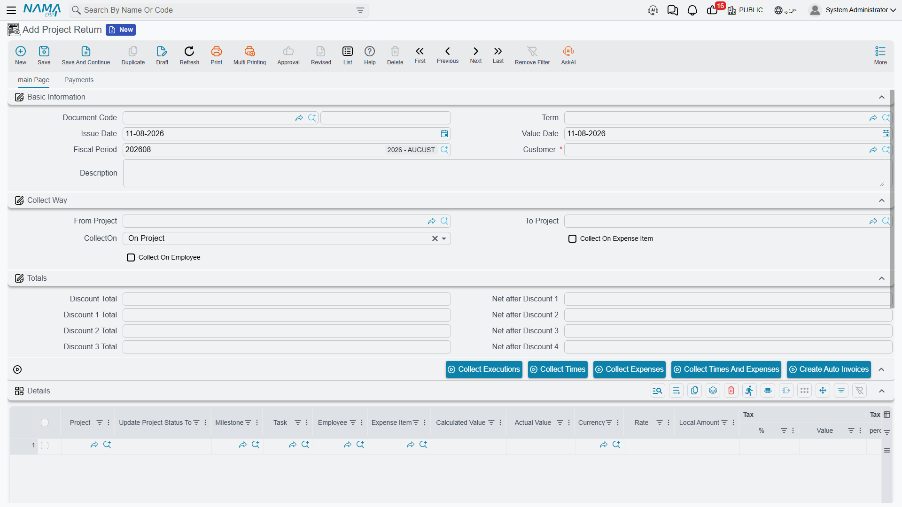

# Project Return

::: info Licence
The Project Return screen is part of Project Management (ECPA) and is gated on the `ecpa` licence
code.
:::

Sooner or later a design office bills something it should not have billed. The wrong project was
invoiced, a milestone went out twice, an engineer's hours were priced at the wrong rate, or the
client simply refused to pay for part of the work. The money has to go back, and the ledger has to
show that it went back.

**Project Return** (مردود فاتورة المشاريع) is that document. You will find it under **Invoice**
(الفاتورة) in the Project Management menu, immediately below
[Project Invoice](/modules/ecpa/invoicing/ecpa-project-invoice). It is a document like any other —
it has a book, a term (توجيه), a fiscal period, a commit, and an accounting effect that is produced
in the background as a business request.

Almost everything about it is the invoice. Same screen, same line structure, same four taxes, same
four cascading discounts, same collect buttons, same term definition class. What is *different*
about it is small in code and large in practice, and this page is mostly about those differences.

## A return stands entirely on its own

The most important structural fact first: **a Project Return is not attached to the invoice it
reverses.**

There is no "original invoice" field on the header, no *Create Return From Invoice* button on the
invoice screen, and no list anywhere that pairs an invoice with its returns. You open a blank
Project Return, choose the customer, and then decide for yourself what to give back. The only
things tying the two documents together are the customer, the project, and whatever you write in the
description.

That has one consequence worth stating plainly, because it surprises people who come from a sales
module: **nothing reconciles the return against what was actually billed.** The system never sums
the customer's invoices, never looks at the project's invoiced total, and never compares the two.
A user can return 100,000 against a project that was only ever invoiced 10,000, and can issue the
very same return twice, and neither the screen nor the commit will object.

If your firm needs a ceiling, that ceiling has to be built as a custom validation. Out of the box,
the discipline is procedural: quote the invoice code in the return's description, and let the
approval route on the return's book do the checking that the software does not.

## The screen is the invoice screen

The return's edit screen, list screen and search screen are built by the same code as the invoice's,
so if you know one you know the other.

The main page carries:

| Block | What it holds |
|---|---|
| Basic Information | Document Code (book + number), Term (توجيه), Issue Date, Value Date, Fiscal Period, **Customer**, Description |
| Collect Way (طريقة التجميع) | From Project and To Project — a project *code range*, not a line value — plus CollectOn (On Project / On Task / On Milestone) and the two extra grouping switches, Collect On Expense Item and Collect On Employee |
| The action buttons | Collect Times, Collect Expenses, Collect Times And Expenses, Collect Executions |
| Details grid (التفاصيل) | One row per amount being returned: project, milestone, task, employee, expense item, Calculated Value, **Actual Value**, currency and rate, the four tax pairs, the four discount steps, description, dimensions (محددات) |
| Executions grid (التنفيذات) | The read-only audit list of individual timesheet lines behind a *Collect Executions* sweep |
| Totals | Total Value, Total Taxes, the header discount, Net value |
| Dimensions | Legal Entity (شركة), Sector, Branch, Department, Analysis Set |

**Actual Value** is the number that matters on every line — it is what gets returned, what the taxes
and discounts are computed from, and what reaches the ledger. Calculated Value is informational and
cannot be typed. The discount and tax arithmetic is identical to the invoice's: the four discounts
cascade, and all four taxes are then levied on the same post-discount base. The
[Project Invoice page](/modules/ecpa/invoicing/ecpa-project-invoice) walks through that ladder in
detail and it is not repeated here.

## Building the lines

Most returns are typed by hand, and that is the intended way to use the document. You add a row,
pick the project, type the amount you are giving back, and set the tax percentages to match the
original invoice.

The four collect buttons are on the screen too, because the return shares the invoice's button set.
They behave exactly as they do on the invoice — and that is the thing to understand before you press
one. *Collect Times*, *Collect Expenses* and *Collect Times And Expenses* sweep up **approval and
expense lines that have never been billed**, and *Collect Executions* sweeps up **timesheet lines
that have never been billed**. They gather unbilled work, not billed work.

So pressing *Collect Times And Expenses* on a return will never find the hours you are trying to
credit — those hours are marked as billed already. What it *will* find is any work that has not been
invoiced yet, which is almost never what a credit note is for. Treat the collect buttons on this
screen as a way of pulling structured rows in when you happen to want them, and type the ordinary
credit note by hand.

## What committing a return does not do

This is the single most important behaviour on the page, and it catches out every site that has not
been told.

When a Project Invoice is committed, it stamps its sources: the Time Sheet Approval lines it billed
are flagged as processed, and the timesheet lines it billed are stamped with the invoice's
reference. That stamping is what stops the same hour being billed twice.

**Committing a Project Return does not clear those stamps.** The hours and expense lines that the
invoice took stay taken. Returned work is not released back into the billing pool, and no collect
button will ever pick it up again.

::: warning Returned work cannot be re-collected onto a new invoice
If you bill 40 hours, issue a return for those 40 hours, and then want to re-bill them correctly,
*Collect Times* and *Collect Executions* will both find nothing — those source lines are still
flagged as billed.
:::

There are two supported ways back, and it is worth choosing between them *before* you raise the
return:

1. **Un-commit the original invoice.** Cancelling an invoice reverses its accounting effect and
   un-stamps every source line it consumed, putting that work back in the pool. Correct the invoice,
   commit it again, and no return is needed at all. This is the right move when the invoice is
   simply wrong and the period is still open.
2. **Issue the return, and type the re-bill by hand.** Once the return exists you can raise a new
   invoice with a hand-typed line for the corrected amount. You lose the link to the underlying
   timesheet and expense rows, so the new invoice is a bare amount rather than a collected one — but
   the closed period stays closed.

In short: use a return when the money must genuinely go back to the client, and un-commit the
invoice when the billing was simply mis-assembled.

## The accounts a return uses

A Project Return books its entry through a document term, exactly as the invoice does, and it uses
**the same kind of term**: the Project Invoice and Project Return term screens are one and the same
definition, so every option means the same thing on both. See
[Document Terms for Project Documents](/modules/ecpa/invoicing/ecpa-document-terms) for what the
screen holds.

There is one thing about that arrangement you must know before you configure anything:

::: warning A return does not flip the sides for you
The return books in **the same direction** as the invoice. Its main entry debits whatever the term's
debit side resolves to and credits whatever the credit side resolves to — there is no automatic sign
inversion for a credit note.
:::

The consequence is a setup rule rather than a warning. The return needs **its own term record,
configured as the mirror of the invoice's**:

| | Invoice term | Return term |
|---|---|---|
| Main entry, debit side | Customer's receivable account | Sales returns / fee revenue |
| Main entry, credit side | Project fee revenue | Customer's receivable account |
| Tax 1 pair | Tax receivable / VAT payable | Reversed the same way |
| Discount pairs | Discount allowed / customer | Reversed the same way |

Copy the invoice term onto the return's book without swapping the sides and the return will debit
the customer a second time — a credit note that increases what the client owes. Nothing in the
product stops it. Build the mirror term once, attach it to the return's book, and check the first
committed return in the ledger before you let the module go live.

Like the invoice, the entry is packaged as a background business request, so the journal entry
appears a moment after the commit rather than inside it. If it fails, the row is waiting in the
**Business Requests** list view, where it can be retried from the More menu (Reprocess / Recommit).

## What the system checks before it commits

Very little, and knowing exactly how little is useful:

1. If **From Project** is filled, its customer must be the header customer.
2. If **To Project** is filled, its customer must be the header customer.
3. Every line must carry a non-zero **Actual Value**.

Beyond those three rules and the generic document checks (book, period, dimensions), the return
commits whatever you typed. There is no amount ceiling, no duplicate check and no reference back to
an invoice — which is exactly why the approval route on the return's book is worth configuring.

## A worked example

Take the invoice worked through on the [Project Invoice page](/modules/ecpa/invoicing/ecpa-project-invoice):
project `Q-000123` for customer `C-0012`, billed by *Collect Times And Expenses* as a single line of
**10,860.00**, less a 5 % discount and plus 15 % tax, for a net of **11,864.55**. Five source lines —
three blocks of approved hours and one billable travel expense — were stamped as billed when it
committed.

The client now disputes Sara's 12 hours on *Site Survey*, billed at 150 an hour, and the firm agrees
to credit them.

1. Open a new **Project Return**, choose the return's book (the one carrying the mirrored term) and
   customer `C-0012`.
2. Press *Collect Times And Expenses* out of curiosity and **nothing arrives** — all five source
   lines from the invoice are already flagged as billed. So add **one line by hand**: project
   `Q-000123`, *Actual Value* **1,800.00**, tax 1 = 15 %.
3. The line arithmetic runs on save: after-discount value 1,800.00, tax 1 = 270.00, line net
   **2,070.00**. The header shows *Total Value* 1,800.00 and *Net value* 2,070.00.
4. Commit. With the mirrored return term in place, the background business request produces:

   | Debit | Credit | Amount |
   |---|---|---|
   | Sales returns | Customer `C-0012` | 1,800.00 |
   | VAT payable | Tax receivable | 270.00 |

5. Sara's 12 hours stay flagged as billed. They are out of the billing pool for good unless someone
   un-commits the original invoice — which, with the return now committed, nobody should.

That last step is the one to walk a new user through. The return has done its job for the client and
for the ledger; it has not, and will not, put the work back on the shelf.
