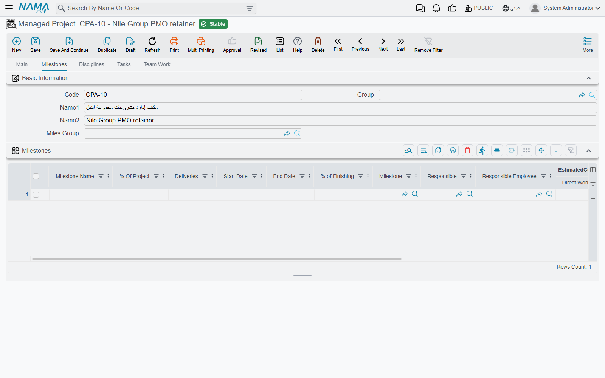
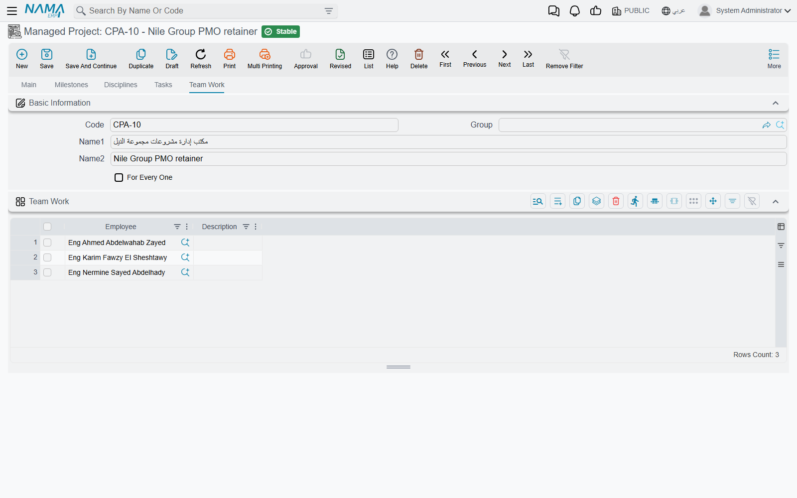

# The Managed Project

Everything in Project Management (ECPA) hangs off one record: the **Managed Project**. It is the engagement itself — one record per job the firm has taken on for one customer. It says who runs the job, what was contracted for and in which currency, when it is meant to start and finish, and how the work is broken down. Tasks, timesheets, expenses and invoices all point back at it, and the numbers they produce are reported here.

You will find it at **Project Management > Projects > Managed Project**, under licence `ecpa`.

Throughout this page we follow one job. *Nama Architects* has won the **Riyadh Clinic Fit-out** for customer `C-0042`: a six-month interior job worth **900,000**, run by Ahmed S., broken into three phases and two specialities.

## A master file, not a document

This is the first thing to understand, because it explains a lot of the screen's behaviour. A Managed Project is a **master file** in exactly the same sense a customer or an item is: it has a code, a group and two names, it has no book, no document term, no value date, and there is nothing to process. You open it, you edit it, you save it. There is no commit step and nothing is sent to the ledger from here.

That has two consequences worth stating plainly:

- **The project itself books nothing.** It appears in accounting only as something *other* documents point at — as a dimension on an invoice, and as the owner of a subsidiary account (see [Detail Accounts](#Detail-Accounts) below). Money reaches a project through tasks, expense documents and invoices, never through this screen. The [costing page](/modules/ecpa/ecpa-costing-and-profitability) maps that out in full.
- **The project's state is not a workflow.** It moves through a **Change Project Status** button, described further down, and the list of statuses is a list — not a sequence anything enforces.

## Page 1 — Main

### Basic Information

The identity block: **Code**, **Group**, **Name1** (the Arabic name) and **Name2** (the English name), the **Customer**, a free **description** line, and two reference fields that behave differently from everything else on the screen:

- **Sales Quotation** is greyed out. You never fill it in. It is stamped by the [project sales quotation](/modules/ecpa/projects/ecpa-sales-quotation) when its *Create Project And Tasks* button builds the project — which is the module's real "new project" route for firms that quote before they start.
- **copy from** is the opposite: pick another project here and this one is prefilled from it. It is covered under the action family below, because it carries more than you might expect.

Our example starts with code `PRJ-0007`, Name1 *تشطيب عيادة الرياض*, customer `C-0042`.

### Project Details

This block is the contract in fields. It is shared with the quotation and the [project template](/modules/ecpa/projects/ecpa-project-templates), so it will look familiar if you have met those screens.

| Field | What it is for |
|---|---|
| **Project Class** | a classification label for filtering and reporting |
| **Project Type** / **Proj Sub Type** | the work vocabulary — the sub-type lookup is narrowed by the type you chose. See [project setup](/modules/ecpa/projects/ecpa-project-setup) |
| **Manager** / **Vice Manager** | the two employees who own the job. They matter beyond reporting: they decide whose timesheets a manager can collect for approval, and they are always included in the project's team |
| **From Date** / **To Date** (editable pair) | the planned window |
| **Planned Project Time** | a number plus a unit, defaulting to months, and **required** |
| **From Date** / **To Date** (greyed pair) | the actual window. These are filled in by the system, never typed |
| **Responsible Employee**, **Responsible**, **Mediator** | the day-to-day owner, an outside responsible party, and the agent or intermediary who brought the work |
| **Contract Total Cost**, **Currency**, **Rate** | the contracted value in the deal's currency, and the rate to convert it |
| **Contract Local Cost** | the contracted value in the local currency — recomputed on every save as *Contract Total Cost × Rate*, so treat it as a result rather than an input |
| **Estimated Cost** | your own estimate of what the job will cost to deliver. It is informational: nothing compares it to what is actually spent |

The planned window is self-balancing, which saves a lot of arithmetic. Type the **From Date** and a **Planned Project Time**, and the **To Date** fills itself in; type a **To Date** instead and the **From Date** is worked back from it; change the duration or its unit and the end date moves.

For the Riyadh clinic: type *Interior*, manager *Ahmed S.*, planned from **01-03-2026**, planned project time **6 Month** — and the planned to-date arrives on its own as **01-09-2026**. Contract total **900,000**, currency **SAR**, rate **1**, so on save the contract local cost reads **900,000** too.

::: info The two date pairs
The planned dates and the actual dates carry the same English labels, and the actual pair sits directly under the planned one. The reliable way to tell them apart is that **the actual pair is greyed out** — the system writes it from the project's tasks: the earliest task start, and, once the completion figure reaches 100 %, the latest task end.
:::

### Recurring invoicing

Not every engagement is billed against work done. A retainer, a maintenance agreement or a fixed monthly fee is the same charge issued again and again, and the **Auto Invoice** block is where a project describes that arrangement once.

**Auto Invoice Period** sets the rhythm — a number and a unit, arriving as *1 Month* on a new project. It must be at least a day.

The **Auto Invoice** grid below the classifications is where the charge itself is written. One row per recurring line:

| Column | What it holds |
|---|---|
| **Value** | the amount to bill each period |
| **Description** | the wording that will appear on the invoice line |
| **Sector**, **Branch**, **Department**, **Analysis Set** | the dimensions the invoice line should carry |

Use several rows when the retainer is billed as several lines — a fee line and a disbursements line, say — and the invoice will be built with the same breakdown.

The header **Auto Invoice Value** is not something you type. It is maintained by the system: on every save it is set to the total of the grid. Fill the grid and it reports that total back to you as a check; leave the grid empty and it reads zero, which is the system's way of saying this project has no recurring charge to raise.

The invoices themselves are not produced here. On the [project invoice](/modules/ecpa/invoicing/ecpa-project-invoice) screen, **Create Auto Invoices** reads these lines and copies each one into an invoice line at its value — so the project holds the standing instruction, and the invoice screen carries it out when the period comes round.

For the Riyadh clinic the practice bills a monthly design fee: period **1 Month**, one grid line of **150,000**. On save the header *Auto Invoice Value* reads **150,000**, and each month's invoice is raised from that single line.

### Project Classes

**project Class 2** through **project Class 8** are seven more classification references. They exist so a firm can slice its portfolio however it likes — by funding source, by region, by partner — and they are used for filtering and reporting only.

### The details matrix

Below the classes sits the **Details** grid: the milestone × discipline matrix, where the estimated hours and cost of every speciality in every phase are laid out. It is the hardest idea in the module and it has [its own page](/modules/ecpa/projects/ecpa-milestones-and-matrix), which walks a full 4 × 3 grid. The short version you need while reading this screen:

- you type only three things per row — the **Milestone**, the **Discipline**, and the **Discipline Percentage On Milestones** that says how much of that speciality's work falls in that phase;
- every cost column on the row is **recalculated on save** from the Disciplines page and that percentage, so anything typed into them is replaced;
- both references must already exist on the Milestones and Disciplines pages, or the save is refused.

Three buttons sit above the grid — *Copy Milestones To Details*, *Copy Disciplines To Details* and *Create Matrix From Disciplines And Milestones*.

::: warning These three buttons overwrite the grid
Each of them **replaces** the whole Details grid rather than adding to it. Any discipline percentages you have already typed are gone. Build the Milestones and Disciplines pages first, press the button once, then do your typing.
:::

### Project Status

Five read-only numbers, and a rule about them that catches everybody out. They are described under [Where the numbers come from](#Where-the-numbers-come-from) below.

### Detail Accounts

A **Main Account** plus five numbered accounts. This is what lets a project act as a **subsidiary account**: create accounts of type Subsidiary whose subsidiary type is the project, put them here, and every document that costs or bills this project can land on the project's own accounts. Where a project is created from a quotation and the quotation carries no accounts of its own, these Subsidiary Accounts are taken from the [template](/modules/ecpa/projects/ecpa-project-templates) instead.

### Dimensions

Legal entity, sector, branch, department and analysis set — the ordinary Nama dimensions, carried by everything the project touches.

## Page 2 — Milestones

Milestones are the phases the firm plans and bills against: concept, detailed design, site supervision. This page is where a project's phases are listed, and it is more than a list — **it is a generator**.

Each row carries a **Milestone Name**, a **% Of Project** weight, planned **Start Date** and **End Date**, a free-text **Deliveries** note, a responsible employee, a **% of Finishing** figure, and a set of estimated-cost columns. When you save the project, every row that does not yet point at an existing milestone **creates a real Project Milestone master record**, filed under the master group you named in **Miles Group** and coded from the project's code plus the row's position when that group has no coding formula of its own. Remove a row and its generated milestone is removed with it.

For the Riyadh clinic, group `MG-MILES` and three rows:

| Milestone name | % of project | Start | End |
|---|---|---|---|
| Concept | 20 | 01-03-2026 | 01-04-2026 |
| Detailed design | 50 | 01-04-2026 | 01-07-2026 |
| Site supervision | 30 | 01-07-2026 | 01-09-2026 |

On save, three milestone records appear as `PRJ-00070`, `PRJ-00071` and `PRJ-00072`. Those records are what the rest of the module picks up: a task is assigned to a milestone, an invoice line bills one, a [project stage](/modules/ecpa/projects/ecpa-project-stages) schedules them.

Two things about this grid are worth knowing before you type into it:

- **The estimated-cost columns are results, not inputs.** For any milestone that appears in the Details matrix, they are rewritten on save from the matrix rows that belong to it. The place to enter a budget is the Disciplines page.
- **% of Finishing is yours to maintain.** Nothing calculates it. It stays at whatever a human last typed, and it is the figure a milestone-by-milestone progress report reads.

The percentages have one rule the system does enforce: for each milestone, the matrix rows underneath it may not add up to more than that milestone's own **% Of Project**. That is the validation support is asked about most, and it is walked through with numbers on the [matrix page](/modules/ecpa/projects/ecpa-milestones-and-matrix).

## Page 3 — Disciplines

The specialities the job needs — architecture, structure, MEP — one row each, with the **% Project** weight and the estimated cost of that speciality across the whole job: **Direct Work Hours**, **Avg Cost of Hour**, **Indirect Costs**. On save the system multiplies the first two into a direct cost and adds the indirect to reach a total.

This page is the budget's real input. The matrix on the Main page does nothing but distribute these numbers across the phases.

For the clinic:

| Discipline | % of project | Direct hours | Avg cost/hour | Indirect |
|---|---|---|---|---|
| Architecture | 60 | 1,200 | 90 | 20,000 |
| MEP | 40 | 800 | 110 | 12,000 |

which saves as **108,000 + 20,000 = 128,000** for architecture and **88,000 + 12,000 = 100,000** for MEP.

None of it is enforced anywhere. There is no budget check in this module: these figures inform the people reading the screen, and nothing stops a project spending five times them.

## Page 4 — Tasks

A read-only list of every [task](/modules/ecpa/tasks/ecpa-tasks) that points at this project. You cannot create a task from here — this is a window, not a grid — but it is the quickest way to see the whole work breakdown of a job and open any part of it.

## Page 5 — Team Work

The roster of who is allowed to work on this project.

Add one row per employee, with an optional note. On save the project quietly keeps a list of everyone entitled to book time to it: the manager, the vice manager, and every employee on this grid. That list is what the [timesheet](/modules/ecpa/task-execution/ecpa-timesheets) screen matches against — an employee who is not on it will not find the project or its tasks in the picker. Tick **For Every One** when the job is open to the whole firm and you do not want to maintain the roster.

For the clinic we add *Sara M.* and *Khalid R.*, which together with Ahmed S. makes the four people whose timesheets this project will accept.

## The status list

A project carries one of these:

| Status | Meaning in practice |
|---|---|
| **Initial** | a project registered but not yet acknowledged as work |
| **Not Started** | what a new project gets automatically |
| **In Progress** | work has begun |
| **Customer Approval** | waiting on the client |
| **On Hold** | paused |
| **Finished** | delivered |
| **Cancelled** | abandoned |

The status is displayed read-only in the Project Status group and changed with the **Change Project Status** button at the top of the Main page. Pressing it asks which status you want — *Not Started*, *In Progress*, *Finished*, *On Hold* or *Customer Approval* — and the answer takes effect when you save.

Three other things move it without anyone pressing the button:

- creating the project from an **accepted sales quotation** sets it to *In Progress*;
- the **first timesheet** booked against a project that is still *Not Started* moves it to *In Progress*;
- an **invoice line** can carry an *Update Project Status To* value, which is applied to the project when the invoice is processed.

::: info It is a list, not a workflow
Nothing validates the order of the moves. A project can go from *Finished* back to *Not Started*, or from *Not Started* straight to *Finished*, and no rule, permission or warning stands in the way. Treat the status as a label your organisation agrees to maintain, not as a control.
:::

## Where the numbers come from

The **Project Status** group holds five figures that nobody types:

| Field | What it is |
|---|---|
| **Total Project Cost** | the sum of the actual cost of the project's tasks |
| **Total Planned Time** | the sum of their planned hours |
| **Total Actual Time** | the sum of their approved actual hours |
| **Current Finished Percentage** | Total Actual Time ÷ Total Planned Time × 100, to two decimals |
| **Project Status** | the status described above |

Two facts about these five decide how you read the screen.

**They refresh when a task is saved, not when the project is saved.** Open a project, change something, save it, and these numbers do not move — they are recalculated by the *task*, as part of saving it. If you are looking at a project whose figures seem stale, the fix is to open one of its tasks and save it; the totals are rebuilt from all of that project's tasks in the process. The same recalculation runs when a [timesheet approval](/modules/ecpa/task-execution/ecpa-timesheet-approval) is committed, which is how approved hours find their way here in normal operation.

**Total Project Cost is labour only.** It is task executors' hours valued at their rates, and nothing else — expenses, purchases, stock and fixed assets never reach it, however they were recorded against the project. If you need cost against revenue, read the [costing and profitability page](/modules/ecpa/ecpa-costing-and-profitability), which is honest about which screen shows what.

::: tip The only percentage the system calculates
**Current Finished Percentage is the module's one computed progress figure, and it measures hours, not delivery.** A job that has burned all its planned hours reads 100 % whether or not anything has been handed over. Every other percentage on the project — the milestone *% of Finishing*, the discipline *% OF Finished*, the matrix rows' *Finished Percentage* — is typed in by hand, and stays exactly as typed.
:::

By the time two tasks on the Riyadh clinic have been worked and their hours approved — 400 hours planned, 260 actual, 31,000 of actual cost — saving the second task writes **Total Project Cost 31,000**, **Total Planned Time 400**, **Total Actual Time 260** and **Current Finished Percentage 65.00 %**, and stamps the actual start date from the earliest task. The milestone *% of Finishing* columns still read zero, because nobody has typed into them.

## The action family

Besides the three matrix buttons already covered, the project screen carries a small family of actions for reusing work.

**Repeat Project** duplicates the project for a new engagement. It asks for a customer range (*From Customer* / *To Customer* by code), a **Start Date**, whether to copy tasks and their executors, and how much of the milestone list to bring along; the edit-screen version also lets you give the copy a name. Each copy is re-dated: the planned window starts on the date you answered and keeps the original's length, and the milestone rows shift with it so the phases stay in proportion.

::: warning Always fill in the customer range
The action duplicates the selected project **once for every customer in the From/To range**. Leave that range empty and it will produce one copy for every customer in the database. Name the single customer in both fields when you want a single copy.
:::

**Repeat Miles** does not create a project. It appends copies of the milestone rows to the project you are already on, and can bring the last milestone's tasks onto the new one — the tool for a job that repeats the same phase, such as a retainer that runs another survey cycle each quarter. It needs at least two milestone rows to work with.

**copy from**, on the Basic Information group, prefills a new project from an existing one: the header, project details, accounts, currency and rate, the phases-discipline group, and all four grids — disciplines, milestones and the details matrix. The copied milestone rows arrive unlinked, so saving the new project generates its own milestone records rather than sharing the source's.

::: warning A copied project inherits the original's progress
*copy from* also carries the source project's **Total Project Cost**, **Current Finished Percentage**, planned and actual time and its **status**. A brand-new project can therefore open showing another job's numbers. They correct themselves the first time one of the new project's own tasks is saved; until then, do not read them.
:::

**Generate Invoice**, in the *More* menu, opens a new [project invoice](/modules/ecpa/invoicing/ecpa-project-invoice) already carrying the project's customer and pointing at this project on both sides, so the collect buttons on the invoice know what to sweep. The project must be saved first.

## Setting a whole breakdown up in one step

The Main page carries a **Phases Discipline Group** field, and it is the fastest way to start a project that follows a house standard. Choosing a group **wipes and regenerates the Milestones, Disciplines and Details grids** from that group's lines — so pick it before you type anything, not after. Groups are built once for the firm and reused; the [milestones and matrix page](/modules/ecpa/projects/ecpa-milestones-and-matrix) explains how to design one.

## What else points at a project

Once a project exists, most of the module refers to it:

- [tasks](/modules/ecpa/tasks/ecpa-tasks) are created against it and push their cost and hours back;
- [timesheets](/modules/ecpa/task-execution/ecpa-timesheets) book hours to those tasks;
- [expense requests and expense documents](/modules/ecpa/expenses/ecpa-project-expenses) record what the job spends;
- [project invoices](/modules/ecpa/invoicing/ecpa-project-invoice) bill it;
- [procedures](/modules/ecpa/projects/ecpa-procedures) log the follow-ups agreed on it.
