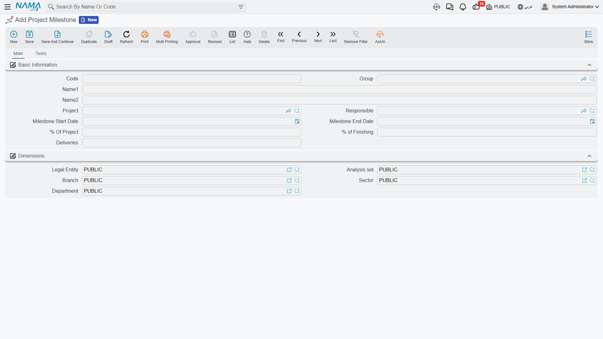
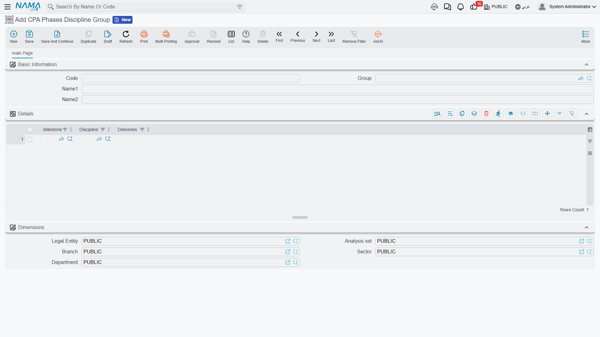
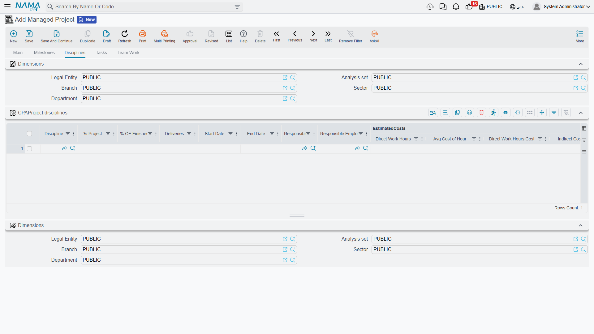

# Milestones and the Phase–Discipline Matrix

::: info Required licence
`ecpa` — one code for the whole module. There are no sub-licences.
:::

An engineering office never sells "a villa". It sells a **concept design**, then a **schematic
design**, then a **detailed design**, then a set of **tender documents** — and it invoices as each
one is delivered. Nor does it staff "a villa": the work is done by an architectural team, a
structural team and an electrical team, each of which does a slice of every phase.

So the work of a project is cut two ways at once — by **phase** and by **discipline** — and the real
unit of planning is neither of them on its own. It is the cell where they meet: *the structural work
of the detailed design phase*. Project Management (ECPA) calls those cells the **Details** grid of
the project, and this page is about how you get them there and what the numbers in them mean.

We will build one concrete example and carry it all the way through: project `P-2026-014`,
**Villa 27, Al Nakheel**, with **four milestones and three disciplines — twelve work packages**.

::: info Milestone and Project Stage are two different things
This page is about the **Project Milestone** (مرحلة) — a phase name belonging to one project. The
module also has a **Project Stage** (مرحلة مشروع), which is a committed schedule-and-cost document
that references milestones on its lines. The Arabic labels are nearly identical, so always say which
one you mean. Project Stages have [their own page](/modules/ecpa/projects/ecpa-project-stages).
:::

## Part 1 — Milestones, the phases you bill against

A **milestone** is one phase of one project, held as a record in its own right so that other things
can point at it: tasks are grouped under milestones, project invoice lines can be raised against a
milestone, and project stage documents and their extensions build their date chains from milestones.

You will find the file at **Project Management → Projects → Project Milestone**
(**ادارة المشاريع ← مشاريع ← مرحلة**), and it holds the project it belongs to, a responsible
employee, a start and an end date, its **% Of Project** and its **% of Finishing**.



::: tip Read the milestone file, do not type into it
You normally never create a milestone here. Milestones are generated from the project's own
**Milestones** page: each line of that grid becomes a milestone record when the project is saved,
lines you delete take their milestone record with them, and deleting the project removes them all.
Creating one by hand produces a record the project's grid knows nothing about.
:::

### The project's Milestones page

Open project `P-2026-014` and go to its **Milestones** page. Each row names a phase and says how big
a share of the whole project it is:

| Milestone Name | % Of Project |
|---|---|
| Concept | 10 |
| Schematic | 20 |
| Detailed Design | 55 |
| Tender Documents | 15 |

The row also carries start and end dates, a responsible employee, a **% of Finishing** which you
type yourself as the phase progresses, and a set of estimated-cost columns we will come back to in
Part 3 — those are filled in for you, not typed.

Above the grid sits **Miles Group**, the coding group used to number the milestone records this page
generates. Set it once and the generated milestones get tidy codes; leave it and they are coded from
the project's own code plus the line number.


## Part 2 — The Phases Discipline Group, a reusable template

A firm that designs villas does it the same way every time. Re-typing the same phase-and-discipline
breakdown on every new project is exactly the sort of work an ERP should remove, and the
**Phases Discipline Group** (**ادارة المشاريع ← مشاريع ← مجموعة المراحل والتخصصات**) is what removes
it.

The thing to understand about this file — and it surprises almost everyone — is that **it is not a
two-dimensional grid**. It is a header and one flat list, and each line of that list is a single
**(milestone, discipline) pair**. The matrix is implied by *which pairs you chose to create*; the
combinations you leave out are the ones that discipline does not work on in that phase.

Nakheel Engineering records one group, `PDG-VILLA` "Villa design breakdown", with twelve lines:

| Milestone | Discipline |
|---|---|
| Concept | Architectural |
| Concept | Structural |
| Concept | Electrical |
| Schematic | Architectural |
| Schematic | Structural |
| Schematic | Electrical |
| Detailed Design | Architectural |
| Detailed Design | Structural |
| Detailed Design | Electrical |
| Tender Documents | Architectural |
| Tender Documents | Structural |
| Tender Documents | Electrical |

Twelve lines, twelve work packages. A second group for interior fit-out work might have only seven
lines, because structural is not involved in the early phases — and that is the whole point of a
hand-built template: it captures the shape of a job, including the gaps.

There are no percentages, no hours and no costs anywhere on this file. It carries **names only**.
Every number is entered per project, because every project is worth a different amount.



### What happens when you pick a group on a project

On the project's Main page there is a **Phases Discipline Group** field sitting just above the
matrix. Choose `PDG-VILLA` and Nama fills **three** grids at once, from that one list of twelve
pairs:

| Grid | What it receives |
|---|---|
| **Details** (the matrix, on the Main page) | one row per group line — twelve rows, each with its milestone and discipline already set |
| **Milestones** page | one row per *distinct* milestone in the group — four rows: Concept, Schematic, Detailed Design, Tender Documents |
| **Disciplines** page | one row per *distinct* discipline in the group — three rows: Architectural, Structural, Electrical |

Everything else on those rows — the percentages, hours, costs, dates and responsibles — is left
blank for you to fill in. The template gives you the skeleton; the numbers are yours.

::: warning Choosing a group replaces the three grids
The three grids are **replaced**, not added to. If you have already typed milestone percentages,
discipline hours or matrix percentages and you then pick a group, that work is gone. Pick the group
first, on a fresh project, and fill in the numbers afterwards.
:::

## Part 3 — The project's own grids are the real matrix

The template got twelve empty cells onto the project. Now they have to be given money, and this is
where the module's one genuinely clever mechanism lives: **you cost a project by discipline, and
Nama distributes that cost across the phases.**

### The Disciplines page is the input

Go to the project's **Disciplines** page. Each discipline gets a share of the project and an
estimate of what it will take:

| Discipline | % Project | Direct Work Hours | Avg Cost of Hour | Indirect Costs |
|---|---|---|---|---|
| Architectural | 50 | 800 | 60 | 12 000 |
| Structural | 30 | 400 | 65 | 6 000 |
| Electrical | 20 | 200 | 55 | 3 000 |

Two columns on this grid fill themselves in as soon as you save: **Direct Work Hours Cost** is hours
× average cost of hour, and **Total** adds the indirect costs on top.

| Discipline | Direct Work Hours Cost | Total |
|---|---|---|
| Architectural | 800 × 60 = 48 000 | 60 000 |
| Structural | 400 × 65 = 26 000 | 32 000 |
| Electrical | 200 × 55 = 11 000 | 14 000 |
| **Project** | **85 000** | **106 000** |

So Villa 27 is estimated at 1 400 hours and 106 000 of cost — and not one of those numbers has been
attached to a phase yet.



### The matrix distributes it

Now open the **Details** grid on the project's Main page. On each of the twelve rows you type exactly
**one** number: **Discipline Percentage On Milestones** — *what share of this discipline's own work
falls in this phase*.

Read that definition twice, because it is the one thing people get wrong. It is not the share of the
phase, and it is not the share of the project. It is the share of **that discipline's** work. The
architectural team's percentages must therefore add up across the four phases to 100, and so must
the structural team's and the electrical team's — each column of the matrix sums to 100 on its own.

Nakheel Engineering knows its own trades well enough to spread them differently:

| Discipline | Concept | Schematic | Detailed Design | Tender Documents |
|---|---|---|---|---|
| Architectural | 8 % | 18 % | 60 % | 14 % |
| Structural | 10 % | 20 % | 50 % | 20 % |
| Electrical | 15 % | 25 % | 50 % | 10 % |

The architects do most of their work in detailed design; the electrical team is busier early, when
loads and routes are being agreed.

The moment you save, Nama walks every matrix row, finds the discipline row for the same discipline,
and scales it down:

```
% Project              = the discipline's % Project     × Discipline Percentage
Direct Work Hours      = the discipline's hours         × Discipline Percentage
Avg Cost of Hour       = the discipline's average       (copied unchanged, not scaled)
Indirect Costs         = the discipline's indirect      × Discipline Percentage
Direct Work Hours Cost = this row's hours × this row's average cost of hour
Total                  = Direct Work Hours Cost + Indirect Costs
```

Which gives Villa 27's twelve work packages:

| Milestone | Discipline | Discipline % | % Project | Direct Hours | Avg Cost/Hour | Direct Cost | Indirect | Total |
|---|---|---|---|---|---|---|---|---|
| Concept | Architectural | 8 | 4.00 | 64 | 60 | 3 840 | 960 | 4 800 |
| Concept | Structural | 10 | 3.00 | 40 | 65 | 2 600 | 600 | 3 200 |
| Concept | Electrical | 15 | 3.00 | 30 | 55 | 1 650 | 450 | 2 100 |
| Schematic | Architectural | 18 | 9.00 | 144 | 60 | 8 640 | 2 160 | 10 800 |
| Schematic | Structural | 20 | 6.00 | 80 | 65 | 5 200 | 1 200 | 6 400 |
| Schematic | Electrical | 25 | 5.00 | 50 | 55 | 2 750 | 750 | 3 500 |
| Detailed Design | Architectural | 60 | 30.00 | 480 | 60 | 28 800 | 7 200 | 36 000 |
| Detailed Design | Structural | 50 | 15.00 | 200 | 65 | 13 000 | 3 000 | 16 000 |
| Detailed Design | Electrical | 50 | 10.00 | 100 | 55 | 5 500 | 1 500 | 7 000 |
| Tender Documents | Architectural | 14 | 7.00 | 112 | 60 | 6 720 | 1 680 | 8 400 |
| Tender Documents | Structural | 20 | 6.00 | 80 | 65 | 5 200 | 1 200 | 6 400 |
| Tender Documents | Electrical | 10 | 2.00 | 20 | 55 | 1 100 | 300 | 1 400 |

Read the Architectural rows downwards and you get 64 + 144 + 480 + 112 = 800 hours, and
3 840 + 8 640 + 28 800 + 6 720 = 48 000 of direct cost — exactly what was entered on the Disciplines
page. Nothing was created or lost; the discipline's estimate was simply cut into four pieces.


::: info You type two references and one percentage — nothing else
Every cost column on the matrix is recalculated from the Disciplines page on every save, so a figure
typed straight into one of them is discarded the next time the project is saved. If a work package's
cost is wrong, the fix is on the Disciplines page or in the percentage, never in the cell.
:::

### And it rolls back up per milestone

Having cut the estimate by discipline, Nama immediately adds it back up by phase and writes the
result onto the **Milestones** page. Each milestone gets the sum of its own matrix rows, and an
average hourly cost derived from the two totals:

| Milestone | % Of Project | Direct Hours | Direct Work Hours Cost | Avg Cost of Hour |
|---|---|---|---|---|
| Concept | 10 | 134 | 8 090 | 60.37 |
| Schematic | 20 | 274 | 16 590 | 60.55 |
| Detailed Design | 55 | 780 | 47 300 | 60.64 |
| Tender Documents | 15 | 212 | 13 020 | 61.42 |
| **Project** | **100** | **1 400** | **85 000** | |

The average hourly cost of a phase is not an average of the three disciplines' rates — it is
`cost ÷ hours` for that phase, so a phase where the expensive structural team does proportionally
more work comes out dearer. Tender Documents at 61.42 is the priciest hour on this project for
exactly that reason.

::: info Indirect costs do not roll up
The milestone's own **Indirect Costs** column stays exactly as you typed it — the 21 000 of indirect
cost distributed across the matrix is *not* summed into the milestone rows, and a milestone's Total
is its direct work hours cost plus whatever indirect figure sits on the milestone row itself. If you
want phase totals that include overhead, enter the indirect cost per phase on the Milestones page as
well.
:::

Like the matrix, the milestone estimated-cost columns are recomputed on every save for any milestone
that appears in the matrix, so treat them as read-outs rather than as fields you fill in.

## What Nama checks when you save

Four rules keep the three grids consistent, and they are the reason a template is worth using — a
group-built project satisfies the first two automatically.

1. **Every discipline in the matrix must exist on the Disciplines page.** Otherwise the save is
   refused, naming the discipline it could not find.
2. **Every milestone in the matrix must exist on the Milestones page.** Same treatment.
3. **One discipline's percentages may not add up to more than 100.** The architectural column of our
   matrix sums to exactly 100; push any of its rows up and the save is refused.
4. **A milestone's rows may not claim more of the project than the milestone does.** The three
   Detailed Design rows come to 55 % of the project, which is precisely the 55 % on that milestone's
   row. Raise the row percentages without raising the milestone and the save is refused.

Nama does *not* insist that the milestone percentages add up to 100, nor the discipline ones. A
project whose breakdown only covers 70 % of the work saves happily, so a quick look at the totals
before you hand the project over is worth the ten seconds.

## Building the matrix without a template

If a project does not follow any of the firm's standard shapes, fill the Milestones and Disciplines
pages by hand and then use the buttons above the matrix on the Main page:

- **Create Matrix From Disciplines and Milestones** — builds every possible combination: four
  milestones × three disciplines = twelve rows, whether or not all twelve are real work.
- **Copy Milestones To Details** — one matrix row per milestone, discipline left blank.
- **Copy Disciplines To Details** — one matrix row per discipline, milestone left blank.

::: warning All three buttons replace the matrix
They do not append. Pressing one wipes the Details grid and rebuilds it, taking every discipline
percentage you have typed with it. Use them at the start, then edit; never as a way of "adding the
missing rows" to a matrix you have already costed.
:::

The choice between a template and the Create Matrix button is really a choice between a hand-picked
subset and every combination. A group is the better tool when some cells are genuinely empty — the
interior fit-out job with no structural work in the early phases. The button is the faster tool when
every discipline really does touch every phase, as it does on Villa 27.

## What the matrix is for, and what it is not

The estimated hours and costs on the matrix are **informational**. Nothing in the module compares
them with what actually happens: no warning fires when the architectural team passes 800 hours, and
no document is blocked for exceeding an estimate. They are a plan you can report against, not a
budget the system enforces. Where actual cost really comes from is set out in
[Where Project Cost and Revenue Come From](/modules/ecpa/ecpa-costing-and-profitability).

The milestones themselves, though, are used all over the module:

- **Tasks** are grouped under a milestone, so hours recorded against a task land in a phase — see
  [Project Tasks](/modules/ecpa/tasks/ecpa-tasks).
- **Project invoice lines** can be raised against a specific milestone, which is how a firm bills
  "concept design, 10 % of the contract" — see
  [Project Invoice](/modules/ecpa/invoicing/ecpa-project-invoice). There is no automation that bills
  a milestone when it reaches a percentage; the decision to invoice stays with a person.
- **Project stage documents** and their extensions use milestones to build the date chain and to
  book delay days — see [Project Stages](/modules/ecpa/projects/ecpa-project-stages).

And the **% of Finishing** on a milestone is typed by hand. The only progress figure the module
calculates for itself is the project's own completion percentage, which is actual task hours divided
by planned task hours — nothing weights it by milestone. Say so plainly to anyone who expects the
matrix to produce a progress report.
