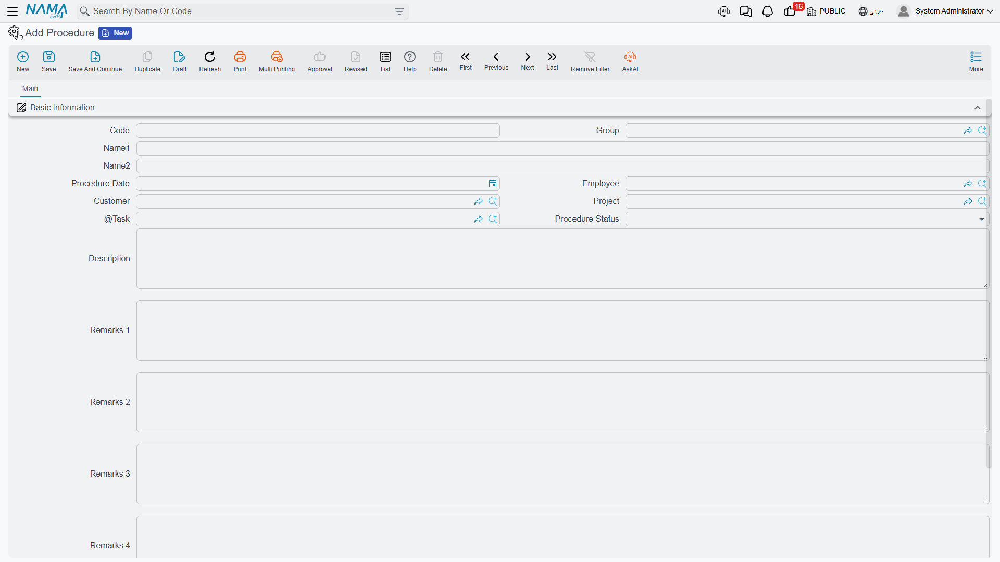

# Procedures

The name invites a misunderstanding, so start here: a **Procedure** in Project Management (ECPA) is not a workflow definition, not a checklist template and not a stored routine. It is a **follow-up record** — the next thing that has to happen on a job, written down so it is not forgotten.

Read it as a to-do: *who* is on the hook, *what* has to be done, *for which customer, project and task*, *by when*, and *where it stands now*.

You will find it at **Project Management > Projects > Procedure**, under licence `ecpa`.

Like a project, a procedure is a **master file**: a code, a group, two names, no book, no document term, nothing processed in the background. You save it and it exists.

## The screen

Everything is on one page.

| Field | What it holds |
|---|---|
| **Code**, **Group** | the usual identity pair; the group can supply automatic coding |
| **Name1** / **Name2** | the Arabic and English names — in practice, the follow-up itself: *"obtain municipality approval"* |
| **Procedure Date** | when it is due, or when it happened |
| **Employee** | who is responsible for it |
| **Customer** | the client it concerns |
| **Project** | the [Managed Project](/modules/ecpa/projects/ecpa-managed-project) it belongs to |
| **Task** | the specific [task](/modules/ecpa/tasks/ecpa-tasks) it hangs off |
| **Procedure Status** | where it stands — see below |
| **Description**, **Remarks 1** to **Remarks 4** | five generous free-text areas |

The three work references narrow each other as you fill them in: choose a customer and the project lookup shows only that customer's projects; choose a project as well and the task lookup shows only that project's tasks. Fill them in left to right and the pickers stay short.

**Procedure Status** offers *Not Started*, *Under Processing*, *Postponed*, *Finished*, *Not Responsible* and *Other*, plus one more for an item that has been reopened. It is descriptive: nothing in the module branches on it, no rule depends on it. What it does earn you is a usable list screen — the status is both a filter and a sort column, so "everything still under processing on the Riyadh clinic" is one search away.

The four numbered remark areas exist because every firm keeps a slightly different set of notes against a follow-up: the client's exact wording, the reference number of the letter sent, the internal decision. Use them as your team agrees, and give them names that match through the [Fields and Entities Settings](/platform/fields-and-entities-settings/fields-settings-overview) screen so nobody has to remember what "Remarks 3" means on this particular record.

::: tip More slots than the screen shows
The record also carries spare attachment, reference, number and description fields that are not on the default layout. If your follow-ups need to point at a document, or carry a value, ask your implementation team to place them with the [screen modifier](/platform/screen-modifier/screen-modifier-overview) and to declare which record types the references may point at.
:::

## Procedures raised from a timesheet

Most procedures in a busy office are never typed on this screen at all — they arrive from the field.

Every line of a [Tasks Executing](/modules/ecpa/task-execution/ecpa-timesheets) document has room for a **next procedure**: a short line of text saying what has to happen next, and a date for it. An engineer closing off a site visit writes *"obtain municipality approval"*, dates it **15-04-2026**, and saves the timesheet.

Whether anything comes of that depends on one setting: the timesheet's document term must name a **Procedures Group**. That group is the master switch.

- With a Procedures Group named on the term, every timesheet line carrying next-procedure text creates a Procedure — named after the text, filed under that group with an automatic code, dated as entered, and carrying the line's employee, customer, project and task.
- Edit the text and save again, and the same procedure is updated rather than duplicated.
- Cancel the timesheet, and the procedures it raised are removed with it.
- With no Procedures Group on the term, nothing is created and the next-procedure text stays a note on the timesheet line.

Procedures born this way arrive **without a status**. If your team works its follow-up list by filtering on status, someone should set one when the item is picked up; a procedure with an empty status will not appear under any of the status filters.

## Where they surface

Two places. The Procedure list screen is the working view — filter by status, employee, project or date to get today's follow-up list. And the [task](/modules/ecpa/tasks/ecpa-tasks) screen carries an embedded list of every procedure logged against that task, which is the answer to "what has been agreed on this piece of work and what is still open".
