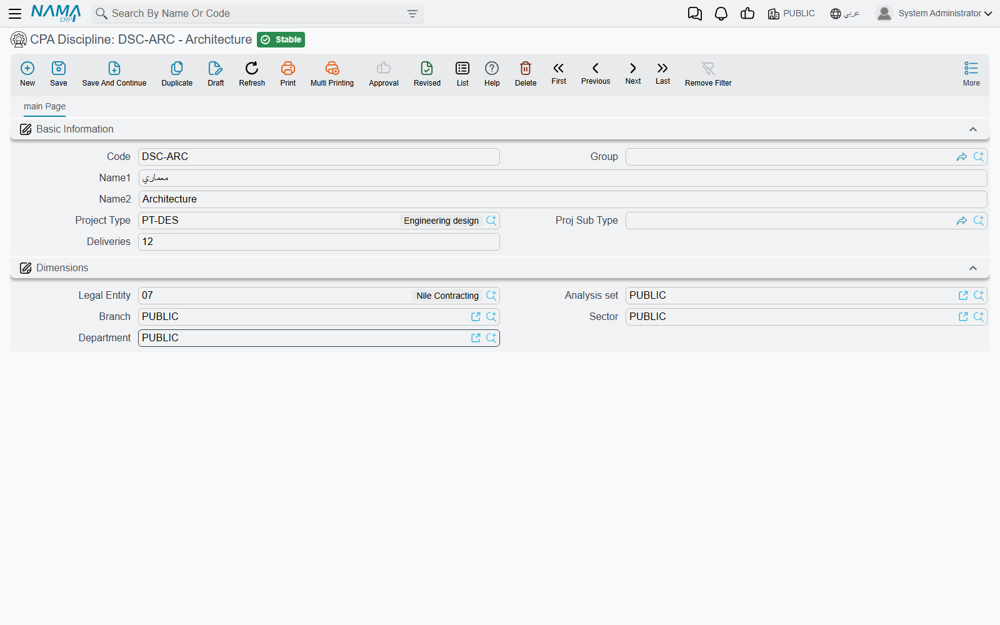

# Project Types, Classes and Disciplines

::: info Required licence
`ecpa` — one code for the whole module. There are no sub-licences.
:::

Before an engineering office can open its first project in Project Management (ECPA), it has to
teach Nama its own vocabulary: what kinds of work it sells, how it likes to slice its portfolio for
reporting, and which professional disciplines its people belong to. Four small master files carry
that vocabulary, and all four live under **Project Management → Projects**
(**ادارة المشاريع ← مشاريع**).

They are not equally important, and it saves a lot of wasted effort to know that up front.
**Project Type** is the one that actually changes how the system behaves. The other three are
classification: Nama stores them, shows them on lists, and lets you filter and report by them — and
that is all they do.

Throughout this page we will set up a small architectural and engineering office, **Nakheel
Engineering**, which does two kinds of work and employs four kinds of engineer.

## Project Type — the load-bearing one

A **Project Type** is the top level of the firm's service catalogue: the kind of engagement it
sells. Nakheel Engineering sells two:

| Code | Name |
|---|---|
| `RES` | Residential |
| `COM` | Commercial |

Every project is stamped with one. The record itself is deliberately plain — a code, a coding group,
an Arabic and an English name, and the usual dimensions (legal entity, analysis set, branch, sector,
department). There are no rates on it, no accounts and no defaults.

What makes it load-bearing is what happens elsewhere once a project carries one:

- **It keeps tasks honest.** Task types are themselves tied to a project type. When you save a task,
  Nama checks that the task type you chose belongs to the same project type as the task's project,
  and refuses the save if it does not. A `Residential` project can only be given task types that
  were set up for `Residential` work. This is described in full on
  [Project Tasks](/modules/ecpa/tasks/ecpa-tasks).
- **It narrows the lookups.** On a project and on a project sales quotation, picking the Project
  Type restricts the Project Sub Type list to that type's sub-types. On a task, it restricts the
  task-type list the same way.
- **It travels with the work.** The type and sub-type are copied from the project onto every task
  and onto timesheet lines, so time analysis can be sliced by type without joining back to the
  project. They are also carried over when a project is generated from a quotation.

The Project Type screen has a second page listing **every project of this type** — a read-only view
showing each project's code, customer, manager, vice manager and responsible. It is the quickest way
to answer "what have we got running under Residential?" without opening the project list and
filtering.

::: tip Set project types up first
Everything else in the module either hangs off a project type or is filtered by it. Creating task
types before project types means going back to edit every one of them, and opening a task type
lookup on a project that has no project type at all is best avoided.
:::

## Project Sub Type — a narrower variant of the type

A **Project Sub Type** splits a type into the variants the office actually recognises. It looks
exactly like the Project Type screen with one extra field: **Project Type**, which is required. That
parent is what makes the cascade work — choose Residential on a project and only Residential
sub-types are offered.

Nakheel Engineering sets up four:

| Code | Name | Project Type |
|---|---|---|
| `RES-VIL` | Villa | Residential |
| `RES-APT` | Apartment building | Residential |
| `COM-RET` | Retail | Commercial |
| `COM-OFF` | Office building | Commercial |

Like the type, the sub-type is copied onto tasks and onto timesheet lines, and it is one of the
filters on the project list view. It carries no rates and no accounts either — it exists so that
"how much time did we spend on villas last year?" is a question the lists can answer.

## Project Class — a reporting tag, and eight of them

A **Project Class** is the office's own way of tagging a project for reporting: public sector versus
private, by region, by funding source, by size band. The record is nothing but a code, a group and
the two names.

Nakheel Engineering uses two:

| Code | Name |
|---|---|
| `PUB` | Public sector |
| `PRV` | Private sector |

What is unusual is that a project offers **eight independent slots** for this same file, so a firm
can run up to eight parallel tag axes at once — sector in the first, region in the second, funding
source in the third, and so on. On the project screen the first slot sits in the **Project Details**
group beside Project Type and Project Sub Type; slots two to eight are gathered in their own group
further down, titled **Project Classes**. People often look for the first one there and do not find
it.

Be clear with your users about what a class is for: it is stored, displayed and filterable, and no
rule, calculation or accounting entry in the module depends on it. That is not a shortcoming — it is
exactly what a reporting tag should be — but a consultant who promises that a class will drive
pricing or approvals will have to take the promise back.

## Discipline — who does which part of the work

A **Discipline** is a professional specialism: architectural, structural, electrical, mechanical,
HVAC, quantity surveying. In an engineering office the work of a project is split two ways at once —
by **phase** (which milestone) and by **discipline** (which profession) — and the discipline is that
second axis.

Nakheel Engineering has four:

| Code | Name |
|---|---|
| `ARC` | Architectural |
| `STR` | Structural |
| `ELE` | Electrical |
| `MEC` | Mechanical |

The record itself is a code, a coding group and the two names. Its value is entirely in the places
it gets used:

- on a project's **Disciplines** page, where each discipline gets its share of the project and its
  estimated hours and costs;
- on the project's **Details** matrix, where each (milestone, discipline) pair becomes one work
  package — see
  [Milestones and the Phase–Discipline Matrix](/modules/ecpa/projects/ecpa-milestones-and-matrix);
- in a reusable **Phases Discipline Group**, the template that pre-combines phases with disciplines;
- on **expense request and expense document lines**, so a cost can be charged to a discipline;
- on **timesheet lines**, where the discipline defaults from the document header, so worked hours
  can be analysed by profession.

::: info Rates do not live on the discipline
The estimated hours, average hourly cost and indirect costs that a firm associates with, say, its
structural team are entered **per project**, on that project's Disciplines page — not on the
discipline master file. Two projects can value the same discipline completely differently, which is
usually what a firm wants.
:::

## Setting the vocabulary up, in order

1. **Project Types** — `RES` Residential, `COM` Commercial.
2. **Project Sub Types** under them — `RES-VIL`, `RES-APT`, `COM-RET`, `COM-OFF`.
3. **Project Classes** — `PUB`, `PRV`, and any second axis you want in slot two.
4. **Disciplines** — `ARC`, `STR`, `ELE`, `MEC`.
5. **Task types** for each project type, so that tasks can be saved at all — on
   [Project Tasks](/modules/ecpa/tasks/ecpa-tasks).
6. **Milestones and a phases-and-disciplines template**, which is where the vocabulary above starts
   producing an actual work breakdown — on
   [Milestones and the Phase–Discipline Matrix](/modules/ecpa/projects/ecpa-milestones-and-matrix).

With those in place, a new project is mostly a matter of choosing from lists —
[The Managed Project](/modules/ecpa/projects/ecpa-managed-project) walks through the screen itself.
