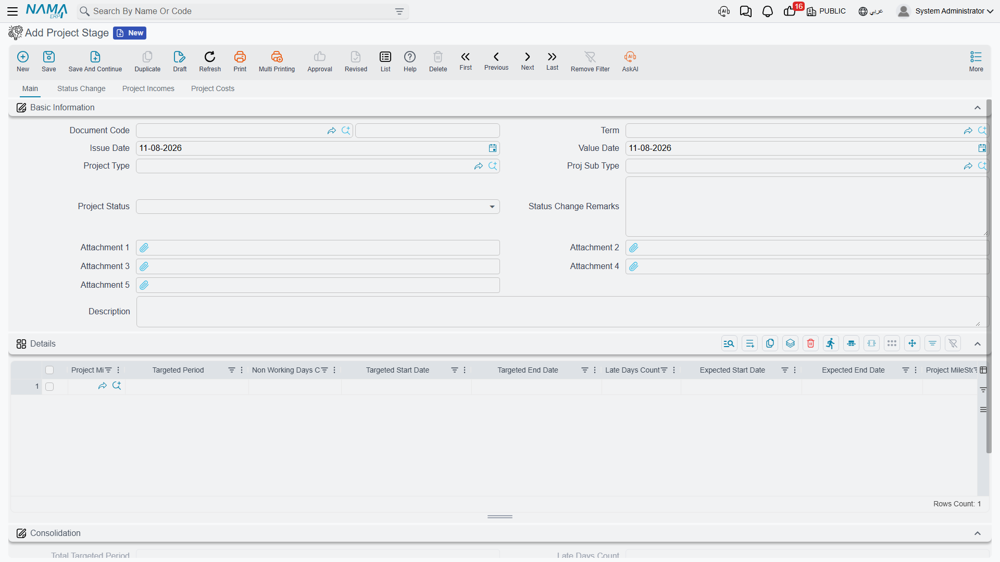
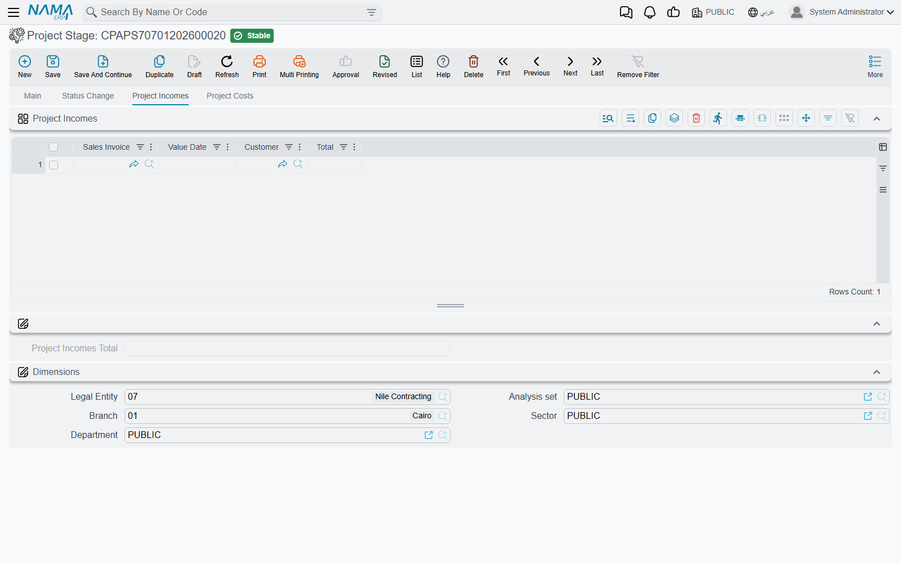
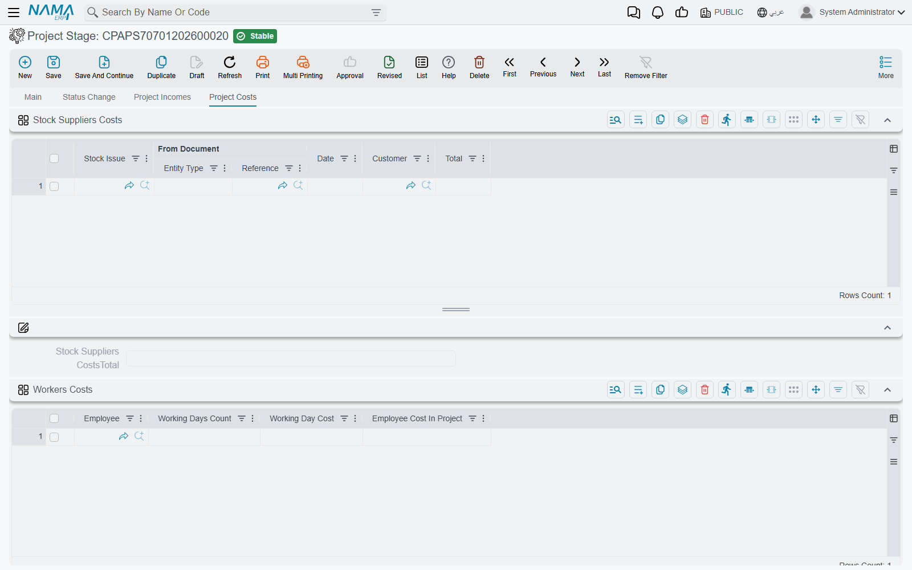

# Project Stages

Most of Project Management (ECPA) is built around people and hours. The **Project Stage** is the one
screen in the module that steps back from hours and asks a different question: *this run of phases —
did it finish on time, and did it make money?*

It answers both on one sheet. The top half is a schedule: you list the phases in order, give each one
a target number of days, and the document chains the dates so that each phase starts where the
previous one ended. Delays booked later push the *expected* dates out beyond the *targeted* ones, so
the two columns sit side by side and the slippage is visible without arithmetic. The bottom half is a
margin sheet: you attach the invoices that were billed on the work and the documents that cost it —
stock issues, employee days, asset days, bought-in services, payments — and the document totals both
sides into a profit figure.

**Where to find it:** *Project Management → Projects → Project Stage*. Like every screen in the
module it needs licence code `ecpa`.

## A Stage Is Not Attached to a Project

Before anything else, one fact about how this screen works, because everything else on the page reads
differently once you know it.

**A project stage has no project field.** You will not find one on the Main page, on any tab, or on
the list view — and the document never writes anything back to a project. The link to a project is
indirect: each line of the schedule names a **milestone**, milestones belong to projects, and that is
the whole of the relationship. Nothing you enter here appears on the Managed Project screen; the
project's own *Total Project Cost* is unaffected; its status is unaffected; its completion percentage
is unaffected.

Three practical consequences follow:

- **You find a stage by its own document code**, by the project type and sub type on its header, or
  by its dimensions — not by drilling down from a project.
- **A stage may carry milestones from more than one project.** The system does not check that they
  belong together. That is occasionally useful (a shared mobilisation period across two towers of the
  same development) and is otherwise something for your own naming discipline to prevent.
- **Committing a stage does not "close" any milestone.** The milestone status you set on a stage line
  lives on the stage line; the milestone master record is not touched.

Read the stage as a standalone commercial sheet about a named run of work. That is what it is, and on
those terms it is the only place in the module where income and cost appear on the same screen — see
[Where Project Cost and Revenue Come From](/modules/ecpa/ecpa-costing-and-profitability) for the
wider picture.

::: info Milestone or stage?
Two different records, and the names are close enough to trip anyone up. A **Project Milestone** is a
master file — one named phase of one project ("Concept Design" on Marina Tower). A **Project Stage**
is this document, which lists several of those milestones and puts a schedule and a margin around
them. Milestones are generated from the Milestones page of the project itself; see
[Milestones and the Phase–Discipline Matrix](/modules/ecpa/projects/ecpa-milestones-and-matrix).
:::

## The Schedule

The Main page carries the usual document header — document code and book, term, issue date, value
date — plus the project type and sub type the stage is filed under, its status, five attachment slots
and a description. Then comes the **Details** grid, which is the schedule.



Take an engineering office running the design phases of **Marina Tower**. Three milestones, in order,
starting 1 March:

| Project Milestone | Targeted Period | Non Working Days | Targeted Start | Targeted End |
|---|---|---|---|---|
| Concept Design | 30 | 4 | 01-03-2026 | 31-03-2026 |
| Schematic Design | 45 | 6 | 31-03-2026 | 15-05-2026 |
| Tender Documents | 25 | 2 | 15-05-2026 | 09-06-2026 |

Only four of those numbers were typed: the three targeted periods and the **first line's targeted
start date**. Everything else in the table is worked out by the document.

- **Targeted End Date** is the line's targeted start plus its targeted period.
- **Targeted Start Date** on every line after the first is the previous line's targeted end — the
  phases are assumed to run back to back. Type the start date on the first line only.
- **Non Working Days Count** is a note about the phase, not a scheduling input. It does not lengthen
  or shorten the dates; it is used only in the "net after non-working days" totals below.

Because the chain runs top to bottom, the way to move a later phase is to change an earlier phase's
targeted period, not to type a date on the later line. A milestone may appear only once on the
document, and the picker helps you here — it hides any milestone already used on the lines.

Two further columns record where each phase stands: **Project Milestone Status** (*Initial*,
*In Progress*, *Finished*) and a **Status Change Remarks** box beside it.

### Late Days and the Expected Dates

Three more columns sit to the right of the targeted ones, and they are the reason the screen is worth
keeping up to date:

- **Late Days Count** — days of slippage on this phase. **You cannot type this.** It is written only
  by [Stage Extensions](/modules/ecpa/projects/ecpa-stage-extensions), the short document that grants
  more time, and it always holds the total across every committed extension for that phase.
- **Expected Start Date** and **Expected End Date** — the same chain again, but with the late days
  added. The first line's expected start is its targeted start; every later line's expected start is
  the previous line's expected end; and each expected end is the expected start plus the targeted
  period *plus* the late days.

Suppose the client took ten extra days to sign off the massing, and an extension of 10 days is
committed against Concept Design. The targeted column does not move — it is the promise, and it stays
as evidence of the promise. The expected column tells the truth:

| Project Milestone | Late Days | Expected Start | Expected End | Targeted End |
|---|---|---|---|---|
| Concept Design | 10 | 01-03-2026 | 10-04-2026 | 31-03-2026 |
| Schematic Design | 0 | 10-04-2026 | 25-05-2026 | 15-05-2026 |
| Tender Documents | 0 | 25-05-2026 | 19-06-2026 | 09-06-2026 |

One late phase at the top has pushed the whole programme out by ten days, which is exactly the
behaviour a designer would expect and exactly the number the client will ask about.

### The Consolidation Totals

Underneath the grid, a read-only group adds the columns up. For the example above:

| Consolidation field | Value | How it is reached |
|---|---|---|
| Total Targeted Period | 100 | 30 + 45 + 25 |
| Late Days Count | 10 | sum of the line late days |
| Total Expected Period | 110 | targeted + late |
| Non Working Days Count | 12 | 4 + 6 + 2 |
| Net After Non Working Targeted Period | 88 | 100 − 12 |
| Net After Non Working Expected Period | 98 | 110 − 12 |

The last two lines are why the non-working column exists: they turn a calendar duration into working
days, which is the number a resource planner actually wants.

Below the totals sits the standard Dimensions group — legal entity, branch, department, sector and
analysis set — exactly as on any other document.

### The Status Change History

The second tab, **Status Change**, is filled entirely by the system. It holds two audit grids: one
for the milestone statuses on the lines (which milestone, from which status, to which status, changed
by whom, changed on) and one for the document's own status. A row is appended whenever a status or
its remark changes, so the tab reads as a running commentary on how the phases moved rather than a
single "current state" snapshot. The *Changed On* stamp is the day the edit was made, not the
document's value date.

The document's own status offers three values — **In Progress**, **Finished** and **Cancelled** — and
it describes this sheet. It is the stage's status, not the status of any project, and it is not
propagated anywhere.

## The Income Side

The third tab, **Project Incomes**, is the only place in Project Management where revenue is attached
to anything other than an invoice's own ledger entry.



Each row picks one **Sales Invoice**; the document then fills in the invoice's value date, its
customer and its net value for you, so the only real decision is which invoices belong to this run of
phases. On Marina Tower, two:

| Sales Invoice | Value Date | Customer | Total |
|---|---|---|---|
| SI-2026-0431 | 12-04-2026 | Marina Development | 250,000 |
| SI-2026-0588 | 27-05-2026 | Marina Development | 168,000 |

**Project Incomes Total: 418,000.**

Note which document this column takes. It is the sales invoice from the supply-chain side of the
system — the same document a trading company raises. The
[Project Invoice](/modules/ecpa/invoicing/ecpa-project-invoice) that this module raises against
collected hours and expenses is a different document, and it is not what this grid collects. Sites
that bill entirely through project invoices will find the income tab of limited use and should read
the profit figure accordingly.

## The Cost Side

The fourth tab, **Project Costs**, holds five grids, each followed by its own total. This is the
module's only consolidated cost view — and the single most important thing to understand about it is
that **every line on it is put there by hand**.

Nothing arrives here on its own. A stock issue made to the project does not appear; an approved
timesheet does not appear; a committed project expense document does not appear; a purchase invoice
does not appear. Somebody opens this tab and picks each document. The automation the screen does
offer is real but modest: once you have picked a document, its date, its counterparty and its value
are read off it for you, so the numbers are the document's numbers and not a retyped guess.



::: info The screenshot is cut at the fold
The image above shows the first two grids only. The fixed-asset, transportation and other-cost grids
and the Project Profit group sit below the visible area of the tab; scroll down on the real screen to
reach them.
:::

**Stock Suppliers Costs** — materials issued out of a warehouse for the work. Pick a **Stock Issue**
and the row fills with its source document, date, customer and net value.

**Workers Costs** — the only labour figure on this sheet, and it is typed rather than collected.
Three columns: employee, **Working Days Count** and **Working Day Cost**. The fourth, *Employee Cost
In Project*, is their product. A site engineer at 40 days on 700 a day gives 28,000. This is
deliberately a *day* rate and it is quite independent of the hourly costing that timesheets and tasks
use elsewhere in the module — nothing is copied between them in either direction.

**Fixed Asset Costs** — the same shape for equipment: fixed asset, working days, working day cost,
and their product. A survey rig at 30 days on 600 a day gives 18,000. There is no connection to
depreciation, to asset custody or to any other fixed-asset document; the figure is your own estimate
of what the equipment's time was worth to this work.

**Transportation Costs** — pick a **Misc Purchase Invoice** and the row fills with its source
document, date, supplier and net value. The grid title names the usual case, but the column simply
accepts a misc purchase invoice, so any bought-in service that was invoiced that way belongs here.

**Other Costs** — pick a **Payment Voucher** and the row fills with its source document, date, the
supplier it was paid to and the amount. This is the catch-all for money that left the business against
the work without passing through a purchase invoice.

Continuing Marina Tower:

| Cost grid | Total |
|---|---|
| Stock Suppliers Costs Total | 96,000 |
| Workers Costs Total | 74,500 |
| Fixed Asset Costs Total | 18,000 |
| Transportation Costs Total | 12,500 |
| Other Costs Total | 9,200 |

## The Profit Roll-Up

At the foot of the cost tab, the **Project Profit** group repeats the six totals and gives the answer.
The arithmetic is exactly as plain as it looks:

```
Project Incomes Total            418,000
  Stock Suppliers Costs Total     96,000
  Workers Costs Total             74,500
  Fixed Asset Costs Total         18,000
  Transportation Costs Total      12,500
  Other Costs Total                9,200
                                --------
  all costs                      210,200
                                --------
Project Profit                   207,800
```

The group lists the six component totals beside the profit figure; if you want the total cost as a
number of its own, add the five cost lines. The totals are recalculated every time the document is
saved and again when it is committed, so a stage that is being kept up to date always shows a current
margin.

Two things this figure is **not**:

- **It is not compared with anything.** There is no budget in Project Management. The estimated-cost
  columns on a project and the contract value on its header are informational, and nothing on this
  screen — no validation, no warning, no block — checks the profit or the costs against them. A stage
  showing a loss commits exactly as readily as one showing a profit.
- **It is not the project's cost.** The *Total Project Cost* on the Managed Project screen is labour
  cost from approved timesheets and nothing else. The two numbers answer different questions and are
  not meant to agree. See
  [Where Project Cost and Revenue Come From](/modules/ecpa/ecpa-costing-and-profitability).

## Committing, and the Guard Against Double Counting

A project stage is a document: it carries a book, a code, a term, an issue date and a value date, and
it is committed rather than simply saved. Committing runs three checks.

1. **The first line must have a targeted start date** — without it there is nothing for the chain to
   start from.
2. **A milestone may not appear twice** on the same document.
3. **No income or cost document may be counted twice.** The same sales invoice, stock issue, misc
   purchase invoice or payment voucher may not appear twice on this stage, *and* may not already
   appear on another committed project stage. If it does, the commit is refused.

That third check is the quiet hero of the screen. Because stages are assembled by hand and one
project's work is often spread over several of them, the obvious risk is billing or costing the same
invoice on two sheets — and the system will not let you. Note that it covers the four grids that hold
a document reference. The workers and fixed-asset grids hold no document, so nothing stops the same
employee or the same asset being entered on two lines; keep those two grids tidy yourself.

Committing has no financial consequences of its own: a project stage produces **no ledger entry and
no stock movement**. Its effects are entirely internal — the status history is appended and the totals
are recalculated. Cancelling one is correspondingly cheap: there is nothing to unwind, and the status
history stays as a record of what happened.

## Extending a Stage

You never type a delay onto the schedule. When a phase slips, raise a
[Stage Extension](/modules/ecpa/projects/ecpa-stage-extensions) against the stage, naming the phase,
the number of days and a reason. Committing it writes the days onto the matching line here and
re-chains the expected dates, which is how the ten days on Concept Design in the table above got
there.
