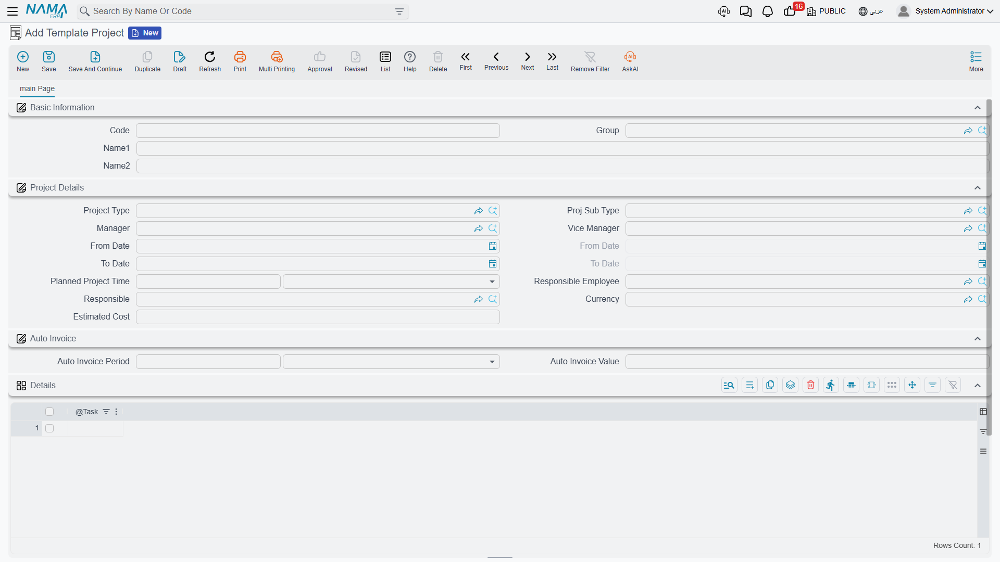

# Project Templates

Most firms do the same handful of jobs over and over. An interior fit-out always needs a survey, a concept, detailed drawings, a tender package and site supervision; it always runs about six months; it always ends up on the same accounts. A **Template Project** in Project Management (ECPA) captures that repetition so it does not have to be retyped for every new client.

You will find it at **Project Management > Projects > Template Project**, under licence `ecpa`.

A template is a small, quiet master file — no book, no document term, nothing to process. Its value is entirely in what it saves someone else from typing.

## Read this before you design one

A template does **not** create projects. There is no "create project from template" button anywhere in the module, and the [Managed Project](/modules/ecpa/projects/ecpa-managed-project) screen has no template field.

The template is consumed by the [project sales quotation](/modules/ecpa/projects/ecpa-sales-quotation). The chain is:

**template → quotation → accepted quotation → project and tasks**

Design your templates for the estimator writing the quotation, not for the project manager. That one sentence explains every decision on the rest of this page.

## What the screen holds

**Basic Information** — **Code**, **Group**, **Name1** and **Name2**, plus the template's **Subsidiary Accounts** bag.

**Project Details** — the defaults for a job of this kind: **Project Type** and **Proj Sub Type**, **Manager** and **Vice Manager**, the planned **From Date** and **To Date**, the **Planned Project Time** with its unit, the **Responsible Employee**, the **Responsible** third party, an **Estimated Cost** and the **Currency**.

**Details** — a one-column grid listing the **Task**s a job of this kind normally involves. Each row points at an existing task record, which is how a house methodology gets written down: the standard steps, in order, named the same way every time.

**Detail Accounts** and **Dimensions** — the main account plus five numbered accounts, and the usual legal entity, sector, branch, department and analysis set.

For *Nama Architects*, one template covers most of the practice's work: code `TPL-FITOUT`, name *Interior fit-out*, project type **Interior**, planned project time **6 Month**, and five task rows — Site survey, Concept design, Detailed drawings, Tender package, Site supervision.

## What travels, and where

Two hand-offs matter, and they carry different things.

**When the estimator picks the template on a quotation**, the quotation receives the planned **From Date**, the planned **To Date**, the **Planned Project Time** and its unit, and **every row of the task list**. That is the moment the template earns its keep: the estimator opens a blank quotation, names the template, and the five standard tasks and the six-month window are already there to price.

Everything else on the template — the project type and sub-type, the managers, the responsible employee, the estimated cost, the currency, the dimensions — is not carried at this step. The estimator fills those in on the quotation, from which they *do* reach the project.

**When the accepted quotation runs Create Project And Tasks**, a [Managed Project](/modules/ecpa/projects/ecpa-managed-project) and its [tasks](/modules/ecpa/tasks/ecpa-tasks) are built. Almost everything on the new project comes from the quotation. The one thing taken from the template at this point is its **Subsidiary Accounts**, and only as a fallback — when the quotation carries no subsidiary accounts of its own, the template's are used.

::: tip Where to put the accounts
Because the Subsidiary Accounts are the only thing that reaches a project directly from a template, it is worth filling in properly on every template you create. It is the module's tidiest way to say "all interior fit-outs book to these accounts unless the deal says otherwise".
:::

## What a new project still needs

A project built through this chain arrives with its header, its dates and its task list, and with **nothing else**. Specifically, its **Milestones**, **Disciplines** and **Details** matrix are all empty, and so is its **Team Work** roster.

That is not a gap in your template — a template has no milestones or disciplines to give. Build them on the project the usual way: either type them on the Milestones and Disciplines pages, or pick a **Phases Discipline Group**, which fills all three grids in one step. The [milestones and matrix page](/modules/ecpa/projects/ecpa-milestones-and-matrix) covers that.

So the practical division of labour is: **the template standardises the work list and the calendar; the phases-discipline group standardises the phase-and-speciality breakdown.** Firms that set both up get a new project almost fully formed in two picks.
