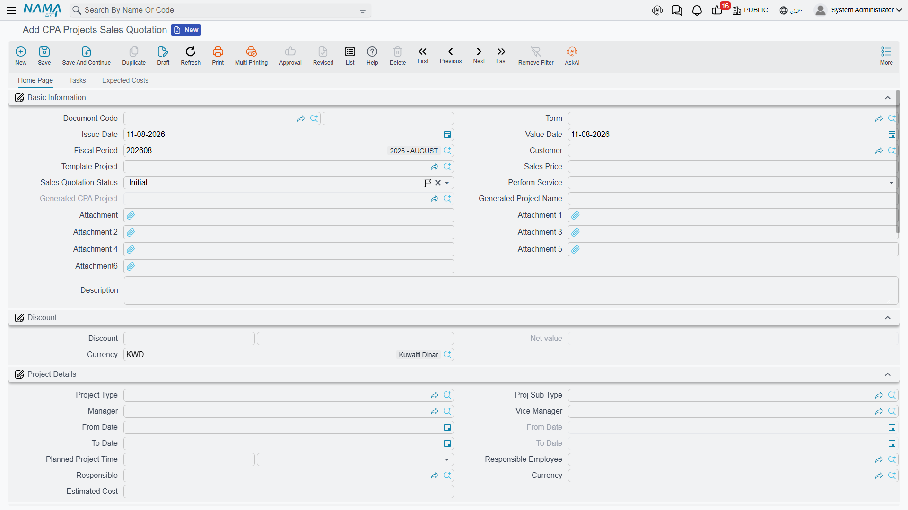
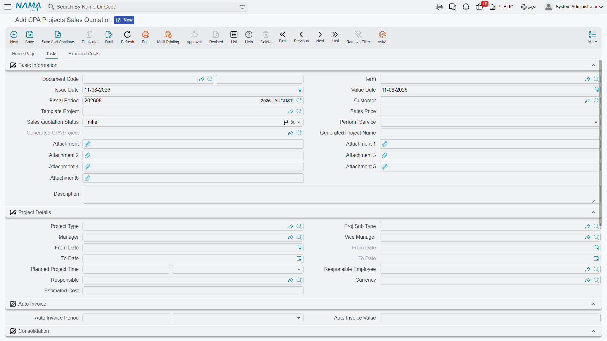

# Project Sales Quotation

::: info Required licence
`ecpa` — one code for the whole module. There are no sub-licences.
:::

Everything else in Project Management (ECPA) assumes a project already exists. The quotation is
where it comes from. It is the proposal a professional-services firm puts in front of a client
before anybody starts work: *here are the tasks we will do, here are the people who will do them and
how many hours we expect each of them to spend, here are the out-of-pocket costs we expect to incur,
this is the price, and this is how we would like to be paid.*

When the client says yes, one button on that same screen turns the proposal into a live project and
a set of tasks — and that button is the module's real "new project" path. There is no *create
project from template* action anywhere; a template feeds the **quotation**, and the quotation
creates the project.

You will find it under **Project Management → Projects → CPA Projects Sales Quotation**
(**ادارة المشاريع ← مشاريع ← عرض أسعار مشروع**).

::: tip A quotation books nothing
A quotation is a document — it has a book, a document term (توجيه), an issue date and a value date,
and you commit it. But committing it produces no accounting entry of any kind. Nothing is debited,
nothing is credited, and no business request is raised. It is a pre-sales record and a source
document for the project it creates; the money only starts moving on the
[Project Invoice](/modules/ecpa/invoicing/ecpa-project-invoice).
:::

## The example we will follow

Nama Consulting is quoting customer **C-0012** for a feasibility study, working from the template
project **TP-STUDY**. Two pieces of work are involved — a *Site Survey* and *Report Writing* — and
four people will be on the job. The firm wants **25,000** for it, less a 4 % goodwill discount, paid
in three instalments.

Every number on this page comes from that one job, and it is the same job that is billed on the
[Project Invoice](/modules/ecpa/invoicing/ecpa-project-invoice) page.

## Starting from a template

The first thing most firms do on a new quotation, after choosing the customer, is pick a **Template
Project**. A template is a saved skeleton of a job type — see
[Project Templates](/modules/ecpa/projects/ecpa-project-templates) — and its main contribution here
is the list of task names such a job usually involves.

Choosing **TP-STUDY** does two things immediately:

1. It copies the template's planned start, planned finish and planned total project time into the
   quotation's **Project Details** block.
2. It fills the **Details** grid with one row per template task: `Site Survey` and `Report Writing`.

::: warning Choosing a template replaces the Details grid
The task rows are not merged — the grid is cleared and rebuilt from the template. Pick your template
before you start editing task names, not after.
:::

The hours are *not* part of what the template hands over. The template holds names; the effort and
the money are built on the next page.

## The home page — the offer itself

**Basic Information** carries the document's identity (book and code, term, issue date, value date,
fiscal period) and then the commercial header: the **Customer**, the **Template Project**, the
**Sales Price**, the **Sales Quotation Status**, and — filled in later by the system — the
**Generated CPA Project**. **Generated Project Name** is worth filling in deliberately: it becomes
the name of the project the quotation creates, in both languages. Seven attachment slots and a
description round the group off.

The **Discount** group next to it holds a percentage-and-value pair, the resulting **Net value**, and
the currency. Type the Sales Price and the net value follows it; enter a discount and the net is the
sales price less the discount value.

**Net value is recomputed on every save.** The server works it out from the Sales Price and the
discount, so save the quotation and read the stored figure before quoting the number to anyone.

For our job: **Sales Price 25,000**, a **4 %** discount worth **1,000**, **Net value 24,000**.

**Project Details** is the block that will be handed to the project when the quotation is accepted —
project type and sub type, manager and vice manager, planned and actual start and finish, the
planned total project time, the responsible employee, and the estimated cost. Nothing here is
enforced; the estimated cost is an internal figure, and the module never compares it against what the
job actually costs. See
[Where Project Cost and Revenue Come From](/modules/ecpa/ecpa-costing-and-profitability) for what
does and does not roll up.

The **Auto Invoice** group holds a period and a value, for firms that bill a retainer rather than
measured work. The **value** travels to the created project as a periodic-billing line. The
project's own **Auto Invoice Period** — the rhythm its recurring charge is raised on — is set on
the project itself; see [The Managed Project](/modules/ecpa/projects/ecpa-managed-project).

The **Consolidation** group at the top right is where you watch the quotation add up. All three
figures are computed on save:

| Figure | Comes from |
|---|---|
| **Expected Time Total** (إجمالى عدد الساعات المتوقعة) | the Total Time column of the Details grid |
| **Employee Rate Total** (إجمالى أجر الساعة لكل المهام) | every Tasks row's planned hours × its hourly rate |
| **Project Expense Item Total** (إجمالى بند المصروف) | the Value column of the Expected Costs grid |

Finally, the accounts group at the foot of the page holds the sub-ledger accounts the project will
carry — a main account and five more. The pickers only offer accounts that are set up as project
subsidiaries, and whatever you choose here is copied onto the created project. If you leave them
empty, the template's accounts are used instead.

### The Details grid — a list of names, with a derived total

The Details grid has two columns: the **Task** name and its **Total Time**. The task name is typed
text, not a picker, because at quotation time the task does not exist yet — the system offers a
suggestion list built from the names already on the grid so you spell them the same way everywhere.

The **Total Time** column is not something you type. On every save it is overwritten with the sum of
the planned hours of every row on the **Tasks** page whose task name matches. So the Details grid is
a summary of the Tasks page, and the Tasks page is where the work really goes in.

## The Tasks page — where the price is built

This is the heart of the quotation. One row per person per task: who does it, between which dates,
how many hours you are planning for, at what hourly rate, and what that costs. Daily and monthly
hour ceilings can be set per row, and they travel through to the created task.

Our four rows:

| Employee | Task | Planned hours | Employee Rate | Planned Cost |
|---|---|---|---|---|
| E-101 Ahmed | Site Survey | 40 | 120 | 4,800 |
| E-102 Sara | Site Survey | 20 | 150 | 3,000 |
| E-101 Ahmed | Report Writing | 30 | 120 | 3,600 |
| E-103 Omar | Report Writing | 10 | 200 | 2,000 |

On save, the Details grid's Total Time reads **60** for Site Survey and **40** for Report Writing;
**Expected Time Total** is **100** and **Employee Rate Total** is **13,400**.

::: tip The rate here is the selling rate, and it follows the job all the way to the invoice
The hourly rate you enter on this grid is copied onto the created task's executors grid, and that is
the rate a project invoice uses when it collects approved time. Cost is a different number entirely —
it comes from payroll, on the timesheet. The two are explained side by side in
[Project Management Settings](/modules/ecpa/ecpa-configuration).
:::

The Actual hours, Actual cost and % of Finished columns on this grid belong to the executed job, not
the proposal. They stay empty on a quotation. The **Generated Document** column at the far right
fills in once the project and tasks have been created, and tells you which task each row became.

## The Expected Costs page — an internal estimate

The third page lists the out-of-pocket costs you expect the job to incur: a task name, a **Project
Expense Item** (required), a **Value**, and an **Internal Account** tick.

For our study: `Travel` **1,500** with Internal Account unticked, and `Printing` **300** with it
ticked — a **Project Expense Item Total** of **1,800**.

The Internal Account tick means the same thing here as it does everywhere else in the module: an
internal cost is one the firm swallows, an external one is expected to be recharged to the client.
See [Project Expenses](/modules/ecpa/expenses/ecpa-project-expenses) for the full story.

Be clear about what this page is, though. It is an **estimate that lives on the quotation**. It feeds
the Consolidation total and nothing else — accepting the offer does not create expense requests,
expense documents or any kind of cost line on the project. When the job actually runs, the real
expenses are raised as project expense requests in the ordinary way, and it is those, not these, that
a project invoice can bill.

## The payment schedule

Choose a **Payment Template** and the Payments grid is built and refreshed on every save: one line
per instalment, each with its code, description, percentage, amount and due date. Our `50-30-20`
template on a net of 24,000 gives **12,000**, **7,200** and **4,800**.

Alongside the amounts sit **Paid Value**, **System paid** and **Remaining**. Those track settlement:
when receipt vouchers are collected against the quotation, the collected amounts land in *System
paid* and *Remaining* falls. No accounting comes from the quotation itself — the entry belongs to the
receipt voucher.

::: info The schedule is a promise, not a billing instruction
Nothing connects these instalment lines to the project invoice. The invoice never reads them, and
they are never a source of an invoice amount. If a firm bills by instalment it types the instalment
amount onto the invoice line by hand.
:::

The **Remarks** grid below it holds two free-text columns for anything else that belongs on the
proposal. They stay on the quotation — they are not copied to the project or to any task.

## Accepting, rejecting, and creating the job

Three buttons sit on the home page.

**Accept Offer** (قبول العرض) sets the **Sales Quotation Status** to **Accepted**. **Cancel Offer**
(رفض العرض) sets it to **Rejected** — the recorded state is a rejection, so use it when the offer
will not be going ahead rather than as a "put this on hold" action. Both act on the screen in front
of you: you still have to save the document afterwards. The status list also carries **Initial**
(the state a new quotation starts in) and **Feedback from Customer**, which you set by hand while a
proposal is being negotiated.

**Create Project And Tasks** (إنشاء المشروع والمهام المتعلقة به) is the one that matters. Before it
will run:

- the quotation must be **saved**;
- its status must be **Accepted** — otherwise it refuses with the message
  *"Sales Quotation Status Must Be Accpeted"* (the typo is in the message itself);
- it must have a **Template Project** — a quotation without one is refused with
  *"You must choose template project"*, which appears in English even on an Arabic screen.

It then asks you two questions — a **Project Group** and a **Task Group** — which decide the coding
groups the new records are filed under. Leave the project group empty and the project takes the
quotation's own code.

What it builds, for our example:

1. **One project.** Named from *Generated Project Name*, customer C-0012, status **In Progress**. It
   receives the quotation's project type and sub type, manager and vice manager, planned and actual
   dates, planned project time, responsible and estimated cost, its dimensions, and the Subsidiary Accounts
   from the quotation (or from the template if the quotation had none). One periodic-billing line is
   added carrying the Auto Invoice value. The finished project is written back into
   **Generated CPA Project** on the quotation.
2. **One task per quoted task name** — `Site Survey` and `Report Writing`. Each is attached to the
   new project and the customer, starts at status **In Progress**, inherits the quotation's planned
   window, project type and planned duration, and carries an executors row for every Tasks-page line
   with that task name: the employee, the planned hours, the hourly rate, the planned cost and the
   daily and monthly ceilings.
3. **The links back.** Each Details row records the task it produced, and each Tasks row records its
   generated document, so you can always see what the proposal turned into.

If someone types a person against a task name that never made it onto the Details grid, the missing
Details row is added for you.

::: warning Press it once
Run this action once. Pressing it again finds the project and tasks it made last time rather than
making duplicates, but each task's executors grid is **cleared and rebuilt** from the quotation's
Tasks page, so any executor row that was added, removed or re-rated on the task itself is lost.
After it has run, edit the project and the tasks, not the quotation.
:::

## What does not travel to the project

Worth knowing before somebody goes looking for it on the new project:

- **The agreed price stays on the quotation.** Neither the Sales Price nor the Net value is written
  onto the project, so there is no contract figure on the project to compare invoices against.
  Nothing in the module caps what you can bill — see the
  [Project Invoice](/modules/ecpa/invoicing/ecpa-project-invoice) page.
- **The expected costs stay on the quotation**, as described above.
- **The payment schedule stays on the quotation.**
- **The new project's Milestones, Disciplines and Team Work grids are empty.** Milestones and the
  phase–discipline matrix are built on the project afterwards — see
  [Milestones and the Phase–Discipline Matrix](/modules/ecpa/projects/ecpa-milestones-and-matrix).
- **The remarks lines stay on the quotation.**

## The job end to end

1. New quotation, customer **C-0012**, template **TP-STUDY** → the Details grid fills with *Site
   Survey* and *Report Writing*.
2. Tasks page: four rows totalling **100 planned hours** and **13,400** of planned labour.
3. Expected Costs page: Travel **1,500** (external), Printing **300** (internal) → **1,800**.
4. Sales Price **25,000**, discount 4 % = **1,000**, **Net value 24,000**.
5. Payment template `50-30-20` → instalments of **12,000 / 7,200 / 4,800**.
6. Save. Consolidation reads 100 / 13,400 / 1,800.
7. **Accept Offer**, save again.
8. **Create Project And Tasks** with a project group and a task group → project **Q-000123** at
   status In Progress, tasks *Site Survey* and *Report Writing* with their executors.

From here the work is recorded on
[timesheets](/modules/ecpa/task-execution/ecpa-timesheets),
[approved](/modules/ecpa/task-execution/ecpa-timesheet-approval), and billed on the
[Project Invoice](/modules/ecpa/invoicing/ecpa-project-invoice) — which is where the 25,000 finally
turns into money.
