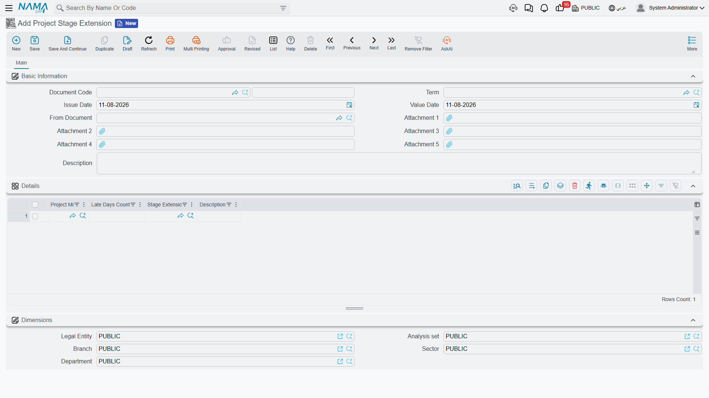

# Stage Extensions

A [Project Stage](/modules/ecpa/projects/ecpa-project-stages) holds the promise: each phase, its
targeted number of days, and the dates that follow from them. Phases then slip, and the question is
what to do about it. Project Management (ECPA) answers it in a deliberate way — **you never edit the
schedule to absorb a delay**. The targeted dates stay exactly as they were agreed, and the slippage
is recorded as a separate document with a date, a size and a reason of its own.

That document is the **Project Stage Extension**, and it is the only thing in the module that can
lengthen a stage. The Late Days Count column on the stage cannot be typed into; it is written from
here.

**Where to find it:** *Project Management → Projects → Project Stage Extension*, under licence code
`ecpa`.

## The Screen

One page, and a short one. The header is the standard document set — document code and book, term,
issue date, value date, five attachments and a description — plus one field that matters more than
the rest.

**From Document** names the project stage being extended, and it has to be filled in first. The
milestone picker on the lines below is limited to the milestones that appear on that stage — which is
exactly what you want, since an extension can only lengthen a phase the stage already schedules, but
it does mean the picker returns nothing at all while From Document is empty. If the lookup seems
broken, that is almost always the reason.

The **Details** grid then takes one row per delayed phase:

| Column | What goes in it |
|---|---|
| **Project Milestone** | The phase that slipped. Required, and it must be one of the stage's own milestones. |
| **Late Days Count** | How many days it slipped by. Required. |
| **Stage Extension Reason** | Why, picked from the reason list. Optional. |
| **Description** | The free-text version of why, for the detail the reason code cannot carry. |

Below the grid sits the standard Dimensions group.

There is no requester and no approver field on this document. Whoever raised it is recorded by the
system as its author, and if extensions need signing off at your site that is done through the
system's general approval mechanism rather than through anything specific to this screen.

## What Committing Does

Carry on the Marina Tower example from the stage page. The stage schedules Concept Design (30 days
from 1 March), Schematic Design (45 days) and Tender Documents (25 days), running to a targeted end
of 9 June. The client then takes ten extra days to sign off the massing.

1. Raise an extension, set **From Document** to the Marina Tower stage, and add one line: Concept
   Design, 10 late days, reason *Client approval delay*.
2. Commit it.
3. Open the stage. Its Concept Design line now shows **Late Days Count 10**, and an expected end of
   10 April against a targeted end of 31 March. Because the expected dates chain the same way the
   targeted ones do, Schematic Design and Tender Documents have each shifted ten days too, and the
   Consolidation group reads **total targeted period 100, late days 10, total expected period 110**.

Now suppose the structural consultant then loses four days on Schematic Design. Raise a **second**
extension against the same stage, one line, Schematic Design, 4 days. After it commits, the stage
reads Concept Design 10 late days, Schematic Design 4, total late 14, total expected period 114.

That second document is worth pausing on, because it shows how the arithmetic actually works. An
extension does not *add* its days to whatever was there before. Each time an extension is committed,
the system re-reads **every committed extension raised against that stage**, totals the late days per
milestone, and writes the totals onto the stage's lines — putting zero on any phase no extension has
touched. Then it re-chains the expected dates and re-totals the Consolidation group.

The pleasant consequence is that the numbers can never drift:

- **Cancelling an extension removes exactly its own days**, no more and no less, and the remaining
  extensions keep theirs.
- **Correcting an extension** — changing the days, or moving a line to a different milestone — leaves
  the stage holding the corrected total, not the sum of the old and the new.
- **Moving an extension to a different stage** by changing From Document cleans up the stage it came
  from as well as updating the one it moved to.

Like the stage itself, the extension has no financial effect: committing it writes no ledger entry
and moves no stock. Its entire purpose is those late-day numbers and the record of why they exist.

## Reasons and Reason Types

The reason on a line comes from a two-level list, set up once and left alone.

**Stage Extension Reason Type** is the outer level — the family a reason belongs to. Typical
setups have three or four: *Client*, *Consultant*, *Contractor*, *Force majeure*.

**Stage Extension Reason** is the reason itself, and it carries a **Reason Type** pointing at one of
the above. So a firm might record:

| Reason | Reason Type |
|---|---|
| Late approval of design submission | Client |
| Late release of site | Client |
| Consultant comments returned late | Consultant |
| Drawing rework after design change | Contractor |
| Weather stoppage | Force majeure |

Both screens are plain lookup files: a code, a group, an Arabic and an English name, attachment slots
and dimensions. Nothing more, and — this is the point — nothing behind them. A reason does not change
the number of days granted, does not restrict which stages it can be used on, and does not feed any
calculation anywhere in the module. The two lists exist so that a year of extensions can be filtered
and read: *how many days did we lose to the client, and how many did we lose to ourselves?* That
question is answerable only if the reasons were picked consistently, which makes the setup worth
doing properly even though nothing enforces it.
