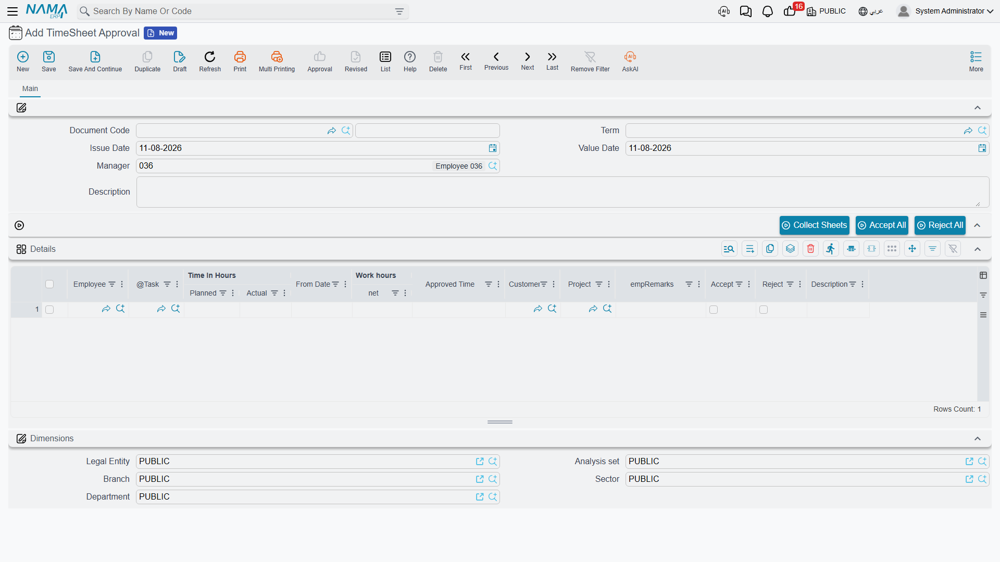
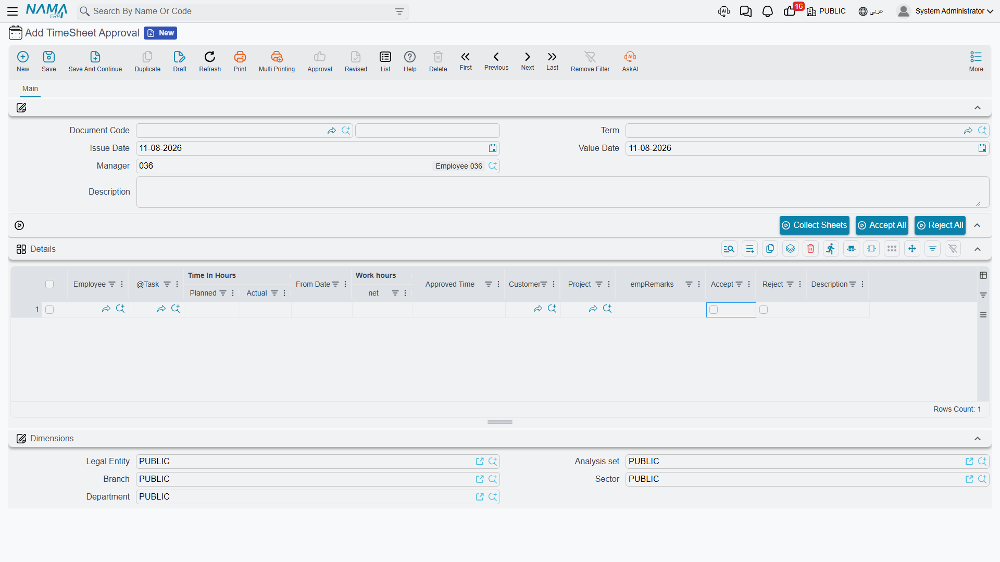
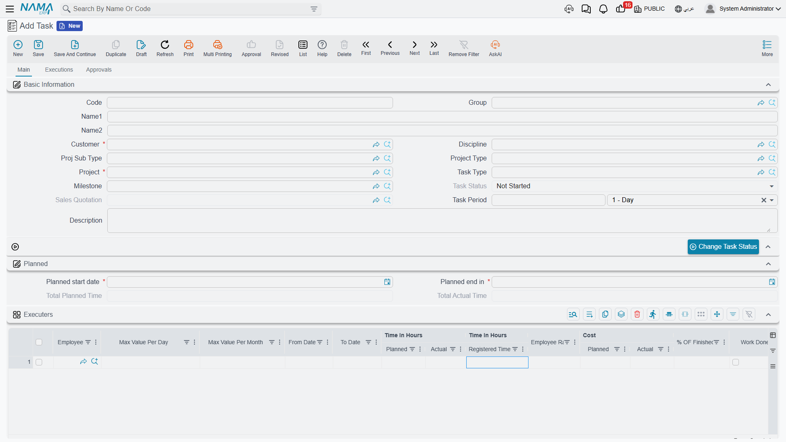

# Approving Worked Hours

Hours recorded on a [Tasks Executing](/modules/ecpa/task-execution/ecpa-timesheets) document are a claim, not a fact. They sit in the task's **Registered Time** column, they cost the project nothing, and they move no completion percentage. **TimeSheet Approval** is the document that turns them into fact: a project manager opens one, pulls in everything his teams have submitted, decides line by line what he accepts and how much of it, and commits. That commit is the moment registered hours become **actual** hours, the task's actual cost moves, and the project's totals catch up.

You will find it at **Project Management > Task Execution / Approvals > TimeSheet Approval**, under licence `ecpa`.

## The header is short, and the Manager field is the whole security model

There is very little to fill in: a book and code, an issue date, a value date, a description — and **Manager**, which defaults to the employee of the logged-in user.

That one field decides what the document is allowed to see. When you press *Collect Sheets*, the system only returns hours belonging to projects where **this manager is the project's manager or its vice-manager**. A manager cannot pull in, and therefore cannot approve, another manager's teams. Leave the field empty and the collection refuses to run at all.

A document term is optional here. The approval raises no accounting entry of its own, so the term carries exactly one setting, described at the end of this page.

## Collect Sheets — building the grid

The grid on this document is built by the **Collect Sheets** button, and that is how it is meant to be used: you do not type rows, you collect them and then decide on them.

Pressing it asks a set of range questions, all optional except where noted:

| Question | What it narrows |
|---|---|
| **From / To Project** | a range of project codes |
| **From / To Milestone** | a range of milestone codes |
| **From / To Employee** | a range of employee codes — the way a manager approves one person at a time |
| **From Date / To Date** | the working days to pull |
| **This Month** | ticked by default; while it is ticked it overrides the two dates with the current calendar month |

On top of whatever you answer, two conditions are always applied and cannot be relaxed:

- the line's sheet status is **Waiting Approval** and its document has been sent for approval — a timesheet nobody pressed *Send To Approval* on is invisible here, no matter how it is dated;
- the line's project has **this document's Manager as its manager or vice-manager**.

What comes back is not a copy of the timesheet lines. They are **aggregated into one row per employee, per day, per task**. A person who booked four hours in the morning and three and a half in the afternoon against the same task on the same day arrives as a single row of 7:30. Net times are summed, the employees' own line notes are joined together into **Employee Remarks**, and the rows are sorted by employee, then date, then task, so the grid reads like a timesheet a manager would recognise. Each row quietly remembers which original lines it came from, which is how the decision finds its way back to them on save.

Lines with no task on them are skipped, as are lines missing a date or a start time — the collection reports them rather than guessing.

::: tip Build the grid with Collect Sheets, not by hand
Only rows produced by *Collect Sheets* carry the link back to the timesheet lines they came from, and that link is what carries a decision back to the task and its executer row. If something is missing from the grid, collect it again with wider criteria rather than typing a row in.
:::

::: warning Collecting replaces the grid
*Collect Sheets* fills the grid with the result of the search — it does not add to what is already there. Press it a second time with different answers and the decisions you have already ticked are gone. Answer the questions for everything you intend to approve in one pass, or save the document before you collect again.
:::

Work that has already been decided will not come back: once a line is approved or rejected it is no longer *Waiting Approval*, so a later collection cannot find it.

## Deciding

Each collected row carries the facts on the left and the decision on the right.

| Column | Notes |
|---|---|
| **Employee**, **Task**, **Project**, **Customer** | who worked on what; project and customer are refreshed from the task |
| **From Date** | **read-only** — the day being decided on |
| **Time In Hours ǀ Planned** | the person's budgeted hours on that task, carried in for context so you can see what the approval will consume |
| **Work hours ǀ net** | **read-only** — the total the employee submitted for that day and task |
| **Approved Time** | **the manager's number.** Leave it empty on an accepted row and it is filled with the net time; type a smaller figure to approve part of the claim |
| **Accept** / **Reject** | ticking one unticks the other |
| **Employee Remarks** | what the employee wrote on his lines, joined together |
| **Description** | the manager's own reason — the place to record why time was cut or refused |

Two rules are enforced on save, and they are both about being decisive:

1. **Exactly one of Accept and Reject must be ticked on every row.** Leaving both blank is not "decide later" — it is an error, and the document will not save. If some rows are not ready, delete them from the grid and collect them again on a later document.
2. **Approved Time may not be negative, and may not exceed Net Time.** You can cut a claim; you cannot inflate one. Approving more hours than were recorded is not a thing this document can do.

**Accept All** and **Reject All** tick the whole grid at once, which is the normal starting point: accept everything, then walk down the exceptions.

## The manager's decision, worked through

Continuing the example: Sara recorded 7:30 on task CPAT-0207 on 05/03 and pressed *Send To Approval*. Her project manager opens a TimeSheet Approval with himself as Manager and presses **Collect Sheets** with *This Month* ticked. Her two lines arrive as one row:

| Employee | Task | From Date | Planned | Work hours ǀ net | Approved Time |
|---|---|---|---|---|---|
| EMP-115 Sara | CPAT-0207 | 05/03 | 60.00 | 7:30 | *(blank)* |

He accepts it, but cuts **Approved Time to 7:00** — the half hour after five was a coffee break — and types "30 min not chargeable" into Description. He saves.

## What committing writes back

This is the payoff, and it reaches three places at once.

**On the original timesheet lines.** Every line the row was built from is stamped with the outcome: accepted lines go to **Approved**, rejected ones to **Rejected**. The timesheet's own header status is then recomputed — all approved makes the sheet *Approved*, all rejected makes it *Rejected*, a mixture leaves it at *Waiting Approval*. Approved lines become read-only from that moment; they cannot be edited or deleted, and neither can the document that holds them.

**On the task's executer row.** This is the transfer the whole chain exists for:

- an accepted row moves the approved hours across — **Actual Time += Approved Time**, and **Registered Time −= Approved Time**;
- a rejected row simply removes the claim — **Registered Time −= Net Time** — and adds nothing to actual;
- the task's **Start From** is pulled back to the earliest day approved on it.

**On the task and the project totals.** Every task touched by the document is re-totalled — each executer row's actual cost as Actual Time × Employee Rate, the row's completion percentage, then the task's actual cost, total actual time and completion — and the parent projects are re-totalled after it. This is the only route by which the project screen's cost figure changes on its own.

In the worked example, Sara's row on CPAT-0207 now reads:

| | Before | After |
|---|---|---|
| Time In Hours ǀ Registered Time | 7.50 | **0.50** |
| Time In Hours ǀ Actual | 0.00 | **7.00** |
| Cost ǀ Actual | 0.00 | **630.00** (7.00 × 90.00) |
| % OF Finished | 0 % | **11.67 %** (7.00 ÷ 60.00) |

::: info The half hour that was cut stays registered
Notice the 0.50 left in Registered Time. When a manager approves less than was claimed, the difference is not returned to zero — it leaves the registered bucket only when it is decided on, and it never was. It is neither costed on the task nor billable, but it does sit against the executer row's planned-hours ceiling. If a task starts refusing timesheets sooner than its planned hours suggest it should, cut-back time from earlier approvals is usually the reason; raising the row's planned hours is the way to clear the path.
:::

The document also finishes off two jobs that belong to the timesheet. Any timesheet line carrying an expense item produces its [project expense request](/modules/ecpa/expenses/ecpa-project-expenses) at this point rather than earlier — which most sites will never see, because the expense columns are not on the standard timesheet grid and have to be placed there by a screen layout change first — and — if the approval's document term has **Regenerate Accounting Effect For Time Sheet Documents** ticked — each affected timesheet's ledger entry is re-issued as a business request and **processed** in the background. That single option is what makes *Create Accounting Effects For Approved Lines Only* on the timesheet's term useful: without the re-issue, a timesheet configured to book only approved lines would never book anything.

## Reversing a decision

Cancelling the approval undoes all of it. The source timesheet lines go back to **Waiting Approval** with no verdict on them, the approved hours are moved back out of the task's actual bucket and into registered, and the expense request the approval generated is removed. The hours are then available to be collected and decided on again.

## What happens next

Approved hours are the module's billable currency. On the [Project Invoice](/modules/ecpa/invoicing/ecpa-project-invoice), *Collect Times And Expenses* prices them at the task's Employee Rate multiplied by the **Normal Time Rate** from the [Project Management Settings](/modules/ecpa/ecpa-configuration) screen — so with an Employee Rate of 90.00, a Normal Time Rate of 1.5 and Sara's 7.00 approved hours, the invoice proposes **945.00** against the 630.00 the same hours cost the project. That gap is the practice's margin on her time, and it is the reason the module keeps cost and price on separate rates.

The invoice offers a second route as well, pricing the timesheet lines directly at their own Total Cost. The two routes count the same work in different objects, so a firm should settle on one of them and use it consistently — the invoice page sets out the choice.
