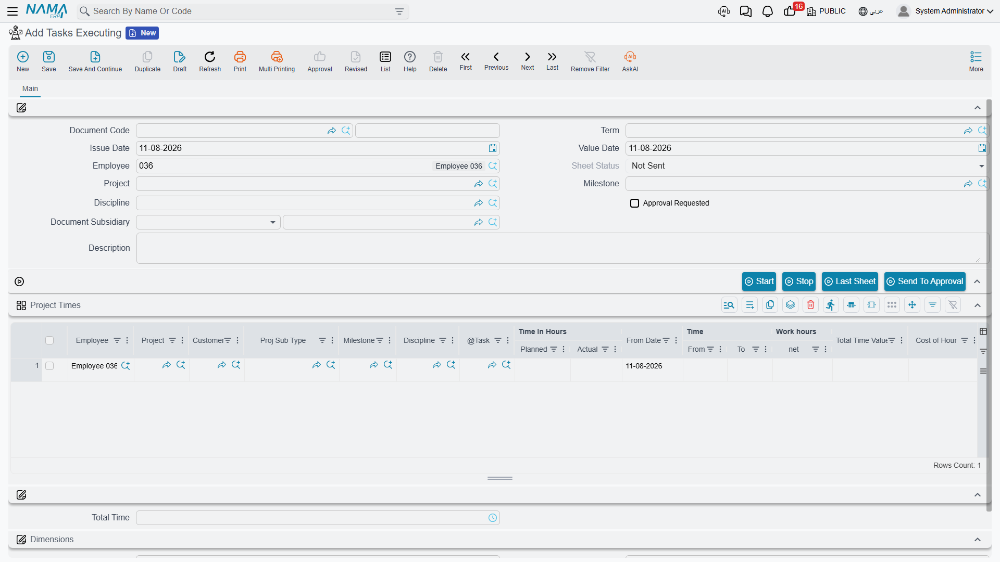

# Recording Worked Hours

Everything a professional-services firm sells passes through this screen. **Tasks Executing** is where an employee writes down what he actually did — this task, from nine to one, then that task, from two to half past five — and it is the point where hours stop being a plan and become a number the business can cost, approve and bill.

You will find it at **Project Management > Task Execution / Approvals > Tasks Executing**, under licence `ecpa`.

Unlike a [task](/modules/ecpa/tasks/ecpa-tasks), which is a master file edited in place, this is a **document**: it has a book, a code, an issue date and a value date, and committing it produces effects. Three of them, to be exact — it pushes hours onto the task, it moves the task and the project into *In Progress*, and it raises a labour cost entry in the ledger. What it does **not** do is finish the story. Recorded hours land in the task's *registered* bucket, which is the module's word for "claimed but not yet accepted"; turning them into actual work is the job of [Approving Worked Hours](/modules/ecpa/task-execution/ecpa-timesheet-approval).



## The header — one employee, one day

A timesheet normally covers **one employee for one value date**. The header sets the defaults every line inherits, and two of its fields do real work rather than merely labelling the document.

| Field | Notes |
|---|---|
| **Document Code** (book and code), **Issue Date** | the usual document identity |
| **Value Date** | **the field that decides the day.** Every line's From Date is set to the document's value date on every save — you do not date lines individually |
| **Term** | optional, but it is where all the configurable behaviour lives: the accounts the labour cost is booked to, the procedures group, and the book and term of a generated expense request. A sheet saved without a term is purely statistical |
| **Employee** | defaulted to the employee of the logged-in user on a new document. Changing it stamps that employee onto every line already in the grid |
| **Project**, **Milestone**, **Discipline** | header defaults; a line that leaves them empty falls back to these |
| **Sheet Status** | maintained by the system — *Not Sent*, *Waiting Approval*, *Approved*, *Rejected* |
| **Approval Requested** | set by the **Send To Approval** button, not by hand |
| **Document Subsidiary** | the account this document's cost is carried against; it accepts an additional-cost record, a project or a customer |
| **Description** | free text, and it becomes the narration on the ledger entry |

A **Dimensions** group closes the screen — legal entity, analysis set, branch, sector, department — and each grid line can override them individually. Where a line carries its own dimension the line wins; anything the line leaves blank falls back to the header.

## Who is allowed to record time against what

Two filters decide what an employee can pick, and between them they explain nearly every "the task isn't in the list" call support receives.

The **project** picker offers projects the employee actually belongs to, and skips projects that are Finished. A project builds that list from its manager, its vice-manager and the people named on its **Team Work** page, plus everyone appearing on the executers grid of any of its tasks.


The **task** picker then narrows that to tasks of the chosen project that are *Not Started* or *In Progress*, and on whose executers grid this employee appears. And the save checks it again: an employee who is not an executer of the task he named is refused, as is one whose executer row has been ticked **Work Done**, or one whose executer row's date window does not contain the document's value date.

So the sequence for onboarding somebody onto a piece of work is always the same: add him to the task's executers grid, **save the task**, and only then can he record time.

## A line is a block of time

Each row of the **Project Times** grid is one continuous block of work: a task, a start time, an end time. Two rows for the same person on the same day whose times overlap are refused, so the grid reads as a genuine timeline rather than a set of overlapping claims.

The left half of the grid says *what was worked on*:

| Column | Notes |
|---|---|
| **Employee** | **required**; only the chosen task's executers are offered |
| **Project**, **Customer**, **Proj Sub Type** | project is picked or inherited from the header; customer and sub-type follow it |
| **Milestone**, **Discipline** | limited to the project's own milestones and disciplines; both fall back to the header |
| **Task** | **the anchor of the line.** Everything downstream — the registered hours, the approval, the invoice — hangs off it |
| **Time In Hours ǀ Planned** and **ǀ Actual** | **read-only reference figures**, refreshed from the task's executer row on every save. They show you the person's budget and his approved total on that task, so you can see the ceiling you are approaching while you type |
| **From Date** | forced to the document's Value Date |
| **Time ǀ From**, **Time ǀ To** | **both required.** From Time may not be later than To Time |
| **Finished Percentage** | how complete the employee considers the task after this block of work; typing it fills **Remaining Percent** with the difference from 100 |
| **Procedure**, **Next Procedure**, **Next Procedure Date** | see *Procedures raised from a line* below |
| **Description** | the employee's own note. It travels through to the approval, where the manager sees it as *Employee Remarks* |
| **Internal Account** | marks the work as internal — not to be passed to the customer |
| **Attachment**, **Line Subsidiary** | supporting file and the account the line is carried against |

The right half is the money.


| Column | Notes |
|---|---|
| **Work hours ǀ net** | To Time minus From Time, as a time value. Computed |
| **Total Time Value** | the same figure in decimal hours — 3:30 becomes 3.50. This is the number every calculation downstream uses |
| **Cost of Hour** | what an hour of this person costs the firm. See below |
| **Total Cost** | net decimal hours × Cost of Hour |
| **Currency**, **Rate**, **Local Amount** | the currency and rate come from the project's account; the local amount is Total Cost converted |
| **Invoice** | **read-only.** Stamped with the project invoice that billed this line, and its presence is what stops the line being billed a second time |

A **Total Time** field under the grid adds the net times up, which is the number an employee checks against his own day before pressing save.

### Where Cost of Hour comes from

This is the rate the *ledger* uses, and it is not the rate on the task. When **Update Hour Cost of TimeSheet From HR** is ticked on the [Project Management Settings](/modules/ecpa/ecpa-configuration) screen and **Standard Monthly Hours** is not zero, every save recomputes it:

```text
Cost of Hour  =  the employee's total constant salary in HR  ÷  Standard Monthly Hours
Total Cost    =  net decimal hours  ×  Cost of Hour
```

With that setting off, Cost of Hour is yours to type, and Total Cost with it. It matters that you do type them, because Total Cost is the amount the ledger entry carries and the amount an invoice bills when it collects executions — a line left at zero books nothing and bills nothing.

Do not confuse this with the **Employee Rate** on the task's executer row, which drives the task's own planned and actual cost. The [Project Tasks](/modules/ecpa/tasks/ecpa-tasks) page sets the two side by side; the short version is that the task's rate is what the work is worth to the project, and Cost of Hour is what the firm pays in salary for it.

## The stopwatch

Four buttons sit between the header and the grid, and the first two turn the screen into a timer for people who record work as they do it rather than at the end of the day.

**Start** looks at the last row of the grid. If that row is complete, it appends a new one — copying the employee, project and task from it — with today's date and the current time as From Time. If the last row is only half filled in, it completes whichever of From Date and From Time is missing. Either way you get a running block with no end.

**Stop** closes that block: To Date is set to the row's From Date, To Time to the current time, and the row's net time and the document's Total Time are recomputed on the spot.

**Last Sheet** opens your own most recent timesheet, which is how most people start their day — open yesterday's, glance at it, press New.

**Send To Approval** hands the document to the manager. The document must be saved first; pressing it marks the sheet *Approval Requested* and re-commits it, which moves the header and every line to **Waiting Approval**. Until then the sheet sits at *Not Sent* and no approval document can see it.

## What committing a timesheet does

Commit the document and four things follow.

1. **The work starts officially.** Every task named on a line, and the header's project, move from *Not Started* to *In Progress* if that is where they were.
2. **Hours land on the task.** For each line, the matching executer row's **Registered Time** increases by the line's net decimal hours. Actual hours do not move — nothing here is approved yet.
3. **A cost entry is raised in the ledger** — described in its own section below.
4. **Procedures are created** from any line that carries next-action text, provided the document term names a procedures group.

Two checks run before any of that. The daily and monthly ceilings on the executer row are tested against everything this employee has already recorded on that task for the same day and the same calendar month, and — on the document's first commit — the task's actual hours plus the hours on this document are compared against the executer row's planned hours. Exceeding either is refused with a message naming the task.

::: info The task's planned hours are checked at both ends
The executer row rejects a save when actual + registered exceeds planned, and so does the timesheet. If a term has **Consider Registered Time With Save** ticked, the timesheet counts pending hours in that comparison too — which is the stricter and usually the more sensible setting on a busy project, because it stops a team collectively over-booking a task while approvals are still queued.
:::

### Sara's day

Continuing the example from [Project Tasks](/modules/ecpa/tasks/ecpa-tasks): the practice has *Update Hour Cost of TimeSheet From HR* ticked and *Standard Monthly Hours* set to **176**. Sara's constant salary is 12 000, so her Cost of Hour resolves to **68.18**.

She opens a timesheet with Value Date 05/03 and Employee EMP-115, and records two blocks against task CPAT-0207:

| # | Task | Time ǀ From | Time ǀ To | net | Cost of Hour | Total Cost |
|---|---|---|---|---|---|---|
| 1 | CPAT-0207 | 09:00 | 13:00 | 4:00 | 68.18 | 272.72 |
| 2 | CPAT-0207 | 14:00 | 17:30 | 3:30 | 68.18 | 238.63 |

**Total Time** reads 7:30 — 7.50 hours, comfortably inside the eight-hour daily ceiling on her executer row. She saves, and:

- task CPAT-0207 and project PRJ-014 both move to **In Progress**;
- Sara's executer row on the task now shows **Registered Time 7.50** and **Actual 0.00**;
- a ledger entry for **511.35** is queued.

She presses **Send To Approval**. The sheet and both lines go to **Waiting Approval**, and from that moment the document is visible to her project manager.

## The ledger effect

A timesheet books labour cost, and it does so **only when the document has a term whose Debit and Credit sides are both configured**. If either side is missing, no entry is produced at all — the document remains a purely statistical record of hours.

When both sides are set, the document produces **one ledger line per timesheet line**, valued at that line's **Total Cost**, in the line's currency at the line's rate. Lines worth zero are dropped. The accounts on each side come from the term in the ordinary way, and the document offers the side configuration three subsidiaries to choose from — the line's **employee**, that employee's **department**, and the line's **project** — alongside the document and line subsidiaries. Dimensions come from the line where the line has them and from the header otherwise, and the document's Description becomes the narration. In a typical set-up the entry debits a labour-cost or work-in-progress account and credits a salary-accrual account.

The entry is not written the instant you press save. Committing the document raises a **business request**, and the request is **processed** in the background — so saving is immediate, and a failure to process shows up in the Business Requests list view where it can be retried from the More menu.

::: tip Booking cost only after a manager has signed off
Tick **Create Accounting Effects For Approved Lines Only** on the timesheet's term and only lines a manager has approved are converted into ledger lines. On its own that would mean nothing was ever booked, because approval happens after the timesheet is committed — so pair it with **Regenerate Accounting Effect For Time Sheet Documents** on the *approval* document's term, which re-issues the timesheet's entry once the decisions are in. The two options together are how a firm keeps unapproved claims out of the accounts.
:::

## Procedures raised from a line

An employee finishing a block of work often knows what has to happen next. Typing that into the line's **Next Procedure** — with a date in **Next Procedure Date** — creates a [procedure](/modules/ecpa/projects/ecpa-procedures) record when the document is committed, named after the text and carrying the employee, customer, project and task from the line. The created record is written back into the line's **Created Procedure** column so you can open it from the sheet.

This only happens when the document's term names a **Procedures Group**; with no group configured, next-action text is just text. Cancelling the timesheet deletes the procedures it created.

## Expenses recorded on a timesheet line

A timesheet line can also carry an **Expense Item** and a value — the taxi to site, the printing bill — so that an employee records his hours and his out-of-pocket spend in one place. When an approval for the sheet is committed, the system raises a [project expense request](/modules/ecpa/expenses/ecpa-project-expenses) automatically, in the **Generation Book** and **Generation Term** named on the timesheet's term, with one request line per expense line carrying the project, task, expense item, value, employee and the *Internal Account* flag. Cancelling the timesheet deletes the generated request.

These two columns are not part of the standard Project Times grid; a firm that wants to record spend this way adds them to the grid through a screen layout change first. The alternative, and the more common one, is to raise the expense request directly on its own screen.

## Editing a sheet after it has been sent

Once a manager has approved a line, that line is frozen. Its employee, project, task, date, times and remarks may not be changed and the line may not be deleted; the document as a whole cannot be deleted while any line on it is approved. Correcting approved work therefore starts with the approval document, not with the timesheet.

Lines that were rejected, or that are still waiting, remain editable. Re-committing a sheet re-does its effects cleanly: the old lines' registered hours are subtracted from the task and the new ones added, and the ledger entry is re-issued.

## The Time Sheet Request

The menu holds a second, near-identical screen: **Time Sheet Request** (طلب تنفيذ مهام), at **Project Management > Task Execution / Approvals > Time Sheet Request**. It is a record of **intended or claimed work** — the same header, the same grid, the same document term class as the timesheet, with most of the timesheet's validation switched off.

| | Tasks Executing | Time Sheet Request |
|---|---|---|
| From Time and To Time | required | not required |
| Overlapping blocks on the same day | refused | allowed |
| Employee must be an executer of the task | checked | not checked |
| Actual hours against the executer's planned hours | checked | not checked |
| A line's From Date | always forced to the Value Date | defaulted from the Value Date only when empty |
| Hours added to the task's Registered Time | yes | no |
| Ledger entry from the document term | yes | yes |

Read that last row twice, because it is the point of the screen and the thing that surprises people: **a committed request books its cost to the ledger exactly as a timesheet does**, through the same term, valued the same way, processed the same way. What it does not do is touch the task. Registered hours stay where they were, planned-hours ceilings are not consulted, and the task's status does not change.

That combination makes it useful for capturing work loosely — hours claimed for a period before anyone has decided which task they belong to, or work by people who are not yet on the task's executers grid — while still getting the cost onto the books. Approval and billing run off the Tasks Executing document, so a firm that needs its hours approved and invoiced records them there.

::: warning The request is a dead end, not a first step
There is no way to turn a Time Sheet Request into a Tasks Executing document: nothing converts it, and no approval or invoice ever sees its lines — *Collect Sheets* and *Collect Executions* both read timesheet lines only. Use the request for cost capture and nothing else, and record anything that has to be approved or billed on a Tasks Executing document from the start.
:::

## What happens next

Once the sheet is at *Waiting Approval*, the manager takes over — see [Approving Worked Hours](/modules/ecpa/task-execution/ecpa-timesheet-approval), which is where registered hours become actual hours and the task's cost finally moves. Billing follows from there, on the [Project Invoice](/modules/ecpa/invoicing/ecpa-project-invoice), which can price work either from these lines' Total Cost or from the approved hours at the task's Employee Rate. The invoice page explains which route to choose; the important thing from here is that a line billed once carries the invoice's stamp and is never collected again.
