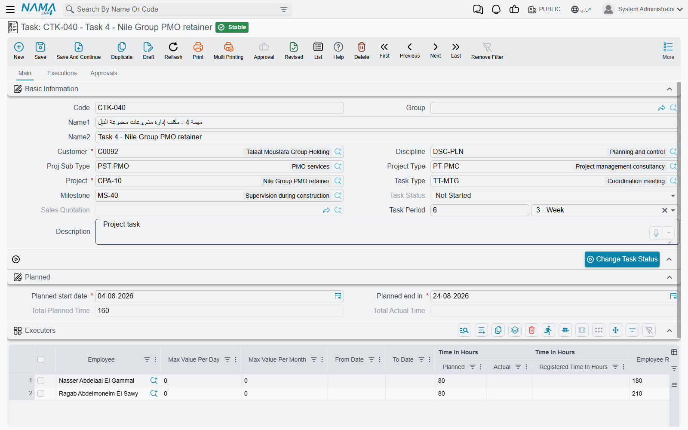
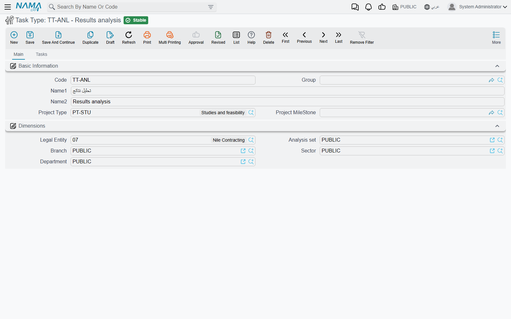

# Project Tasks

A project in Project Management (ECPA) is a container: a customer, a set of milestones, a set of disciplines. It holds no work. The **task** is where the work lives — "M2 structural drawings", "site survey", "tender documents" — and, more importantly, it is where the *people* live. A task names the employees who will do it, how many hours each of them is budgeted, and what an hour of each of them costs. That single grid is the module's labour budget, and it is also the running actual: as hours are recorded and approved, they accumulate on the very same rows, next to the planned figures, so a project manager can see per-person over-run at a glance without opening a report.

You will find it at **Project Management > Tasks > Task**, under licence `ecpa`.

## Where a task sits in the chain

Three screens carry the labour side of the module, and they only make sense together. The task is the first of them.

```text
  Task                  Tasks Executing         TimeSheet Approval        Project Invoice
  (master file)         (document)              (document)                (document)

  who will work,   ──►  what was actually  ──►  what the manager     ──►   what the customer
  how many hours,       worked, hour by         accepted                   is billed
  at what rate          hour

  planned hours         registered hours        actual hours               invoice lines
  planned cost          + a cost entry in       + actual cost
                          the ledger            + refreshed project
                                                  totals
```

Read that middle column carefully, because it is the idea most people miss on first contact. Hours recorded on a timesheet are **registered** — submitted, pending, believed. They do not count as work done and they do not produce a cost on the task. Only a manager's approval turns registered hours into **actual** hours, and only then does the task's actual cost move. The two buckets sit side by side on the executers grid, which is why that grid is the centre of this page.

The task itself is a **master file**, not a document. It has no book, no document term and no accounting effect of its own; it is created once and edited in place for as long as the work runs. But do not read "master file" as "static" — **saving a task is what refreshes the parent project's totals**, and that matters more than it sounds. The project screen's planned time, actual time, cost and completion percentage are all sums over its tasks, stored when a task is saved. Saving the *project* does not recompute them.



## The header — what the task belongs to

The top of the screen answers "which piece of which project is this?".

| Field | What it does |
|---|---|
| **Code**, **Name1**, **Name2**, **Group** | the usual master-file identity; Name1 is the Arabic name and Name2 the English one |
| **Project** | **required**, and it is the field that drives everything else. Picking a project copies its legal entity, sector, branch, department, analysis set and its customer onto the task |
| **Customer** | **required**, but you rarely type it — it arrives from the project, and the save refuses if the two disagree |
| **Milestone** | which phase of the project this task belongs to. If the project has milestones at all, this becomes required. Picking a milestone first will fill the project in for you |
| **Discipline** | the professional speciality doing the work — Structural, Architectural, Electrical |
| **Task Type** | the classification described below |
| **Project Type**, **Proj Sub Type** | inherited from the project; whatever you type here is replaced from the project every time the task is saved |
| **Task Status** | maintained by the system and by the status button, not typed |
| **Sales Quotation** | filled in for you when the task was generated from a [project sales quotation](/modules/ecpa/projects/ecpa-sales-quotation) |
| **Task Period** | a value plus a unit — "10 · Day". Type it and the planned end date is worked out from the planned start; change either date and the period follows |
| **Description** | free text |

Below that sits the **Planned** group — **Planned start date** and **Planned end in**, which have to fall inside the project's own planned window, plus **Total Planned Time** and **Total Actual Time**, both of them sums over the executers grid.

At the bottom of the page an **Actual** group shows what the approvals have produced: **Start From** (pulled back to the earliest approved working day), **Actual Cost** and **% OF Finished**. All three are read-only; nothing on this group is typed.

### Task Type

A task type is a short list a firm sets up once — "Design", "Site Supervision", "Report Writing" — and its one piece of real configuration is the **Project Type** it names.



That field does two things. The Task Type lookup on a task only offers types whose project type matches the project you chose, so an engineering-office project never sees a task type meant for facility management. And the same rule is checked again when the task is saved: if the task type's project type and the project's project type disagree, the save is refused.

## The Executers grid — the heart of the task

One row per person. Each row is simultaneously a budget line ("Sara has sixty hours on this"), a rate card ("her hour costs ninety"), a permission ("she may book time on this task, between these dates, up to eight hours a day") and a running total ("she has done seven of them, and half an hour is still awaiting a decision").


| Column | What it is for |
|---|---|
| **Employee** | **required**. Picking someone copies the hourly rate from that employee's own file into **Employee Rate** |
| **From Date** / **To Date** | the window inside which this person may record time on this task. A timesheet dated outside it is refused |
| **Max Value Per Day** | a ceiling on hours this person may record on this task in one day |
| **Max Value Per Month** | the same ceiling over a calendar month |
| **Time In Hours ǀ Planned** | the budget — how many hours this person is given |
| **Time In Hours ǀ Registered Time** | **maintained by the system.** Hours submitted on timesheets and not yet decided on |
| **Time In Hours ǀ Actual** | **maintained by the system.** Hours a manager has approved. Only the approval document moves this number |
| **Employee Rate** | the hourly rate this task costs the person at. Defaulted from the employee's file, editable afterwards |
| **Cost ǀ Planned** | Employee Rate × Planned hours, recomputed as you type either |
| **Cost ǀ Actual** | **read-only.** Employee Rate × Actual hours |
| **% OF Finished** | **read-only.** Actual hours ÷ planned hours for this row |
| **Work Done** | tick it when this person has finished. He can no longer record time on the task, and he drops off the list of people the task offers |
| **Planned start date** / **Planned end in** | this person's own slice of the task's schedule; both must sit inside the task's planned dates |

::: info Planned hours are a ceiling, not just a target
The save checks every row: **actual plus registered hours may not exceed planned hours**. So a row budgeted sixty hours will not accept a sixty-first, and the fix is to raise the planned figure deliberately rather than let it drift. It is the closest thing the module has to enforcement — the estimated-cost figures elsewhere in Project Management enforce nothing.
:::

### A task, filled in

Take an architecture practice running project **PRJ-014 "Al-Nakheel Tower"** for customer **CUS-0032 Nakheel Development**. Milestone **M2 – Detailed Design** needs structural drawings, so the practice raises task **CPAT-0207 "M2 Structural drawings"**, discipline Structural, planned 01/03 → 31/03, and puts two people on it:

| Employee | Planned hrs | Employee Rate | Cost ǀ Planned | Max/day | Max/month | From – To |
|---|---|---|---|---|---|---|
| EMP-115 Sara | 60 | 90.00 | 5 400.00 | 8 | 120 | 01/03 – 31/03 |
| EMP-122 Omar | 40 | 75.00 | 3 000.00 | 8 | 120 | 01/03 – 31/03 |

The task is worth **8 400.00** of planned labour, and its status is **Not Started**. Registered and Actual are both zero on both rows, and will stay zero until somebody records time — which is the subject of [Recording Worked Hours](/modules/ecpa/task-execution/ecpa-timesheets).

## Two hourly rates, and why they disagree

This is the single most common source of confusion in the module, so it is worth being blunt: **there are two hourly rates, they come from different places, and they answer different questions.** Neither is wrong when they differ.

| | **Employee Rate** (on the executer row) | **Cost of Hour** (on the timesheet line) |
|---|---|---|
| Where you see it | the task's Executers grid | each line of a Tasks Executing document |
| Where the number comes from | the hourly rate held on the employee's own file, copied in when you pick him — and editable on the row afterwards | the employee's total constant salary in HR, divided by **Standard Monthly Hours** from the module settings, recalculated on every save |
| Who controls it | the project manager, per task | payroll and the module settings, globally |
| What it produces | **Cost ǀ Planned** and **Cost ǀ Actual** on the task, which roll up into the project's cost total | **Total Cost** on the timesheet line, which is the amount that reaches the general ledger |
| What else reads it | the project invoice, when it bills approved hours | the project invoice, when it collects executions |

In the worked example Sara's Employee Rate is **90.00**, while her timesheet lines will cost **68.18** an hour — her salary of 12 000 divided by 176 standard monthly hours. When she records 7.50 hours and the manager approves 7.00 of them, the task's actual cost rises by 7.00 × 90.00 = **630.00** while the ledger carries 7.50 × 68.18 = **511.35**. Both figures are correct. The task is telling you what the work is *worth to the project at the rate the manager committed to*; the ledger is telling you what the firm *actually paid in salary* for the hours that were spent.

::: tip Which one do I change?
If a project is over budget on paper but the accounts look fine, you are looking at Employee Rate. If the ledger's labour cost looks wrong for everybody at once, you are looking at Standard Monthly Hours and the *Update Hour Cost of TimeSheet From HR* setting — both live on the [Project Management Settings](/modules/ecpa/ecpa-configuration) screen.
:::

## Filling the grid faster

Two actions on the task **list view** work on several tasks at once, which is how a firm sets up a whole milestone's worth of tasks in one pass. Select the tasks, then open the More menu.

**Add Executors** asks you for up to six employees and appends each of them as a new row on every task you selected, stamping the hourly rate from each employee's file as it goes. Employees who are already on a task are skipped, so running it twice does no harm.

**Recalculate Hourly Rate** re-reads every executer row's rate from the employee's file and saves. It is the annual-review button: change the rates on the employee files, select the live tasks, run it once.

::: warning Recalculating rewrites rates you edited by hand
Recalculate Hourly Rate overwrites **every** executer row on every selected task with the employee's current file rate. Any rate you tuned by hand for a particular task is lost. Select deliberately.
:::

Note that neither action touches hours already recorded. Planned cost is recomputed from the new rate; actual cost follows on the next save.

## Task status

A task carries one of six states — **Not Started**, **In Progress**, **Finished**, **Closed**, **Postponed**, **Cancelled** — and only the first two ever change on their own. A new task opens at *Not Started*, and the moment the first timesheet naming it is committed it becomes **In Progress** (the parent project makes the same jump at the same moment). Everything after that is a human decision, taken with the **Change Task Status** button on the screen, or with **Change Status** on the list view for a batch of tasks at once.

The two buttons behave slightly differently and it is worth knowing which you pressed. On the edit screen, Change Task Status writes your choice onto the open form and leaves it there — **you still have to save**. On the list view, the choice is applied and saved on every selected task immediately.

Status is a label with one piece of teeth: a task marked **Finished** accepts no further timesheet lines, and the task picker on a timesheet only ever offers tasks that are *Not Started* or *In Progress*. Closing out a milestone by walking its tasks to Finished is therefore a real control, not just tidiness.

::: info There is no dependency between tasks
Nothing in the module says "task B starts when task A ends". Sequencing is expressed through milestones and planned dates only — there is no predecessor field, no critical path and no Gantt view.
:::

## What saving a task changes

Saving is quiet but consequential. Every save:

1. re-copies the project type and sub-type from the project;
2. recomputes each row's planned cost from rate × planned hours, and each row's actual cost and completion percentage from the approved hours;
3. rolls those up into the task's **Actual Cost**, **Total Planned Time**, **Total Actual Time** and **% OF Finished**;
4. **refreshes the parent project's totals** — its planned and actual time, its cost figure and its completion percentage;
5. rebuilds the list of employees who are allowed to book time to this task and to this project.

Point 5 deserves a sentence of its own, because it is the answer to "why can't the employee find the task on his timesheet?". An employee appears in a task's picker only if he is on that task's executers grid and his row is *not* ticked Work Done — and the task is only offered inside a project the employee belongs to, which the project builds from its manager, vice-manager and [Team Work](/modules/ecpa/projects/ecpa-managed-project) page. Add someone to a task and save it, and he can record time against it a moment later. Forget to save, and he cannot.

## Rules that stop a save

Besides the planned-hours ceiling described above, the task refuses to save when:

- the task's customer is not the project's customer;
- the project has milestones and no milestone was chosen;
- the task type's project type does not match the project's project type;
- the task's planned dates fall outside the project's planned window, or an executer row's planned dates fall outside the task's;
- you deleted an executer row that already carries approved hours, or changed the employee on such a row — approved work cannot be silently reassigned;
- the same employee appears on two rows whose date ranges overlap.

## The Executions and Approvals pages

The task screen's second and third tabs are read-only windows onto the two documents downstream of it, and they save a great deal of hunting.

**Executions** lists every timesheet line raised against this task — employee, dates, from and to time, and the completion percentage the employee claimed. It is the audit trail for "who worked on this and when".

**Approvals** lists every approval line for the task — project, employee, whether it was approved, the approved time, and the completion and remaining percentages. It is the audit trail for "what was actually accepted".

## Procedures on a task

The Main page closes with a list of the [procedures](/modules/ecpa/projects/ecpa-procedures) recorded against this task — follow-up notes with an owner, a date and a status. You can raise them by hand, and they are also created for you from a timesheet line whenever the employee types something into *Next Procedure* and the timesheet's document term names a procedures group. It is the module's "what happens next" log, hanging off the task it belongs to.
