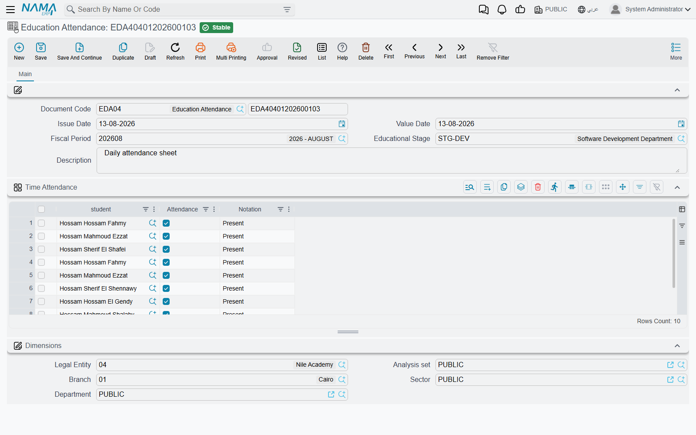
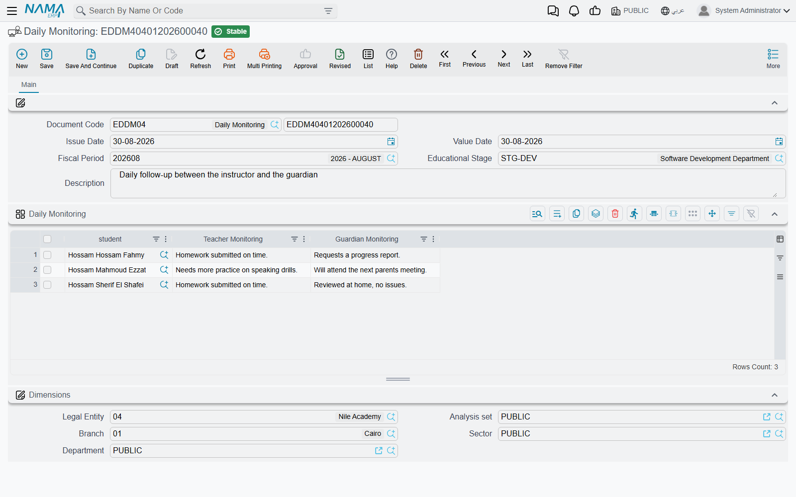
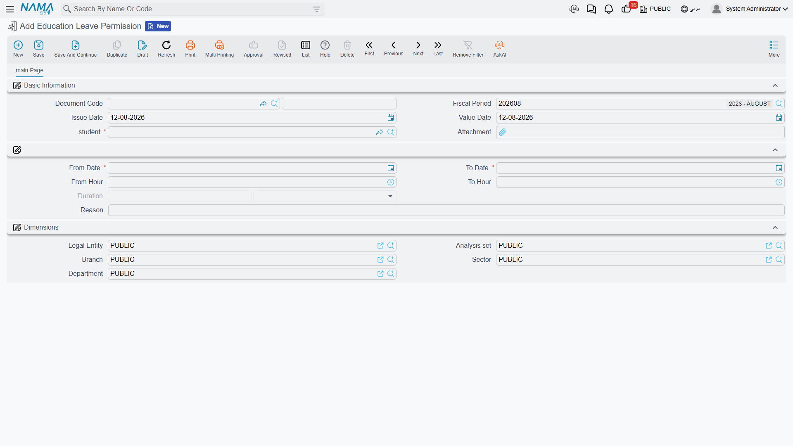
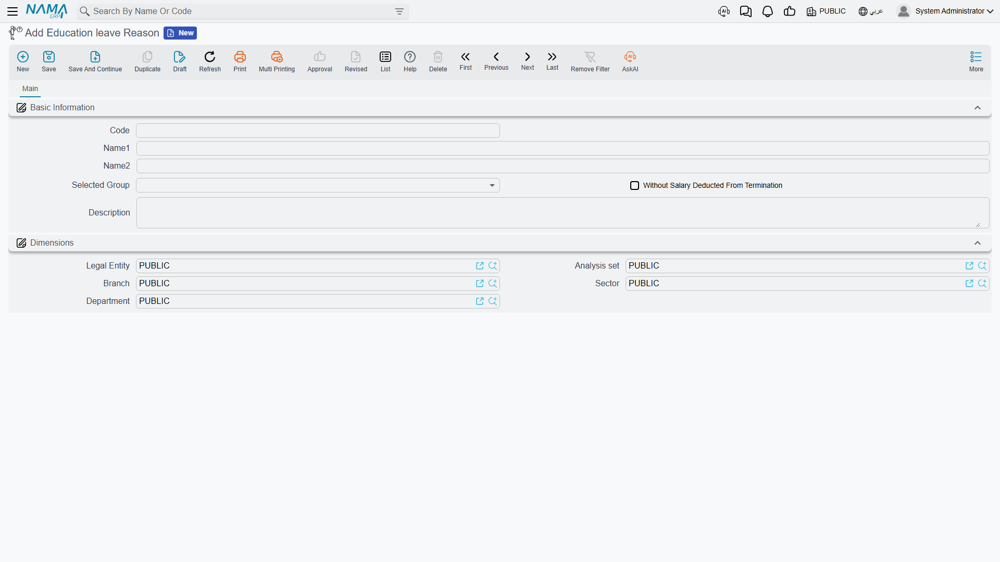

# Attendance, Daily Monitoring and Leave

Three screens carry the day-to-day life of a school: who was in class this morning, what the
teachers and the families had to say about a pupil, and who was allowed to leave early. In Nama
those are **Education Attendance**, **Daily Monitoring** and **Education Leave Permission**, and
they are among the most frequently used screens in the whole module — one school day produces
several of them, every day, all year.

Education Attendance and Education Leave Permission live under
**Education → Time Attendance** (**التعليم ← الحضور / الإنصراف**), together with the
**Education Leave Reason** list. Daily Monitoring is reached from
**Education → Master Files → Daily Monitoring** (**التعليم ← الملفات ← متابعة يومية**).

## Education Attendance — one sheet per stage, per day

The first thing to understand about attendance in Nama is the size of the unit it records. One
Education Attendance document covers **one educational stage on one day** — not one lesson, not one
subject, not one teacher's period. There is no timetable behind it and no session to attach it to.
The question it answers is the register question a school asks once, at the start of the day: was
this child in school today?

The header is what fixes that. Alongside the document code and the **Issue Date**
(تاريخ التحرير), the fields that matter are:

- the **Value Date** (التاريخ الفعلي) — **the school day being recorded**, which is what makes one
  sheet different from the next;
- the **Educational Stage** (المرحلة التعليمية) — the stage whose pupils this sheet covers, as
  described in [Students, Guardians and the Academic Structure](./education-master-files);
- a **Fiscal Period** (الفترة), and a **Description** (ملاحظات) for anything the sheet as a whole
  needs to say — "school closed at 11:00 for the sandstorm".

Then a single grid, **Time Attendance** (الحضور / الإنصراف), with one line per pupil:

| Column | What goes in it |
|---|---|
| **student** (الطالب) | The pupil this line is about |
| **Attendance** (الحضور) | A tick. Ticked means present; left unticked, the line records an absence |
| **Notation** (ملاحظات) | Free text for that one pupil — "arrived 8:40", "sick note from the guardian", "left with her mother before assembly" |

### The daily rhythm

Picture a school with three stages — Primary, Preparatory and Secondary. Every morning it produces
**three** attendance documents, one per stage, each dated with that day. The Primary sheet has
thirty lines, one per pupil: twenty-seven ticked, three left unticked, and a note against two of the
three saying why. Tomorrow the same three sheets are created again with tomorrow's Value Date. Over
a five-day week that is fifteen documents, and a term's attendance for the whole school is simply
the pile of them.

Because the stage is on the header and the day is on the header, that pair is what you search on
afterwards. "Preparatory on the 3rd of March" is one document; "Ahmad's whole term" is a search
across the lines.

### You pick the pupils onto the sheet

This is the part that surprises people arriving from other systems, so it is worth saying plainly:
**the grid does not fill itself**. Nama's Education module has no enrolment document — nothing
registers a pupil into a course, a class or a section as a transaction — so there is no enrolment
list for the sheet to be built from. You add the lines and choose each **student** yourself.

In practice that is less work than it sounds, because a day's sheet is the same list of pupils as
yesterday's. The habit that works is to build each stage's sheet once, carefully, and then use the
ordinary **duplicate** action (نسخة مماثلة) on it each morning: the copy arrives with the same stage
and the same thirty pupils already on it, and all the form teacher does is set the Value Date and
correct the ticks. A stage's sheet is typed in full once and maintained thereafter — new pupils
added as they join, leavers removed as they go.

::: tip Attendance here is about pupils, not staff
Education Attendance is the pupils' register and stands entirely on its own. Staff attendance,
fingerprint and card devices, shifts and overtime belong to the HR side of the system and are
recorded there against employee records. Pupils' ticks are filled in by hand, by whoever takes the
register.
:::

## Daily Monitoring — the follow-up diary

Daily Monitoring has exactly the same shape as attendance — the same document code, **Issue Date**,
**Value Date**, **Fiscal Period**, **Educational Stage** and **Description**, with a grid of pupils
underneath — but what it carries is completely different. There is no presence tick anywhere on it.
Each line holds two pieces of writing:

| Column | What goes in it |
|---|---|
| **student** (الطالب) | The pupil being followed up |
| **Teacher Monitoring** (ملاحظة المدرس) | What the teacher observed — **required** |
| **Guardian Monitoring** (ملاحظة ولى الأمر) | What the guardian said, or what the guardian was told — **required** |

Both notes are required, and that requirement tells you how the screen is meant to be used. A line
completes only when the school has both halves of the conversation: the observation *and* the
family's side of it. So a Daily Monitoring document is not a full class list — it carries the
handful of pupils who actually needed following up that day.

The two screens work as a pair. Attendance answers *was the child here*; Daily Monitoring answers
*how did the day go, and what did we say to the family about it*. A Primary sheet on the 3rd of
March might carry thirty ticked lines, while the same day's monitoring document carries four: one
pupil who has been quiet since the term began, with the mother's reply after the phone call; one who
did not hand in the science project, with the father's promise to see to it; and two who fell out in
the playground, each with the note that went home. The next follow-up starts by reading those lines
back.

Schools that keep a written communication log with families, or that need to show a pattern of
contact before taking a step with a pupil, get that log out of this screen. Since the Value Date
sits on the header, a term's diary for a stage is just the sequence of its documents, in order.

## Education Leave Permission — the pupil who left early

A leave permission is the slip: one document, one pupil, one absence that somebody authorised. Where
an attendance line only says a pupil was not there, the permission says for how long and why.

The document names the **student** (الطالب) and the period, alongside the usual document code,
**Issue Date**, **Value Date** and **Fiscal Period**:

| Field | What goes in it |
|---|---|
| **From Date** (من تاريخ) | The first day away — required |
| **To Date** (إلى تاريخ) | The last day away — required |
| **From Hour** (من ساعة) / **To Hour** (إلي ساعة) | The times, when the absence is part of a day rather than whole days |
| **Reason** (السبب) | **Free text** — you type the reason onto the document in your own words |
| **Attachment** (مرفق) | One file: the scanned request, the medical note, the guardian's letter |

The two commonest cases both fit comfortably. A pupil collected at midday for a dentist appointment
gets From Date and To Date both set to the 3rd of March, From Hour 12:00 and To Hour 14:30, the
reason typed as "collected by his father at 12:15, dental appointment", and the appointment card
attached. A family travelling for a bereavement gets From Date the 3rd and To Date the 6th, no
hours, the reason written out, and the guardian's letter attached.

Because the reason is free text, it can say exactly what happened rather than forcing the nearest
item from a list — which is what you want on a slip a guardian may later ask to see. It also means
the wording is whatever the person at the desk typed, so schools that care about consistency agree
on a house style for it.

### Education Leave Reason — the school's standard list

**Education Leave Reason** (سبب الإنصراف) sits in the same **Time Attendance** menu group and is
where a school writes down its own standard list of reasons: a code, the Arabic and English names,
and a **Description** (الوصف) spelling out what the reason covers.

It is the school's reference list — the agreed vocabulary, kept in one place so that "medical
appointment", "family travel", "religious occasion" and "collected early by guardian" mean the same
thing to everyone and read the same way on every slip. Staff consult it and write the agreed wording
into the permission's Reason field.

## All three record information only

Say this once and it explains a great deal about how freely these screens can be used.

Education Attendance, Daily Monitoring and Education Leave Permission are **records**. Saving them
creates **no accounting entry** and **no stock movement**, and **nothing downstream consumes them** —
a tick does not deduct a fee, a leave permission does not write an absence onto an attendance sheet
and changes nothing on a contract, and a monitoring note reaches no other document. Money in the
Education module travels only through the [Course Contract](./education-course-contracts) and its
[payment schedule](./education-payment-schedules); the register never touches it. Marks live
entirely on their own document as well — see [Recording Marks](./education-marks).

That independence is the practical point. A form teacher can enter, correct and re-enter a day's
register, a note or a slip without any risk of disturbing a balance, a receivable or an instalment,
and none of it waits on the finance office. What these three screens give the school is the written
history: who was in, how each day went, and who was let out — kept per stage, per day, for as far
back as the school has been entering them.
