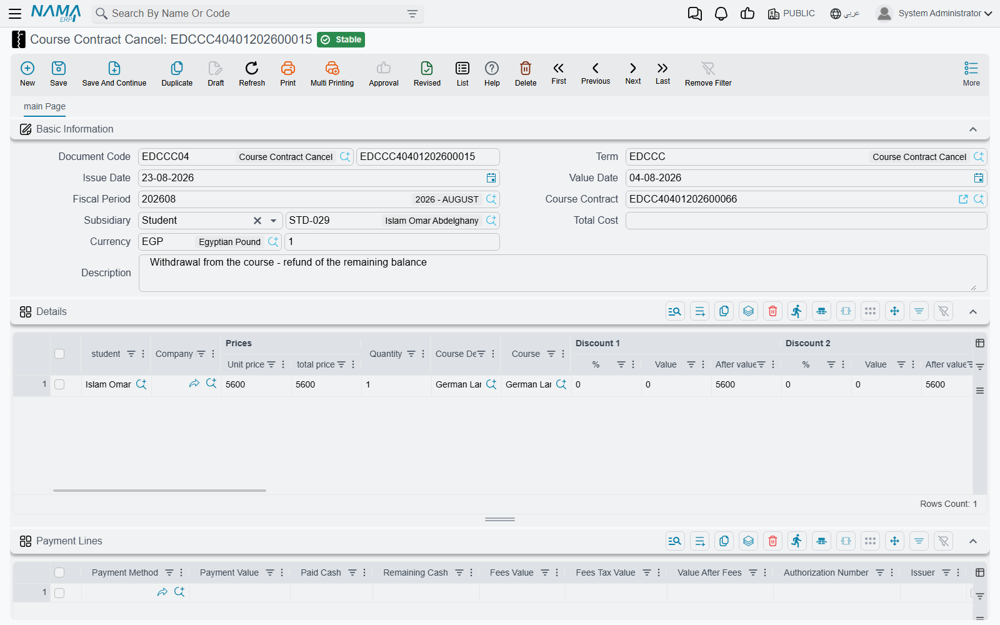
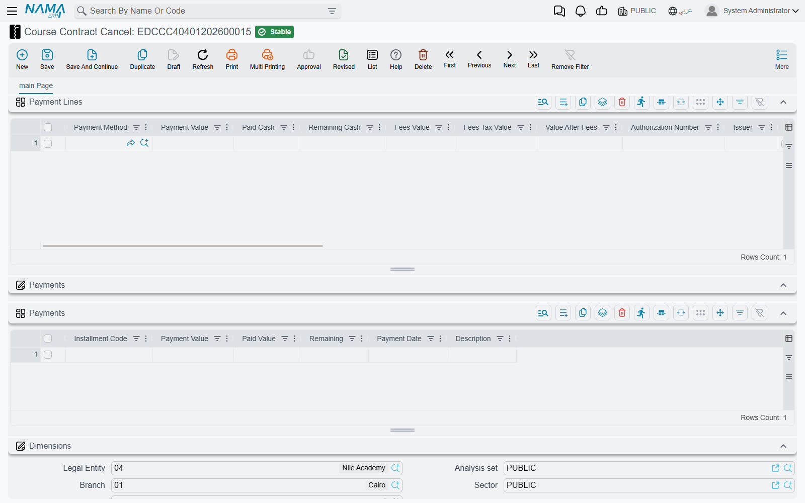

# Cancelling a Course Contract

A contract is signed for a full training programme, the trainee attends three months and then
withdraws. The fees for the months that will never be taught should stop being owed, the ledger
entry that put them on the payer's account has to be undone, and whatever was collected in advance
may have to go back out. Education handles all of that with one document: **Course Contract Cancel**
(إلغاء عقد دورة تدريبية), which sits on **Education → Master Files**, right next to the contract
itself.

It is a document in its own right, not a button on the contract. It has its own book and code, its
own issue date, value date and fiscal period, its own currency and rate, and — the detail that
decides everything it does to the ledger — **its own document term**.

## It starts life as a copy of the contract

The only field you really have to fill is **Course Contract** in the header. Choosing it pulls the
contract down into this document: the **Subsidiary** (the party who pays), the description, every
**Details** line with its student, quantity, unit price, discounts and taxes, every payment-method
row, and every instalment from the contract's payment schedule. Each copied line arrives as a fresh
line on the cancellation.

Which means that the document in front of you, if you touch nothing else, describes the cancellation
of the **entire** contract. That is the default, and it is deliberate — a full cancellation is the
common case, so it costs one field.

::: tip Partial cancellation is subtraction, not a percentage
There is no "cancel 40%" field anywhere on the screen. You cancel part of a contract by editing the
copy down to the part you are actually cancelling: delete the detail lines for trainees who are
staying, reduce a quantity or a unit price on a line that is only partly cancelled, and delete the
instalment rows you are not releasing. Whatever is left on the screen when you commit is what gets
cancelled.
:::

## The two grids you edit

**Details** (التفاصيل) carries one line per trainee, with the same columns as the contract — Student,
Course Definition, Course, Unit Price, Quantity, the discount and tax columns, the analysis
dimensions and the line Subsidiary. It also shows one column the contract's grid does not:
**Prices | Total price**, the gross line total. Keep an eye on it, because that is the figure the
document is validated against.

**Payments** (الدفعات) carries the instalments being released. On this document most of the grid is
read-only: **Payment Value** and **Payment Date** arrive disabled and are taken from the contract, so
you cannot quietly rewrite the original plan from here. The two columns you fill are:

- **Installment Code** — which instalment on the contract this row settles. The field offers the
  contract's own instalment codes as a suggestion list, so you pick rather than type.
- **Paid Value** — how much of that instalment this cancellation releases.

::: warning The two totals have to agree before it will commit
The sum of **Prices | Total price** across the detail lines must equal the sum of **Paid Value**
across the instalment rows, otherwise the document is refused with
*"Details total … must be equal to schedule lines total …"*. Three more checks guard the instalment
side: a code that does not exist on the referenced contract is rejected, two cancellations cannot
settle the same instalment, and the amounts settled against an instalment cannot exceed its value.
:::

### A worked example

A contract for one trainee runs at 24,000 over eight monthly instalments of 3,000. Three instalments
have already been collected and the trainee withdraws, so 15,000 across the remaining five
instalments has to go.

1. Create a Course Contract Cancel, pick the contract. Everything copies down: a 24,000 detail line
   and eight instalment rows.
2. On the detail line, reduce the unit price to 15,000 — that is the part being cancelled.
3. Delete the three instalment rows that were already collected. On each of the five that remain,
   enter **Paid Value** 3,000.
4. Details total 15,000, instalment total 15,000. The document commits.

## What processing does

Saving the document creates its effects in the background as a business request, so the save itself
is instant. Two separate things then happen, and the second one is the one people are usually
looking for.

### It books the mirror image of the contract's entry

The cancellation produces its own general-ledger entry through **its own term** — not the contract's.
The two terms are configured on the same screen, but the sides are reversed: what the contract's term
holds on the debit side, the cancellation's term holds on the credit side and the other way round. A
contract that debited the trainee's receivable and credited fees revenue is undone by a cancellation
that debits fees revenue and credits the trainee. The mechanics of setting both terms up, and the
mirroring rule in full, are on the [Document Terms](./education-document-terms) page.

### It settles the contract's instalments

This is the part that surprises people, so it is worth stating plainly. A cancellation does not
delete instalments from the original contract and it does not mark them void. It registers itself as
a **payer** of them.

Every instalment row you filled writes a settlement entry against the matching instalment on the
contract. On the contract's payment schedule, that instalment's **System paid** rises by the amount
you entered and its **Remaining** falls by the same amount — exactly as if a receipt voucher had
come in and paid it. Take the example above: the contract's five open instalments of 3,000 each go
from 3,000 remaining to zero, and the contract as a whole now reads as fully collected, because the
cancelled portion has been settled rather than left hanging.

So after a cancellation, the contract's **paid** figure is higher and its **remaining** figure is
lower. That is the intended reading: the contract has nothing outstanding any more, because the part
that was never going to be collected has been closed out by the cancellation. You can see exactly
which entries did it from the contract itself — the **Installment Payments** (سندات سداد الدفعات)
toolbar button lists every settlement entry standing against that contract's instalments, and the
cancellation shows up there among them. More on how the schedule is built and read on the
[Payment Schedules and Collection](./education-payment-schedules) page.

::: info No refund document is produced
Nothing is generated by a cancellation — no payment voucher, no receipt voucher, no credit note, no
return document of any kind. If money has to physically go back to the payer, you record it on the
**Payment Lines** grid of the cancellation itself, exactly the way an incoming collection is recorded
on the contract. Each row names a payment method and an amount, and books to that method's account —
on the opposite side of the ledger from the contract, because this document runs in the opposite
direction. Money out is a line on this document, not a separate document.
:::

If the background processing fails — a closed fiscal period, an account the term cannot resolve — the
document is still saved and its processing status says so. Power users retry from the **Business
Requests** list view: filter the failed rows, select them, and use the More menu to reprocess.

## Undoing a cancellation

A cancellation is reversible in the ordinary way. Uncommitting or deleting it removes its ledger
entry and removes every settlement entry it wrote, which restores the original contract's instalments
to the state they were in before — the **System paid** figures drop back and the **Remaining**
figures return. Nothing has to be repaired by hand on the contract.

For the document being cancelled, and how its fees, students and collections are recorded in the
first place, see [Course Contracts](./education-course-contracts).
