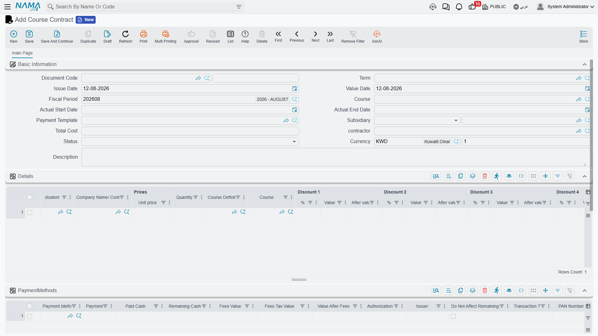
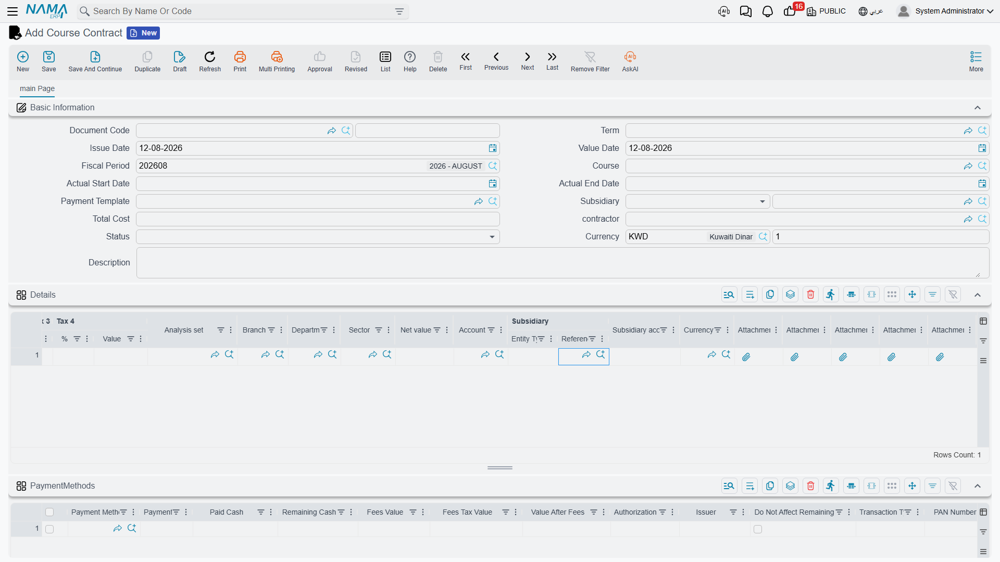

# Course Contracts

Most of the Education module records information rather than money: who is enrolled, who turned up,
what marks were scored, which bus a student rides. The **Course Contract** is where the module
finally talks about money. It is the agreement that says *these students are joining this course,
this is what they are being charged, and this is how they will pay* — and, together with its
[cancellation document](./education-contract-cancellation), it is the only place in Education that
reaches the general ledger.

You will find it at **Education → Master Files → Course Contract**.

## Who the parties are

A contract has two sides, and it is worth being clear about them before you fill anything in.

On one side there is the **student**. Students appear on the contract's **Details** grid — one line
per enrolled student — and a single contract can carry a whole group. A company sending five staff
members on the same training course is one contract with five student lines, not five contracts.

On the other side there is **whoever actually owes the money**, and that is not always the student.
The header field **Subsidiary** is where you name the paying party, and it accepts a **Student**, a
**Guardian**, or a **Customer**. For an adult on a professional course the student pays for himself;
for a child, the guardian carries the receivable; for corporate training, a customer account does.

There is a third possibility that avoids naming the payer at all. Because
[students and guardians are accounting subsidiaries](./education-master-files) in their own right,
the document term can be told to take the party **from the student line itself** — either the
student on the line, or *that student's guardian*. On a contract enrolling eight children from eight
different families, this is what puts each family's share on its own account without anyone having
to name eight payers by hand. How this is configured is described on the
[Document Terms](./education-document-terms) page.

The header also carries a **Contractor**, and each student line can carry one of its own — useful
when the enrolment came through an agency or a sponsoring company.

## Filling in the contract

The **Basic Information** block is standard document territory: the **Document Code** (its book and
number), the **Term**, the **Issue Date**, the **Value Date** and the **Fiscal Period**. Two of
these matter more than they look:

- The **Term** is not a formality. It is the single thing that decides which accounts the contract
  will debit and credit. A contract saved under the wrong term books to the wrong place.
- The **Value Date** is the base date for the instalment plan. When the system generates payments it
  counts periods forward from here, so a contract whose value date is wrong produces a schedule with
  all the wrong due dates.

Then comes the **Course** — the training course being sold, chosen from the
[Course](./education-courses) master file. Picking it does real work, as the next section explains.
**Actual Start Date** and **Actual End Date** sit alongside it as reference dates you record for the
enrolment, and **Payment Template** is the shortcut that builds the whole instalment plan for you
(see [Payment Schedules and Collection](./education-payment-schedules)).

## The student lines and where the price comes from

Each line in the **Details** grid names a **Student**, a **Quantity** and a **Unit price**, and the
line's value is simply quantity × unit price. A line left with an empty quantity contributes
nothing, so it is worth glancing down that column before committing.

You do not normally type the unit price. **When you choose the Course on the header, the system
copies that course's Sales Price into the Unit price of the detail lines.** The Course master file is
therefore the price list for training: set the fee once on the course, and every contract written
against it is priced consistently. You can still override a line afterwards — a scholarship student
or a negotiated corporate rate is just an edited unit price — but the default comes from the course.

Beyond price and quantity, a line can carry its own **Course Definition** and **Course** (handy when
one contract covers several offerings), up to eight **Discount** columns with a percentage or a value
each, four **Tax** columns, and the usual **Dimensions** — Analysis set, Branch, Department and
Sector — so the revenue lands in the right analytical bucket. Taxes here are exactly what you type
into the grid: the system takes the percentages and values you enter rather than working them out for
you. The **Net value** column is calculated for you from the price after discounts.

Each line also has its own **Subsidiary** field, which is the "line subsidiary" the document term can
be pointed at when the payer differs from line to line.

## Currency and rate

The header carries a **Currency** and a **Currency Rate**. If you leave them alone the contract takes
the legal entity's own currency at a rate of 1, which is what most schools and training centres want.
Fill them in when the contract is genuinely priced in a foreign currency — the rate you set here is
the one the ledger entry is translated at, so it is fixed at the moment of processing rather than
being re-read later.

## What committing the contract actually does

This is the part worth reading twice, because the Course Contract does *not* behave like a sales
invoice.

**It writes ledger entries directly.** There is no invoice document, no receipt voucher and no
payment voucher created behind the scenes. Nothing is reserved, issued or moved in any warehouse —
the Education module has no stock movement of any kind. What the contract produces is a general
ledger entry, and nothing else.

**The document term decides both sides of that entry.** The term carries a **Debit** side and a
**Credit** side, and each of them says which account to use and where to find it. For a normal
contract the debit is the party side — the receivable on the student, the guardian or the customer —
and the credit is the company side, your training revenue account. The
[cancellation document](./education-contract-cancellation) uses its own term and reverses those
roles.

**The party side resolves at the moment of processing**, from whichever source the term names:

| The term's account source points at | The system uses |
|---|---|
| Student | The student on the line |
| Guardian | The guardian of the student on the line |
| Document Subsidiary | The **Subsidiary** on the contract header |
| Line Subsidiary | The **Subsidiary** on that detail line |

Discounts, taxes and any cash paid at signing have their own sides on the term, so a discount can be
booked to a discount account rather than simply shrinking the revenue. All of this is set up once per
document term and then applies to every contract written under it; the
[Document Terms](./education-document-terms) page walks through the screens.

::: tip Nothing is hard-coded
Education ships no settings screen of its own. If a contract is booking to the wrong account, the
answer is always in the document term it was saved under — not in a module option somewhere.
:::

## Watching the effect land

Saving is instant, because the accounting effect is not written line by line while you wait. The
contract raises a **business request** that is processed in the background, and the document carries
a **processing status** that tells you how that went.

Almost always it simply succeeds and there is nothing to do. When it does not — a closed fiscal
period, an account missing from the term, a party with no accounts set up — the request is left in a
failed state and can be retried without re-entering anything. Power users do this from the
**Business Requests** list view: filter by status, select the failed rows, and use the **More** menu
to reprocess them. The general mechanics, including how to read the processing status, are covered in
[How documents are processed into accounting effects](/modules/accounting/support/accounting-request-processing).

There is also a **Regenerate Accounting Effects** action on the contract's toolbar. Use it after
correcting a document term: it re-issues the ledger entry from the term as it now stands, and removes
the entry altogether if the term no longer has a debit or a credit side configured.

## What the system checks before it lets you commit

A handful of rules will stop a save, and knowing them saves a lot of guessing:

- **A contract needs at least one student line.** An empty Details grid is refused outright.
- **The instalment plan has to add up.** If the contract has a payment schedule, the total of the
  scheduled instalments must match what the contract leaves to be paid. This is by far the most
  common message people meet, and it is explained with worked numbers on
  [Payment Schedules and Collection](./education-payment-schedules).
- **Money collected cannot exceed the contract's value.** Recording more than the contract is worth
  is treated as an error rather than as an overpayment.
- **Unit prices and discount values cannot be negative.** If you need to reduce a fee, use a discount
  column; if you need to unwind an enrolment, use the cancellation document.
- **Two instalments cannot share the same code.** Codes are filled in automatically on save, so this
  normally only bites when someone has typed them by hand.

## Where to go from here

Once the contract is committed, its working life is about money coming in against it, which is the
subject of [Payment Schedules and Collection](./education-payment-schedules). If the enrolment falls
through, the contract is unwound by a separate document rather than by editing it — see
[Cancelling a Course Contract](./education-contract-cancellation). And if the entries are landing in
the wrong accounts, the settings that drive them are on
[Document Terms](./education-document-terms).
