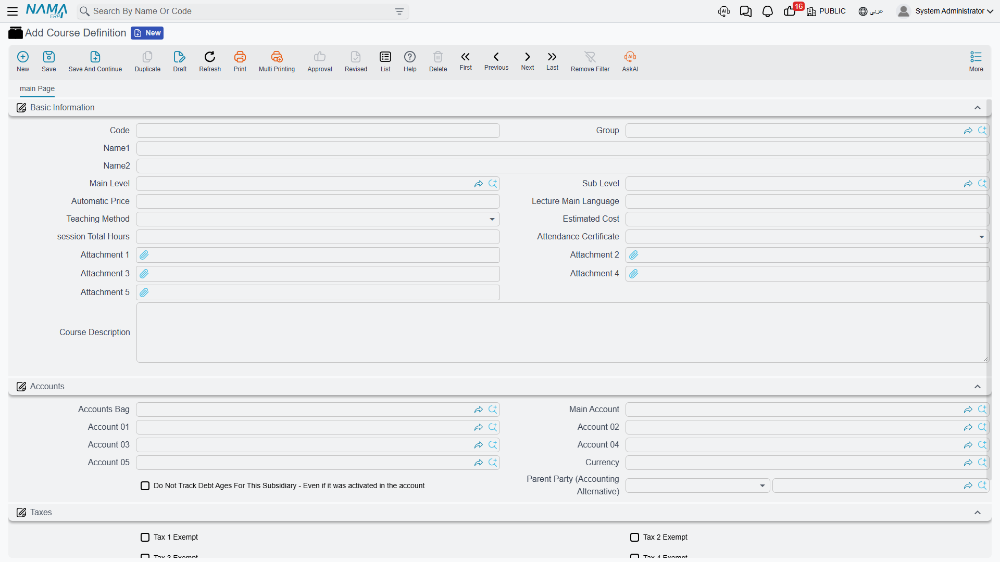
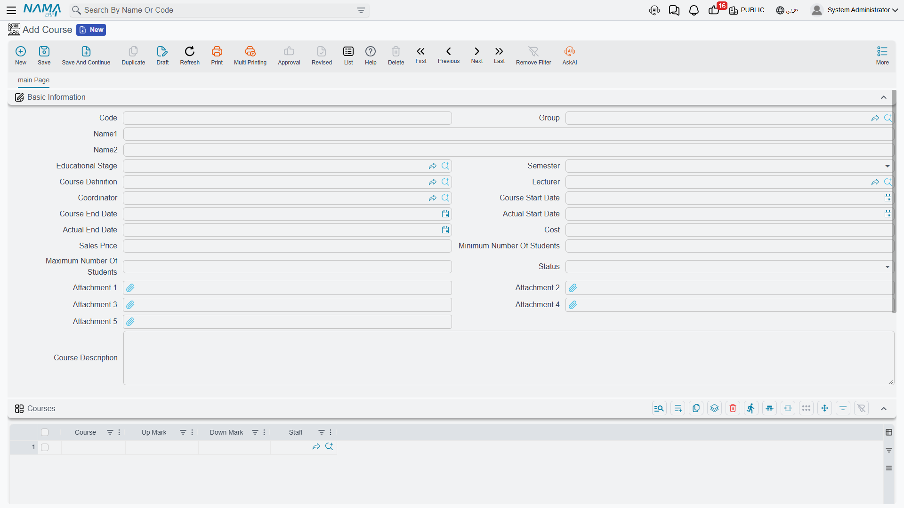

# Course Definitions and Courses

A training centre's brochure lists **Advanced Excel for Accountants** once: thirty hours, taught in
English, in the classroom, aimed at the intermediate accounting level, ending with an attendance
certificate. That entry in the brochure never changes.

What changes is the running of it. The spring intake starts on 1 March with Sarah Mansour teaching
and Ahmed Fouad coordinating, and it is sold at 1,800 per student. The autumn intake starts on
15 September with a different lecturer and a different price. One brochure entry, two different
things to organise, two different sets of marks.

That is exactly the split Nama makes. The **Course Definition** is the brochure entry — the
catalogue card. The **Course** is the offering you actually run, and it is the record that fees,
lecturers, dates and subject marks hang off.

## The Course Definition — the catalogue card

You create it from **Education → Master Files → Course Definition** (in Arabic
**التعليم ← الملفات ← تعريف دورة**).

Beyond the usual code, group and Arabic/English names, the card answers the questions a prospectus
answers:

| Field | What it says |
|---|---|
| **Main Level** (المستوى الرئيسي) / **Sub Level** (المستوى الفرعي) | The academic level the course sits at — "Intermediate", and under it "Intermediate – Finance" |
| **Lecture Main Language** (اللغة الرئيسية للمحاضرة) | Free text: `English`, `Arabic`, `Arabic with English material` — whatever your prospectus says |
| **Teaching Method** (طريقة التدريس) | **Online** (Online) or **Attendance** (الحضور) — delivered over the internet, or in a room |
| **Session Total Hours** (عدد ساعات الدورة) | How many teaching hours the course is worth — the 30 in "a 30-hour course" |
| **Estimated Cost** (التكلفة التقديرية) and **Automatic Price** (السعر التلقائي) | Planning figures recorded on the card for reference |
| **Attendance Certificate** (شهادة حضور) | **Yes** (نعم) or **No** (لا) — does finishing this course earn a certificate of attendance? |
| **Course Description** (وصف الدورة) | The long text you would put in the brochure |
| **Attachment 1..5** (مرفق 1..5) | The syllabus, the accreditation letter, the sample material |

### Main Level and Sub Level classify courses, not students

Both are small master files of their own — **Education → Master Files → Main Level** and
**→ Sub Level** — carrying nothing but a code and a name. It is worth being clear about what they
are for, because their names invite the wrong guess: they are the **course catalogue's** two-tier
classification. They have nothing to do with the Educational Stage / Class Room / Rank hierarchy
that students belong to, which is described in
[Students, Guardians and the Academic Structure](./education-master-files). A student is never
placed on a Main Level; a course definition is.

## The Course — the offering you run

You create it from **Education → Master Files → Course** (in Arabic
**التعليم ← الملفات ← مادة دراسية**).

::: info Two records, and the labels overlap
The screen you are on is labelled **Course** / «مادة دراسية», and so is the grid inside it and each
of that grid's lines. Read it this way: the **record** is the offering you are running, and the
**grid lines** are the subjects that make it up. The rest of this page says "course" for the record
and "subject" for the lines.
:::

| Field | What it says |
|---|---|
| **Educational Stage** (المرحلة التعليمية) | The stage this offering belongs to |
| **Semester** (ترم دراسى) | First (الاول), Second (الثاني), Third (الثالث), Fourth (الرابع) or Annual (سنوى) |
| **Course Definition** (تعريف دورة) | Which catalogue card this is an offering of |
| **Lecturer** (المحاضر) | Who teaches it |
| **Coordinator** (المنسق) | Who administers it |
| **Course Start Date** (تاريخ بداية الدورة) and **Course End Date** (تاريخ نهاية الدورة) | The plan |
| **Actual Start Date** (تاريخ البداية الفعلي) and **Actual End Date** (تاريخ النهاية الفعلي) | What really happened, typed in when it happens |
| **Cost** (التكلفة) | What running this intake is expected to cost you — a figure you record |
| **Sales Price** (سعر البيع) | What one student pays. This one travels — see below |
| **Minimum / Maximum Number Of Students** (الحد الأدنى / الأقصى لعدد الطلاب) | The intake size you are planning for, written on the card for the people organising it |
| **Course Description** (وصف الدورة), **Attachment 1..5** (مرفق 1..5) | As on the definition |

The **Lecturer** and **Coordinator** pair deserves a second look, because it is where readers most
often trip. A Lecturer in Nama is its own master file, with its own contact details and stated pay
basis — it is not an HR employee record, and creating one does not create an employee. The
Coordinator beside it is an ordinary **Employee**. A staff member who both teaches a course and
administers it therefore needs a record on each side. Both files are covered in
[Students, Guardians and the Academic Structure](./education-master-files).

Below the basic information the screen carries the standard **Accounts**, **Taxes** and
**Dimensions** groups that master files across Nama share.

### Picking a Course Definition copies nothing

This is the point that surprises people, so it is worth stating flatly: choosing a Course Definition
on a Course is a **link, and only a link**. Nothing is copied down — not the level, not the teaching
language, not the teaching method, not the session hours, not the estimated cost, not the
certificate flag.

A Course is therefore filled in entirely on its own. The definition it points at tells anyone
reading the record which catalogue entry this intake belongs to, and lets you list every intake of
*Advanced Excel for Accountants* side by side — but the dates, the lecturer, the price and the
subjects are yours to type on the Course itself. When you open a new term of a course you already
ran, the **Duplicate** (نسخة مماثلة) action on the previous intake is the quickest start: it brings
the subjects grid with it, and you correct the dates, the lecturer and the price.

### The subjects grid

The grid at the bottom of the Course breaks the offering into the parts a student is marked on.
Each line names one subject and the two marks that go with it:

| Column | What it holds |
|---|---|
| **Course** (مادة دراسية) | The subject name — **free text**, typed in, not a reference to another record |
| **Up Mark** (الدرجة العظمى) | The maximum mark this subject is out of |
| **Down Mark** (الدرجة الصغرى) | The pass mark — the lowest mark that counts as a pass |
| **Staff** (مدرس المادة) | The employee teaching that subject |

For the Excel intake the grid might read: *Formulas and Functions* out of 40 with a pass at 20,
*Pivot Tables and Dashboards* out of 30 with a pass at 15, and *Financial Modelling* out of 30 with
a pass at 15 — 100 marks across three subjects.

Because the subject names are free text, they are exactly what you type. Spell them the way you want
them to appear on every student's marks sheet, because that is precisely where they end up:
[Recording Marks](./education-marks) pulls this grid across for the student, subject names and both
marks included.

## Where the money enters: the Sales Price

The Education module has an academic half and a financial half, and the **Sales Price** on the
Course is the single field that joins them.

When you raise a [Course Contract](./education-course-contracts) and pick the course on it, that
course's Sales Price is written into the **Unit Price** (سعر الوحدة) of the contract's student
lines. Our 1,800 becomes 1,800 per student; twelve students on one contract at a quantity of 1 each
gives 21,600 to be scheduled and collected. From there the contract is in charge — discounts,
taxes, instalments and collection all live on it, and it is the contract, not the course, that
reaches the general ledger.

::: tip Set the price before you contract, not after
The price travels at the moment you pick the course on the contract. Changing a Course's Sales Price
afterwards does not reach back into contracts already written — those keep the unit price they were
given, which is usually what you want, since a signed agreement should not move on its own. It does
mean the price on the Course wants to be right *before* the first contract of the intake is raised.
On a contract already entered, correct the unit price on the student line by hand.
:::

What the money side does from there — who pays, the instalment plan, collection and cancellation —
is covered in [Course Contracts](./education-course-contracts),
[Payment Schedules and Collection](./education-payment-schedules) and
[Cancelling a Course Contract](./education-contract-cancellation).

Saving a Course or a Course Definition creates no accounting entry and no stock movement of its own.
They are catalogue and planning records; the ledger only ever hears from the contract.
