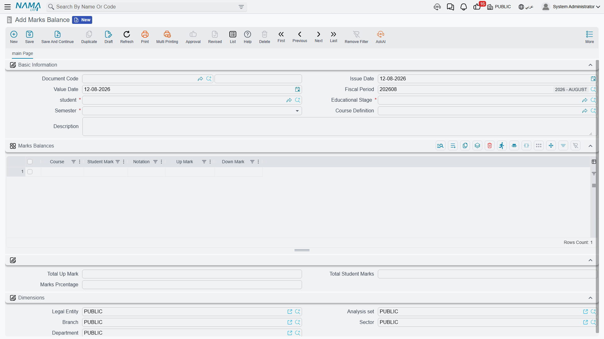

# Recording Marks

At the end of the term somebody has to write down what each student scored in each subject. In Nama
that record is the **Marks Balance**, and one of them covers one student, on one course, in one
semester.

You reach it from **Education → Master Files → Marks Balance** (in Arabic
**التعليم ← الملفات ← رصيد درجات**).

## What one Marks Balance covers

Think of it as a single student's marks sheet for a single term. If a stage has thirty students,
the end of the term produces thirty Marks Balances — one per student. If that student also sat a
second course in the same semester, that is a further document.

It is an ordinary Nama document, so it takes a **book** and code, an **Issue Date** (تاريخ التحرير),
a **Value Date** (التاريخ الفعلي) and a **Fiscal Period** (الفترة). Unlike most documents in the
system it needs no [document term](./education-document-terms) — there is no term field on the
screen, and none is asked for when you save.

Four things identify the sheet, and the first three are required:

- the **Student** (الطالب) whose marks these are;
- the **Educational Stage** (المرحلة التعليمية) they sat it in;
- the **Semester** (ترم دراسى) — First (الاول), Second (الثاني), Third (الثالث), Fourth (الرابع) or
  Annual (سنوى);
- and the course, chosen in the **Course Definition** (تعريف المواد الدراسية) field — this is where
  you pick the offering the student actually attended, described in
  [Course Definitions and Courses](./education-courses).

A **Description** (ملاحظات) field at the end takes anything the sheet needs to say as a whole.

## The subject lines come from the course

Picking the course is the step that does the work. The moment you choose it, Nama reads that
course's subjects grid and builds one line here for every subject on it, carrying across the subject
name and both of its marks:

| Column | Where it comes from |
|---|---|
| **Course** (مادة دراسية) | The subject name, copied from the course. It is free text there and free text here |
| **Up Mark** (الدرجة العظمى) | The maximum the subject is out of, copied from the course |
| **Down Mark** (الدرجة الصغرى) | The pass mark, copied from the course |
| **Student Mark** (درجة الطالب) | **The one column you type** — what this student actually scored |
| **Notation** (ملاحظات) | Free text per subject: "absent from the retake", "project submitted late" |

So the sheet arrives ready to fill in. Taking the Excel intake from the courses page — *Formulas and
Functions* out of 40 with a pass at 20, *Pivot Tables and Dashboards* out of 30 with a pass at 15,
*Financial Modelling* out of 30 with a pass at 15 — you choose the course, three lines appear with
those six figures already in place, and all you type is 34, 22 and 19.

Having the pass mark sitting on the line next to the mark you are typing is the point of carrying it
across: whoever enters the marks, and whoever reads the sheet afterwards, can see at a glance where
each subject stands against the bar the course set.

::: warning Choosing the course rebuilds the grid
The lines are pulled fresh from the course each time you pick one, and they **replace** whatever is
in the grid. If you have already typed marks and then change the course on the document, those marks
go with the old lines. Settle the student and the course first, then enter the marks.
:::

Because the subject names are plain text copied from the course, they read exactly as they were
typed there — and they stay as they were on the day the sheet was made. Renaming a subject on the
course later does not rewrite marks sheets already entered, which is what you want: last term's
sheets should keep last term's wording.

## A Marks Balance records marks, and nothing else

This is worth saying plainly, because the document sits in a module that also handles money.

A Marks Balance is a record. Saving and committing it creates **no accounting entry** and **no stock
movement**, and it feeds **no other document** — not a course contract, not a fee, not an
instalment, not attendance. Nothing in the module reads it back. Marks and money never meet: the
money side of Education runs entirely through the
[Course Contract](./education-course-contracts) and its
[payment schedule](./education-payment-schedules).

That independence is convenient in practice. Marks can be entered, corrected and re-entered by
academic staff at the end of a term without any risk of disturbing a contract, a balance or a
receivable — and a student's marks sheet exists whether or not anybody has finished collecting the
fees.
