# Students, Guardians and the Academic Structure

A school cannot record a single day of attendance, print a single mark sheet or sign a single
training contract before it has described itself to the system: which stages it teaches, how those
stages are divided, who the pupils are and who is responsible for them. That description lives in
**Education → Master Files**, and it is the first thing you build in the module.

Everything on this page is a register. These records hold information and supply the parties and
classifications that the rest of the module refers to — they create no accounting entries and no
stock movement whatsoever. The only place in Education where money reaches the ledger is the
[Course Contract](./education-course-contracts).

## The academic structure, built from the top down

Think of a school called Al-Noor. It teaches three stages — Primary, Preparatory and Secondary.
Primary is split into six class rooms, one per grade, and each grade is split into two or three
sections of about thirty pupils. Nama models exactly that shape, in four master files.

### Stage Type

**Stage Type** is a small lookup: a code and the two names, nothing more. It categorises the stages
themselves — you might create *General*, *Vocational* and *Language* stage types, or *Basic* and
*Higher*. Nothing else in the module uses it, so keep the list short and meaningful; it exists so
that a school with many stages can group them.

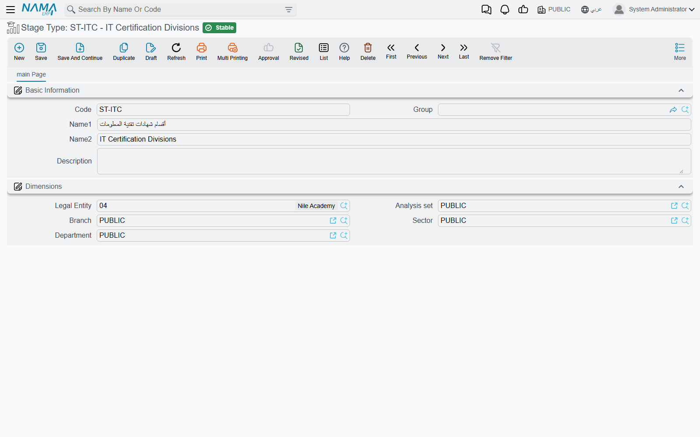

### Educational Stage

**Educational Stage** is the backbone of the whole module. It is the record you create for *Primary*,
*Preparatory*, *Secondary* — or, in a training centre, for *Beginner*, *Intermediate* and *Advanced*.
Besides its code and names it carries a **Stage Type**, free remarks, and a **Class Rooms** grid
listing the class rooms that make the stage up.

Stages nest. A stage can sit under another stage, so a large school can model *Primary → Lower
Primary / Upper Primary* rather than flattening everything into one list. The nesting is not a field
on the standard form; it is handled through the tree-shaped list view of Educational Stage, where the
stages appear as an expandable tree.

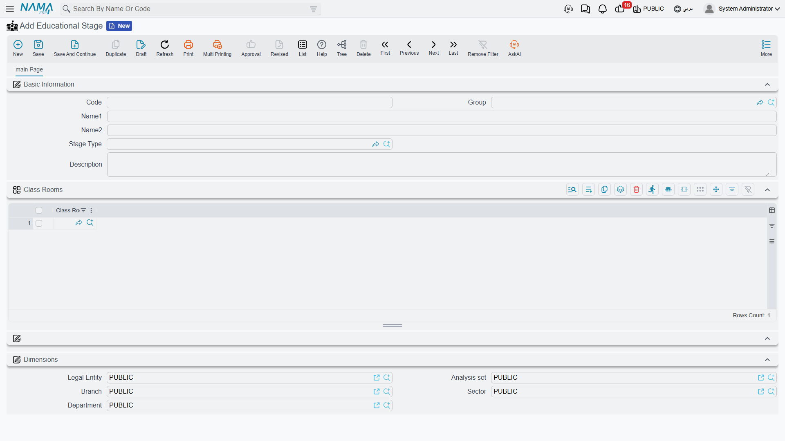

::: tip The most referenced record in Education
The educational stage turns up almost everywhere: on students, class rooms, ranks, courses,
attendance sheets, daily monitoring, mark sheets and the published fee list. If your stage list is
wrong, every screen downstream inherits the mistake — so agree the stage list with the school before
entering anything else.
:::

### Class Room

A **Class Room** is one division of a stage — grade 4 of Primary, or the *Evening Beginner* group of
a training centre. Its record carries code, names, the **Educational Stage** it belongs to, remarks,
and a **Ranks** grid listing the sections inside it.

The link is recorded from both ends: the class room names its stage, and the stage lists the class
room in its own grid. Fill in whichever end you are standing on — they are two views of the same
structure, and a school usually builds the tree downwards from the stage.

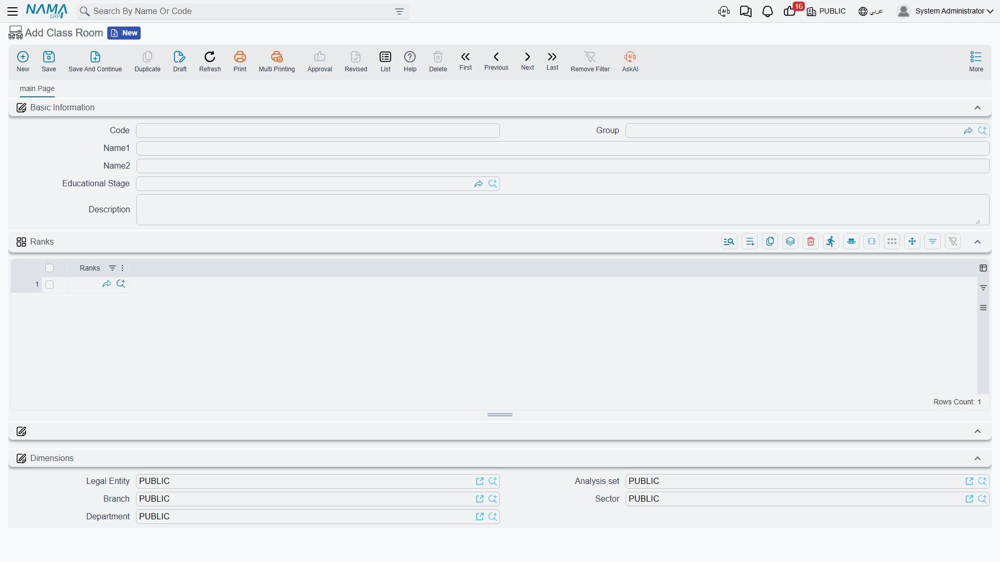

### Rank

A **Rank** is the smallest named grouping — section 4/A, 4/B, 4/C inside grade 4. It names the
**Class Room** it belongs to, carries a **Student Number** figure where you record how many pupils
that section is meant to hold, and holds a **Students** grid — which is where each pupil is actually
placed in a section.

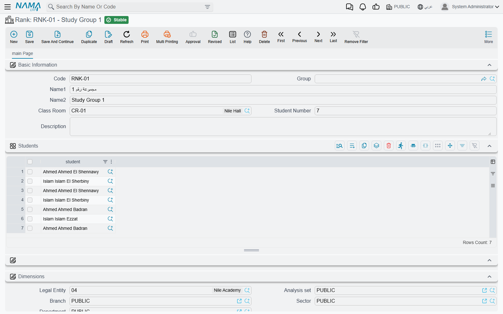

::: info Student Number is a recorded figure
The number you type there is planning documentation for the people reading the record — a note that
4/A is a thirty-pupil section — and it is yours to use in your own reporting and capacity planning.
:::

## Where a student sits in the structure

The structure is built downwards, and each level lists the level below it: the stage lists its class
rooms, the class room lists its ranks, and the rank lists its students. So *Primary* names grades 1
to 6, grade 4 names sections 4/A, 4/B and 4/C, and section 4/A names the thirty pupils in it.

**A pupil is placed by adding them to the Students grid on their rank**, not from the student card.
The student card itself carries only one academic link — the **Educational Stage** — which is the
pupil's stage, not their section. Both matter, and they answer different questions.

That split follows the way the rest of the module asks its questions. Attendance sheets, daily
monitoring and mark sheets are all taken **per stage** and then list the pupils on them, so the stage
on the student card is the classification those screens read. The rank's Students grid is where the
finer placement lives — which section a pupil sits in, and how full that section is against the
Student Number you recorded on it.

## The Student record

A **Student** card is the pupil's or trainee's identity in the system — and, at the same time, an
account the school can charge. It opens with a *Basic Information* group:

| Field | What it holds |
|---|---|
| Code, Group | The student number and an optional grouping of your own |
| Name1 / Name2 | The Arabic and the English name |
| Educational Stage | The stage the pupil is enrolled in |
| Guardian | The parent or sponsor responsible for the pupil |
| Birth date, Joining Date | Date of birth and the date the pupil joined the school |
| Enrollment State | Newcomer, Moved, Enrolled, Reenrolled, or one of three spare values |
| Religion, Nationality | Standard lookups shared with the rest of the system |
| Contract Type | Governmental or Private, plus three spare values |
| Program Type | Morning Program, Evening Program, Sport Activities, plus three spare values |
| Picture, Attachment 1..5 | The pupil's photo and up to five scanned documents |
| Description | Free remarks |

**Contract Type** is worth a sentence, because it drives how a school reads its own roster: a
*Governmental* pupil is one whose fees are carried by a ministry, a company or another sponsoring
body, while a *Private* pupil pays privately. When the fees really are carried by an outside body,
that body is named on the contract as the Education Contractor, described further down this page.

Below that sits the full **Address** block — country, city, state, area, street, building number,
postal code, district, land plot number, two free address lines and a map location — followed by the
**Accounts**, **Taxes** and **Dimensions** groups described in the next section.

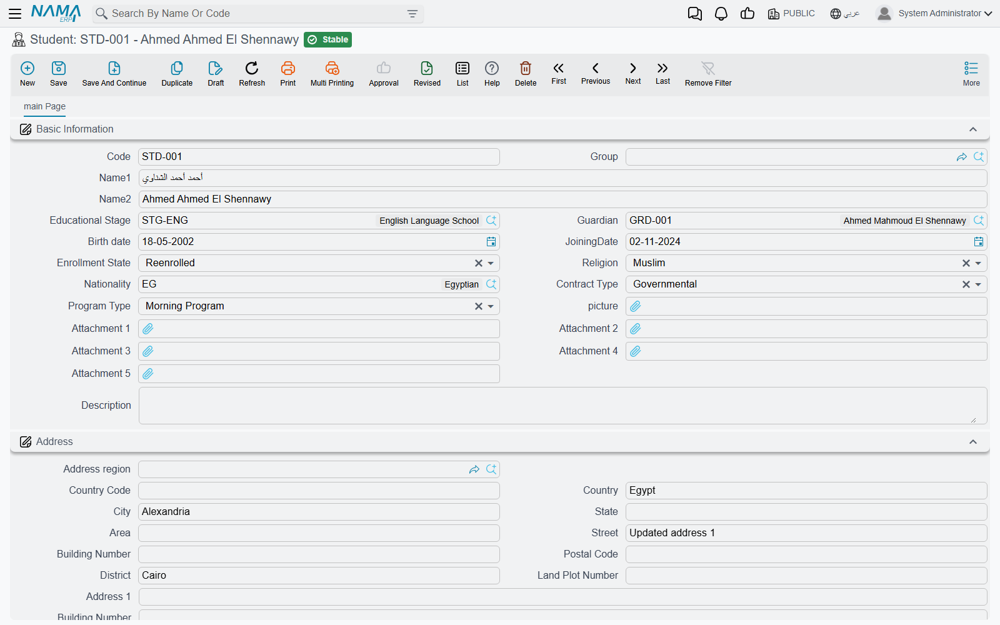

## Guardians, and how a student is linked to one

A **Guardian** is the father, mother or sponsor who answers for one or more pupils. The record holds
a code and the two names, the guardian's **Current Vacancy** (their job title), a **Mobile** number
and an **EMail** address for quick contact, and remarks. A second page, **Contact Info**, holds two
complete contact blocks: one for where the family lives now, and one headed *Home land contact info*
for the country of origin — the pairing schools with expatriate families need. Each block carries a
full address plus two telephones, a mobile, a fax number, an e-mail and a website.

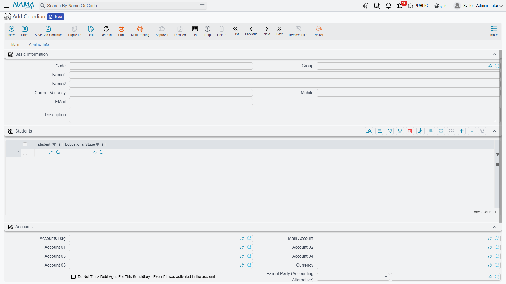

::: info Two mobiles, two e-mails
The Mobile and EMail on the first page and the mobile and e-mail inside the Contact Info block are
separate fields serving different habits — the quick contact on the front page, the full postal-style
record on the second. Decide as a school which one your staff will trust, and fill it consistently.
:::

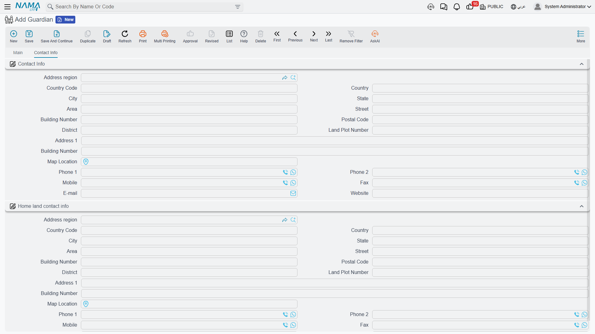

The link between the two people is made **on the student card**: you open the pupil and pick the
guardian in its *Guardian* field. One guardian can be named by any number of students, which is how a
family of three brothers ends up on one account. If a guardian's children change — a pupil leaves, a
younger sibling joins — you edit the pupils, not the guardian.

## Students and guardians are accounting subsidiaries

Both the Student and the Guardian record carry an **Accounts** group, and that is not decoration:
in Nama's language each of them is a *subsidiary* (ذمة) — a party the general ledger can hold a
balance for, exactly like a customer or a supplier.

The Accounts group gives you an **Accounts Bag**, a **Main Account**, five further account slots
(*Account 01* to *Account 05*), the party's **Currency**, and a switch to keep this particular party
out of debt-age tracking. On a student you can also nominate a **higher party (the accounting
alternative)** — a Customer, Supplier, Employee or Third Party — and the accounting entries for that
student are directed to it instead, which is how a school bills a company for the twelve pupils it sponsors while still
keeping twelve separate student cards. The **Taxes** group beside it marks the party exempt from any
of the four tax slots.

Two things follow from this, and they are the whole reason the design exists:

1. **A course contract can be raised against the pupil, against the guardian, or against an ordinary
   customer.** The contract's party field accepts all three, so the fee lands on whichever account the
   school actually collects from. See [Course Contracts](./education-course-contracts).
2. **A student or a guardian can drive an accounting dimension.** Because both are registered as
   dimension sources, a document line can take its dimension from the student or the guardian on it —
   useful when a school wants its revenue analysed by stage, branch or sponsor without maintaining a
   parallel coding scheme.

Finally, the standard **Dimensions** group (legal entity, analysis set, branch, sector, department)
appears on every master file in this module, students and guardians included.

## Lecturers, employees and contractors

### A Lecturer is not an employee record

This is the one piece of design that trips people up most often, so it is worth stating flatly:
**the Lecturer master file is not the HR Employee master file.** A lecturer is created in
Education → Master Files → **Lecturer**, and the record has nothing to do with payroll.

It holds the code and the two names, a **Hiring Start Date**, a free-text **Preferred Times** field
where you note the slots the teacher is willing to take ("Sun/Tue mornings, no Thursdays"), up to
five attachments for certificates and contracts, a full contact-info block, and the dimensions.
Lecturers are then named on [Courses](./education-courses).

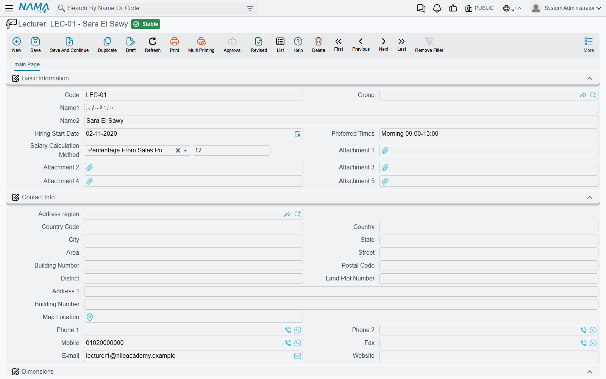

If the same person is also a salaried employee of the school, they exist twice: once as an Employee
in HR, where the salary is calculated, and once as a Lecturer here, where the teaching assignment is
recorded.

### Employees and sponsors in the same menu group

For convenience, the ordinary **Employee** and **Sponsor** screens are placed inside the Education →
Master Files menu group. They are the same records the rest of the system uses — nothing
education-specific happens to them. You need them because a course names an employee as its
**coordinator** and a bus names an employee as its custodian, and it saves a trip to another menu.

### Education Contractor

An **Education Contractor** is the outside body that supplies or sponsors a batch of trainees — a
ministry, an army unit, a company sending twenty staff on a language course. The record is
deliberately minimal: a code, a group and the two names. It is a naming record, used on the
[Course Contract](./education-course-contracts) as a whole and on each student line inside it, so you
can answer "which trainees on this contract came from which body".

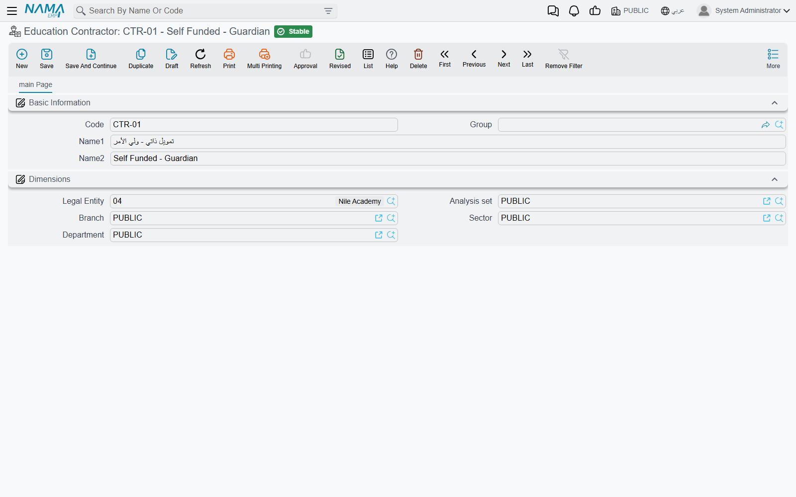

Note that the contractor is a label, not an account. Who the money is collected from is a separate
decision made on the contract itself, where the party is a student, a guardian or a customer.

## Main Level and Sub Level classify courses, not students

**Main Level** and **Sub Level** sit in the same Master Files menu group as Educational Stage, Class
Room and Rank, and their names invite you to read them as another layer of the school hierarchy. They
are not. Both are simple code-and-name lookups, and their only use is on the **Course Definition**
record, where they classify the course catalogue — *Languages → English*, *Languages → French*,
*IT → Networking*.

They never appear on a student, a class room or a rank. See
[Course Definitions and Courses](./education-courses) for how they are used.

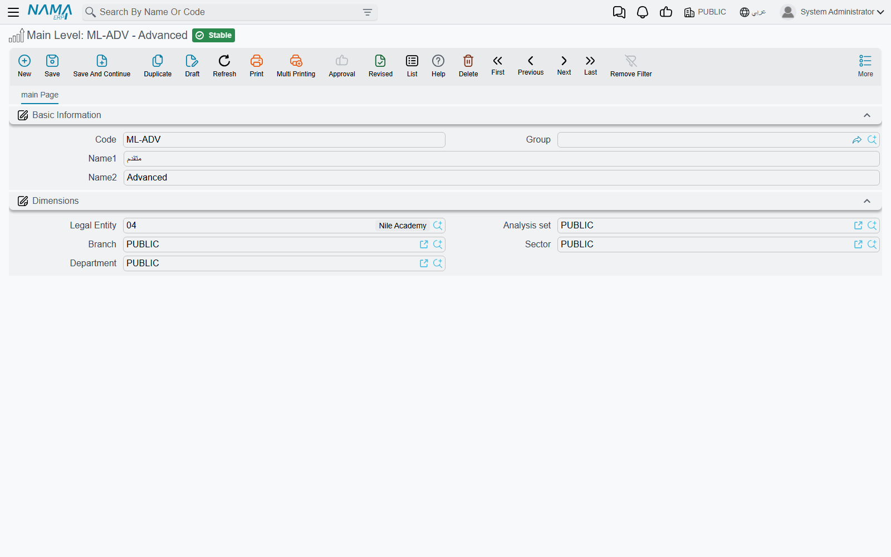

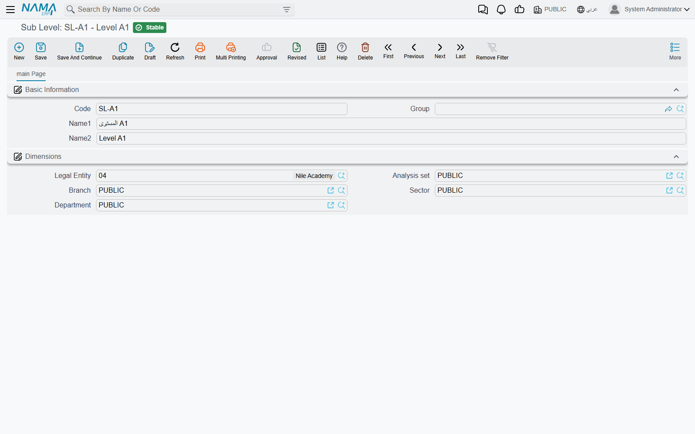

## Changing a student's data with Update Student Information

A student card is an ordinary master file, so anyone with permission can open it and type over it.
That is fine for fixing a typo, but it leaves no trace of *when* the pupil moved from Preparatory to
Secondary or *when* the family changed address. **Update Student Information** exists for those
changes: it is a dated document that carries the new values, so the school ends up with a filed,
auditable history of every change instead of a silently overwritten card.

You raise it like any other document — a book, a term, an issue date, a value date and a period —
then pick **one student** and fill in only the fields you are changing. On commit, the document
copies its values onto that student's card.

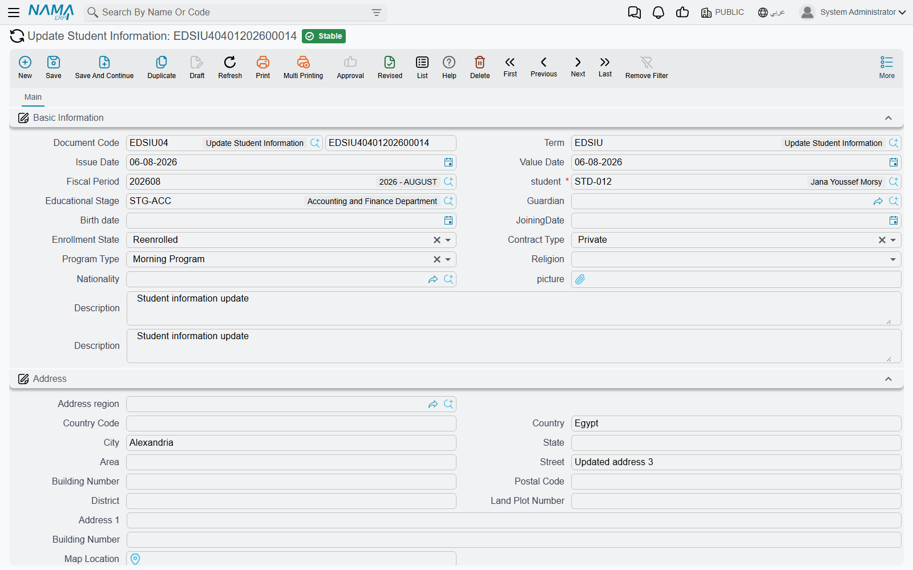

**What it can change**: the educational stage, the guardian, the birth date, the joining date, the
enrolment state, the contract type, the programme type, the religion, the nationality, the picture,
the whole address block, and the student's spare description, number and date fields.

**What it cannot change**: the code, the two names, the group, the attachments, the accounting
settings and the account slots. Those stay the responsibility of the student card itself.

::: warning An empty field means "leave as is"
Every value the document copies is copied only when it is filled in. A field you leave blank is not
carried over as a blank — the student keeps whatever was there before. That makes the document safe
to use for a single change (you fill one field and nothing else moves), but it also means you cannot
clear a student's value by raising an update with the field emptied. To blank a field, edit the
student card.
:::

### Updates are kept in date order

The document is dated for a reason, so the system protects that ordering. Before committing, it looks
for the most recent committed Update Student Information for the same pupil, and if that document is
dated **after** the one you are entering, the commit is refused with:

> Could not update Student {0}, there is another update document {1} after this update

In practice this means you **cannot back-date an update behind one that has already been committed**.
If a pupil moved stage in September and you only enter that in November — after a committed October
document has already changed their address — the September entry is rejected, because letting it
through would overwrite November's data with September's. When two updates share the same value date,
the one entered first is treated as the earlier of the two.

The sensible working habit is therefore to enter each change when it happens, in the order it
happened. If you must correct history, correct the newest document rather than inserting an old one
behind it.

## The Expense list — published fees per stage and semester

**Expense** is the school's published price list. It is a master file with a code, the two names and
a single grid, where each line names an **Educational Stage**, a **Semester** (First, Second, Third,
Fourth or Annual) and the **Expense** amount for that combination — Primary / First / 12,000;
Primary / Second / 12,000; Secondary / Annual / 30,000, and so on.

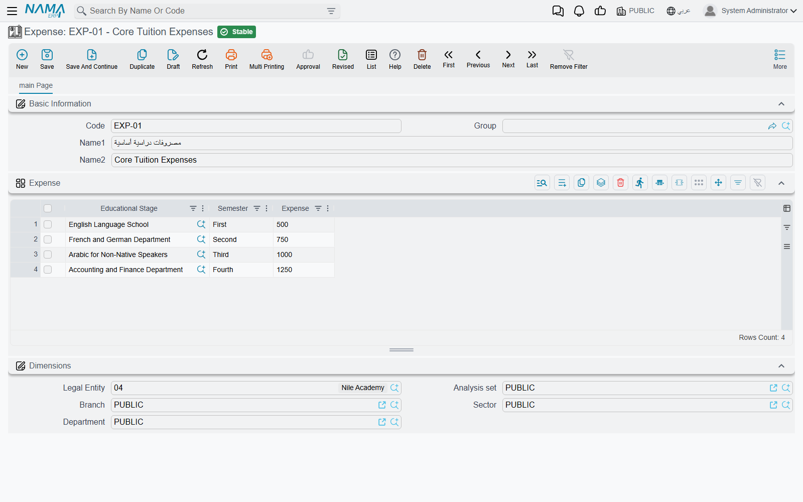

It is a reference list, kept separately from what any individual contract charges. When a contract is
raised, its amounts are entered on the contract's own lines and schedule, priced from the course and
from whatever the school agreed with that family; the Expense screen is where the officially
published figure per stage and semester is written down so that staff can look it up and quote it
consistently. Keeping the two apart is what lets a school hold one public price list while still
signing contracts with discounts, instalment arrangements and sponsor-funded exceptions. For what a
contract actually charges, see [Course Contracts](./education-course-contracts) and
[Payment Schedules and Collection](./education-payment-schedules).
